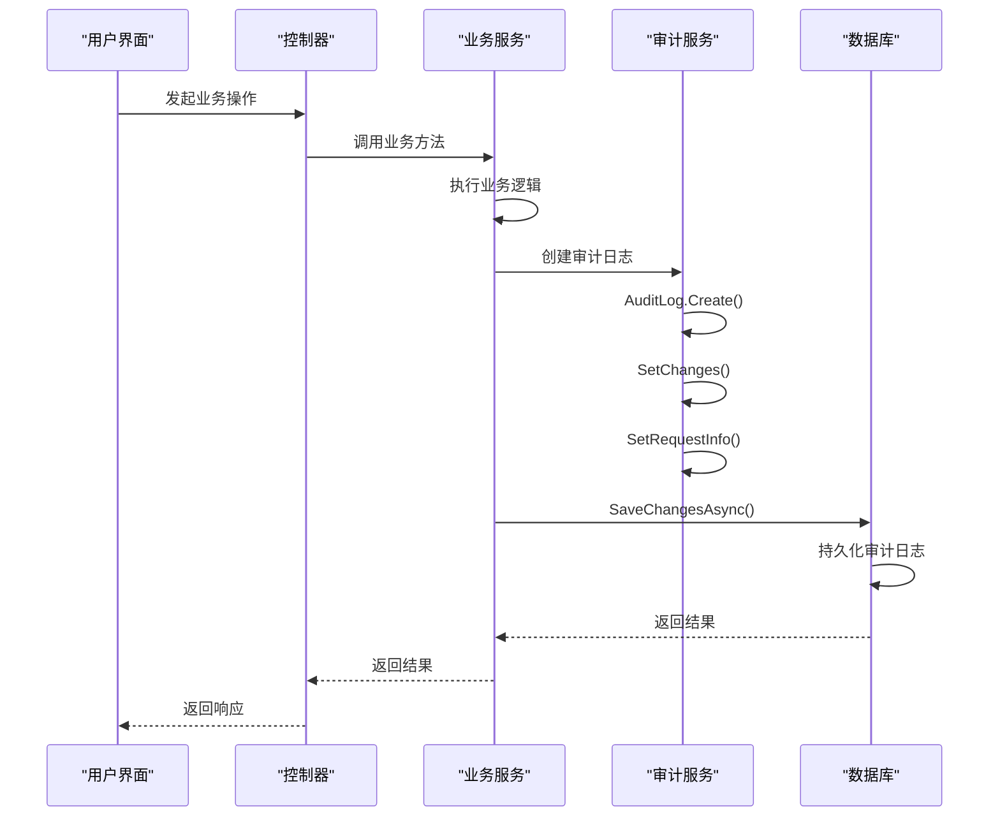

# 审计日志实体

<cite>
**本文档中引用的文件**  
- [AuditLog.cs](file://Backend/Hrevolve.Domain/Audit/AuditLog.cs)
- [AuditLogConfiguration.cs](file://Backend/Hrevolve.Infrastructure/Persistence/Configurations/AuditLogConfiguration.cs)
- [HrevolveDbContext.cs](file://Backend/Hrevolve.Infrastructure/Persistence/HrevolveDbContext.cs)
- [AuditableEntity.cs](file://Backend/Hrevolve.Domain/Common/AuditableEntity.cs)
- [CreateEmployeeCommand.cs](file://Backend/Hrevolve.Application/Employees/Commands/CreateEmployeeCommand.cs)
- [LoginCommand.cs](file://Backend/Hrevolve.Application/Identity/Commands/LoginCommand.cs)
</cite>

## 目录
1. [简介](#简介)
2. [属性结构](#属性结构)
3. [不可变性设计](#不可变性设计)
4. [数据库配置与索引策略](#数据库配置与索引策略)
5. [系统集成与自动记录机制](#系统集成与自动记录机制)
6. [审计操作类型常量](#审计操作类型常量)
7. [总结](#总结)

## 简介

审计日志实体（AuditLog）是Hrevolve系统中用于记录所有关键业务操作的核心组件。该实体通过详细的属性结构捕获操作的上下文信息，包括操作类型、实体信息、变更详情、操作者信息、客户端信息和请求上下文。其设计遵循不可变性原则，确保日志记录的一致性和可靠性。通过与Entity Framework Core的SaveChanges拦截器集成，系统能够自动记录关键业务操作，为多租户环境提供完整的审计追踪能力。

**Section sources**
- [AuditLog.cs](file://Backend/Hrevolve.Domain/Audit/AuditLog.cs#L5-L107)

## 属性结构

审计日志实体包含以下核心属性，用于全面记录操作的上下文信息：

- **租户ID (TenantId)**: 用于多租户隔离，标识操作所属的租户
- **用户ID (UserId)**: 执行操作的用户唯一标识
- **用户名 (UserName)**: 执行操作的用户名称
- **操作类型 (Action)**: 操作的类型，如创建、更新、删除等
- **实体类型 (EntityType)**: 被操作的实体类型名称
- **实体ID (EntityId)**: 被操作的实体唯一标识
- **旧值 (OldValues)**: 操作前的实体状态，以JSON格式存储
- **新值 (NewValues)**: 操作后的实体状态，以JSON格式存储
- **变更字段 (AffectedColumns)**: 记录发生变更的字段列表
- **IP地址 (IpAddress)**: 执行操作的客户端IP地址
- **用户代理 (UserAgent)**: 客户端的用户代理字符串
- **请求路径 (RequestPath)**: 发起操作的API端点路径
- **追踪ID (TraceId)**: 用于分布式追踪的唯一标识
- **关联ID (CorrelationId)**: 用于关联相关操作的标识
- **时间戳 (Timestamp)**: 操作发生的时间，使用UTC时间

这些属性共同构成了完整的审计信息，支持后续的审计查询、安全分析和合规性检查。

**Section sources**
- [AuditLog.cs](file://Backend/Hrevolve.Domain/Audit/AuditLog.cs#L10-L69)

## 不可变性设计

审计日志实体采用不可变性设计原则，确保日志记录的完整性和一致性。该设计通过以下机制实现：

### 静态工厂方法
通过静态工厂方法`Create`初始化审计日志实例，该方法接收必需的参数（租户ID、用户信息、操作类型、实体类型和实体ID），并返回一个已部分填充的审计日志对象。

### 实例方法
提供两个实例方法用于逐步填充审计信息：
- `SetChanges`: 设置变更详情，包括旧值、新值和受影响的字段
- `SetRequestInfo`: 设置请求上下文信息，包括IP地址、用户代理、请求路径、追踪ID和关联ID

### 私有构造函数
采用私有构造函数模式，防止外部直接实例化，确保所有实例都通过受控的工厂方法创建。

### 只读属性
所有属性的setter均为私有，防止在对象创建后被意外修改，确保审计日志一旦创建就不可更改。

这种设计模式确保了审计日志的创建过程是明确和受控的，同时保持了对象的不可变性，符合审计系统对数据完整性的严格要求。

**Section sources**
- [AuditLog.cs](file://Backend/Hrevolve.Domain/Audit/AuditLog.cs#L71-L107)

## 数据库配置与索引策略

审计日志实体的数据库配置通过`AuditLogConfiguration`类实现，定义了表结构、字段约束和索引策略，以优化审计查询性能。

### 字段长度限制
- **UserName**: 最大长度100字符
- **Action**: 最大长度50字符，必填
- **EntityType**: 最大长度100字符，必填
- **EntityId**: 最大长度100字符
- **AffectedColumns**: 最大长度2000字符
- **IpAddress**: 最大长度50字符
- **UserAgent**: 最大长度500字符
- **RequestPath**: 最大长度500字符
- **TraceId**: 最大长度100字符
- **CorrelationId**: 最大长度100字符
- **OldValues** 和 **NewValues**: 使用text类型，无长度限制，用于存储JSON格式的变更数据

### 索引策略
配置了多个复合索引以支持常见的审计查询场景：
- **(TenantId, Timestamp)**: 支持按租户和时间范围查询审计日志
- **(TenantId, UserId, Timestamp)**: 支持查询特定用户在特定租户中的操作历史
- **(TenantId, EntityType, EntityId)**: 支持查询特定实体的所有操作记录
- **TraceId**: 支持通过追踪ID查询相关操作链

这些索引策略显著提高了审计查询的性能，特别是在处理大量审计日志数据时，能够快速定位和检索相关记录。

```mermaid
erDiagram
AUDIT_LOGS {
uuid Id PK
uuid TenantId
uuid? UserId
string? UserName
string Action UK
string EntityType UK
string? EntityId
text? OldValues
text? NewValues
string? AffectedColumns
string? IpAddress
string? UserAgent
string? RequestPath
string? TraceId
string? CorrelationId
timestamp Timestamp
}
AUDIT_LOGS ||--o{ TENANTS : "belongs to"
AUDIT_LOGS ||--o{ USERS : "created by"
```

**Diagram sources**
- [AuditLogConfiguration.cs](file://Backend/Hrevolve.Infrastructure/Persistence/Configurations/AuditLogConfiguration.cs#L11-L51)
- [AuditLog.cs](file://Backend/Hrevolve.Domain/Audit/AuditLog.cs#L10-L69)

## 系统集成与自动记录机制

审计日志实体通过与系统其他组件的集成，实现了关键业务操作的自动记录。

### 领域事件模式
系统采用领域事件模式，当关键业务操作发生时，会发布相应的领域事件。审计服务订阅这些事件，并创建相应的审计日志记录。例如，当用户登录成功时，系统会发布`UserLoggedInEvent`，审计服务捕获该事件并创建登录审计记录。

### SaveChanges拦截器
在`HrevolveDbContext`中，通过重写`SaveChangesAsync`方法，在保存更改时自动处理审计逻辑。对于实现了`AuditableEntity`基类的实体，系统会自动设置创建时间、创建人、最后修改时间等审计字段。

### 审计日志创建流程
1. 业务操作触发领域事件或直接调用审计服务
2. 使用`AuditLog.Create`静态方法创建审计日志实例
3. 通过`SetChanges`方法设置变更详情
4. 通过`SetRequestInfo`方法设置请求上下文
5. 将审计日志添加到数据库上下文
6. 在事务提交时持久化审计日志

这种集成机制确保了审计日志的创建是透明的，业务代码无需直接处理审计逻辑，降低了耦合度，提高了系统的可维护性。



**Diagram sources**
- [HrevolveDbContext.cs](file://Backend/Hrevolve.Infrastructure/Persistence/HrevolveDbContext.cs#L120-L154)
- [AuditLog.cs](file://Backend/Hrevolve.Domain/Audit/AuditLog.cs#L73-L107)

## 审计操作类型常量

系统定义了`AuditActions`静态类，包含常用的审计操作类型常量，确保操作类型的一致性和可维护性：

- **Create**: 实体创建操作
- **Update**: 实体更新操作
- **Delete**: 实体删除操作
- **Login**: 用户登录操作
- **Logout**: 用户登出操作
- **LoginFailed**: 登录失败操作
- **PasswordChange**: 密码更改操作
- **MfaEnabled**: 多因素认证启用操作
- **MfaDisabled**: 多因素认证禁用操作
- **Export**: 数据导出操作
- **Import**: 数据导入操作

这些常量的使用确保了系统中所有审计日志的操作类型保持一致，便于后续的查询和分析。

**Section sources**
- [AuditLog.cs](file://Backend/Hrevolve.Domain/Audit/AuditLog.cs#L112-L125)

## 总结

审计日志实体是Hrevolve系统中实现全面审计追踪的核心组件。通过精心设计的属性结构、不可变性原则、优化的数据库配置和无缝的系统集成，该实体为系统提供了可靠的审计能力。其设计不仅满足了基本的审计需求，还考虑了多租户环境、性能优化和系统集成等高级要求，为系统的安全性和合规性提供了坚实的基础。