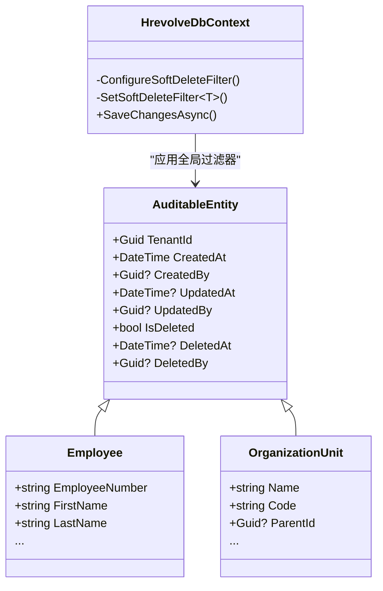
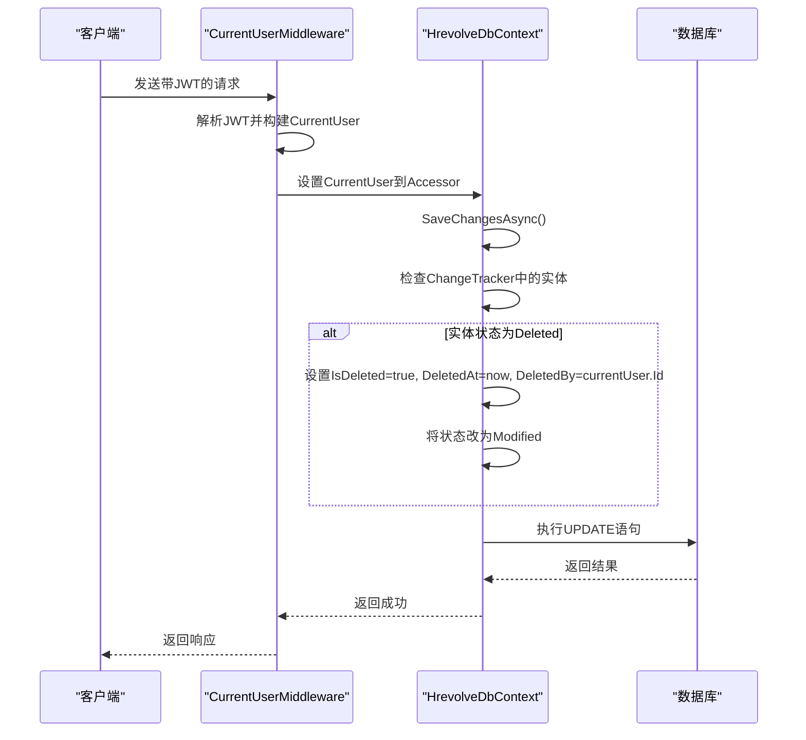

# 软删除机制

<cite>
**本文档引用的文件**  
- [AuditableEntity.cs](file://Backend/Hrevolve.Domain/Common/AuditableEntity.cs)
- [HrevolveDbContext.cs](file://Backend/Hrevolve.Infrastructure/Persistence/HrevolveDbContext.cs)
- [ITenantContext.cs](file://Backend/Hrevolve.Shared/MultiTenancy/ITenantContext.cs)
- [CurrentUserMiddleware.cs](file://Backend/Hrevolve.Web/Middleware/CurrentUserMiddleware.cs)
- [ICurrentUser.cs](file://Backend/Hrevolve.Shared/Identity/ICurrentUser.cs)
- [Employee.cs](file://Backend/Hrevolve.Domain/Employees/Employee.cs)
- [OrganizationUnit.cs](file://Backend/Hrevolve.Domain/Organizations/OrganizationUnit.cs)
- [Repository.cs](file://Backend/Hrevolve.Infrastructure/Persistence/Repositories/Repository.cs)
- [EmployeesController.cs](file://Backend/Hrevolve.Web/Controllers/EmployeesController.cs)
- [CreateEmployeeCommand.cs](file://Backend/Hrevolve.Application/Employees/Commands/CreateEmployeeCommand.cs)
</cite>

## 目录
1. [引言](#引言)
2. [软删除核心实现](#软删除核心实现)
3. [元数据记录机制](#元数据记录机制)
4. [数据查询与性能影响](#数据查询与性能影响)
5. [绕过查询过滤器的开发指导](#绕过查询过滤器的开发指导)
6. [结论](#结论)

## 引言
Hrevolve系统采用逻辑软删除机制替代物理删除，以确保数据完整性、支持数据恢复和满足审计合规要求。该机制基于`AuditableEntity`基类中的`IsDeleted`字段，结合EF Core的全局查询过滤器（Global Query Filter）实现。所有继承自`AuditableEntity`的实体在查询时会自动排除已被标记为删除的记录，从而实现透明的软删除功能。本文档详细阐述该机制的实现原理、元数据记录方式、对系统性能的影响以及在特定场景下的开发实践。

**Section sources**
- [AuditableEntity.cs](file://Backend/Hrevolve.Domain/Common/AuditableEntity.cs#L1-L47)
- [HrevolveDbContext.cs](file://Backend/Hrevolve.Infrastructure/Persistence/HrevolveDbContext.cs#L1-L157)

## 软删除核心实现

### 全局查询过滤器配置
Hrevolve系统通过在`HrevolveDbContext`的`OnModelCreating`方法中配置全局查询过滤器，为所有继承自`AuditableEntity`的实体自动应用软删除逻辑。`ConfigureSoftDeleteFilter`方法遍历模型中的所有实体类型，对每个`AuditableEntity`的派生类调用`SetSoftDeleteFilter`静态方法，设置`HasQueryFilter(e => !e.IsDeleted)`。这意味着任何针对这些实体的LINQ查询，无论是在应用层、服务层还是仓储层，都会在生成的SQL中自动添加`WHERE IsDeleted = 0`的条件，从而在数据库层面屏蔽已删除的记录。

**Diagram sources**
- [AuditableEntity.cs](file://Backend/Hrevolve.Domain/Common/AuditableEntity.cs#L6-L47)
- [HrevolveDbContext.cs](file://Backend/Hrevolve.Infrastructure/Persistence/HrevolveDbContext.cs#L100-L118)

### 删除操作的拦截与转换
软删除的实现不仅依赖于查询过滤，还依赖于对删除操作的拦截。在`HrevolveDbContext`的`SaveChangesAsync`方法中，系统重写了此方法以拦截所有实体状态变更。当检测到`EntityState.Deleted`状态时，代码不会执行物理删除，而是将实体状态修改为`EntityState.Modified`，并设置`IsDeleted = true`、`DeletedAt`和`DeletedBy`字段。这一过程对上层应用代码完全透明，开发者只需调用标准的`Remove`方法，即可触发软删除逻辑。

**Section sources**
- [HrevolveDbContext.cs](file://Backend/Hrevolve.Infrastructure/Persistence/HrevolveDbContext.cs#L120-L155)

## 元数据记录机制

### DeletedAt与DeletedBy字段的用途
`DeletedAt`和`DeletedBy`字段是软删除机制的重要组成部分，它们共同构成了删除操作的完整审计信息。`DeletedAt`记录了删除操作发生的具体时间（UTC），这对于数据恢复、问题排查和合规审计至关重要。`DeletedBy`则记录了执行删除操作的用户ID，明确了操作的责任人。这两个字段与`CreatedAt`、`CreatedBy`、`UpdatedAt`、`UpdatedBy`共同构成了完整的实体生命周期审计链。

### 与多租户上下文和用户中间件的协同
元数据的自动填充依赖于`ITenantContext`和`CurrentUserMiddleware`的协同工作。`ITenantContext`接口通过`ITenantContextAccessor`实现，利用`AsyncLocal`存储当前请求的租户信息，确保数据的多租户隔离。`CurrentUserMiddleware`在请求管道中解析JWT令牌，从中提取用户信息（如ID、邮箱、角色等），并通过`ICurrentUserAccessor`将其设置到当前上下文中。在`SaveChangesAsync`方法中，系统通过`_currentUserAccessor.CurrentUser`获取当前用户，从而自动填充`CreatedBy`、`UpdatedBy`和`DeletedBy`等审计字段。

**Diagram sources**
- [HrevolveDbContext.cs](file://Backend/Hrevolve.Infrastructure/Persistence/HrevolveDbContext.cs#L120-L155)
- [CurrentUserMiddleware.cs](file://Backend/Hrevolve.Web/Middleware/CurrentUserMiddleware.cs#L1-L58)
- [ICurrentUser.cs](file://Backend/Hrevolve.Shared/Identity/ICurrentUser.cs#L1-L115)

**Section sources**
- [AuditableEntity.cs](file://Backend/Hrevolve.Domain/Common/AuditableEntity.cs#L36-L47)
- [HrevolveDbContext.cs](file://Backend/Hrevolve.Infrastructure/Persistence/HrevolveDbContext.cs#L120-L155)
- [ITenantContext.cs](file://Backend/Hrevolve.Shared/MultiTenancy/ITenantContext.cs#L1-L81)
- [CurrentUserMiddleware.cs](file://Backend/Hrevolve.Web/Middleware/CurrentUserMiddleware.cs#L1-L58)

## 数据查询与性能影响

### 对数据查询的影响
软删除机制对数据查询产生了深远影响。一方面，它极大地提升了数据安全性，防止了误删数据的永久丢失，为数据恢复提供了可能。另一方面，它也引入了复杂性。例如，在统计活跃员工数量时，查询会自动排除已删除的员工，这符合业务预期。然而，在实现“回收站”或“历史记录”功能时，开发者必须显式地绕过全局过滤器来查询已删除的记录，这增加了开发的复杂性。

### 索引设计与性能考量
从性能角度看，软删除对数据库索引设计提出了特殊要求。由于`IsDeleted`字段是查询过滤的关键，为`IsDeleted`字段创建索引可以显著提高查询性能，尤其是在大型数据集上。更优的策略是创建包含`IsDeleted`的复合索引，例如`(TenantId, IsDeleted, CreatedAt)`，这可以同时满足多租户隔离、软删除过滤和时间范围查询的需求。然而，这也意味着数据库中会积累大量“已删除”的数据，可能导致表体积膨胀，影响备份、恢复和整体查询性能。因此，系统需要定期归档或物理清理过期的已删除数据。

**Section sources**
- [HrevolveDbContext.cs](file://Backend/Hrevolve.Infrastructure/Persistence/HrevolveDbContext.cs#L115-L118)
- [AuditableEntity.cs](file://Backend/Hrevolve.Domain/Common/AuditableEntity.cs#L36)

## 绕过查询过滤器的开发指导
在某些特定场景下，如数据恢复、审计日志查看或实现“回收站”功能，需要查询已被软删除的记录。为此，EF Core提供了`IgnoreQueryFilters()`方法。开发者可以在`DbSet`上使用此方法来临时禁用全局查询过滤器。例如，要查询所有员工（包括已删除的），可以使用`context.Employees.IgnoreQueryFilters().ToList()`。**必须谨慎使用此方法**，因为它会暴露所有租户和所有状态的数据，必须结合业务逻辑和权限验证来确保数据安全。例如，在恢复数据时，应先验证当前用户是否有权限恢复该特定实体，并确保操作在正确的租户上下文中进行。

**Section sources**
- [HrevolveDbContext.cs](file://Backend/Hrevolve.Infrastructure/Persistence/HrevolveDbContext.cs#L117)
- [Repository.cs](file://Backend/Hrevolve.Infrastructure/Persistence/Repositories/Repository.cs#L1-L115)

## 结论
Hrevolve系统的软删除机制是一个成熟、可靠的设计，它通过`AuditableEntity`基类、EF Core全局查询过滤器和`SaveChangesAsync`拦截的组合，实现了透明且安全的逻辑删除。该机制与多租户架构和用户上下文紧密结合，确保了审计信息的完整性和准确性。尽管它带来了索引设计和数据膨胀的挑战，但其在数据安全和业务灵活性方面的优势远大于其复杂性。开发者在使用时应充分理解其原理，特别是在需要绕过过滤器时，必须严格遵守安全规范。