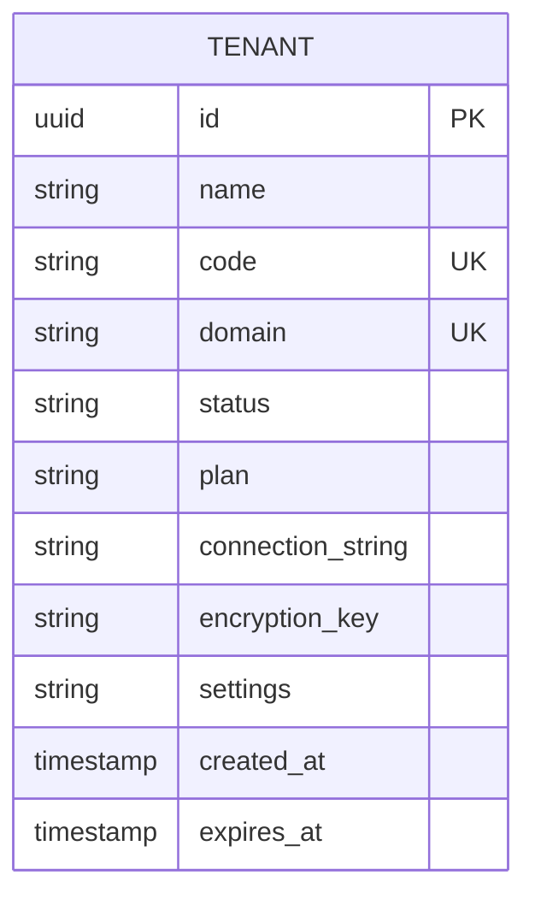
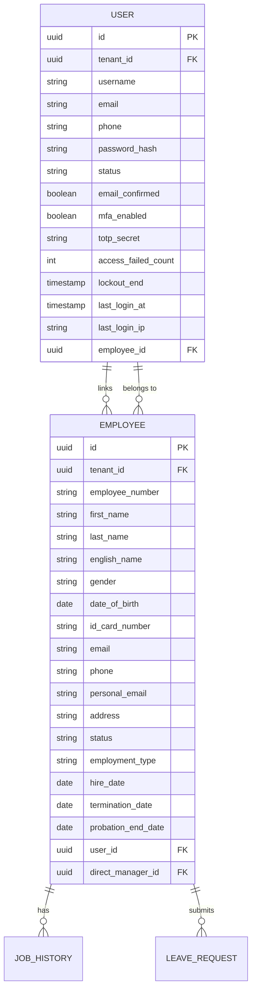
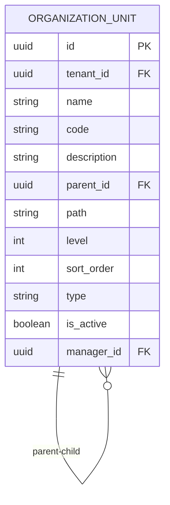
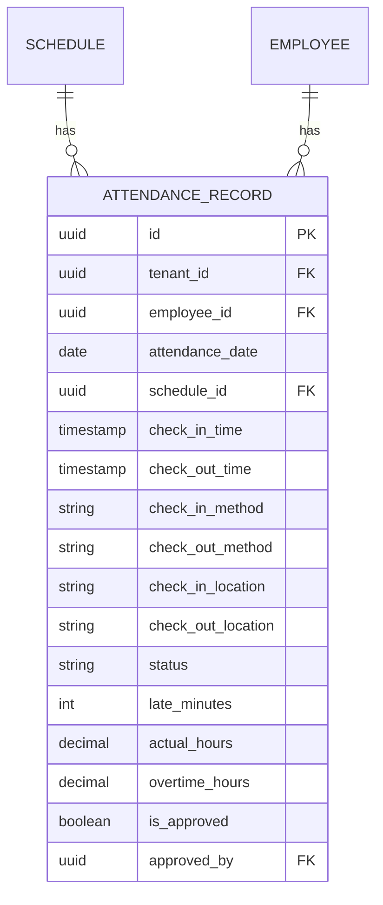
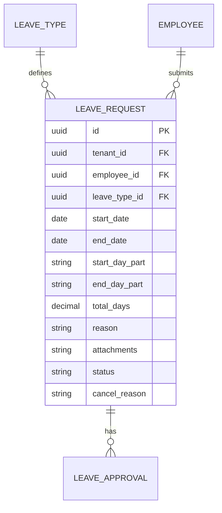
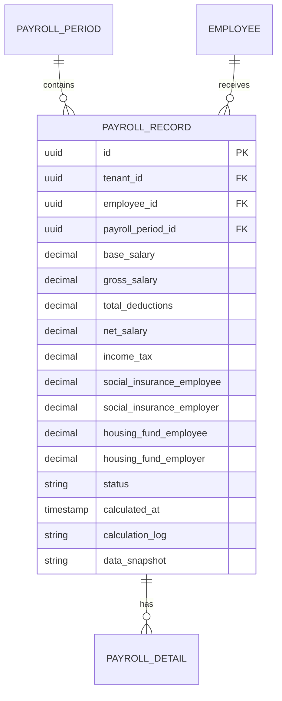

# 数据库设计

<cite>
**本文档引用的文件**   
- [DatabaseDesign.drawio](file://Design/DatabaseDesign.drawio)
- [InitialCreate.cs](file://Backend/Hrevolve.Infrastructure/Migrations/20251227093819_InitialCreate.cs)
- [TenantConfiguration.cs](file://Backend/Hrevolve.Infrastructure/Persistence/Configurations/TenantConfiguration.cs)
- [IdentityConfiguration.cs](file://Backend/Hrevolve.Infrastructure/Persistence/Configurations/IdentityConfiguration.cs)
- [OrganizationConfiguration.cs](file://Backend/Hrevolve.Infrastructure/Persistence/Configurations/OrganizationConfiguration.cs)
- [AttendanceConfiguration.cs](file://Backend/Hrevolve.Infrastructure/Persistence/Configurations/AttendanceConfiguration.cs)
- [LeaveConfiguration.cs](file://Backend/Hrevolve.Infrastructure/Persistence/Configurations/LeaveConfiguration.cs)
- [PayrollConfiguration.cs](file://Backend/Hrevolve.Infrastructure/Persistence/Configurations/PayrollConfiguration.cs)
- [Tenant.cs](file://Backend/Hrevolve.Domain/Tenants/Tenant.cs)
- [User.cs](file://Backend/Hrevolve.Domain/Identity/User.cs)
- [Employee.cs](file://Backend/Hrevolve.Domain/Employees/Employee.cs)
- [OrganizationUnit.cs](file://Backend/Hrevolve.Domain/Organizations/OrganizationUnit.cs)
- [AttendanceRecord.cs](file://Backend/Hrevolve.Domain/Attendance/AttendanceRecord.cs)
- [LeaveRequest.cs](file://Backend/Hrevolve.Domain/Leave/LeaveRequest.cs)
- [PayrollRecord.cs](file://Backend/Hrevolve.Domain/Payroll/PayrollRecord.cs)
</cite>

## 目录
1. [引言](#引言)
2. [核心实体与关系](#核心实体与关系)
3. [多租户数据隔离](#多租户数据隔离)
4. [迁移脚本分析](#迁移脚本分析)
5. [统一处理机制](#统一处理机制)
6. [敏感数据加密](#敏感数据加密)

## 引言
本文档基于`DatabaseDesign.drawio`中的ER图和`InitialCreate.cs`迁移脚本，详细描述了Hrevolve系统的数据库设计。重点分析了Tenant、User、Employee、OrganizationUnit、AttendanceRecord、LeaveRequest、PayrollRecord等核心表的字段定义、主外键约束、索引策略和数据类型选择。同时，文档化了多租户实现、软删除、审计字段和敏感数据加密等关键设计。

## 核心实体与关系

### 租户(Tenant)实体
Tenant表是SaaS多租户架构的核心，存储每个租户的基本信息和配置。

**字段定义：**
- `Id` (PK, uuid): 租户唯一标识
- `Name` (varchar(200)): 租户名称，必填
- `Code` (varchar(50)): 租户代码，全局唯一，用于URL和API
- `Domain` (varchar(200)): 自定义域名，唯一
- `Status` (varchar(20)): 租户状态（Active, Suspended, Expired）
- `Plan` (varchar(20)): 租户套餐（Free, Standard, Professional, Enterprise）
- `ConnectionString` (varchar(1000)): 独立数据库租户的连接字符串
- `EncryptionKey` (varchar(500)): 租户级加密密钥
- `Settings` (varchar(2000)): 租户配置，以JSON格式存储
- `CreatedAt` (timestamp with time zone): 创建时间
- `ExpiresAt` (timestamp with time zone): 过期时间

**索引策略：**
- `IX_Tenants_Code` (唯一): `Code`字段，用于快速查找租户
- `IX_Tenants_Domain` (唯一): `Domain`字段，支持自定义域名访问



**Diagram sources**
- [DatabaseDesign.drawio](file://Design/DatabaseDesign.drawio#L1-L800)
- [Tenant.cs](file://Backend/Hrevolve.Domain/Tenants/Tenant.cs#L1-L67)
- [TenantConfiguration.cs](file://Backend/Hrevolve.Infrastructure/Persistence/Configurations/TenantConfiguration.cs#L1-L56)

**Section sources**
- [DatabaseDesign.drawio](file://Design/DatabaseDesign.drawio#L1-L800)
- [Tenant.cs](file://Backend/Hrevolve.Domain/Tenants/Tenant.cs#L1-L67)
- [TenantConfiguration.cs](file://Backend/Hrevolve.Infrastructure/Persistence/Configurations/TenantConfiguration.cs#L1-L56)

### 用户(User)与员工(Employee)实体
User和Employee是系统的核心身份实体，通过`EmployeeId`字段关联。

**字段定义：**
- `User`表：
  - `Id`, `TenantId`, `Username`, `Email`, `Phone`, `PasswordHash`
  - `Status`, `EmailConfirmed`, `PhoneConfirmed`, `MfaEnabled`
  - `TotpSecret`, `RecoveryCodes`: MFA相关，加密存储
  - `AccessFailedCount`, `LockoutEnd`: 登录安全
  - `LastLoginAt`, `LastLoginIp`: 最后登录信息
  - `EmployeeId`: 关联的员工ID

- `Employee`表：
  - `Id`, `TenantId`, `EmployeeNumber`, `FirstName`, `LastName`, `EnglishName`
  - `Gender`, `DateOfBirth`, `IdCardNumber`: 身份信息，`IdCardNumber`加密存储
  - `Email`, `Phone`, `PersonalEmail`, `Address`: 联系信息
  - `Status`, `EmploymentType`, `HireDate`, `TerminationDate`, `ProbationEndDate`
  - `UserId`: 关联的用户ID
  - `DirectManagerId`: 直属上级ID

**关系：**
- 一个User可以关联一个Employee（1:1）
- 一个Employee可以关联一个User（1:1）
- 一个Employee可以有多个JobHistory（1:N）
- 一个Employee可以有多个LeaveRequest（1:N）



**Diagram sources**
- [DatabaseDesign.drawio](file://Design/DatabaseDesign.drawio#L1-L800)
- [User.cs](file://Backend/Hrevolve.Domain/Identity/User.cs#L1-L194)
- [Employee.cs](file://Backend/Hrevolve.Domain/Employees/Employee.cs#L1-L137)
- [IdentityConfiguration.cs](file://Backend/Hrevolve.Infrastructure/Persistence/Configurations/IdentityConfiguration.cs#L1-L178)

**Section sources**
- [DatabaseDesign.drawio](file://Design/DatabaseDesign.drawio#L1-L800)
- [User.cs](file://Backend/Hrevolve.Domain/Identity/User.cs#L1-L194)
- [Employee.cs](file://Backend/Hrevolve.Domain/Employees/Employee.cs#L1-L137)

### 组织架构(OrganizationUnit)实体
OrganizationUnit表支持树状组织架构，使用邻接表模型和路径枚举模型。

**字段定义：**
- `Id`, `TenantId`, `Name`, `Code`, `Description`
- `ParentId`: 父级组织ID，自引用
- `Path`: 路径枚举，如`/1/5/23/`，用于快速查询子树
- `Level`: 层级深度
- `SortOrder`: 排序序号
- `Type`: 组织类型（Company, Division, Department, Team, Group）
- `IsActive`: 是否激活
- `ManagerId`: 负责人ID

**索引策略：**
- `IX_OrganizationUnits_TenantId_Code` (唯一): 租户内代码唯一
- `IX_OrganizationUnits_TenantId_ParentId`: 按父级查询
- `IX_OrganizationUnits_TenantId_Path`: 按路径查询，支持快速子树操作



**Diagram sources**
- [DatabaseDesign.drawio](file://Design/DatabaseDesign.drawio#L1-L800)
- [OrganizationUnit.cs](file://Backend/Hrevolve.Domain/Organizations/OrganizationUnit.cs#L1-L108)
- [OrganizationConfiguration.cs](file://Backend/Hrevolve.Infrastructure/Persistence/Configurations/OrganizationConfiguration.cs#L1-L95)

**Section sources**
- [DatabaseDesign.drawio](file://Design/DatabaseDesign.drawio#L1-L800)
- [OrganizationUnit.cs](file://Backend/Hrevolve.Domain/Organizations/OrganizationUnit.cs#L1-L108)

### 考勤(AttendanceRecord)实体
AttendanceRecord表记录员工每日考勤情况。

**字段定义：**
- `Id`, `TenantId`, `EmployeeId`, `AttendanceDate`
- `ScheduleId`: 关联的排班ID
- `CheckInTime`, `CheckOutTime`: 签到/签退时间
- `CheckInMethod`, `CheckOutMethod`: 签到方式（App, WiFi, Device, Manual, Web）
- `CheckInLocation`, `CheckOutLocation`: 位置信息（GPS坐标）
- `Status`: 考勤状态（Pending, Normal, Late, EarlyLeave, Absent, Incomplete, Leave, BusinessTrip）
- `LateMinutes`, `EarlyLeaveMinutes`: 迟到/早退分钟数
- `ActualHours`, `OvertimeHours`: 实际工时和加班时长
- `IsApproved`, `ApprovedBy`, `ApprovedAt`: 审核状态

**索引策略：**
- `IX_AttendanceRecords_TenantId_EmployeeId_AttendanceDate` (唯一): 租户内员工每日考勤唯一
- `IX_AttendanceRecords_TenantId_AttendanceDate_Status`: 按日期和状态查询，支持考勤统计



**Diagram sources**
- [DatabaseDesign.drawio](file://Design/DatabaseDesign.drawio#L1-L800)
- [AttendanceRecord.cs](file://Backend/Hrevolve.Domain/Attendance/AttendanceRecord.cs#L1-L191)
- [AttendanceConfiguration.cs](file://Backend/Hrevolve.Infrastructure/Persistence/Configurations/AttendanceConfiguration.cs#L1-L107)

**Section sources**
- [DatabaseDesign.drawio](file://Design/DatabaseDesign.drawio#L1-L800)
- [AttendanceRecord.cs](file://Backend/Hrevolve.Domain/Attendance/AttendanceRecord.cs#L1-L191)

### 请假(LeaveRequest)实体
LeaveRequest表管理员工的请假申请。

**字段定义：**
- `Id`, `TenantId`, `EmployeeId`, `LeaveTypeId`
- `StartDate`, `EndDate`: 请假起止日期
- `StartDayPart`, `EndDayPart`: 开始/结束时段（FullDay, Morning, Afternoon）
- `TotalDays`: 请假天数
- `Reason`: 请假原因
- `Attachments`: 附件URL列表，JSON格式
- `Status`: 请假状态（Pending, Approved, Rejected, Cancelled）
- `CancelReason`: 取消原因

**关系：**
- 一个LeaveRequest属于一个LeaveType
- 一个LeaveRequest有多个LeaveApproval（审批记录）
- 一个Employee有多个LeaveRequest



**Diagram sources**
- [DatabaseDesign.drawio](file://Design/DatabaseDesign.drawio#L1-L800)
- [LeaveRequest.cs](file://Backend/Hrevolve.Domain/Leave/LeaveRequest.cs#L1-L234)
- [LeaveConfiguration.cs](file://Backend/Hrevolve.Infrastructure/Persistence/Configurations/LeaveConfiguration.cs#L1-L167)

**Section sources**
- [DatabaseDesign.drawio](file://Design/DatabaseDesign.drawio#L1-L800)
- [LeaveRequest.cs](file://Backend/Hrevolve.Domain/Leave/LeaveRequest.cs#L1-L234)

### 薪资(PayrollRecord)实体
PayrollRecord表存储员工的薪资记录。

**字段定义：**
- `Id`, `TenantId`, `EmployeeId`, `PayrollPeriodId`
- `BaseSalary`, `GrossSalary`, `TotalDeductions`, `NetSalary`
- `IncomeTax`, `SocialInsuranceEmployee`, `SocialInsuranceEmployer`
- `HousingFundEmployee`, `HousingFundEmployer`
- `Status`: 薪资状态（Draft, Calculated, Approved, Paid）
- `CalculatedAt`: 计算时间
- `CalculationLog`, `DataSnapshot`: 计算日志和数据快照，JSON格式

**关系：**
- 一个PayrollRecord属于一个PayrollPeriod
- 一个PayrollRecord有多个PayrollDetail（薪资明细）
- 一个Employee有多个PayrollRecord



**Diagram sources**
- [DatabaseDesign.drawio](file://Design/DatabaseDesign.drawio#L1-L800)
- [PayrollRecord.cs](file://Backend/Hrevolve.Domain/Payroll/PayrollRecord.cs#L1-L162)
- [PayrollConfiguration.cs](file://Backend/Hrevolve.Infrastructure/Persistence/Configurations/PayrollConfiguration.cs#L1-L147)

**Section sources**
- [DatabaseDesign.drawio](file://Design/DatabaseDesign.drawio#L1-L800)
- [PayrollRecord.cs](file://Backend/Hrevolve.Domain/Payroll/PayrollRecord.cs#L1-L162)

## 多租户数据隔离
系统实现了两种多租户数据隔离方式：

### 查询重写（Query Rewriting）
这是主要的隔离方式，通过在所有查询中自动添加`TenantId`过滤条件实现。

**实现机制：**
- 所有实体都包含`TenantId`字段
- 在EF Core中，通过全局查询过滤器（Global Query Filter）自动添加`TenantId`条件
- 例如，查询员工时，实际SQL为：`SELECT * FROM Employees WHERE TenantId = @currentTenantId`
- 这种方式简单高效，适用于共享数据库模式

### 行级安全（RLS）
作为增强的安全措施，系统支持数据库级别的行级安全。

**实现机制：**
- 在PostgreSQL等支持RLS的数据库中创建安全策略
- 策略基于当前会话的`tenant_id`变量
- 例如：`CREATE POLICY tenant_isolation ON Employees USING (TenantId = current_setting('app.current_tenant'))`
- 这种方式提供了额外的安全层，即使应用层查询被绕过也能保证数据隔离

## 迁移脚本分析
`InitialCreate.cs`迁移脚本使用Fluent API配置了复杂的实体关系映射。

### 复杂关系映射
- **自引用关系**：`OrganizationUnit`的`ParentId`映射到`Parent`导航属性
  ```csharp
  builder.HasOne(o => o.Parent)
         .WithMany(o => o.Children)
         .HasForeignKey(o => o.ParentId)
         .OnDelete(DeleteBehavior.Restrict);
  ```
- **一对多关系**：`LeaveRequest`与`LeaveApproval`的关系
  ```csharp
  builder.HasMany(l => l.Approvals)
         .WithOne()
         .HasForeignKey(a => a.LeaveRequestId)
         .OnDelete(DeleteBehavior.Cascade);
  ```
- **值对象映射**：`Tenant.Settings`配置为JSON列
  ```csharp
  builder.Property(t => t.Settings)
         .HasConversion(
             v => JsonSerializer.Serialize(v, (JsonSerializerOptions?)null),
             v => JsonSerializer.Deserialize<TenantSettings>(v, (JsonSerializerOptions?)null) ?? new TenantSettings())
         .HasMaxLength(2000);
  ```

### 索引配置
脚本中定义了大量索引以优化查询性能：
- 唯一索引确保业务唯一性（如员工编号、用户邮箱）
- 复合索引支持常用查询条件（如按租户+状态查询）
- 路径索引支持组织架构的快速子树查询

## 统一处理机制

### 软删除(IsDeleted)
系统实现了统一的软删除机制：

**字段定义：**
- `IsDeleted` (boolean): 删除标记
- `DeletedAt` (timestamp with time zone): 删除时间
- `DeletedBy` (uuid): 删除人ID

**实现方式：**
- 所有实体继承`AuditableEntity`，包含这些字段
- 通过全局查询过滤器自动排除已删除记录
- 删除操作设置`IsDeleted=true`而非物理删除
- 支持数据恢复和审计追踪

### 审计字段(CreatedBy/CreatedOn)
系统实现了完整的审计追踪：

**字段定义：**
- `CreatedAt` (timestamp with time zone): 创建时间
- `CreatedBy` (uuid): 创建人ID
- `UpdatedAt` (timestamp with time zone): 更新时间
- `UpdatedBy` (uuid): 更新人ID

**实现方式：**
- 所有实体继承`AuditableEntity`
- 在EF Core的`SaveChanges`中自动填充当前用户和时间
- 与领域事件结合，记录完整的变更历史

## 敏感数据加密
系统对敏感数据实施了严格的加密策略：

### 加密字段
- `User.PasswordHash`: 使用BCrypt哈希
- `User.TotpSecret`, `User.RecoveryCodes`: MFA密钥，加密存储
- `Employee.IdCardNumber`: 身份证号，加密存储
- `Tenant.EncryptionKey`: 租户级加密密钥

### 加密策略
- **租户级密钥**：每个租户有独立的加密密钥(`Tenant.EncryptionKey`)
- **字段级加密**：敏感字段使用租户密钥进行AES加密
- **密钥管理**：密钥存储在安全的配置服务中，不直接存于数据库
- **透明加密**：在EF Core配置中通过值转换器实现透明加解密