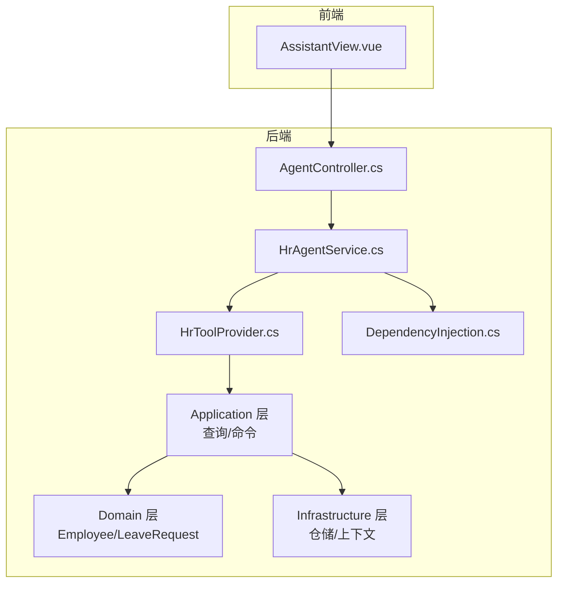
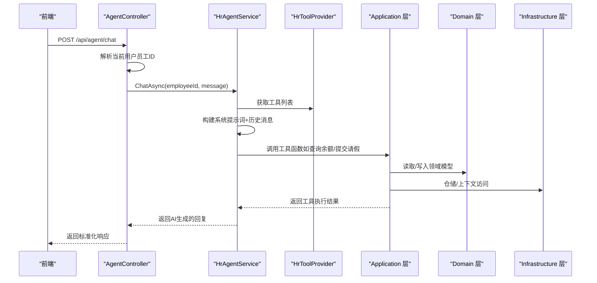
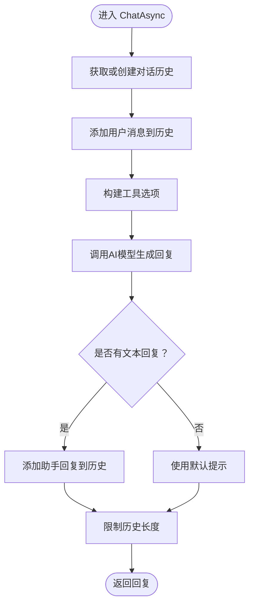
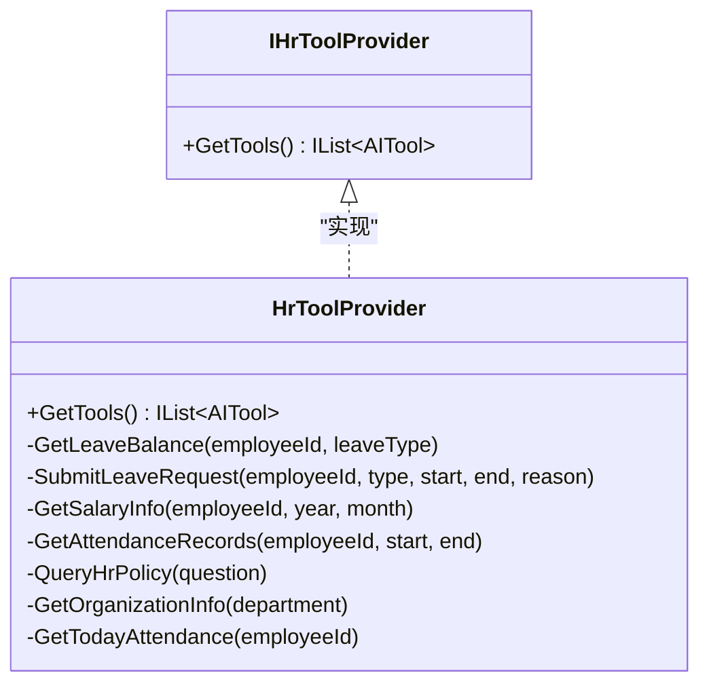
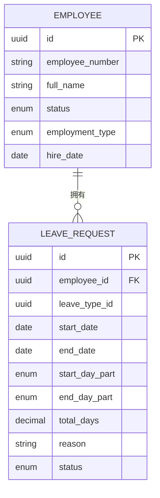
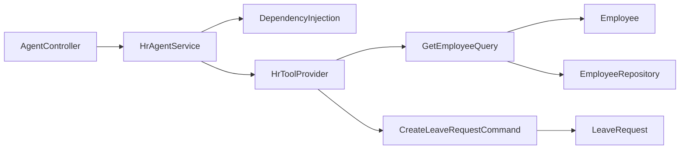

# AI助手实体

<cite>
**本文引用的文件**
- [Agent.md](file://Design/Agent.md)
- [HrAgentService.cs](file://Backend/Hrevolve.Agent/Services/HrAgentService.cs)
- [HrToolProvider.cs](file://Backend/Hrevolve.Agent/Services/HrToolProvider.cs)
- [DependencyInjection.cs](file://Backend/Hrevolve.Agent/DependencyInjection.cs)
- [AgentController.cs](file://Backend/Hrevolve.Web/Controllers/AgentController.cs)
- [Employee.cs](file://Backend/Hrevolve.Domain/Employees/Employee.cs)
- [LeaveRequest.cs](file://Backend/Hrevolve.Domain/Leave/LeaveRequest.cs)
- [GetEmployeeQuery.cs](file://Backend/Hrevolve.Application/Employees/Queries/GetEmployeeQuery.cs)
- [CreateLeaveRequestCommand.cs](file://Backend/Hrevolve.Application/Leave/Commands/CreateLeaveRequestCommand.cs)
- [EmployeeRepository.cs](file://Backend/Hrevolve.Infrastructure/Persistence/Repositories/EmployeeRepository.cs)
- [appsettings.json](file://Backend/Hrevolve.Web/appsettings.json)
</cite>

## 目录
1. [简介](#简介)
2. [项目结构](#项目结构)
3. [核心组件](#核心组件)
4. [架构总览](#架构总览)
5. [详细组件分析](#详细组件分析)
6. [依赖关系分析](#依赖关系分析)
7. [性能考量](#性能考量)
8. [故障排查指南](#故障排查指南)
9. [结论](#结论)
10. [附录](#附录)

## 简介
本文件围绕“AI助手实体”主题，结合设计文档与代码实现，系统性说明HR Agent如何通过对话历史、工具调用记录等机制与核心业务实体（如Employee、LeaveRequest）交互，并解释其设计如何支持自然语言查询与任务自动化。尽管ER图中未直接呈现AI助手实体，但通过Agent层的服务与工具函数，系统实现了以对话为中心的数据访问与业务编排，从而在不改变领域模型的前提下扩展了自然语言交互能力。

## 项目结构
- 设计文档与AI能力说明集中在设计目录，明确AI框架、工具函数清单与配置方式。
- Agent层提供AI服务与工具提供者，封装与LLM的交互以及对业务工具的调用。
- Web层提供对外API，控制器基于当前登录员工上下文调用Agent服务。
- Application层提供查询与命令，作为Agent工具函数的业务入口。
- Domain层定义核心业务实体（Employee、LeaveRequest等），Agent通过Application层间接访问这些实体。
- Infrastructure层提供仓储与数据库访问，Application层通过仓储与上下文访问领域模型。

图表来源
- [AgentController.cs](file://Backend/Hrevolve.Web/Controllers/AgentController.cs#L1-L87)
- [HrAgentService.cs](file://Backend/Hrevolve.Agent/Services/HrAgentService.cs#L1-L151)
- [HrToolProvider.cs](file://Backend/Hrevolve.Agent/Services/HrToolProvider.cs#L1-L250)
- [DependencyInjection.cs](file://Backend/Hrevolve.Agent/DependencyInjection.cs#L1-L123)
- [GetEmployeeQuery.cs](file://Backend/Hrevolve.Application/Employees/Queries/GetEmployeeQuery.cs#L1-L146)
- [CreateLeaveRequestCommand.cs](file://Backend/Hrevolve.Application/Leave/Commands/CreateLeaveRequestCommand.cs#L1-L137)
- [Employee.cs](file://Backend/Hrevolve.Domain/Employees/Employee.cs#L1-L137)
- [LeaveRequest.cs](file://Backend/Hrevolve.Domain/Leave/LeaveRequest.cs#L1-L234)
- [EmployeeRepository.cs](file://Backend/Hrevolve.Infrastructure/Persistence/Repositories/EmployeeRepository.cs#L1-L82)

章节来源
- [Agent.md](file://Design/Agent.md#L186-L235)
- [AgentController.cs](file://Backend/Hrevolve.Web/Controllers/AgentController.cs#L1-L87)
- [HrAgentService.cs](file://Backend/Hrevolve.Agent/Services/HrAgentService.cs#L1-L151)
- [HrToolProvider.cs](file://Backend/Hrevolve.Agent/Services/HrToolProvider.cs#L1-L250)
- [DependencyInjection.cs](file://Backend/Hrevolve.Agent/DependencyInjection.cs#L1-L123)

## 核心组件
- Agent控制器：接收前端消息，解析当前用户员工ID，调用Agent服务并返回标准化响应。
- HR Agent服务：维护对话历史、构建系统提示词、调用AI模型并整合工具调用结果。
- 工具提供者：注册AI工具函数（查询余额、提交请假、查询薪资、考勤、组织架构、今日考勤、HR政策）。
- 依赖注入：按配置选择AI提供商（OpenAI/Azure/Mock），注册Agent服务与工具提供者。
- 应用层查询/命令：作为Agent工具函数的业务入口，访问领域模型与仓储。
- 领域模型：Employee、LeaveRequest等核心实体，Agent通过应用层间接读写。

章节来源
- [AgentController.cs](file://Backend/Hrevolve.Web/Controllers/AgentController.cs#L1-L87)
- [HrAgentService.cs](file://Backend/Hrevolve.Agent/Services/HrAgentService.cs#L1-L151)
- [HrToolProvider.cs](file://Backend/Hrevolve.Agent/Services/HrToolProvider.cs#L1-L250)
- [DependencyInjection.cs](file://Backend/Hrevolve.Agent/DependencyInjection.cs#L1-L123)
- [GetEmployeeQuery.cs](file://Backend/Hrevolve.Application/Employees/Queries/GetEmployeeQuery.cs#L1-L146)
- [CreateLeaveRequestCommand.cs](file://Backend/Hrevolve.Application/Leave/Commands/CreateLeaveRequestCommand.cs#L1-L137)
- [Employee.cs](file://Backend/Hrevolve.Domain/Employees/Employee.cs#L1-L137)
- [LeaveRequest.cs](file://Backend/Hrevolve.Domain/Leave/LeaveRequest.cs#L1-L234)

## 架构总览
AI助手采用“控制器-服务-工具-应用层-领域层”的分层架构：
- 控制器层负责鉴权与上下文提取，确保仅允许已绑定员工身份的用户使用。
- Agent服务负责对话历史管理、系统提示词与工具编排。
- 工具提供者将业务能力封装为LLM可调用的函数，函数参数与返回值均面向自然语言交互。
- 应用层查询/命令作为工具函数的业务边界，保证领域模型不变的同时暴露受控接口。
- 领域模型与仓储隔离业务逻辑与数据持久化，Agent通过应用层间接访问。

图表来源
- [AgentController.cs](file://Backend/Hrevolve.Web/Controllers/AgentController.cs#L1-L87)
- [HrAgentService.cs](file://Backend/Hrevolve.Agent/Services/HrAgentService.cs#L1-L151)
- [HrToolProvider.cs](file://Backend/Hrevolve.Agent/Services/HrToolProvider.cs#L1-L250)
- [GetEmployeeQuery.cs](file://Backend/Hrevolve.Application/Employees/Queries/GetEmployeeQuery.cs#L1-L146)
- [CreateLeaveRequestCommand.cs](file://Backend/Hrevolve.Application/Leave/Commands/CreateLeaveRequestCommand.cs#L1-L137)
- [Employee.cs](file://Backend/Hrevolve.Domain/Employees/Employee.cs#L1-L137)
- [LeaveRequest.cs](file://Backend/Hrevolve.Domain/Leave/LeaveRequest.cs#L1-L234)
- [EmployeeRepository.cs](file://Backend/Hrevolve.Infrastructure/Persistence/Repositories/EmployeeRepository.cs#L1-L82)

## 详细组件分析

### Agent控制器（对外API）
- 职责：鉴权、提取当前用户员工ID、调用Agent服务、返回标准化响应。
- 关键点：仅授权用户可使用；当用户未绑定员工信息时返回明确错误码。
- 输出：统一的响应结构，包含消息文本与时间戳。

章节来源
- [AgentController.cs](file://Backend/Hrevolve.Web/Controllers/AgentController.cs#L1-L87)

### HR Agent服务（对话编排）
- 职责：维护每个员工的对话历史、构建系统提示词、调用AI模型、整合工具调用结果、限制历史长度。
- 数据模型设计考量：
  - 对话历史以内存字典存储（生产环境建议替换为Redis或数据库），键为员工ID，值为消息列表。
  - 系统提示词集中管理，确保Agent行为一致且符合业务约束（如仅能查询本人薪资、组织信息等）。
  - 历史修剪策略：保留系统消息与最近N条消息，避免上下文过长影响性能与成本。
- 错误处理：捕获异常并返回友好提示，避免中断用户体验。

图表来源
- [HrAgentService.cs](file://Backend/Hrevolve.Agent/Services/HrAgentService.cs#L1-L151)

章节来源
- [HrAgentService.cs](file://Backend/Hrevolve.Agent/Services/HrAgentService.cs#L1-L151)

### 工具提供者（AI工具函数）
- 职责：注册AI可调用的工具函数，覆盖假期余额、请假申请、薪资查询、考勤记录、HR政策、组织架构、今日考勤等。
- 设计要点：
  - 工具函数签名面向自然语言交互，参数包含员工ID、日期范围、类型等，便于LLM自动推理。
  - 工具函数内部预留调用应用层查询/命令的占位，当前以模拟实现演示交互流程。
  - 支持RAG检索HR政策（向量数据库抽象层已在设计文档中说明，工具函数中留有占位）。

图表来源
- [HrToolProvider.cs](file://Backend/Hrevolve.Agent/Services/HrToolProvider.cs#L1-L250)

章节来源
- [HrToolProvider.cs](file://Backend/Hrevolve.Agent/Services/HrToolProvider.cs#L1-L250)
- [Agent.md](file://Design/Agent.md#L202-L233)

### 依赖注入（AI提供商与服务注册）
- 职责：按配置选择AI提供商（OpenAI/Azure/Mock），注册IChatClient、工具提供者与Agent服务。
- 配置来源：appsettings.json中的AI节，支持Provider、ApiKey、Model、Endpoint、DeploymentName。
- 开发测试：未配置API Key时回退到Mock客户端，便于本地调试。

章节来源
- [DependencyInjection.cs](file://Backend/Hrevolve.Agent/DependencyInjection.cs#L1-L123)
- [appsettings.json](file://Backend/Hrevolve.Web/appsettings.json#L1-L39)

### 应用层与领域模型（与Agent交互的桥梁）
- 查询与命令：
  - GetEmployeeQuery：查询员工详情与当前职位信息，Agent工具函数可通过此查询获取员工组织信息与基础资料。
  - CreateLeaveRequestCommand：创建请假申请，Agent工具函数可通过此命令提交请假，同时校验余额与日期冲突。
- 领域模型：
  - Employee：员工实体，包含个人信息、雇佣状态、职位历史等，Agent通过应用层间接读取。
  - LeaveRequest：请假申请实体，包含起止日期、时段、原因、状态与审批记录，Agent通过应用层间接写入。

图表来源
- [Employee.cs](file://Backend/Hrevolve.Domain/Employees/Employee.cs#L1-L137)
- [LeaveRequest.cs](file://Backend/Hrevolve.Domain/Leave/LeaveRequest.cs#L1-L234)

章节来源
- [GetEmployeeQuery.cs](file://Backend/Hrevolve.Application/Employees/Queries/GetEmployeeQuery.cs#L1-L146)
- [CreateLeaveRequestCommand.cs](file://Backend/Hrevolve.Application/Leave/Commands/CreateLeaveRequestCommand.cs#L1-L137)
- [Employee.cs](file://Backend/Hrevolve.Domain/Employees/Employee.cs#L1-L137)
- [LeaveRequest.cs](file://Backend/Hrevolve.Domain/Leave/LeaveRequest.cs#L1-L234)

### 与核心业务实体的交互路径
- 通过应用层查询/命令访问领域模型，Agent工具函数不直接依赖领域模型，而是通过应用层的受控接口进行读写。
- 对话历史与工具调用记录：
  - 对话历史：由Agent服务维护，用于上下文记忆与多轮对话连贯性。
  - 工具调用记录：工具函数的输入参数、输出结果可作为审计与追踪依据（当前实现中以模拟为主，实际生产中可接入日志/审计）。
- 自然语言到业务动作的映射：
  - 用户询问“我的年假还有多少”，Agent识别意图后调用“查询余额”工具，应用层查询员工余额并返回。
  - 用户说“帮我请个假”，Agent引导用户提供类型、日期、原因，随后调用“提交请假”命令，应用层校验余额与日期冲突后创建请假申请。

章节来源
- [HrAgentService.cs](file://Backend/Hrevolve.Agent/Services/HrAgentService.cs#L1-L151)
- [HrToolProvider.cs](file://Backend/Hrevolve.Agent/Services/HrToolProvider.cs#L1-L250)
- [GetEmployeeQuery.cs](file://Backend/Hrevolve.Application/Employees/Queries/GetEmployeeQuery.cs#L1-L146)
- [CreateLeaveRequestCommand.cs](file://Backend/Hrevolve.Application/Leave/Commands/CreateLeaveRequestCommand.cs#L1-L137)

## 依赖关系分析
- 组件耦合：
  - Agent服务依赖IChatClient与IHrToolProvider，通过DI注入解耦具体AI提供商与工具实现。
  - 工具函数依赖应用层查询/命令，避免Agent直接访问领域模型，保持分层清晰。
- 外部依赖：
  - AI提供商（OpenAI/Azure/Mock）通过配置切换，Mock用于开发测试。
  - 日志、配置、仓储等基础设施通过标准.NET扩展注入。
- 潜在循环依赖：
  - Agent层不直接依赖应用层的仓储实现，应用层通过上下文与仓储访问领域模型，避免循环。

图表来源
- [AgentController.cs](file://Backend/Hrevolve.Web/Controllers/AgentController.cs#L1-L87)
- [HrAgentService.cs](file://Backend/Hrevolve.Agent/Services/HrAgentService.cs#L1-L151)
- [DependencyInjection.cs](file://Backend/Hrevolve.Agent/DependencyInjection.cs#L1-L123)
- [HrToolProvider.cs](file://Backend/Hrevolve.Agent/Services/HrToolProvider.cs#L1-L250)
- [GetEmployeeQuery.cs](file://Backend/Hrevolve.Application/Employees/Queries/GetEmployeeQuery.cs#L1-L146)
- [CreateLeaveRequestCommand.cs](file://Backend/Hrevolve.Application/Leave/Commands/CreateLeaveRequestCommand.cs#L1-L137)
- [Employee.cs](file://Backend/Hrevolve.Domain/Employees/Employee.cs#L1-L137)
- [LeaveRequest.cs](file://Backend/Hrevolve.Domain/Leave/LeaveRequest.cs#L1-L234)
- [EmployeeRepository.cs](file://Backend/Hrevolve.Infrastructure/Persistence/Repositories/EmployeeRepository.cs#L1-L82)

章节来源
- [DependencyInjection.cs](file://Backend/Hrevolve.Agent/DependencyInjection.cs#L1-L123)
- [HrToolProvider.cs](file://Backend/Hrevolve.Agent/Services/HrToolProvider.cs#L1-L250)
- [GetEmployeeQuery.cs](file://Backend/Hrevolve.Application/Employees/Queries/GetEmployeeQuery.cs#L1-L146)
- [CreateLeaveRequestCommand.cs](file://Backend/Hrevolve.Application/Leave/Commands/CreateLeaveRequestCommand.cs#L1-L137)

## 性能考量
- 对话历史长度控制：限制最大消息数，避免上下文过长导致成本上升与延迟增加。
- AI提供商选择：在生产环境优先使用稳定可靠的提供商；Mock仅用于开发测试。
- 工具函数幂等与缓存：对只读查询（如余额、组织架构）可引入缓存减少重复调用。
- 日志与监控：统一结构化日志，记录关键指标（请求耗时、错误率、工具调用成功率）以便优化。

## 故障排查指南
- 未配置AI提供商：检查appsettings.json中AI节，确保Provider与ApiKey正确；若为空则回退Mock。
- 用户未绑定员工信息：AgentController会返回明确错误码，需确认用户登录状态与员工关联。
- 工具函数异常：Agent服务捕获异常并返回友好提示；可在日志中定位具体工具与参数。
- 请假余额不足或日期冲突：应用层命令处理器会返回相应错误码，Agent服务将错误信息反馈给用户。

章节来源
- [DependencyInjection.cs](file://Backend/Hrevolve.Agent/DependencyInjection.cs#L1-L123)
- [AgentController.cs](file://Backend/Hrevolve.Web/Controllers/AgentController.cs#L1-L87)
- [CreateLeaveRequestCommand.cs](file://Backend/Hrevolve.Application/Leave/Commands/CreateLeaveRequestCommand.cs#L1-L137)
- [HrAgentService.cs](file://Backend/Hrevolve.Agent/Services/HrAgentService.cs#L1-L151)

## 结论
AI助手通过“对话历史+工具调用”的方式，在不侵入领域模型的前提下，实现了自然语言查询与任务自动化。Agent服务承担对话编排与上下文管理，工具提供者将业务能力封装为LLM可调用的函数，应用层作为业务边界隔离领域模型与外部交互。设计文档明确了AI框架、工具清单与配置方式，配合严格的依赖注入与错误处理，确保系统具备良好的扩展性与可维护性。

## 附录
- 配置参考：AI Provider、ApiKey、Model、Endpoint、DeploymentName。
- 工具函数清单：余额查询、请假提交、薪资查询、考勤记录、HR政策、组织架构、今日考勤。

章节来源
- [Agent.md](file://Design/Agent.md#L186-L235)
- [appsettings.json](file://Backend/Hrevolve.Web/appsettings.json#L1-L39)