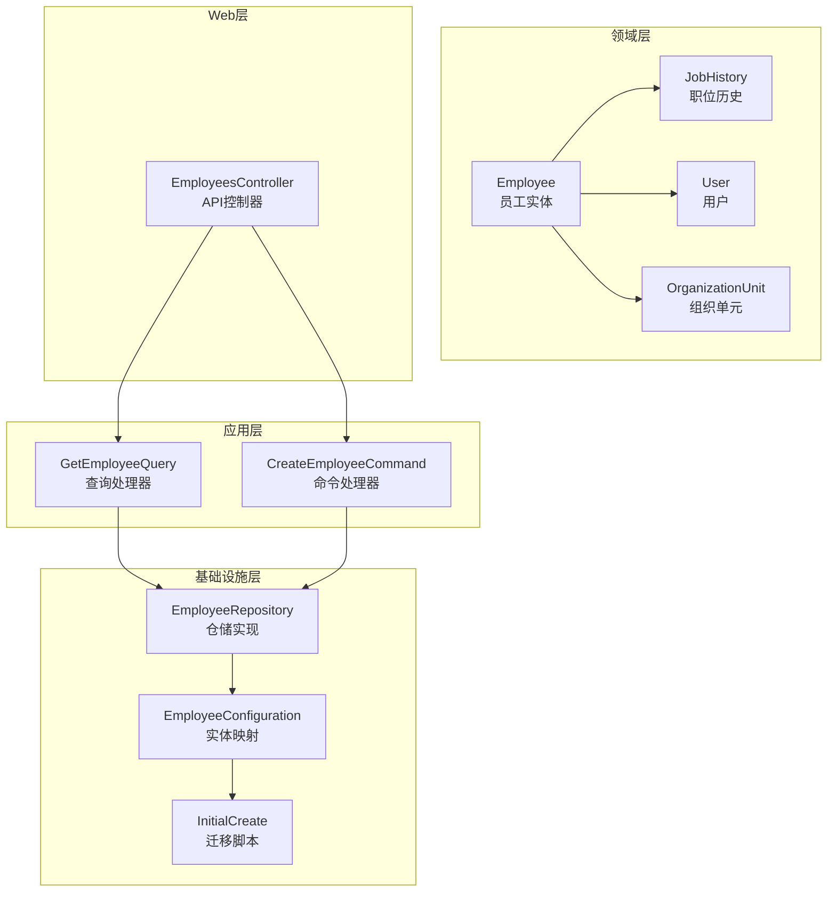
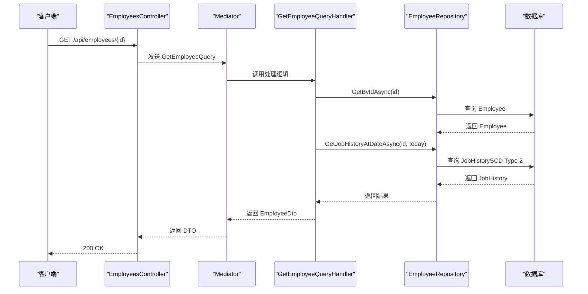
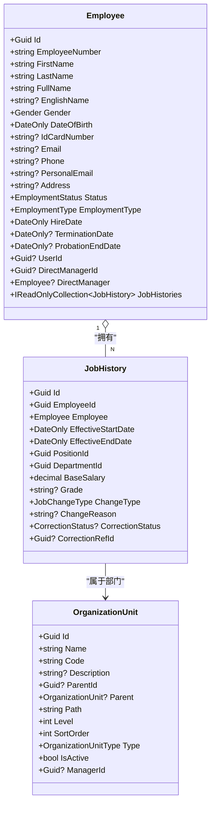
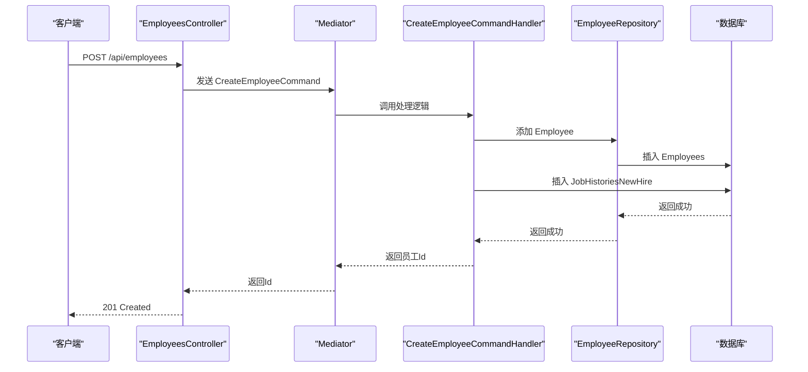
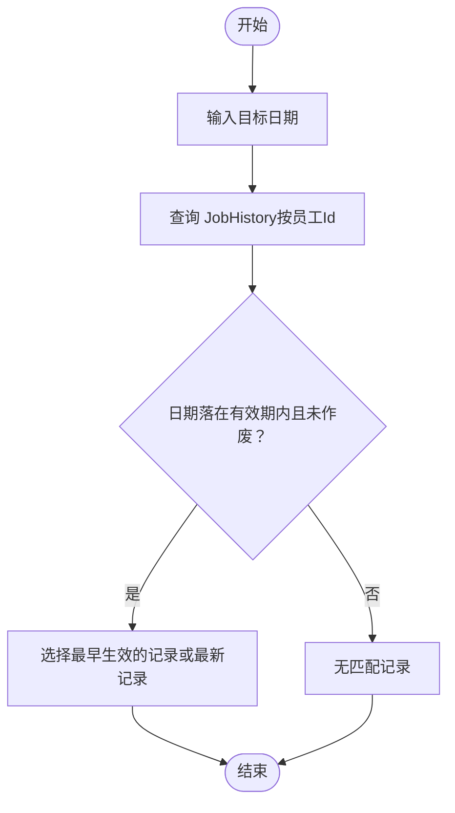
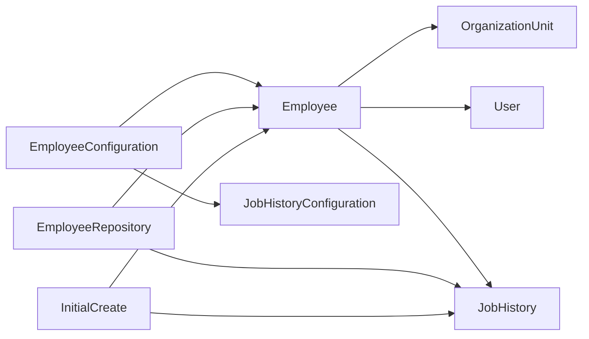

# 员工实体

<cite>
**本文引用的文件**
- [Employee.cs](file://Backend/Hrevolve.Domain/Employees/Employee.cs)
- [JobHistory.cs](file://Backend/Hrevolve.Domain/Employees/JobHistory.cs)
- [OrganizationUnit.cs](file://Backend/Hrevolve.Domain/Organizations/OrganizationUnit.cs)
- [User.cs](file://Backend/Hrevolve.Domain/Identity/User.cs)
- [EmployeeConfiguration.cs](file://Backend/Hrevolve.Infrastructure/Persistence/Configurations/EmployeeConfiguration.cs)
- [EmployeeRepository.cs](file://Backend/Hrevolve.Infrastructure/Persistence/Repositories/EmployeeRepository.cs)
- [GetEmployeeQuery.cs](file://Backend/Hrevolve.Application/Employees/Queries/GetEmployeeQuery.cs)
- [CreateEmployeeCommand.cs](file://Backend/Hrevolve.Application/Employees/Commands/CreateEmployeeCommand.cs)
- [EmployeesController.cs](file://Backend/Hrevolve.Web/Controllers/EmployeesController.cs)
- [20251227093819_InitialCreate.Designer.cs](file://Backend/Hrevolve.Infrastructure/Migrations/20251227093819_InitialCreate.Designer.cs)
- [DatabaseDesign.drawio](file://Design/DatabaseDesign.drawio)
</cite>

## 目录
1. [简介](#简介)
2. [项目结构](#项目结构)
3. [核心组件](#核心组件)
4. [架构总览](#架构总览)
5. [详细组件分析](#详细组件分析)
6. [依赖分析](#依赖分析)
7. [性能考虑](#性能考虑)
8. [故障排查指南](#故障排查指南)
9. [结论](#结论)

## 简介
本文件围绕 HR 核心实体 Employee 的属性与关系进行系统化说明，结合数据库 ER 图与代码实现，重点阐述：
- Employee 的关键属性与语义（如员工编号、姓名、性别、出生日期、雇佣状态、雇佣类型、入职日期、终止日期、试用期结束日期、联系方式、身份证号、直属上级、关联用户等）
- 与 OrganizationUnit 的多对一关系（部门归属）
- 与 User 的一对一关系（账户绑定）
- 与 JobHistory 的 1:N 关系（工作履历，支持 SCD Type 2 时点查询）

同时，本文提供从应用层到基础设施层的调用链路与数据流图示，帮助读者理解 Employee 在整个系统中的职责与边界。

## 项目结构
- 领域层：定义实体与值对象、枚举及领域事件
- 应用层：封装查询与命令，负责用例编排
- 基础设施层：EF Core 映射、仓储与数据库迁移
- Web 层：控制器暴露 API

图表来源
- [Employee.cs](file://Backend/Hrevolve.Domain/Employees/Employee.cs#L1-L137)
- [JobHistory.cs](file://Backend/Hrevolve.Domain/Employees/JobHistory.cs#L1-L124)
- [OrganizationUnit.cs](file://Backend/Hrevolve.Domain/Organizations/OrganizationUnit.cs#L1-L108)
- [User.cs](file://Backend/Hrevolve.Domain/Identity/User.cs#L1-L194)
- [EmployeeConfiguration.cs](file://Backend/Hrevolve.Infrastructure/Persistence/Configurations/EmployeeConfiguration.cs#L1-L110)
- [EmployeeRepository.cs](file://Backend/Hrevolve.Infrastructure/Persistence/Repositories/EmployeeRepository.cs#L1-L82)
- [GetEmployeeQuery.cs](file://Backend/Hrevolve.Application/Employees/Queries/GetEmployeeQuery.cs#L1-L146)
- [CreateEmployeeCommand.cs](file://Backend/Hrevolve.Application/Employees/Commands/CreateEmployeeCommand.cs#L1-L126)
- [EmployeesController.cs](file://Backend/Hrevolve.Web/Controllers/EmployeesController.cs#L1-L106)
- [20251227093819_InitialCreate.Designer.cs](file://Backend/Hrevolve.Infrastructure/Migrations/20251227093819_InitialCreate.Designer.cs#L345-L459)

章节来源
- [Employee.cs](file://Backend/Hrevolve.Domain/Employees/Employee.cs#L1-L137)
- [EmployeeConfiguration.cs](file://Backend/Hrevolve.Infrastructure/Persistence/Configurations/EmployeeConfiguration.cs#L1-L110)
- [EmployeeRepository.cs](file://Backend/Hrevolve.Infrastructure/Persistence/Repositories/EmployeeRepository.cs#L1-L82)
- [GetEmployeeQuery.cs](file://Backend/Hrevolve.Application/Employees/Queries/GetEmployeeQuery.cs#L1-L146)
- [CreateEmployeeCommand.cs](file://Backend/Hrevolve.Application/Employees/Commands/CreateEmployeeCommand.cs#L1-L126)
- [EmployeesController.cs](file://Backend/Hrevolve.Web/Controllers/EmployeesController.cs#L1-L106)
- [20251227093819_InitialCreate.Designer.cs](file://Backend/Hrevolve.Infrastructure/Migrations/20251227093819_InitialCreate.Designer.cs#L345-L459)

## 核心组件
- Employee 实体：承载员工全生命周期关键信息，包含联系信息、身份信息、雇佣状态与类型、入职/终止/试用期结束日期、直属上级、关联用户等；并维护 JobHistory 集合。
- JobHistory 实体：支持 SCD Type 2 的职位历史记录，包含生效起止日期、部门与职位、基本薪资、职级、变更类型与原因、冲正状态等。
- OrganizationUnit 实体：组织单元，支持树形结构与路径枚举，用于表达部门归属。
- User 实体：认证与授权核心，支持外部登录、MFA、受信任设备等，提供与 Employee 的一对一绑定能力。
- EmployeeConfiguration：EF Core 映射，定义字段长度、索引、自引用关系等。
- EmployeeRepository：提供按部门、直接下属、时点查询等仓储方法。
- 查询与命令：GetEmployeeQuery、GetEmployeeAtDateQuery、CreateEmployeeCommand 等，体现应用层用例。

章节来源
- [Employee.cs](file://Backend/Hrevolve.Domain/Employees/Employee.cs#L1-L137)
- [JobHistory.cs](file://Backend/Hrevolve.Domain/Employees/JobHistory.cs#L1-L124)
- [OrganizationUnit.cs](file://Backend/Hrevolve.Domain/Organizations/OrganizationUnit.cs#L1-L108)
- [User.cs](file://Backend/Hrevolve.Domain/Identity/User.cs#L1-L194)
- [EmployeeConfiguration.cs](file://Backend/Hrevolve.Infrastructure/Persistence/Configurations/EmployeeConfiguration.cs#L1-L110)
- [EmployeeRepository.cs](file://Backend/Hrevolve.Infrastructure/Persistence/Repositories/EmployeeRepository.cs#L1-L82)
- [GetEmployeeQuery.cs](file://Backend/Hrevolve.Application/Employees/Queries/GetEmployeeQuery.cs#L1-L146)
- [CreateEmployeeCommand.cs](file://Backend/Hrevolve.Application/Employees/Commands/CreateEmployeeCommand.cs#L1-L126)

## 架构总览
Employee 作为 HR 核心数据模型，贯穿以下关键流程：
- 创建员工：应用层接收 CreateEmployeeCommand，调用仓储创建 Employee，并生成初始 JobHistory（NewHire）。
- 查询员工详情：应用层通过 EmployeeRepository 获取 Employee 及其 JobHistory，按当前日期或指定日期进行 SCD Type 2 时点查询，返回 DTO。
- 组织归属：通过 JobHistory 中的 DepartmentId 与 OrganizationUnit 的树形结构建立部门归属关系。
- 账户绑定：通过 Employee.UserId 与 User.EmployeeId 建立一对一绑定，支持登录与权限控制。

图表来源
- [EmployeesController.cs](file://Backend/Hrevolve.Web/Controllers/EmployeesController.cs#L1-L66)
- [GetEmployeeQuery.cs](file://Backend/Hrevolve.Application/Employees/Queries/GetEmployeeQuery.cs#L1-L91)
- [EmployeeRepository.cs](file://Backend/Hrevolve.Infrastructure/Persistence/Repositories/EmployeeRepository.cs#L70-L81)

章节来源
- [EmployeesController.cs](file://Backend/Hrevolve.Web/Controllers/EmployeesController.cs#L1-L66)
- [GetEmployeeQuery.cs](file://Backend/Hrevolve.Application/Employees/Queries/GetEmployeeQuery.cs#L1-L91)
- [EmployeeRepository.cs](file://Backend/Hrevolve.Infrastructure/Persistence/Repositories/EmployeeRepository.cs#L70-L81)

## 详细组件分析

### Employee 实体属性详解
- 基本标识与姓名
  - 员工编号：唯一性约束，便于检索与跨系统引用
  - 姓、名、全名：组合显示
  - 英文名：可选
  - 性别：枚举
  - 出生日期：DateOnly
- 联系信息
  - 邮箱、手机号、个人邮箱、地址：均为可选字符串
  - 身份证号：加密存储
- 雇佣信息
  - 雇佣状态：Active/OnLeave/Suspended/Terminated
  - 雇佣类型：FullTime/PartTime/Contract/Intern/Consultant
  - 入职日期、终止日期、试用期结束日期：DateOnly 或可空
- 组织与账户
  - 直属上级：自引用（EmployeeId -> Employee）
  - 关联用户：UserId -> User.Id
- 履历集合
  - JobHistories：只读集合，支持 SCD Type 2 的时点查询

章节来源
- [Employee.cs](file://Backend/Hrevolve.Domain/Employees/Employee.cs#L1-L137)
- [EmployeeConfiguration.cs](file://Backend/Hrevolve.Infrastructure/Persistence/Configurations/EmployeeConfiguration.cs#L56-L71)
- [20251227093819_InitialCreate.Designer.cs](file://Backend/Hrevolve.Infrastructure/Migrations/20251227093819_InitialCreate.Designer.cs#L345-L459)

### 与 OrganizationUnit 的多对一关系（部门归属）
- 关系说明
  - Employee 与 JobHistory 之间存在 N:1 关系：每个 JobHistory 指向一个 Employee
  - JobHistory 中包含 DepartmentId 字段，用于指向 OrganizationUnit
  - OrganizationUnit 支持树形结构（邻接表 + 路径枚举），可用于快速判断上下级关系
- 数据库映射
  - JobHistoryConfiguration 定义了 Employee -> JobHistory 的一对多关系与外键约束
  - EmployeeConfiguration 定义了自引用的 DirectManager 关系
- 查询场景
  - 通过 EmployeeRepository.GetByDepartmentAsync 可基于 JobHistory 的 DepartmentId 与时点条件筛选当前在某部门的员工
  - 通过 JobHistory.IsEffectiveOn 可判断某员工在指定日期是否处于该部门

图表来源
- [Employee.cs](file://Backend/Hrevolve.Domain/Employees/Employee.cs#L1-L137)
- [JobHistory.cs](file://Backend/Hrevolve.Domain/Employees/JobHistory.cs#L1-L124)
- [OrganizationUnit.cs](file://Backend/Hrevolve.Domain/Organizations/OrganizationUnit.cs#L1-L108)
- [EmployeeConfiguration.cs](file://Backend/Hrevolve.Infrastructure/Persistence/Configurations/EmployeeConfiguration.cs#L62-L71)
- [EmployeeRepository.cs](file://Backend/Hrevolve.Infrastructure/Persistence/Repositories/EmployeeRepository.cs#L44-L61)

章节来源
- [Employee.cs](file://Backend/Hrevolve.Domain/Employees/Employee.cs#L1-L137)
- [JobHistory.cs](file://Backend/Hrevolve.Domain/Employees/JobHistory.cs#L1-L124)
- [OrganizationUnit.cs](file://Backend/Hrevolve.Domain/Organizations/OrganizationUnit.cs#L1-L108)
- [EmployeeConfiguration.cs](file://Backend/Hrevolve.Infrastructure/Persistence/Configurations/EmployeeConfiguration.cs#L62-L71)
- [EmployeeRepository.cs](file://Backend/Hrevolve.Infrastructure/Persistence/Repositories/EmployeeRepository.cs#L44-L61)

### 与 User 的一对一关系（账户绑定）
- 关系说明
  - Employee.UserId 与 User.Id 建立一对一绑定
  - User 提供外部登录、MFA、受信任设备等能力
- 业务价值
  - 支持登录、权限分配、审计追踪
  - 通过 User.LinkEmployee 将用户与员工绑定
- 数据库映射
  - EmployeeConfiguration 定义了 UserId 字段与索引
  - User 提供 EmployeeId 字段用于反向绑定

图表来源
- [CreateEmployeeCommand.cs](file://Backend/Hrevolve.Application/Employees/Commands/CreateEmployeeCommand.cs#L70-L126)
- [EmployeeRepository.cs](file://Backend/Hrevolve.Infrastructure/Persistence/Repositories/EmployeeRepository.cs#L1-L21)
- [20251227093819_InitialCreate.Designer.cs](file://Backend/Hrevolve.Infrastructure/Migrations/20251227093819_InitialCreate.Designer.cs#L345-L459)

章节来源
- [CreateEmployeeCommand.cs](file://Backend/Hrevolve.Application/Employees/Commands/CreateEmployeeCommand.cs#L70-L126)
- [User.cs](file://Backend/Hrevolve.Domain/Identity/User.cs#L1-L194)
- [EmployeeConfiguration.cs](file://Backend/Hrevolve.Infrastructure/Persistence/Configurations/EmployeeConfiguration.cs#L43-L61)
- [20251227093819_InitialCreate.Designer.cs](file://Backend/Hrevolve.Infrastructure/Migrations/20251227093819_InitialCreate.Designer.cs#L345-L459)

### 与 JobHistory 的 1:N 关系（工作履历）
- SCD Type 2 设计
  - 通过 EffectiveStartDate/EffectiveEndDate 表达记录的有效期
  - CorrectionStatus/CorrectionRefId 支持数据修正与冲正
  - IsEffectiveOn(date) 判断某日期是否在有效期内
- 时点查询
  - GetEmployeeQuery/GetEmployeeAtDateQuery 通过 EmployeeRepository.GetJobHistoryAtDateAsync 实现
  - EmployeeRepository.GetByDepartmentAsync 基于 JobHistory 的时点条件筛选当前在某部门的员工
- 初始化与变更
  - CreateEmployeeCommand 在创建员工时生成初始 JobHistory（NewHire）
  - 后续晋升、调动、调薪、修正等通过新增记录并关闭旧记录实现

图表来源
- [GetEmployeeQuery.cs](file://Backend/Hrevolve.Application/Employees/Queries/GetEmployeeQuery.cs#L58-L91)
- [EmployeeRepository.cs](file://Backend/Hrevolve.Infrastructure/Persistence/Repositories/EmployeeRepository.cs#L70-L81)
- [JobHistory.cs](file://Backend/Hrevolve.Domain/Employees/JobHistory.cs#L90-L107)

章节来源
- [GetEmployeeQuery.cs](file://Backend/Hrevolve.Application/Employees/Queries/GetEmployeeQuery.cs#L58-L91)
- [EmployeeRepository.cs](file://Backend/Hrevolve.Infrastructure/Persistence/Repositories/EmployeeRepository.cs#L70-L81)
- [JobHistory.cs](file://Backend/Hrevolve.Domain/Employees/JobHistory.cs#L90-L107)

### 数据模型与 ER 关系（来自数据库设计图）
- 人员（People）与部门（Department）、职位（Position）等实体在 ER 图中明确出现
- 人员与部门、职位的关系体现了 Employee 与 JobHistory、OrganizationUnit 的关联
- 人员与用户（User）的关联体现了账户绑定

章节来源
- [DatabaseDesign.drawio](file://Design/DatabaseDesign.drawio#L700-L800)

## 依赖分析
- 组件耦合
  - Employee 对 JobHistory 的聚合关系强，但通过只读集合与仓储查询解耦持久化细节
  - Employee 与 User 的绑定通过外键与应用层命令/查询解耦
  - Employee 与 OrganizationUnit 的部门归属通过 JobHistory 的 DepartmentId 解耦
- 外部依赖
  - EF Core 映射与索引配置（EmployeeConfiguration、JobHistoryConfiguration）
  - 数据库迁移脚本（InitialCreate）定义了字段类型、长度、索引与约束
- 循环依赖
  - 代码层面未见循环引用；应用层仅依赖仓储接口，避免领域层对基础设施的直接依赖

图表来源
- [Employee.cs](file://Backend/Hrevolve.Domain/Employees/Employee.cs#L1-L137)
- [JobHistory.cs](file://Backend/Hrevolve.Domain/Employees/JobHistory.cs#L1-L124)
- [User.cs](file://Backend/Hrevolve.Domain/Identity/User.cs#L1-L194)
- [OrganizationUnit.cs](file://Backend/Hrevolve.Domain/Organizations/OrganizationUnit.cs#L1-L108)
- [EmployeeConfiguration.cs](file://Backend/Hrevolve.Infrastructure/Persistence/Configurations/EmployeeConfiguration.cs#L1-L110)
- [EmployeeRepository.cs](file://Backend/Hrevolve.Infrastructure/Persistence/Repositories/EmployeeRepository.cs#L1-L82)
- [20251227093819_InitialCreate.Designer.cs](file://Backend/Hrevolve.Infrastructure/Migrations/20251227093819_InitialCreate.Designer.cs#L345-L539)

章节来源
- [EmployeeConfiguration.cs](file://Backend/Hrevolve.Infrastructure/Persistence/Configurations/EmployeeConfiguration.cs#L1-L110)
- [EmployeeRepository.cs](file://Backend/Hrevolve.Infrastructure/Persistence/Repositories/EmployeeRepository.cs#L1-L82)
- [20251227093819_InitialCreate.Designer.cs](file://Backend/Hrevolve.Infrastructure/Migrations/20251227093819_InitialCreate.Designer.cs#L345-L539)

## 性能考虑
- 索引策略
  - 员工编号与租户组合唯一索引，保证唯一性与查询效率
  - 邮箱与租户组合索引，支持快速查找
  - 状态与租户组合索引，支持状态过滤
  - JobHistory 的时点查询索引（租户+员工+起止日期）提升 SCD Type 2 查询性能
- 查询优化
  - 时点查询优先使用索引列进行过滤，避免全表扫描
  - 部门员工查询通过 JobHistory 的 DepartmentId 与时点条件进行筛选
- 存储与序列化
  - 敏感字段（如身份证号、密码、TOTP 密钥、恢复码）采用加密存储，降低泄露风险
- 批量与事务
  - 员工创建与初始职位历史记录在同一事务中提交，确保一致性

章节来源
- [EmployeeConfiguration.cs](file://Backend/Hrevolve.Infrastructure/Persistence/Configurations/EmployeeConfiguration.cs#L56-L71)
- [EmployeeRepository.cs](file://Backend/Hrevolve.Infrastructure/Persistence/Repositories/EmployeeRepository.cs#L44-L61)
- [20251227093819_InitialCreate.Designer.cs](file://Backend/Hrevolve.Infrastructure/Migrations/20251227093819_InitialCreate.Designer.cs#L461-L539)
- [User.cs](file://Backend/Hrevolve.Domain/Identity/User.cs#L1-L194)

## 故障排查指南
- 常见错误与定位
  - 员工编号重复：CreateEmployeeCommand 在创建前检查重复，返回 DUPLICATE_EMPLOYEE_NUMBER 错误码
  - 实体不存在：GetEmployeeQuery/GetEmployeeAtDateQuery 若找不到员工，抛出实体未找到异常
  - 时点查询无记录：若指定日期不在任何 JobHistory 的有效期内，返回空的 CurrentJob
- 日志与审计
  - AuditLog 记录操作行为、受影响列、新旧值、请求路径、IP、UA 等，便于问题回溯
- 安全与合规
  - User 的访问失败计数与锁定机制，防止暴力破解
  - MFA 开启与受信任设备管理，提升账户安全

章节来源
- [CreateEmployeeCommand.cs](file://Backend/Hrevolve.Application/Employees/Commands/CreateEmployeeCommand.cs#L80-L86)
- [GetEmployeeQuery.cs](file://Backend/Hrevolve.Application/Employees/Queries/GetEmployeeQuery.cs#L51-L57)
- [User.cs](file://Backend/Hrevolve.Domain/Identity/User.cs#L111-L121)
- [20251227093819_InitialCreate.Designer.cs](file://Backend/Hrevolve.Infrastructure/Migrations/20251227093819_InitialCreate.Designer.cs#L269-L343)

## 结论
Employee 作为 HR 核心数据模型，通过清晰的属性定义、严谨的 SCD Type 2 履历设计、与 OrganizationUnit 的部门归属关系以及与 User 的账户绑定，构建了完整的员工全生命周期管理能力。应用层通过查询与命令将这些关系抽象为易用的 API，基础设施层通过 EF Core 映射与索引保障性能与一致性。整体架构在可扩展性、可维护性与安全性方面均具备良好基础。