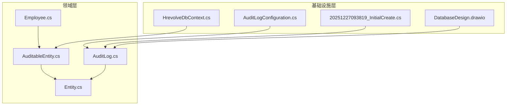
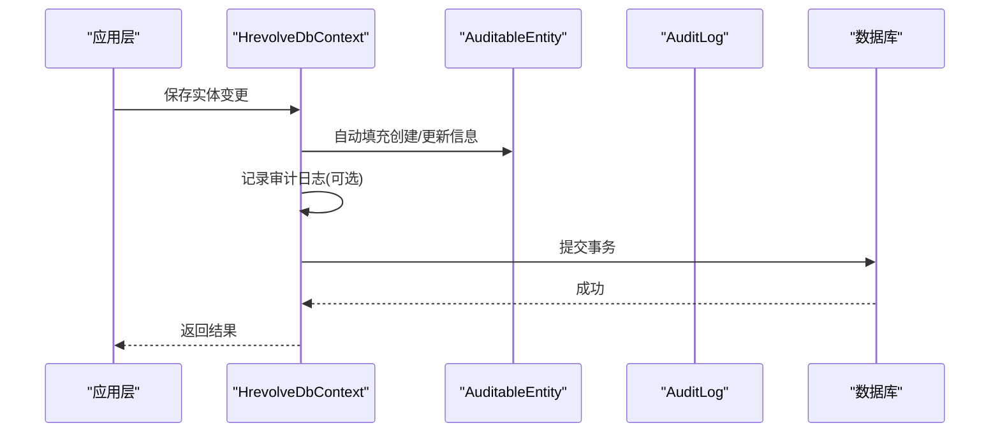
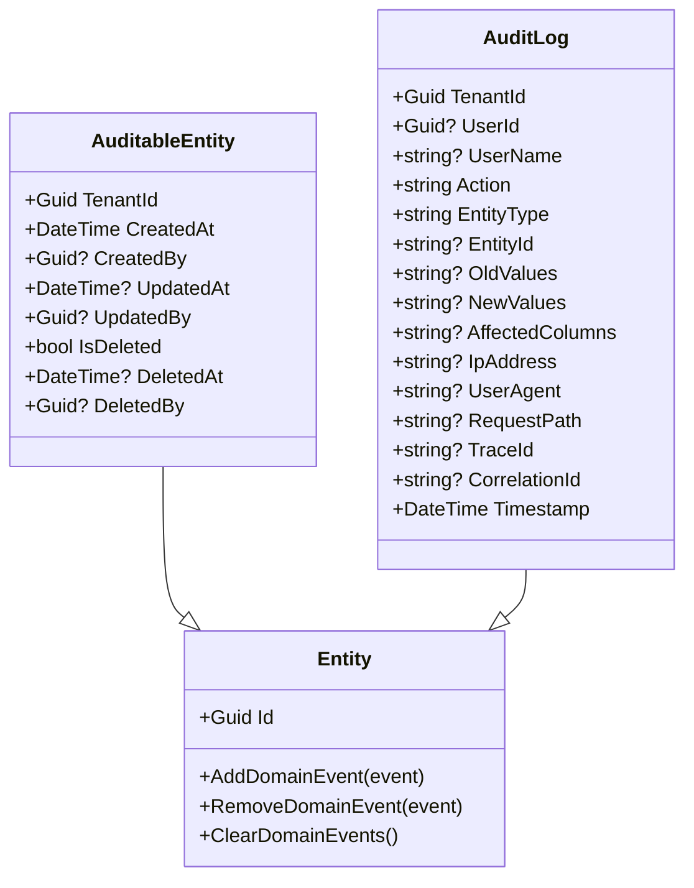
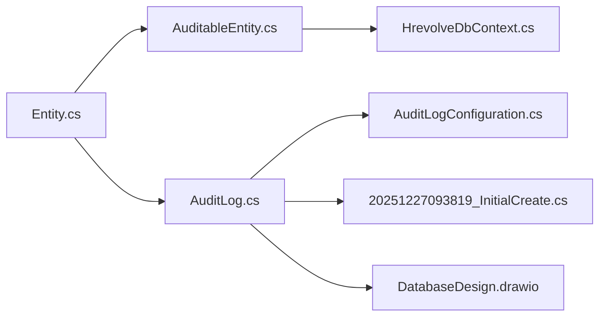

# 审计日志实体

<cite>
**本文引用的文件**
- [AuditLog.cs](file://Backend/Hrevolve.Domain/Audit/AuditLog.cs)
- [AuditableEntity.cs](file://Backend/Hrevolve.Domain/Common/AuditableEntity.cs)
- [Entity.cs](file://Backend/Hrevolve.Domain/Common/Entity.cs)
- [AuditLogConfiguration.cs](file://Backend/Hrevolve.Infrastructure/Persistence/Configurations/AuditLogConfiguration.cs)
- [20251227093819_InitialCreate.cs](file://Backend/Hrevolve.Infrastructure/Migrations/20251227093819_InitialCreate.cs)
- [HrevolveDbContext.cs](file://Backend/Hrevolve.Infrastructure/Persistence/HrevolveDbContext.cs)
- [Employee.cs](file://Backend/Hrevolve.Domain/Employees/Employee.cs)
- [DatabaseDesign.drawio](file://Design/DatabaseDesign.drawio)
</cite>

## 目录
1. [简介](#简介)
2. [项目结构](#项目结构)
3. [核心组件](#核心组件)
4. [架构总览](#架构总览)
5. [详细组件分析](#详细组件分析)
6. [依赖关系分析](#依赖关系分析)
7. [性能考量](#性能考量)
8. [故障排查指南](#故障排查指南)
9. [结论](#结论)
10. [附录](#附录)

## 简介
本文件围绕审计日志的记录范围与实现机制展开，重点说明：
- 审计日志记录的操作类型（Create/Update/Delete 等）与目标实体、操作人（UserId/UserName）、时间戳、旧值与新值等字段。
- AuditableEntity 基类如何为所有继承实体提供审计能力（多租户隔离、创建/更新/软删除审计字段）。
- AuditLog 实体如何存储变更历史，并通过 EF Core 配置映射到数据库表。

## 项目结构
审计相关代码主要分布在领域层与基础设施层：
- 领域层：审计实体定义与基类
- 基础设施层：EF Core 映射配置、迁移脚本、上下文扩展

图表来源
- [AuditableEntity.cs](file://Backend/Hrevolve.Domain/Common/AuditableEntity.cs#L1-L47)
- [AuditLog.cs](file://Backend/Hrevolve.Domain/Audit/AuditLog.cs#L1-L125)
- [Entity.cs](file://Backend/Hrevolve.Domain/Common/Entity.cs#L1-L49)
- [Employee.cs](file://Backend/Hrevolve.Domain/Employees/Employee.cs#L1-L77)
- [AuditLogConfiguration.cs](file://Backend/Hrevolve.Infrastructure/Persistence/Configurations/AuditLogConfiguration.cs#L1-L55)
- [20251227093819_InitialCreate.cs](file://Backend/Hrevolve.Infrastructure/Migrations/20251227093819_InitialCreate.cs#L1-L26)
- [HrevolveDbContext.cs](file://Backend/Hrevolve.Infrastructure/Persistence/HrevolveDbContext.cs#L101-L134)
- [DatabaseDesign.drawio](file://Design/DatabaseDesign.drawio#L1-L200)

章节来源
- [AuditableEntity.cs](file://Backend/Hrevolve.Domain/Common/AuditableEntity.cs#L1-L47)
- [AuditLog.cs](file://Backend/Hrevolve.Domain/Audit/AuditLog.cs#L1-L125)
- [AuditLogConfiguration.cs](file://Backend/Hrevolve.Infrastructure/Persistence/Configurations/AuditLogConfiguration.cs#L1-L55)
- [20251227093819_InitialCreate.cs](file://Backend/Hrevolve.Infrastructure/Migrations/20251227093819_InitialCreate.cs#L1-L26)
- [HrevolveDbContext.cs](file://Backend/Hrevolve.Infrastructure/Persistence/HrevolveDbContext.cs#L101-L134)
- [Employee.cs](file://Backend/Hrevolve.Domain/Employees/Employee.cs#L1-L77)
- [DatabaseDesign.drawio](file://Design/DatabaseDesign.drawio#L1-L200)

## 核心组件
- 审计日志实体 AuditLog
  - 字段覆盖：租户标识、操作人、操作类型、实体类型与ID、旧值/新值、受影响列、请求信息（IP、UA、请求路径、追踪ID、关联ID）、时间戳。
  - 提供静态工厂方法与变更/请求信息设置方法，便于统一构造与填充。
- 可审计实体基类 AuditableEntity
  - 继承自通用实体基类 Entity，新增多租户隔离字段与审计字段（创建/更新/软删除）。
  - 通过 DbContext 扩展在 SaveChanges 时自动填充创建/更新信息与软删除过滤。
- EF Core 映射与迁移
  - AuditLogConfiguration 定义表名、主键、属性长度限制与索引。
  - 迁移脚本创建 AuditLogs 表及字段，包含时间戳与复合索引。
- 示例实体 Employee
  - 继承 AuditableEntity，体现审计字段在业务实体中的落地。

章节来源
- [AuditLog.cs](file://Backend/Hrevolve.Domain/Audit/AuditLog.cs#L1-L125)
- [AuditableEntity.cs](file://Backend/Hrevolve.Domain/Common/AuditableEntity.cs#L1-L47)
- [Entity.cs](file://Backend/Hrevolve.Domain/Common/Entity.cs#L1-L49)
- [AuditLogConfiguration.cs](file://Backend/Hrevolve.Infrastructure/Persistence/Configurations/AuditLogConfiguration.cs#L1-L55)
- [20251227093819_InitialCreate.cs](file://Backend/Hrevolve.Infrastructure/Migrations/20251227093819_InitialCreate.cs#L1-L26)
- [Employee.cs](file://Backend/Hrevolve.Domain/Employees/Employee.cs#L1-L77)

## 架构总览
审计日志的记录流程概览如下：

图表来源
- [HrevolveDbContext.cs](file://Backend/Hrevolve.Infrastructure/Persistence/HrevolveDbContext.cs#L101-L134)
- [AuditLog.cs](file://Backend/Hrevolve.Domain/Audit/AuditLog.cs#L73-L107)
- [AuditLogConfiguration.cs](file://Backend/Hrevolve.Infrastructure/Persistence/Configurations/AuditLogConfiguration.cs#L1-L55)

## 详细组件分析

### AuditLog 实体与记录范围
- 操作类型（Action）
  - 使用常量集中定义，涵盖 Create、Update、Delete、Login、Logout、LoginFailed、PasswordChange、MfaEnabled、MfaDisabled、Export、Import 等。
- 目标实体（EntityType/EntityId）
  - 通过实体类型名称与实体ID标识被审计的具体对象。
- 操作人（UserId/UserName）
  - 记录执行操作的用户标识与用户名，便于审计追溯。
- 时间戳（Timestamp）
  - 默认使用 UTC 时间，便于跨时区一致性。
- 旧值与新值（OldValues/NewValues）
  - 以 JSON 文本形式存储变更前后完整数据，便于回溯与对比。
- 受影响列（AffectedColumns）
  - 记录本次变更涉及的字段集合，辅助快速定位差异。
- 请求上下文（IpAddress/UserAgent/RequestPath/TraceId/CorrelationId）
  - 记录客户端信息与请求链路信息，支持安全审计与问题定位。
- 租户隔离（TenantId）
  - 多租户场景下区分不同租户的数据与审计范围。

章节来源
- [AuditLog.cs](file://Backend/Hrevolve.Domain/Audit/AuditLog.cs#L1-L125)
- [AuditLogConfiguration.cs](file://Backend/Hrevolve.Infrastructure/Persistence/Configurations/AuditLogConfiguration.cs#L1-L55)
- [20251227093819_InitialCreate.cs](file://Backend/Hrevolve.Infrastructure/Migrations/20251227093819_InitialCreate.cs#L1-L26)

### AuditableEntity 基类与自动审计能力
- 多租户隔离
  - 每个实体具备 TenantId 字段，确保数据按租户隔离。
- 创建/更新审计字段
  - CreatedAt/CreatedBy、UpdatedAt/UpdatedBy 自动由 DbContext 在 SaveChanges 时填充。
- 软删除支持
  - IsDeleted/DeletedAt/DeletedBy 字段配合查询过滤器实现软删除。
- 与 DbContext 的集成
  - 遍历所有 AuditableEntity 类型实体，动态设置软删除查询过滤器。
  - 在 SaveChanges 时统一注入当前用户、租户上下文与时间戳。

图表来源
- [Entity.cs](file://Backend/Hrevolve.Domain/Common/Entity.cs#L1-L49)
- [AuditableEntity.cs](file://Backend/Hrevolve.Domain/Common/AuditableEntity.cs#L1-L47)
- [AuditLog.cs](file://Backend/Hrevolve.Domain/Audit/AuditLog.cs#L1-L125)

章节来源
- [AuditableEntity.cs](file://Backend/Hrevolve.Domain/Common/AuditableEntity.cs#L1-L47)
- [Entity.cs](file://Backend/Hrevolve.Domain/Common/Entity.cs#L1-L49)
- [HrevolveDbContext.cs](file://Backend/Hrevolve.Infrastructure/Persistence/HrevolveDbContext.cs#L101-L134)

### 数据库映射与索引
- 表结构
  - AuditLogs 表包含 TenantId、UserId、UserName、Action、EntityType、EntityId、OldValues、NewValues、AffectedColumns、IpAddress、UserAgent、RequestPath、TraceId、CorrelationId、Timestamp 等字段。
- 属性约束
  - 对字符串字段设置最大长度，确保数据库一致性。
- 索引设计
  - 复合索引：(TenantId, Timestamp)、(TenantId, UserId, Timestamp)、(TenantId, EntityType, EntityId)
  - 单列索引：TraceId
  - 以上索引用于审计查询优化与性能提升。

章节来源
- [AuditLogConfiguration.cs](file://Backend/Hrevolve.Infrastructure/Persistence/Configurations/AuditLogConfiguration.cs#L1-L55)
- [20251227093819_InitialCreate.cs](file://Backend/Hrevolve.Infrastructure/Migrations/20251227093819_InitialCreate.cs#L1-L26)

### 示例：Employee 实体的审计落地
- Employee 继承 AuditableEntity，天然具备多租户与审计字段。
- 作为业务实体，其创建/更新/软删除行为将受 DbContext 的统一处理，同时可结合 AuditLog 记录变更历史。

章节来源
- [Employee.cs](file://Backend/Hrevolve.Domain/Employees/Employee.cs#L1-L77)
- [AuditableEntity.cs](file://Backend/Hrevolve.Domain/Common/AuditableEntity.cs#L1-L47)

## 依赖关系分析
- AuditLog 依赖 Entity 作为基类，提供 Id 与领域事件容器。
- AuditableEntity 依赖 Entity，扩展审计字段与软删除能力。
- DbContext 在 SaveChanges 时扫描 AuditableEntity 并注入审计上下文。
- EF Core 配置与迁移负责将 AuditLog 映射到数据库表并建立索引。

图表来源
- [Entity.cs](file://Backend/Hrevolve.Domain/Common/Entity.cs#L1-L49)
- [AuditableEntity.cs](file://Backend/Hrevolve.Domain/Common/AuditableEntity.cs#L1-L47)
- [AuditLog.cs](file://Backend/Hrevolve.Domain/Audit/AuditLog.cs#L1-L125)
- [HrevolveDbContext.cs](file://Backend/Hrevolve.Infrastructure/Persistence/HrevolveDbContext.cs#L101-L134)
- [AuditLogConfiguration.cs](file://Backend/Hrevolve.Infrastructure/Persistence/Configurations/AuditLogConfiguration.cs#L1-L55)
- [20251227093819_InitialCreate.cs](file://Backend/Hrevolve.Infrastructure/Migrations/20251227093819_InitialCreate.cs#L1-L26)
- [DatabaseDesign.drawio](file://Design/DatabaseDesign.drawio#L1-L200)

章节来源
- [HrevolveDbContext.cs](file://Backend/Hrevolve.Infrastructure/Persistence/HrevolveDbContext.cs#L101-L134)
- [AuditLogConfiguration.cs](file://Backend/Hrevolve.Infrastructure/Persistence/Configurations/AuditLogConfiguration.cs#L1-L55)
- [20251227093819_InitialCreate.cs](file://Backend/Hrevolve.Infrastructure/Migrations/20251227093819_InitialCreate.cs#L1-L26)

## 性能考量
- 索引策略
  - 复合索引覆盖常见审计查询维度（租户+时间、租户+用户+时间、租户+实体类型+实体ID），有助于高效检索与报表统计。
- JSON 存储
  - OldValues/NewValues 采用文本存储，便于灵活记录任意结构的变更；但需注意存储体积与查询开销，建议在高并发场景下控制变更粒度或进行异步归档。
- 软删除过滤
  - 通过查询过滤器隐藏已删除记录，避免审计日志污染查询结果，同时减少不必要的数据扫描。

章节来源
- [AuditLogConfiguration.cs](file://Backend/Hrevolve.Infrastructure/Persistence/Configurations/AuditLogConfiguration.cs#L47-L55)
- [HrevolveDbContext.cs](file://Backend/Hrevolve.Infrastructure/Persistence/HrevolveDbContext.cs#L101-L134)

## 故障排查指南
- 审计字段未填充
  - 检查 DbContext 是否正确注入当前用户与租户上下文，确认 SaveChanges 流程是否执行。
- 审计日志缺失
  - 确认是否在业务流程中显式创建并持久化 AuditLog 实例；若依赖事件驱动，请检查事件发布与处理逻辑。
- 查询性能异常
  - 核对查询条件是否命中索引；必要时调整筛选维度或增加复合索引。
- 数据不一致
  - 检查软删除过滤是否生效；确认实体状态转换与审计上下文注入顺序。

章节来源
- [HrevolveDbContext.cs](file://Backend/Hrevolve.Infrastructure/Persistence/HrevolveDbContext.cs#L101-L134)
- [AuditLogConfiguration.cs](file://Backend/Hrevolve.Infrastructure/Persistence/Configurations/AuditLogConfiguration.cs#L47-L55)

## 结论
- AuditLog 提供了全面的审计记录能力，覆盖操作类型、目标实体、操作人、时间戳、旧值/新值、受影响列与请求上下文。
- AuditableEntity 通过基类继承与 DbContext 扩展，为所有业务实体提供统一的多租户与审计能力。
- EF Core 映射与索引设计保障了审计数据的持久化与查询效率。
- 建议在实际业务中结合领域事件与审计日志策略，明确何时生成审计记录，以平衡完整性与性能。

## 附录
- 审计操作类型常量
  - Create、Update、Delete、Login、Logout、LoginFailed、PasswordChange、MfaEnabled、MfaDisabled、Export、Import
- 数据库表字段要点
  - 主键：Id
  - 必填字段：Action、EntityType
  - 索引：(TenantId, Timestamp)、(TenantId, UserId, Timestamp)、(TenantId, EntityType, EntityId)、TraceId

章节来源
- [AuditLog.cs](file://Backend/Hrevolve.Domain/Audit/AuditLog.cs#L112-L125)
- [AuditLogConfiguration.cs](file://Backend/Hrevolve.Infrastructure/Persistence/Configurations/AuditLogConfiguration.cs#L1-L55)
- [20251227093819_InitialCreate.cs](file://Backend/Hrevolve.Infrastructure/Migrations/20251227093819_InitialCreate.cs#L1-L26)