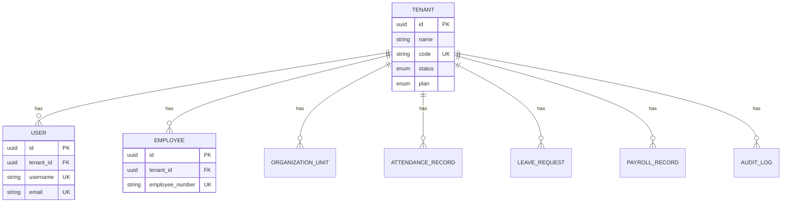

# 概念模型

<cite>
**本文档引用的文件**   
- [DatabaseDesign.drawio](file://Design/DatabaseDesign.drawio)
- [Tenant.cs](file://Backend/Hrevolve.Domain/Tenants/Tenant.cs)
- [User.cs](file://Backend/Hrevolve.Domain/Identity/User.cs)
- [Employee.cs](file://Backend/Hrevolve.Domain/Employees/Employee.cs)
- [OrganizationUnit.cs](file://Backend/Hrevolve.Domain/Organizations/OrganizationUnit.cs)
- [AttendanceRecord.cs](file://Backend/Hrevolve.Domain/Attendance/AttendanceRecord.cs)
- [LeaveRequest.cs](file://Backend/Hrevolve.Domain/Leave/LeaveRequest.cs)
- [PayrollRecord.cs](file://Backend/Hrevolve.Domain/Payroll/PayrollRecord.cs)
- [AuditLog.cs](file://Backend/Hrevolve.Domain/Audit/AuditLog.cs)
- [Agent.md](file://Design/Agent.md)
- [HrAgentService.cs](file://Backend/Hrevolve.Agent/Services/HrAgentService.cs)
- [HrToolProvider.cs](file://Backend/Hrevolve.Agent/Services/HrToolProvider.cs)
</cite>

## 目录
1. [引言](#引言)
2. [核心实体属性与主外键关系](#核心实体属性与主外键关系)
3. [组织架构与员工的树状层级关系](#组织架构与员工的树状层级关系)
4. [多租户（Tenant）与其他实体的关联方式](#多租户tenant与其他实体的关联方式)
5. [AI助手（Agent）相关实体的设计考量](#ai助手agent相关实体的设计考量)
6. [审计日志（AuditLog）的记录范围](#审计日志auditlog的记录范围)
7. [实体间关系类型与业务逻辑依据](#实体间关系类型与业务逻辑依据)

## 引言

Hrevolve系统是一个基于SaaS架构的人力资源管理系统，其概念数据模型设计遵循领域驱动设计（DDD）原则，支持多租户隔离和复杂的业务流程。本模型以`DatabaseDesign.drawio`中的ER图为核心，详细阐述了系统中Tenant（租户）、User（用户）、Employee（员工）、OrganizationUnit（组织单元）、AttendanceRecord（考勤记录）、LeaveRequest（请假申请）、PayrollRecord（薪资记录）等核心实体的属性定义、主外键关系以及业务含义。同时，模型还涵盖了AI助手（Agent）和审计日志（AuditLog）等关键设计，确保了系统的可扩展性、安全性和可追溯性。

## 核心实体属性与主外键关系

本节详细描述Hrevolve系统中核心实体的属性定义、主键（PK）和外键（FK）关系，以及这些属性的业务含义。

### Tenant（租户）

`Tenant`实体是SaaS多租户架构的核心，用于隔离不同客户的数据。每个租户拥有独立的配置和数据空间。

**属性定义：**
- `Id` (PK): 租户的唯一标识符，类型为GUID。
- `Name`: 租户名称，如公司全称。
- `Code`: 租户代码，用于系统内部标识，通常为小写。
- `Domain`: 租户的专属域名，用于单点登录（SSO）和品牌化。
- `Status`: 租户状态，枚举值包括`Active`（活跃）、`Suspended`（暂停）和`Expired`（过期）。
- `Plan`: 租户套餐，枚举值包括`Free`（免费）、`Standard`（标准）、`Professional`（专业）和`Enterprise`（企业）。
- `ConnectionString`: （可选）独立数据库租户使用的数据库连接字符串。
- `EncryptionKey`: （可选）租户专属的加密密钥，用于数据加密。
- `Settings`: 嵌套对象，包含租户的个性化设置，如时区、语言、货币、最大员工数、是否启用MFA等。
- `CreatedAt`: 租户创建时间。
- `ExpiresAt`: （可选）租户套餐过期时间。

**业务含义：** `Tenant`实体是所有其他业务实体的顶层容器。所有数据操作都必须在特定租户的上下文中进行，确保了数据的多租户隔离。

**Section sources**
- [Tenant.cs](file://Backend/Hrevolve.Domain/Tenants/Tenant.cs#L8-L67)

### User（用户）

`User`实体代表系统的认证与授权主体，负责登录、权限管理和身份验证。

**属性定义：**
- `Id` (PK): 用户的唯一标识符，类型为GUID。
- `TenantId` (FK): 外键，关联到`Tenant`实体的`Id`，标识用户所属的租户。
- `Username`: 用户名，用于登录。
- `Email`: 用户邮箱，用于登录和接收通知，存储时转换为小写。
- `Phone`: （可选）用户手机号。
- `PasswordHash`: （可选）密码哈希值，使用BCrypt算法加密存储。
- `Status`: 用户状态，枚举值包括`Active`（活跃）、`Inactive`（非活跃）和`Suspended`（暂停）。
- `EmailConfirmed`: 邮箱是否已验证。
- `PhoneConfirmed`: 手机号是否已验证。
- `MfaEnabled`: 是否启用了多因素认证（MFA）。
- `TotpSecret`: （可选）TOTP（基于时间的一次性密码）密钥，加密存储。
- `RecoveryCodes`: （可选）备用恢复代码，加密存储。
- `AccessFailedCount`: 登录失败次数，用于账户锁定。
- `LockoutEnd`: （可选）账户锁定结束时间。
- `LastLoginAt`: （可选）上次登录时间。
- `LastLoginIp`: （可选）上次登录IP地址。
- `EmployeeId` (FK): （可选）外键，关联到`Employee`实体的`Id`，表示该用户账号关联的员工。

**业务含义：** `User`实体是安全访问的入口。一个`User`可以关联一个`Employee`，但并非所有用户都是员工（例如，外部HR顾问可能有用户账号但不关联员工信息）。

**Section sources**
- [User.cs](file://Backend/Hrevolve.Domain/Identity/User.cs#L8-L194)

### Employee（员工）

`Employee`实体代表公司的员工，是人力资源管理的核心对象，包含员工的全生命周期信息。

**属性定义：**
- `Id` (PK): 员工的唯一标识符，类型为GUID。
- `TenantId` (FK): 外键，关联到`Tenant`实体的`Id`，标识员工所属的租户。
- `EmployeeNumber`: 员工工号，唯一标识。
- `FirstName`: 员工名字。
- `LastName`: 员工姓氏。
- `FullName`: 由`LastName`和`FirstName`拼接而成的全名。
- `EnglishName`: （可选）员工英文名。
- `Gender`: 员工性别，枚举值包括`Male`（男）、`Female`（女）和`Other`（其他）。
- `DateOfBirth`: 出生日期。
- `IdCardNumber`: （可选）身份证号，加密存储。
- `Email`: （可选）工作邮箱。
- `Phone`: （可选）工作电话。
- `PersonalEmail`: （可选）个人邮箱。
- `Address`: （可选）住址。
- `Status`: 雇佣状态，枚举值包括`Active`（在职）、`OnLeave`（休假中）、`Suspended`（停职）和`Terminated`（离职）。
- `EmploymentType`: 雇佣类型，枚举值包括`FullTime`（全职）、`PartTime`（兼职）、`Contract`（合同工）、`Intern`（实习生）和`Consultant`（顾问）。
- `HireDate`: 入职日期。
- `TerminationDate`: （可选）离职日期。
- `ProbationEndDate`: （可选）试用期结束日期。
- `UserId` (FK): （可选）外键，关联到`User`实体的`Id`，表示该员工关联的用户账号。
- `DirectManagerId` (FK): （可选）外键，关联到`Employee`实体的`Id`，表示该员工的直属上级。

**业务含义：** `Employee`实体是人事管理、考勤、请假和薪资计算的基础。其与`User`实体的关联实现了员工身份与系统访问权限的绑定。

**Section sources**
- [Employee.cs](file://Backend/Hrevolve.Domain/Employees/Employee.cs#L6-L137)

### OrganizationUnit（组织单元）

`OrganizationUnit`实体用于构建公司的树状组织架构，支持多种组织类型。

**属性定义：**
- `Id` (PK): 组织单元的唯一标识符，类型为GUID。
- `TenantId` (FK): 外键，关联到`Tenant`实体的`Id`，标识组织单元所属的租户。
- `Name`: 组织单元名称。
- `Code`: 组织单元代码。
- `Description`: （可选）描述。
- `ParentId` (FK): （可选）外键，关联到`OrganizationUnit`实体的`Id`，形成树状结构的父节点。
- `Path`: 路径枚举，例如`/1/5/23/`，用于快速查询子树，避免递归查询。
- `Level`: 层级深度，根节点为0。
- `SortOrder`: 排序序号。
- `Type`: 组织单元类型，枚举值包括`Company`（公司）、`Division`（事业部）、`Department`（部门）、`Team`（团队）和`Group`（小组）。
- `IsActive`: 是否激活。
- `ManagerId` (FK): （可选）外键，关联到`Employee`实体的`Id`，表示该组织单元的负责人。

**业务含义：** 该实体采用邻接表模型（`ParentId`）和路径枚举模型（`Path`）相结合的方式，既保证了树状结构的直观性，又优化了子树查询的性能。

**Section sources**
- [OrganizationUnit.cs](file://Backend/Hrevolve.Domain/Organizations/OrganizationUnit.cs#L9-L108)

### AttendanceRecord（考勤记录）

`AttendanceRecord`实体记录员工的每日考勤情况。

**属性定义：**
- `Id` (PK): 考勤记录的唯一标识符，类型为GUID。
- `TenantId` (FK): 外键，关联到`Tenant`实体的`Id`。
- `EmployeeId` (FK): 外键，关联到`Employee`实体的`Id`。
- `AttendanceDate`: 考勤日期。
- `ScheduleId` (FK): （可选）外键，关联到排班计划。
- `CheckInTime`: （可选）签到时间。
- `CheckOutTime`: （可选）签退时间。
- `CheckInMethod`: （可选）签到方式，枚举值包括`App`（App打卡）、`WiFi`（WiFi打卡）、`Device`（考勤机）和`Manual`（手动补卡）。
- `CheckOutMethod`: （可选）签退方式。
- `CheckInLocation`: （可选）签到位置（GPS坐标）。
- `CheckOutLocation`: （可选）签退位置。
- `Status`: 考勤状态，枚举值包括`Pending`（待处理）、`Normal`（正常）、`Late`（迟到）、`EarlyLeave`（早退）、`Absent`（缺勤）、`Incomplete`（打卡不完整）、`Leave`（请假）和`BusinessTrip`（出差）。
- `LateMinutes`: 迟到分钟数。
- `EarlyLeaveMinutes`: 早退分钟数。
- `ActualHours`: 实际工时（小时）。
- `OvertimeHours`: 加班时长（小时）。
- `IsApproved`: 是否已审核。
- `ApprovedBy` (FK): （可选）外键，关联到`User`实体的`Id`，表示审核人。

**业务含义：** 该实体是计算薪资和分析出勤情况的基础，其状态会根据签到签退时间自动更新。

**Section sources**
- [AttendanceRecord.cs](file://Backend/Hrevolve.Domain/Attendance/AttendanceRecord.cs#L8-L191)

### LeaveRequest（请假申请）

`LeaveRequest`实体记录员工的请假申请及其审批流程。

**属性定义：**
- `Id` (PK): 请假申请的唯一标识符，类型为GUID。
- `TenantId` (FK): 外键，关联到`Tenant`实体的`Id`。
- `EmployeeId` (FK): 外键，关联到`Employee`实体的`Id`。
- `LeaveTypeId` (FK): 外键，关联到`LeaveType`实体，表示请假类型。
- `StartDate`: 请假开始日期。
- `EndDate`: 请假结束日期。
- `StartDayPart`: 开始时段，枚举值包括`FullDay`（全天）、`Morning`（上午）和`Afternoon`（下午）。
- `EndDayPart`: 结束时段。
- `TotalDays`: 请假总天数，根据开始和结束时段自动计算。
- `Reason`: 请假原因。
- `Attachments`: （可选）附件URL列表（JSON格式）。
- `Status`: 申请状态，枚举值包括`Pending`（待审批）、`Approved`（已批准）、`Rejected`（已拒绝）和`Cancelled`（已取消）。
- `CancelReason`: （可选）取消原因。

**业务含义：** 该实体支持复杂的请假逻辑，如半天请假，并通过`Approvals`集合记录完整的审批历史。

**Section sources**
- [LeaveRequest.cs](file://Backend/Hrevolve.Domain/Leave/LeaveRequest.cs#L8-L234)

### PayrollRecord（薪资记录）

`PayrollRecord`实体记录员工在特定薪资周期内的薪资明细。

**属性定义：**
- `Id` (PK): 薪资记录的唯一标识符，类型为GUID。
- `TenantId` (FK): 外键，关联到`Tenant`实体的`Id`。
- `EmployeeId` (FK): 外键，关联到`Employee`实体的`Id`。
- `PayrollPeriodId` (FK): 外键，关联到`PayrollPeriod`实体，表示薪资周期。
- `BaseSalary`: 基本工资。
- `GrossSalary`: 应发工资。
- `TotalDeductions`: 扣除总额。
- `NetSalary`: 实发工资。
- `IncomeTax`: 个人所得税。
- `SocialInsuranceEmployee`: 社保个人部分。
- `SocialInsuranceEmployer`: 社保公司部分。
- `HousingFundEmployee`: 公积金个人部分。
- `HousingFundEmployer`: 公积金公司部分。
- `Status`: 记录状态，枚举值包括`Draft`（草稿）、`Calculated`（已计算）、`Approved`（已审批）和`Paid`（已发放）。
- `CalculatedAt`: 计算时间。
- `CalculationLog`: 计算日志（JSON格式）。
- `DataSnapshot`: 数据快照（JSON格式），用于审计。

**业务含义：** 该实体通过`Details`集合包含详细的薪资项（如奖金、补贴、扣款），并记录完整的计算和审批流程。

**Section sources**
- [PayrollRecord.cs](file://Backend/Hrevolve.Domain/Payroll/PayrollRecord.cs#L8-L162)

## 组织架构与员工的树状层级关系

`OrganizationUnit`实体通过`ParentId`字段与自身形成递归关联，构建了一个树状的组织架构。这种设计允许系统表示从公司、事业部、部门到团队和小组的多层级结构。

**层级关系实现：**
- **邻接表模型**：`ParentId`直接指向父节点的`Id`，使得查询直接上级和直接下级非常高效。
- **路径枚举模型**：`Path`字段存储了从根节点到当前节点的完整路径（如`/1/5/23/`）。这极大地优化了子树查询的性能，例如，查询某个部门下的所有子部门和员工，只需使用`LIKE`操作符即可，避免了昂贵的递归查询。

**业务含义：**
- **权限继承**：权限可以基于组织架构进行继承。例如，部门经理可以查看和管理其部门及所有子部门的员工信息。
- **汇报关系**：虽然`Employee`实体有`DirectManagerId`字段来定义直接汇报关系，但`OrganizationUnit`的层级结构提供了更宏观的组织视图，有助于理解公司的整体架构。
- **数据聚合**：薪资、考勤等统计数据可以按组织单元进行聚合和分析。

**Diagram sources**
- [OrganizationUnit.cs](file://Backend/Hrevolve.Domain/Organizations/OrganizationUnit.cs#L9-L108)
- [Employee.cs](file://Backend/Hrevolve.Domain/Employees/Employee.cs#L6-L137)

## 多租户（Tenant）与其他实体的关联方式

多租户（Multi-Tenancy）是Hrevolve系统的核心架构。`Tenant`实体作为所有业务数据的顶层容器，通过`TenantId`外键与几乎所有其他实体建立关联。

**关联方式：**
- **显式外键**：每个核心业务实体（如`User`、`Employee`、`AttendanceRecord`、`LeaveRequest`、`PayrollRecord`等）都包含一个`TenantId`字段，该字段是外键，指向`Tenant`表的`Id`。
- **数据隔离**：在所有数据库查询中，都会自动添加`WHERE TenantId = @currentTenantId`的条件，确保一个租户的用户只能访问和操作自己租户的数据。
- **共享与隔离**：`Tenant`实体本身是全局的，但其下的所有数据都是隔离的。这意味着系统可以为成千上万个租户提供服务，而每个租户都感觉像是在使用一个独立的系统。

**业务含义：**
- **SaaS模式**：这种设计是SaaS（软件即服务）模式的基础，允许系统以低成本为多个客户提供服务。
- **数据安全**：严格的数据隔离保证了客户数据的机密性和安全性。
- **独立配置**：每个租户可以拥有独立的配置（如`TenantSettings`），例如不同的时区、货币和工作流程。

**Diagram sources**
- [Tenant.cs](file://Backend/Hrevolve.Domain/Tenants/Tenant.cs#L8-L67)
- [User.cs](file://Backend/Hrevolve.Domain/Identity/User.cs#L8-L194)
- [Employee.cs](file://Backend/Hrevolve.Domain/Employees/Employee.cs#L6-L137)
- [OrganizationUnit.cs](file://Backend/Hrevolve.Domain/Organizations/OrganizationUnit.cs#L9-L108)
- [AttendanceRecord.cs](file://Backend/Hrevolve.Domain/Attendance/AttendanceRecord.cs#L8-L191)
- [LeaveRequest.cs](file://Backend/Hrevolve.Domain/Leave/LeaveRequest.cs#L8-L234)
- [PayrollRecord.cs](file://Backend/Hrevolve.Domain/Payroll/PayrollRecord.cs#L8-L162)
- [AuditLog.cs](file://Backend/Hrevolve.Domain/Audit/AuditLog.cs#L8-L126)

## AI助手（Agent）相关实体的设计考量

Hrevolve系统集成了一个基于AI的HR助手，旨在通过自然语言交互提升员工自助服务的体验。其设计考量主要体现在`HrAgentService`和`HrToolProvider`两个服务中。

**设计考量：**
- **技术栈**：采用微软的**Microsoft Agent Framework**（下一代AI Agent框架）和**Microsoft.Extensions.AI**统一抽象层，支持OpenAI、Azure OpenAI等多种LLM提供商，确保了技术的先进性和灵活性。
- **工具函数（Tools）**：AI助手的功能通过一系列预定义的“工具函数”来实现，这些函数是安全的、受控的API调用。例如：
  - `get_leave_balance`: 查询假期余额。
  - `submit_leave_request`: 提交请假申请。
  - `get_salary_info`: 查询薪资信息。
  - `query_hr_policy`: 查询HR政策（结合RAG技术从向量数据库检索知识）。
- **对话管理**：`HrAgentService`负责管理对话状态，维护每个员工的聊天历史，并将用户消息与工具函数调用结合起来，生成连贯的回复。
- **安全与权限**：所有工具函数在执行时都会验证调用者的身份（`employeeId`），确保员工只能查询和操作自己的信息，防止数据越权访问。
- **知识库集成**：通过向量数据库（如ChromaDB或Pinecone）存储HR政策文档的向量嵌入，AI助手可以利用RAG（检索增强生成）技术，在回答问题前先检索最相关的内部知识，从而提供更准确、更合规的答案。

**业务含义：** 这种设计将AI能力无缝集成到现有业务系统中，不仅提升了员工体验，还减轻了HR部门的日常咨询负担。

**Section sources**
- [Agent.md](file://Design/Agent.md#L186-L235)
- [HrAgentService.cs](file://Backend/Hrevolve.Agent/Services/HrAgentService.cs#L7-L151)
- [HrToolProvider.cs](file://Backend/Hrevolve.Agent/Services/HrToolProvider.cs#L6-L250)

## 审计日志（AuditLog）的记录范围

`AuditLog`实体是系统安全和合规性的基石，用于记录所有关键操作，提供完整的操作追溯能力。

**记录范围：**
- **操作类型（Action）**：记录所有重要的`CRUD`操作，包括`Create`（创建）、`Update`（更新）、`Delete`（删除）、`Login`（登录）、`Logout`（登出）、`LoginFailed`（登录失败）、`PasswordChange`（密码修改）、`MfaEnabled`（MFA启用）等。
- **实体信息**：记录被操作的`EntityType`（实体类型，如`User`、`Employee`）和`EntityId`（实体ID）。
- **变更详情**：对于`Update`操作，记录`OldValues`（旧值）和`NewValues`（新值）的JSON快照，以及`AffectedColumns`（变更的字段列表）。
- **上下文信息**：记录操作发生的`Timestamp`（时间戳）、`UserId`和`UserName`（操作者）、`IpAddress`（客户端IP）、`UserAgent`（用户代理）和`RequestPath`（请求路径）。
- **追踪信息**：包含`TraceId`和`CorrelationId`，用于在分布式系统中追踪请求链路。

**业务含义：**
- **安全审计**：能够追踪任何数据变更，识别潜在的安全威胁或内部滥用行为。
- **合规性**：满足GDPR、HIPAA等法规对数据访问和变更记录的要求。
- **故障排查**：当出现问题时，可以通过审计日志快速定位问题发生的时间、操作者和具体变更内容。

**Section sources**
- [AuditLog.cs](file://Backend/Hrevolve.Domain/Audit/AuditLog.cs#L8-L126)

## 实体间关系类型与业务逻辑依据

本节通过ER图展示实体间的1:N（一对多）和N:N（多对多）关系，并解释其背后的业务逻辑。

**关系类型与业务逻辑依据：**

- **1:N (一对多) 关系**:
  - `Tenant` 1:N `User`: 一个租户可以有多个用户账号，但一个用户账号只属于一个租户。**业务逻辑**：SaaS多租户的基本要求。
  - `User` 1:N `ExternalLogin`: 一个用户可以通过多种方式（Google, Microsoft等）登录。**业务逻辑**：支持单点登录（SSO）。
  - `Employee` 1:N `JobHistory`: 一个员工在其职业生涯中可以有多个职位变动记录。**业务逻辑**：记录员工的晋升、调岗历史。
  - `LeaveRequest` 1:N `LeaveApproval`: 一个请假申请可以有多个审批记录（例如，多级审批）。**业务逻辑**：支持复杂的审批流程。
  - `PayrollRecord` 1:N `PayrollDetail`: 一个薪资记录包含多个薪资项（基本工资、奖金、扣款等）。**业务逻辑**：薪资由多个组成部分构成。

- **N:N (多对多) 关系**:
  - `User` N:N `Role` (通过`UserRole`关联表): 一个用户可以拥有多个角色（如HR、经理），一个角色可以分配给多个用户。**业务逻辑**：灵活的基于角色的访问控制（RBAC）。
  - `Employee` N:N `OrganizationUnit` (通过`OrganizationUnit`的`ManagerId`): 一个员工可以管理多个组织单元（如同时是部门经理和项目负责人），一个组织单元只能有一个负责人。**业务逻辑**：虽然`ManagerId`是1:1，但从员工角度看，一个员工可以担任多个管理职务，形成N:1关系，从组织角度看是1:1。严格来说，这是两个1:N关系的组合。

- **1:1 (一对一) 关系**:
  - `User` 1:1 `Employee` (通过`User.EmployeeId`): 一个用户账号通常关联一个员工信息。**业务逻辑**：将系统访问权限与员工身份绑定。

**Diagram sources**
- [DatabaseDesign.drawio](file://Design/DatabaseDesign.drawio)
- [User.cs](file://Backend/Hrevolve.Domain/Identity/User.cs#L8-L194)
- [Employee.cs](file://Backend/Hrevolve.Domain/Employees/Employee.cs#L6-L137)
- [OrganizationUnit.cs](file://Backend/Hrevolve.Domain/Organizations/OrganizationUnit.cs#L9-L108)
- [LeaveRequest.cs](file://Backend/Hrevolve.Domain/Leave/LeaveRequest.cs#L8-L234)
- [PayrollRecord.cs](file://Backend/Hrevolve.Domain/Payroll/PayrollRecord.cs#L8-L162)
- [AttendanceRecord.cs](file://Backend/Hrevolve.Domain/Attendance/AttendanceRecord.cs#L8-L191)
- [AuditLog.cs](file://Backend/Hrevolve.Domain/Audit/AuditLog.cs#L8-L126)