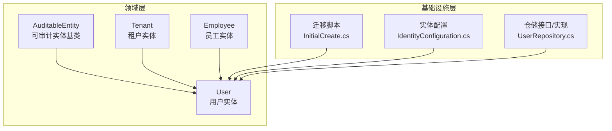
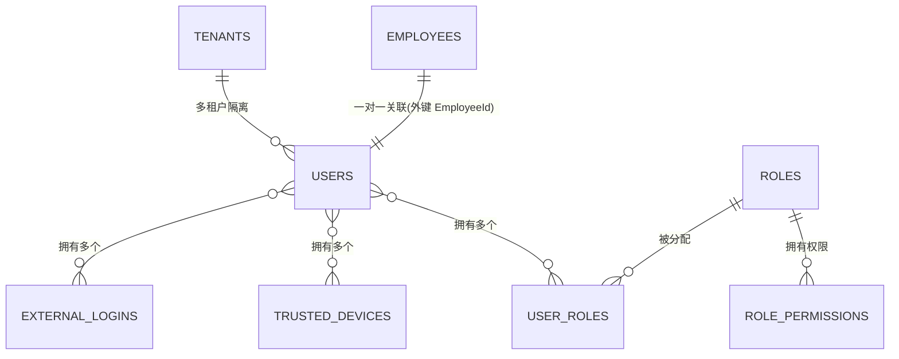
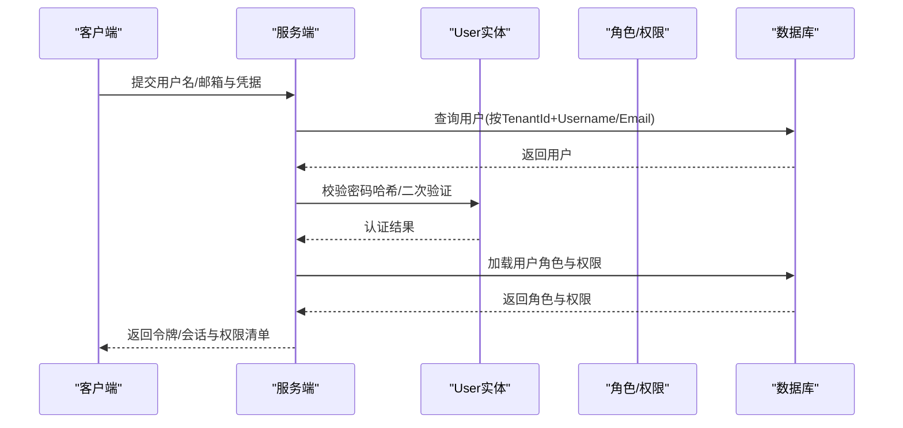
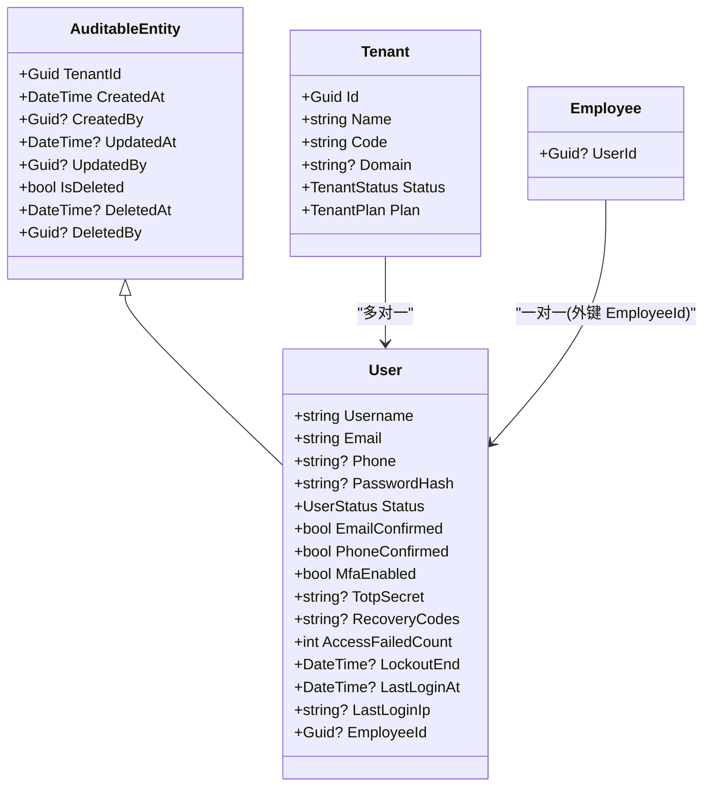

# 用户实体

<cite>
**本文引用的文件**
- [User.cs](file://Backend/Hrevolve.Domain/Identity/User.cs)
- [Employee.cs](file://Backend/Hrevolve.Domain/Employees/Employee.cs)
- [Tenant.cs](file://Backend/Hrevolve.Domain/Tenants/Tenant.cs)
- [AuditableEntity.cs](file://Backend/Hrevolve.Domain/Common/AuditableEntity.cs)
- [InitialCreate.cs](file://Backend/Hrevolve.Infrastructure/Migrations/20251227093819_InitialCreate.cs)
- [IdentityConfiguration.cs](file://Backend/Hrevolve.Infrastructure/Persistence/Configurations/IdentityConfiguration.cs)
- [UserRepository.cs](file://Backend/Hrevolve.Infrastructure/Persistence/Repositories/UserRepository.cs)
</cite>

## 目录
1. [简介](#简介)
2. [项目结构](#项目结构)
3. [核心组件](#核心组件)
4. [架构总览](#架构总览)
5. [详细组件分析](#详细组件分析)
6. [依赖分析](#依赖分析)
7. [性能考虑](#性能考虑)
8. [故障排查指南](#故障排查指南)
9. [结论](#结论)

## 简介
本文件围绕用户实体 User 的结构与关系进行系统化说明，重点阐述：
- User 的认证相关属性：用户名、邮箱、手机号、密码哈希、登录失败计数、锁定截止时间、最近一次登录信息等。
- User 与 Tenant 的多对一关系（多租户上下文）。
- User 与 Employee 的一对一关联（通过 EmployeeId 外键）。
- 在身份认证、权限控制与多租户隔离中的角色定位与数据流。

## 项目结构
User 实体位于领域层的 Identity 模块，继承自可审计实体基类，具备租户隔离能力；数据库层面由 EF Core 迁移与配置定义，包含索引与外键约束；仓储层提供按用户名、邮箱、外部登录标识查询及权限聚合查询的能力。

图表来源
- [User.cs](file://Backend/Hrevolve.Domain/Identity/User.cs#L1-L194)
- [Employee.cs](file://Backend/Hrevolve.Domain/Employees/Employee.cs#L1-L137)
- [Tenant.cs](file://Backend/Hrevolve.Domain/Tenants/Tenant.cs#L1-L67)
- [AuditableEntity.cs](file://Backend/Hrevolve.Domain/Common/AuditableEntity.cs#L1-L48)
- [InitialCreate.cs](file://Backend/Hrevolve.Infrastructure/Migrations/20251227093819_InitialCreate.cs#L333-L365)
- [IdentityConfiguration.cs](file://Backend/Hrevolve.Infrastructure/Persistence/Configurations/IdentityConfiguration.cs#L1-L69)
- [UserRepository.cs](file://Backend/Hrevolve.Infrastructure/Persistence/Repositories/UserRepository.cs#L1-L69)

章节来源
- [User.cs](file://Backend/Hrevolve.Domain/Identity/User.cs#L1-L194)
- [InitialCreate.cs](file://Backend/Hrevolve.Infrastructure/Migrations/20251227093819_InitialCreate.cs#L333-L365)
- [IdentityConfiguration.cs](file://Backend/Hrevolve.Infrastructure/Persistence/Configurations/IdentityConfiguration.cs#L1-L69)
- [UserRepository.cs](file://Backend/Hrevolve.Infrastructure/Persistence/Repositories/UserRepository.cs#L1-L69)

## 核心组件
- User 实体：承载认证与授权所需的核心字段，支持外部登录、受信任设备、角色集合等扩展。
- AuditableEntity 基类：统一注入 TenantId、创建/更新/删除审计字段，支撑多租户隔离与审计追踪。
- Tenant 实体：多租户模型的核心，User 通过 TenantId 归属于某个租户。
- Employee 实体：员工信息载体，User 与 Employee 通过 EmployeeId 建立一对一关联。
- 数据库映射：迁移脚本定义 Users 表结构与索引；EF 配置定义属性长度、唯一性与外键关系。
- 仓储：提供基于用户名/邮箱/外部登录的查询，以及基于角色的权限聚合查询。

章节来源
- [User.cs](file://Backend/Hrevolve.Domain/Identity/User.cs#L1-L194)
- [AuditableEntity.cs](file://Backend/Hrevolve.Domain/Common/AuditableEntity.cs#L1-L48)
- [Tenant.cs](file://Backend/Hrevolve.Domain/Tenants/Tenant.cs#L1-L67)
- [Employee.cs](file://Backend/Hrevolve.Domain/Employees/Employee.cs#L1-L137)
- [InitialCreate.cs](file://Backend/Hrevolve.Infrastructure/Migrations/20251227093819_InitialCreate.cs#L333-L365)
- [IdentityConfiguration.cs](file://Backend/Hrevolve.Infrastructure/Persistence/Configurations/IdentityConfiguration.cs#L1-L69)
- [UserRepository.cs](file://Backend/Hrevolve.Infrastructure/Persistence/Repositories/UserRepository.cs#L1-L69)

## 架构总览
下图展示 User 在认证与权限体系中的位置，以及与 Tenant、Employee 的关系。

图表来源
- [InitialCreate.cs](file://Backend/Hrevolve.Infrastructure/Migrations/20251227093819_InitialCreate.cs#L333-L365)
- [InitialCreate.cs](file://Backend/Hrevolve.Infrastructure/Migrations/20251227093819_InitialCreate.cs#L644-L706)
- [InitialCreate.cs](file://Backend/Hrevolve.Infrastructure/Migrations/20251227093819_InitialCreate.cs#L1048-L1064)
- [IdentityConfiguration.cs](file://Backend/Hrevolve.Infrastructure/Persistence/Configurations/IdentityConfiguration.cs#L1-L69)

## 详细组件分析

### User 实体结构与职责
- 认证相关属性
  - 用户名、邮箱、手机号：用于登录与识别。
  - 密码哈希：存储经安全算法处理后的密码值。
  - 登录失败计数与锁定截止时间：用于账户保护与临时锁定策略。
  - 最近一次登录时间与 IP：用于审计与安全监控。
  - 状态、邮箱/手机确认标志：用于账户可用性与验证状态管理。
- 安全增强
  - MFA 开关与 TOTP 密钥、恢复代码：支持二次验证。
  - 受信任设备列表：降低重复二次验证成本。
  - 外部登录（SSO）：支持多种第三方登录提供商。
- 关联与扩展
  - EmployeeId：与 Employee 建立一对一关联。
  - UserRoles：与角色建立多对多中间表映射。
  - ExternalLogins、TrustedDevices：分别维护外部登录与受信任设备。
- 多租户上下文
  - 继承自 AuditableEntity，具备 TenantId 字段，确保同一租户内的数据隔离。

章节来源
- [User.cs](file://Backend/Hrevolve.Domain/Identity/User.cs#L1-L194)
- [AuditableEntity.cs](file://Backend/Hrevolve.Domain/Common/AuditableEntity.cs#L1-L48)

### User 与 Tenant 的多对一关系
- 关系说明
  - User 属于某个 Tenant，Tenant 可拥有多个 User。
  - 通过 TenantId 字段实现多租户隔离，保证不同租户间的数据互不可见。
- 数据库映射
  - Users 表包含 TenantId 字段，并在迁移中创建了复合唯一索引（TenantId, Username）、（TenantId, Email），以及（TenantId, EmployeeId）索引，确保在多租户上下文中唯一性与查询效率。
- 业务影响
  - 所有用户操作均需携带 TenantId，避免跨租户访问。
  - 权限与角色也应限定在 Tenant 上下文内生效。

章节来源
- [User.cs](file://Backend/Hrevolve.Domain/Identity/User.cs#L1-L194)
- [InitialCreate.cs](file://Backend/Hrevolve.Infrastructure/Migrations/20251227093819_InitialCreate.cs#L333-L365)
- [InitialCreate.cs](file://Backend/Hrevolve.Infrastructure/Migrations/20251227093819_InitialCreate.cs#L1048-L1064)
- [IdentityConfiguration.cs](file://Backend/Hrevolve.Infrastructure/Persistence/Configurations/IdentityConfiguration.cs#L1-L69)

### User 与 Employee 的一对一关联
- 关系说明
  - User 与 Employee 通过 EmployeeId 建立一对一关联，表示一个用户可能对应一个员工档案。
- 数据库映射
  - Users 表包含 EmployeeId 字段，迁移脚本中为（TenantId, EmployeeId）建立了索引，便于按租户与员工维度检索。
- 业务场景
  - 企业内部系统中，员工通常拥有对应的系统用户账号；该关联便于将人事信息与系统账号打通。
  - 反向关系在 Employee 中体现为 UserId 字段，形成双向绑定。

章节来源
- [User.cs](file://Backend/Hrevolve.Domain/Identity/User.cs#L1-L194)
- [Employee.cs](file://Backend/Hrevolve.Domain/Employees/Employee.cs#L1-L137)
- [InitialCreate.cs](file://Backend/Hrevolve.Infrastructure/Migrations/20251227093819_InitialCreate.cs#L333-L365)
- [InitialCreate.cs](file://Backend/Hrevolve.Infrastructure/Migrations/20251227093819_InitialCreate.cs#L1048-L1064)

### 认证流程与权限控制
- 认证流程要点
  - 登录成功时更新最近登录时间与 IP，并重置失败计数与锁定状态。
  - 登录失败超过阈值将触发临时锁定，防止暴力破解。
  - 支持外部登录（SSO）与受信任设备白名单，提升用户体验与安全性。
- 权限控制要点
  - 用户通过 UserRoles 与角色关联，角色再通过 RolePermissions 与权限关联。
  - 仓储提供按用户聚合权限的方法，便于在授权决策中使用。
- 多租户上下文
  - 所有查询与授权均需限定 TenantId，确保权限与数据在租户边界内生效。

图表来源
- [UserRepository.cs](file://Backend/Hrevolve.Infrastructure/Persistence/Repositories/UserRepository.cs#L1-L69)
- [InitialCreate.cs](file://Backend/Hrevolve.Infrastructure/Migrations/20251227093819_InitialCreate.cs#L644-L706)
- [InitialCreate.cs](file://Backend/Hrevolve.Infrastructure/Migrations/20251227093819_InitialCreate.cs#L1048-L1064)

## 依赖分析
- User 对 AuditableEntity 的继承，使其天然具备多租户隔离与审计字段。
- User 与 Tenant 的关系通过 TenantId 显式建模，迁移与配置共同保障唯一性与查询性能。
- User 与 Employee 的一对一关联通过 EmployeeId 外键实现，迁移脚本与配置确保索引存在。
- User 与角色、权限通过 UserRoles、RolePermissions 中间表关联，仓储负责权限聚合查询。
- 外部登录与受信任设备作为 User 的集合属性，迁移与配置分别定义表结构与唯一索引。

图表来源
- [AuditableEntity.cs](file://Backend/Hrevolve.Domain/Common/AuditableEntity.cs#L1-L48)
- [User.cs](file://Backend/Hrevolve.Domain/Identity/User.cs#L1-L194)
- [Employee.cs](file://Backend/Hrevolve.Domain/Employees/Employee.cs#L1-L137)
- [Tenant.cs](file://Backend/Hrevolve.Domain/Tenants/Tenant.cs#L1-L67)

章节来源
- [User.cs](file://Backend/Hrevolve.Domain/Identity/User.cs#L1-L194)
- [Employee.cs](file://Backend/Hrevolve.Domain/Employees/Employee.cs#L1-L137)
- [Tenant.cs](file://Backend/Hrevolve.Domain/Tenants/Tenant.cs#L1-L67)
- [AuditableEntity.cs](file://Backend/Hrevolve.Domain/Common/AuditableEntity.cs#L1-L48)

## 性能考虑
- 唯一性与查询优化
  - Users 表在（TenantId, Username）、（TenantId, Email）、（TenantId, EmployeeId）上建立复合索引，有助于在多租户上下文中快速定位用户。
- 外部登录与受信任设备
  - ExternalLogins 与 TrustedDevices 分别按 Provider/ProviderKey、UserId/DeviceId 建立唯一索引，减少重复与冲突。
- 权限聚合
  - 仓储通过一次性查询用户角色并聚合权限，避免 N+1 查询问题，提高权限判定效率。

章节来源
- [InitialCreate.cs](file://Backend/Hrevolve.Infrastructure/Migrations/20251227093819_InitialCreate.cs#L1048-L1064)
- [IdentityConfiguration.cs](file://Backend/Hrevolve.Infrastructure/Persistence/Configurations/IdentityConfiguration.cs#L1-L69)
- [UserRepository.cs](file://Backend/Hrevolve.Infrastructure/Persistence/Repositories/UserRepository.cs#L1-L69)

## 故障排查指南
- 登录失败与锁定
  - 若频繁登录失败导致账户被锁定，检查 AccessFailedCount 与 LockoutEnd 字段，确认是否达到阈值并处于锁定期内。
- 外部登录异常
  - 检查 ExternalLogins 表中 Provider 与 ProviderKey 的唯一性，避免重复绑定或冲突。
- 权限不生效
  - 确认用户已正确分配角色，且角色已授予相应权限；通过仓储的权限聚合方法核对返回的权限集合。
- 多租户隔离问题
  - 确保所有查询均带上 TenantId，避免跨租户数据泄露或权限越权。

章节来源
- [User.cs](file://Backend/Hrevolve.Domain/Identity/User.cs#L1-L194)
- [UserRepository.cs](file://Backend/Hrevolve.Infrastructure/Persistence/Repositories/UserRepository.cs#L1-L69)
- [InitialCreate.cs](file://Backend/Hrevolve.Infrastructure/Migrations/20251227093819_InitialCreate.cs#L644-L706)

## 结论
User 实体是系统认证与权限体系的核心，通过多租户隔离、外部登录、受信任设备与角色权限机制，实现了安全、灵活的企业级身份管理。User 与 Tenant 的多对一关系确保了租户边界内的数据与权限独立；User 与 Employee 的一对一关联则将系统用户与员工档案打通，便于统一管理。配合完善的索引与仓储权限聚合逻辑，系统在性能与安全性之间取得良好平衡。