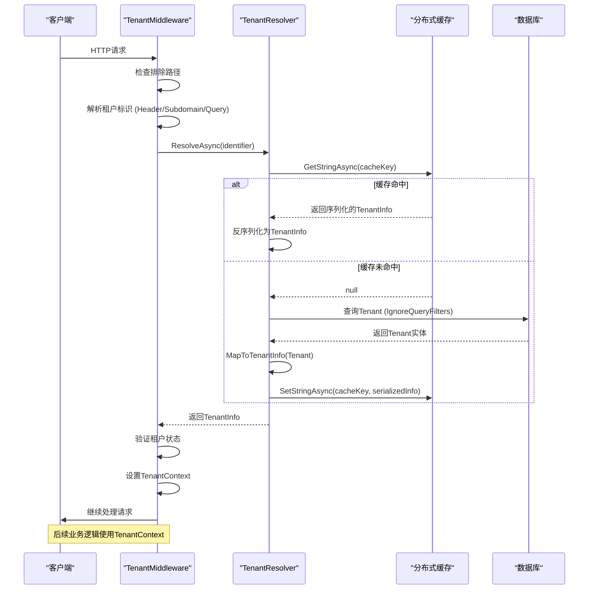

# 租户实体

<cite>
**本文档引用的文件**   
- [Tenant.cs](file://Backend/Hrevolve.Domain/Tenants/Tenant.cs#L1-L67)
- [DatabaseDesign.drawio](file://Design/DatabaseDesign.drawio)
- [TenantConfiguration.cs](file://Backend/Hrevolve.Infrastructure/Persistence/Configurations/TenantConfiguration.cs#L1-L55)
- [20251227093819_InitialCreate.cs](file://Backend/Hrevolve.Infrastructure/Migrations/20251227093819_InitialCreate.cs#L306-L327)
- [TenantResolver.cs](file://Backend/Hrevolve.Infrastructure/MultiTenancy/TenantResolver.cs#L75-L107)
- [TenantInfo.cs](file://Backend/Hrevolve.Shared/MultiTenancy/TenantInfo.cs#L1-L45)
- [TenantMiddleware.cs](file://Backend/Hrevolve.Web/Middleware/TenantMiddleware.cs#L1-L133)
- [ITenantContext.cs](file://Backend/Hrevolve.Shared/MultiTenancy/ITenantContext.cs#L1-L81)
- [User.cs](file://Backend/Hrevolve.Domain/Identity/User.cs#L1-L194)
- [Employee.cs](file://Backend/Hrevolve.Domain/Employees/Employee.cs#L1-L137)
</cite>

## 目录
1. [租户实体属性定义](#租户实体属性定义)
2. [多租户架构核心作用](#多租户架构核心作用)
3. [数据隔离机制](#数据隔离机制)
4. [与其他实体的关联关系](#与其他实体的关联关系)
5. [系统初始化与上下文解析](#系统初始化与上下文解析)

## 租户实体属性定义

租户实体（Tenant）是SaaS多租户系统的核心，其属性定义如下：

- **Id**: 租户的唯一标识符，使用GUID类型，作为数据库主键。
- **Name**: 租户名称，最大长度200字符，必填字段，用于标识租户的显示名称。
- **Code**: 租户代码，最大长度50字符，必填字段，用于系统内部引用和URL路由，必须唯一。
- **Domain**: 租户域名，最大长度200字符，可选字段，用于基于子域名的租户识别，必须唯一。
- **Status**: 租户状态，枚举类型（Active, Suspended, Expired），表示租户的当前状态，必填字段。
- **Plan**: 租户套餐，枚举类型（Free, Standard, Professional, Enterprise），表示租户订阅的服务等级，必填字段。
- **ConnectionString**: 数据库连接字符串，最大长度1000字符，可选字段，用于独立数据库模式的租户，实现数据物理隔离。
- **EncryptionKey**: 租户加密密钥，最大长度500字符，可选字段，用于租户特定数据的加密（如身份证号）。
- **Settings**: 租户配置，一个复杂对象，序列化为JSON字符串存储，最大长度2000字符，包含时区、区域、货币等租户级设置。
- **CreatedAt**: 创建时间，记录租户创建的UTC时间戳。
- **ExpiresAt**: 过期时间，可选字段，用于标识租户套餐的到期时间。

**Section sources**
- [Tenant.cs](file://Backend/Hrevolve.Domain/Tenants/Tenant.cs#L1-L67)
- [TenantConfiguration.cs](file://Backend/Hrevolve.Infrastructure/Persistence/Configurations/TenantConfiguration.cs#L1-L55)
- [20251227093819_InitialCreate.cs](file://Backend/Hrevolve.Infrastructure/Migrations/20251227093819_InitialCreate.cs#L306-L327)

## 多租户架构核心作用

租户实体是整个SaaS应用多租户架构的基石。它通过`TenantId`外键在所有业务实体（如User、Employee、PayrollRecord等）中建立关联，实现了数据的逻辑隔离。每个租户的数据在数据库中都通过`TenantId`进行标记，确保一个租户无法访问另一个租户的数据。这种设计模式允许系统在单一数据库实例中安全地托管多个客户的数据，极大地提高了资源利用率和运维效率。同时，`Status`和`Plan`字段支持对租户进行生命周期管理和差异化服务，是实现SaaS商业模式的关键。

**Section sources**
- [Tenant.cs](file://Backend/Hrevolve.Domain/Tenants/Tenant.cs#L1-L67)
- [User.cs](file://Backend/Hrevolve.Domain/Identity/User.cs#L76-L85)
- [Employee.cs](file://Backend/Hrevolve.Domain/Employees/Employee.cs#L51-L72)

## 数据隔离机制

系统通过`ConnectionString`字段实现租户间的数据物理隔离。当租户的`ConnectionString`被设置时，该租户的数据将存储在独立的数据库中。系统在运行时根据当前请求的租户上下文动态切换数据库连接。对于共享数据库模式的租户，系统则依赖`TenantId`外键进行逻辑隔离。`EncryptionKey`字段进一步增强了数据隔离，它为每个租户提供了独立的加密密钥，确保即使数据被非法访问，也无法解密其他租户的敏感信息。这种分层隔离策略（物理隔离+逻辑隔离+加密隔离）为多租户环境提供了强大的安全保障。

```mermaid
erDiagram
TENANT ||--o{ USER : "1:N"
TENANT ||--o{ EMPLOYEE : "1:N"
TENANT ||--o{ PAYROLL_RECORD : "1:N"
TENANT {
string Id PK
string Name
string Code UK
string Domain UK
string Status
string Plan
string ConnectionString
string EncryptionKey
string Settings
datetime CreatedAt
datetime? ExpiresAt
}
USER {
string Id PK
string Username
string Email
string Status
string TenantId FK
}
EMPLOYEE {
string Id PK
string EmployeeNumber
string FirstName
string LastName
string Status
string TenantId FK
}
PAYROLL_RECORD {
string Id PK
decimal Amount
string TenantId FK
string EmployeeId FK
}
```

**Diagram sources**
- [Tenant.cs](file://Backend/Hrevolve.Domain/Tenants/Tenant.cs#L1-L67)
- [User.cs](file://Backend/Hrevolve.Domain/Identity/User.cs#L1-L194)
- [Employee.cs](file://Backend/Hrevolve.Domain/Employees/Employee.cs#L1-L137)
- [20251227093819_InitialCreate.cs](file://Backend/Hrevolve.Infrastructure/Migrations/20251227093819_InitialCreate.cs)

## 与其他实体的关联关系

租户实体与系统中的核心业务实体建立了1:N（一对多）的关联关系：
- **与User的关系**：一个租户可以拥有多个用户（User）。`User`实体通过`TenantId`外键关联到`Tenant`，并可通过`EmployeeId`关联到具体的员工。这实现了租户内用户的统一管理和认证。
- **与Employee的关系**：一个租户可以管理多个员工（Employee）。`Employee`实体通过`TenantId`外键关联到`Tenant`，其完整的雇佣历史通过`JobHistory`实体进行追踪。这种设计支持租户独立管理员工的全生命周期。

这些关联关系确保了所有业务数据都锚定在租户这一核心实体上，形成了清晰的数据归属和访问边界。

**Section sources**
- [User.cs](file://Backend/Hrevolve.Domain/Identity/User.cs#L76-L85)
- [Employee.cs](file://Backend/Hrevolve.Domain/Employees/Employee.cs#L51-L72)
- [20251227093819_InitialCreate.cs](file://Backend/Hrevolve.Infrastructure/Migrations/20251227093819_InitialCreate.cs#L333-L361)

## 系统初始化与上下文解析

租户实体在系统初始化和运行时上下文解析中扮演着关键角色。系统启动时，`DbInitializer`会创建初始租户。在每次HTTP请求中，`TenantMiddleware`负责解析租户上下文。它通过检查请求头（X-Tenant-Id）、子域名或查询参数来获取租户标识，然后调用`TenantResolver`服务。`TenantResolver`首先查询缓存，若未命中则从数据库加载`Tenant`实体，并将其映射为轻量级的`TenantInfo`对象，最后通过`ITenantContextAccessor`将租户ID和代码设置到当前请求的上下文中。这个上下文随后被`HrevolveDbContext`用于自动过滤数据和切换数据库连接，确保了整个请求处理链路的租户感知能力。



**Diagram sources**
- [TenantMiddleware.cs](file://Backend/Hrevolve.Web/Middleware/TenantMiddleware.cs#L1-L133)
- [TenantResolver.cs](file://Backend/Hrevolve.Infrastructure/MultiTenancy/TenantResolver.cs#L75-L107)
- [ITenantContext.cs](file://Backend/Hrevolve.Shared/MultiTenancy/ITenantContext.cs#L1-L81)