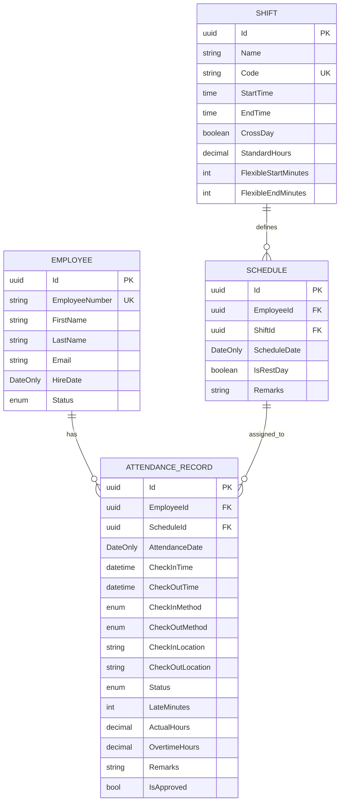

# 考勤记录实体

<cite>
**本文档引用的文件**
- [AttendanceRecord.cs](file://Backend/Hrevolve.Domain/Attendance/AttendanceRecord.cs)
- [Shift.cs](file://Backend/Hrevolve.Domain/Attendance/Shift.cs)
- [Employee.cs](file://Backend/Hrevolve.Domain/Employees/Employee.cs)
- [DatabaseDesign.drawio](file://Design/DatabaseDesign.drawio)
- [AttendanceConfiguration.cs](file://Backend/Hrevolve.Infrastructure/Persistence/Configurations/AttendanceConfiguration.cs)
</cite>

## 目录
1. [引言](#引言)
2. [考勤记录实体属性](#考勤记录实体属性)
3. [与员工的多对一关系](#与员工的多对一关系)
4. [与班次和排班的关联](#与班次和排班的关联)
5. [在考勤统计中的作用](#在考勤统计中的作用)
6. [在异常检测中的作用](#在异常检测中的作用)
7. [实体关系图](#实体关系图)

## 引言
考勤记录实体（AttendanceRecord）是人力资源管理系统中的核心组件之一，用于记录员工每日的打卡数据。该实体不仅存储了基本的签到签退时间，还包含了丰富的状态信息和统计指标，为考勤管理、薪资计算和人力资源分析提供了数据基础。本文档将详细说明该实体的设计、属性及其在系统中的作用。

## 考勤记录实体属性
考勤记录实体包含多个关键属性，用于完整记录员工的考勤情况：

- **Id**: 实体的唯一标识符，继承自基类Entity。
- **EmployeeId**: 关联员工的ID，建立与员工实体的多对一关系。
- **AttendanceDate**: 考勤日期，使用DateOnly类型精确到天。
- **CheckInTime**: 签到时间，可为空，表示员工未签到。
- **CheckOutTime**: 签退时间，可为空，表示员工未签退。
- **CheckInMethod**: 签到方式，枚举类型，包括App、WiFi、考勤机、手动补卡和Web打卡。
- **CheckOutMethod**: 签退方式，同上。
- **CheckInLocation**: 签到位置，存储GPS坐标或WiFi信息。
- **CheckOutLocation**: 签退位置。
- **Status**: 考勤状态，通过UpdateStatus方法根据签到签退情况自动更新。
- **LateMinutes**: 迟到分钟数，用于计算迟到时长。
- **EarlyLeaveMinutes**: 早退分钟数。
- **ActualHours**: 实际工时，通过CalculateHours方法计算签到签退时间差得出。
- **OvertimeHours**: 加班时长。
- **Remarks**: 备注信息，用于记录特殊情况。
- **IsApproved**: 是否已审核，用于管理补卡等特殊情况。

这些属性共同构成了完整的考勤记录，支持了从数据采集到统计分析的全流程。

**Section sources**
- [AttendanceRecord.cs](file://Backend/Hrevolve.Domain/Attendance/AttendanceRecord.cs#L10-L82)

## 与员工的多对一关系
考勤记录实体与员工实体（Employee）之间存在明确的多对一关系。每个考勤记录都归属于一个特定的员工，而一个员工可以有多个考勤记录。这种关系通过EmployeeId属性实现，该属性作为外键指向员工实体的Id。

在数据库层面，这种关系通过AttendanceRecords表中的EmployeeId字段与Employees表的Id字段建立外键约束。系统通过这种关系能够快速查询特定员工的所有考勤记录，或统计某个时间段内所有员工的考勤情况。这种设计符合数据库规范化原则，避免了数据冗余，同时保证了数据的一致性和完整性。

**Section sources**
- [AttendanceRecord.cs](file://Backend/Hrevolve.Domain/Attendance/AttendanceRecord.cs#L10)
- [Employee.cs](file://Backend/Hrevolve.Domain/Employees/Employee.cs#L6)
- [DatabaseDesign.drawio](file://Design/DatabaseDesign.drawio#L1638)

## 与班次和排班的关联
考勤记录实体与班次（Shift）和排班（Schedule）实体存在紧密关联。通过ScheduleId属性，考勤记录可以关联到具体的排班计划，从而获取当天的班次信息。

班次实体定义了标准的工作时间，包括上班时间（StartTime）、下班时间（EndTime）、标准工时（StandardHours）等属性。排班实体则将班次分配给特定员工在特定日期执行。当员工打卡时，系统可以通过关联的排班获取其应遵守的班次规则，进而判断是否迟到、早退或加班。

这种关联设计使得考勤系统能够灵活适应不同的工作制度，支持弹性工作制、轮班制等多种工作模式。同时，通过将排班与考勤记录分离，系统实现了排班计划与实际考勤的解耦，提高了系统的灵活性和可维护性。

**Section sources**
- [AttendanceRecord.cs](file://Backend/Hrevolve.Domain/Attendance/AttendanceRecord.cs#L12)
- [Shift.cs](file://Backend/Hrevolve.Domain/Attendance/Shift.cs#L8)
- [Shift.cs](file://Backend/Hrevolve.Domain/Attendance/Shift.cs#L94)

## 在考勤统计中的作用
考勤记录实体在考勤统计中发挥着核心作用。通过聚合多个考勤记录，系统可以生成各种统计报表，如月度出勤率、平均工时、加班时长等。

实体中的ActualHours和OvertimeHours属性直接支持工时统计，而Status属性则用于分类统计不同状态的天数（如正常、迟到、早退、缺勤等）。系统可以通过查询特定时间段内的考勤记录，快速计算出员工的出勤天数、缺勤天数和加班总时长。

此外，考勤记录实体还支持按部门、团队或全公司范围进行统计分析，为人力资源决策提供数据支持。例如，通过分析各部门的平均迟到率，管理层可以识别出需要改进的团队；通过统计加班时长，可以评估工作负荷并优化人力资源配置。

**Section sources**
- [AttendanceRecord.cs](file://Backend/Hrevolve.Domain/Attendance/AttendanceRecord.cs#L63-L68)
- [AttendanceRecord.cs](file://Backend/Hrevolve.Domain/Attendance/AttendanceRecord.cs#L48)

## 在异常检测中的作用
考勤记录实体在异常检测方面具有重要作用。通过分析CheckInTime和CheckOutTime的值，系统可以自动检测多种异常情况：

- **缺勤检测**: 当CheckInTime和CheckOutTime都为空时，UpdateStatus方法会将状态设置为Absent（缺勤）。
- **打卡不完整检测**: 当只有签到或只有签退时，状态为Incomplete（打卡不完整）。
- **迟到和早退检测**: 系统通过比较实际签到时间与班次规定的上班时间，计算出LateMinutes（迟到分钟数）；同理，通过比较实际签退时间与下班时间，计算出EarlyLeaveMinutes（早退分钟数）。
- **地理位置异常检测**: 通过比较CheckInLocation和CheckOutLocation，系统可以检测员工是否在规定区域内打卡。

这些异常检测机制不仅提高了考勤管理的自动化程度，还减少了人为错误。系统可以自动标记异常记录，提醒管理人员进行审核，或触发相应的处理流程（如补卡申请）。

**Section sources**
- [AttendanceRecord.cs](file://Backend/Hrevolve.Domain/Attendance/AttendanceRecord.cs#L147-L160)
- [AttendanceRecord.cs](file://Backend/Hrevolve.Domain/Attendance/AttendanceRecord.cs#L53-L58)

## 实体关系图
以下ER图展示了考勤记录实体与其他相关实体的关系：

**Diagram sources**
- [AttendanceRecord.cs](file://Backend/Hrevolve.Domain/Attendance/AttendanceRecord.cs)
- [Shift.cs](file://Backend/Hrevolve.Domain/Attendance/Shift.cs)
- [Employee.cs](file://Backend/Hrevolve.Domain/Employees/Employee.cs)
- [DatabaseDesign.drawio](file://Design/DatabaseDesign.drawio)