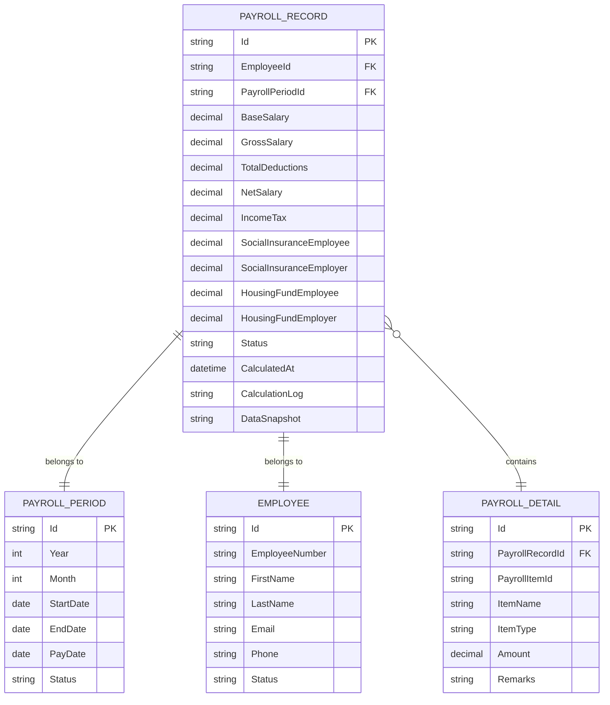

# 薪酬记录实体

<cite>
**本文档引用的文件**   
- [PayrollRecord.cs](file://Backend/Hrevolve.Domain/Payroll/PayrollRecord.cs)
- [PayrollPeriod.cs](file://Backend/Hrevolve.Domain/Payroll/PayrollPeriod.cs)
- [Employee.cs](file://Backend/Hrevolve.Domain/Employees/Employee.cs)
- [20251227093819_InitialCreate.cs](file://Backend/Hrevolve.Infrastructure/Migrations/20251227093819_InitialCreate.cs)
- [DatabaseDesign.drawio](file://Design/DatabaseDesign.drawio)
</cite>

## 目录
1. [薪酬记录实体概述](#薪酬记录实体概述)
2. [核心属性构成](#核心属性构成)
3. [与员工的多对一关系](#与员工的多对一关系)
4. [与薪酬周期的关联](#与薪酬周期的关联)
5. [在薪酬管理中的核心作用](#在薪酬管理中的核心作用)
6. [实体关系图](#实体关系图)

## 薪酬记录实体概述

薪酬记录实体（PayrollRecord）是人力资源管理系统中薪酬模块的核心组成部分，用于存储和管理每位员工在特定薪酬周期内的详细薪酬信息。该实体不仅记录了员工的基本工资、加班费、扣除项和实发工资等关键数据，还通过与员工实体和薪酬周期实体的关联，构建了完整的薪酬管理数据模型。薪酬记录实体在薪酬计算、发放和历史追溯等业务流程中扮演着至关重要的角色。

**Section sources**
- [PayrollRecord.cs](file://Backend/Hrevolve.Domain/Payroll/PayrollRecord.cs#L8-L124)

## 核心属性构成

薪酬记录实体包含多个核心属性，这些属性共同构成了员工薪酬的完整计算和记录体系。主要属性包括：

- **Id**: 实体的唯一标识符，作为主键使用。
- **EmployeeId**: 关联员工的唯一标识符，建立与员工实体的关系。
- **PayrollPeriodId**: 关联薪酬周期的唯一标识符，确定薪酬记录所属的周期。
- **BaseSalary**: 基本工资，员工在该周期内的基础薪酬。
- **GrossSalary**: 应发工资，包括基本工资、奖金、津贴等所有收入项的总和。
- **TotalDeductions**: 扣除总额，包括社保、公积金、个人所得税等所有扣除项的总和。
- **NetSalary**: 实发工资，即应发工资减去所有扣除项后的最终金额。
- **IncomeTax**: 个人所得税，员工在该周期内需要缴纳的税款。
- **SocialInsuranceEmployee**: 社保个人部分，员工个人承担的社保费用。
- **SocialInsuranceEmployer**: 社保公司部分，公司为员工缴纳的社保费用。
- **HousingFundEmployee**: 公积金个人部分，员工个人承担的公积金。
- **HousingFundEmployer**: 公积金公司部分，公司为员工缴纳的公积金。
- **Status**: 薪酬记录的状态，如草稿、已计算、已审批、已发放等。
- **CalculatedAt**: 计算时间，记录薪酬计算完成的时间戳。
- **CalculationLog**: 计算日志，以JSON格式存储薪酬计算过程的详细日志。
- **DataSnapshot**: 数据快照，以JSON格式存储计算时的关键数据，用于审计和追溯。

这些属性通过私有字段和只读集合（如Details）实现数据封装，确保了数据的完整性和安全性。

**Section sources**
- [PayrollRecord.cs](file://Backend/Hrevolve.Domain/Payroll/PayrollRecord.cs#L10-L74)
- [20251227093819_InitialCreate.cs](file://Backend/Hrevolve.Infrastructure/Migrations/20251227093819_InitialCreate.cs#L558-L581)

## 与员工的多对一关系

薪酬记录实体与员工实体之间存在明确的多对一关系。这种关系通过`EmployeeId`外键属性实现，即多个薪酬记录可以关联到同一个员工，但每个薪酬记录只能属于一个特定的员工。这种设计模式符合薪酬管理的实际业务需求，因为每位员工在不同的薪酬周期内都会生成独立的薪酬记录。

在数据库层面，这种关系通过`PayrollRecords`表中的`EmployeeId`字段与`Employees`表的主键`Id`建立外键约束来实现。在代码层面，`PayrollRecord`类通过`EmployeeId`属性直接引用员工的唯一标识符，而`Employee`类则通过`JobHistories`集合间接关联其薪酬记录。这种设计确保了数据的一致性和完整性，同时支持高效的查询和数据操作。

**Section sources**
- [PayrollRecord.cs](file://Backend/Hrevolve.Domain/Payroll/PayrollRecord.cs#L10)
- [Employee.cs](file://Backend/Hrevolve.Domain/Employees/Employee.cs#L46-L47)
- [20251227093819_InitialCreate.cs](file://Backend/Hrevolve.Infrastructure/Migrations/20251227093819_InitialCreate.cs#L559)

## 与薪酬周期的关联

薪酬记录实体与薪酬周期实体（PayrollPeriod）之间存在紧密的关联关系。这种关联通过`PayrollPeriodId`外键属性实现，确保每条薪酬记录都明确归属于一个特定的薪酬周期。薪酬周期实体定义了薪酬计算的时间范围，包括周期的开始日期、结束日期和发薪日期等关键信息。

在业务逻辑中，薪酬计算过程会基于特定的薪酬周期来生成所有符合条件员工的薪酬记录。`PayrollPeriod`类中的`Status`属性（如开放、锁定、关闭）直接影响薪酬记录的创建和修改权限。例如，当薪酬周期状态为"锁定"时，系统将禁止对相关薪酬记录进行修改，以确保数据的稳定性和一致性。这种关联关系在数据库中通过外键约束强制实施，确保了数据的参照完整性。

**Section sources**
- [PayrollRecord.cs](file://Backend/Hrevolve.Domain/Payroll/PayrollRecord.cs#L11-L12)
- [PayrollPeriod.cs](file://Backend/Hrevolve.Domain/Payroll/PayrollPeriod.cs#L29)
- [20251227093819_InitialCreate.cs](file://Backend/Hrevolve.Infrastructure/Migrations/20251227093819_InitialCreate.cs#L560)

## 在薪酬管理中的核心作用

薪酬记录实体在薪酬管理的各个关键环节中发挥着核心作用：

1. **薪酬计算**: 实体提供了`Calculate()`方法，能够自动计算应发工资、扣除总额和实发工资。该方法通过遍历薪酬明细（PayrollDetail）集合，根据项目类型（收入项、扣除项、税项）进行汇总计算，确保了计算结果的准确性和一致性。

2. **薪酬发放**: 通过`MarkAsPaid()`方法，系统可以将薪酬记录的状态更新为"已发放"，从而完成薪酬发放流程。状态管理机制（PayrollRecordStatus）确保了薪酬处理流程的规范化和可追溯性。

3. **历史追溯**: 实体存储了详细的计算日志（CalculationLog）和数据快照（DataSnapshot），这些信息为薪酬数据的审计和历史追溯提供了重要支持。即使在薪酬政策或计算规则发生变化后，系统仍能准确还原历史薪酬数据的计算过程。

4. **数据分析**: 薪酬记录实体的丰富属性为薪酬数据分析提供了坚实的基础。系统可以基于这些数据生成各种薪酬报表，如部门薪酬汇总、个人薪酬历史趋势等，为人力资源决策提供数据支持。

5. **合规性管理**: 通过精确记录社保、公积金和个税等法定扣除项，薪酬记录实体帮助组织确保薪酬管理的合规性，满足相关法律法规的要求。

**Section sources**
- [PayrollRecord.cs](file://Backend/Hrevolve.Domain/Payroll/PayrollRecord.cs#L105-L123)

## 实体关系图

**Diagram sources**
- [PayrollRecord.cs](file://Backend/Hrevolve.Domain/Payroll/PayrollRecord.cs#L8-L124)
- [PayrollPeriod.cs](file://Backend/Hrevolve.Domain/Payroll/PayrollPeriod.cs#L8-L72)
- [Employee.cs](file://Backend/Hrevolve.Domain/Employees/Employee.cs#L6-L107)
- [DatabaseDesign.drawio](file://Design/DatabaseDesign.drawio)

**Section sources**
- [PayrollRecord.cs](file://Backend/Hrevolve.Domain/Payroll/PayrollRecord.cs#L8-L124)
- [PayrollPeriod.cs](file://Backend/Hrevolve.Domain/Payroll/PayrollPeriod.cs#L8-L72)
- [Employee.cs](file://Backend/Hrevolve.Domain/Employees/Employee.cs#L6-L107)
- [DatabaseDesign.drawio](file://Design/DatabaseDesign.drawio)