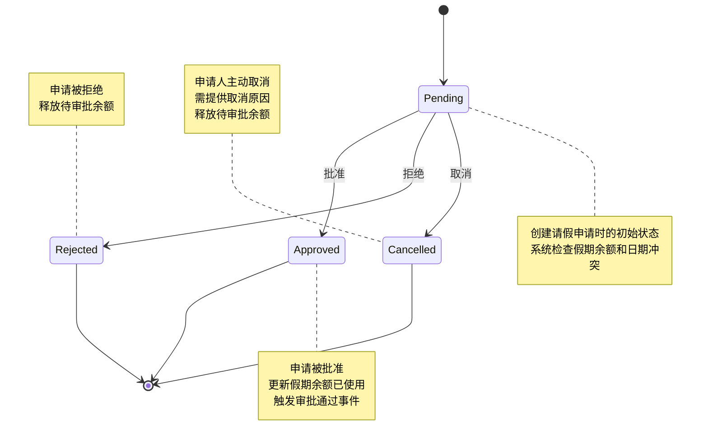
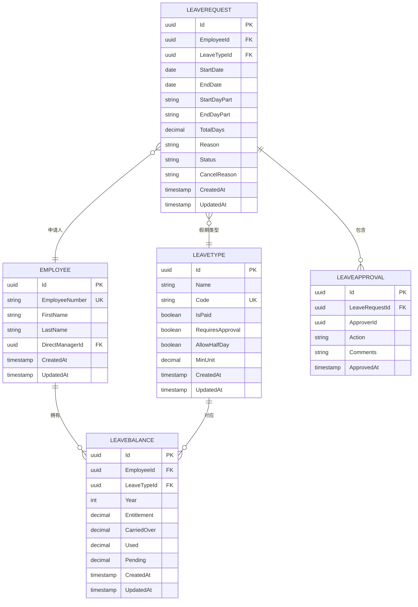

# 请假申请实体

<cite>
**本文档引用的文件**   
- [LeaveRequest.cs](file://Backend/Hrevolve.Domain/Leave/LeaveRequest.cs)
- [LeaveType.cs](file://Backend/Hrevolve.Domain/Leave/LeaveType.cs)
- [Employee.cs](file://Backend/Hrevolve.Domain/Employees/Employee.cs)
- [LeaveConfiguration.cs](file://Backend/Hrevolve.Infrastructure/Persistence/Configurations/LeaveConfiguration.cs)
- [CreateLeaveRequestCommand.cs](file://Backend/Hrevolve.Application/Leave/Commands/CreateLeaveRequestCommand.cs)
- [LeaveController.cs](file://Backend/Hrevolve.Web/Controllers/LeaveController.cs)
</cite>

## 目录
1. [请假申请生命周期](#请假申请生命周期)
2. [核心属性说明](#核心属性说明)
3. [与员工和假期类型的关联](#与员工和假期类型的关联)
4. [审批流程与ApproverId作用](#审批流程与approverid作用)
5. [假期余额计算逻辑集成](#假期余额计算逻辑集成)
6. [状态转换流程图](#状态转换流程图)
7. [数据模型关系图](#数据模型关系图)

## 请假申请生命周期

请假申请实体（LeaveRequest）的生命周期从创建开始，经历待审批、已批准、已拒绝或已取消等状态。当员工提交请假申请时，系统会创建一个状态为"待审批"（Pending）的请假申请。该申请需要经过审批流程，由审批人决定是否批准或拒绝。如果申请被批准，状态变为"已批准"（Approved）；如果被拒绝，状态变为"已拒绝"（Rejected）。申请人也可以在审批完成前取消申请，此时状态变为"已取消"（Cancelled）。

请假申请的生命周期受到多个业务规则的约束。首先，系统会检查所选日期是否与已有的请假申请冲突，避免同一时间段内存在多个有效的请假记录。其次，在创建请假申请时，系统会验证假期余额是否充足，确保员工不会超出其可用假期额度。请假天数的计算考虑了开始时段和结束时段，支持全天、上午和下午等不同的请假单位。

**Section sources**
- [LeaveRequest.cs](file://Backend/Hrevolve.Domain/Leave/LeaveRequest.cs#L8-L120)
- [CreateLeaveRequestCommand.cs](file://Backend/Hrevolve.Application/Leave/Commands/CreateLeaveRequestCommand.cs#L48-L125)

## 核心属性说明

请假申请实体包含多个核心属性，这些属性共同定义了请假的基本信息和状态。Id属性是请假申请的唯一标识符，作为主键在数据库中使用。EmployeeId属性关联到员工实体，标识请假的申请人。LeaveTypeId属性关联到假期类型实体，定义了请假的类型（如年假、病假等）。

StartDate和EndDate属性定义了请假的开始和结束日期，系统会根据这两个日期计算实际请假天数。StartDayPart和EndDayPart属性分别表示开始和结束时段，支持"全天"、"上午"和"下午"三种值，这使得系统能够精确计算半天假期。TotalDays属性存储计算得出的总请假天数，考虑了开始和结束时段的影响。

Status属性是请假申请的核心状态标识，包含"待审批"、"已批准"、"已拒绝"和"已取消"四种可能值。Reason属性存储请假原因，最长可容纳1000个字符。Attachments属性以JSON格式存储附件URL列表，支持上传相关证明文件。CancelReason属性在申请被取消时记录取消原因。

**Section sources**
- [LeaveRequest.cs](file://Backend/Hrevolve.Domain/Leave/LeaveRequest.cs#L10-L47)
- [LeaveConfiguration.cs](file://Backend/Hrevolve.Infrastructure/Persistence/Configurations/LeaveConfiguration.cs#L75-L121)

## 与员工和假期类型的关联

请假申请实体与员工实体（Employee）和假期类型实体（LeaveType）建立了明确的关联关系。通过EmployeeId属性，每个请假申请都与特定的员工相关联。这种关联不仅用于标识申请人，还用于权限控制和数据过滤。例如，员工只能查看和管理自己的请假申请，而经理可以查看其下属的请假申请。

与假期类型实体的关联通过LeaveTypeId属性实现。假期类型定义了不同类型的假期（如年假、病假、事假等）及其特定规则。每个假期类型可以配置是否带薪、是否需要审批、是否允许半天请假等属性。这种设计实现了假期管理的灵活性，企业可以根据需要定义多种假期类型并设置不同的管理规则。

在数据持久化层面，这些关联通过外键约束实现。LeaveRequest实体中的EmployeeId和LeaveTypeId字段都建立了外键约束，确保数据的完整性和一致性。同时，系统还建立了相应的数据库索引，如(TenantId, EmployeeId, Status)复合索引，以优化按员工和状态查询请假申请的性能。

**Section sources**
- [LeaveRequest.cs](file://Backend/Hrevolve.Domain/Leave/LeaveRequest.cs#L10-L12)
- [Employee.cs](file://Backend/Hrevolve.Domain/Employees/Employee.cs#L8-L48)
- [LeaveType.cs](file://Backend/Hrevolve.Domain/Leave/LeaveType.cs#L8-L11)
- [LeaveConfiguration.cs](file://Backend/Hrevolve.Infrastructure/Persistence/Configurations/LeaveConfiguration.cs#L110-L113)

## 审批流程与ApproverId作用

请假申请的审批流程通过LeaveApproval实体实现，其中ApproverId属性起着关键作用。当请假申请需要审批时，系统会创建一个或多个LeaveApproval记录，每个记录都包含ApproverId，标识执行审批操作的审批人。审批人可以是申请人的直接上级，也可以是根据企业审批流程配置的其他管理人员。

审批流程支持多级审批和并行审批两种模式。在多级审批中，申请需要依次经过多个审批人的批准；在并行审批中，多个审批人可以同时进行审批，通常需要所有审批人都批准申请才能通过。ApproverId不仅记录了谁进行了审批，还与系统权限控制集成，确保只有具有适当权限的用户才能执行审批操作。

审批记录还包含Action属性（批准或拒绝）、Comments属性（审批意见）和ApprovedAt属性（审批时间），这些信息共同构成了完整的审批历史。审批历史对于审计和追溯非常重要，企业可以随时查看某个请假申请的完整审批过程。当申请被批准时，系统会触发LeaveRequestApprovedEvent领域事件，通知相关系统组件进行后续处理。

**Section sources**
- [LeaveRequest.cs](file://Backend/Hrevolve.Domain/Leave/LeaveRequest.cs#L54-L114)
- [LeaveRequest.cs](file://Backend/Hrevolve.Domain/Leave/LeaveRequest.cs#L141-L158)
- [LeaveController.cs](file://Backend/Hrevolve.Web/Controllers/LeaveController.cs#L58-L66)

## 假期余额计算逻辑集成

请假申请与假期余额计算逻辑紧密集成，确保假期管理的准确性和一致性。系统通过LeaveBalance实体管理每个员工的假期余额，包含年度额度（Entitlement）、结转额度（CarriedOver）、已使用（Used）和待审批（Pending）等关键指标。可用余额（Available）通过公式"年度额度 + 结转额度 - 已使用 - 待审批"动态计算得出。

当员工创建请假申请时，系统会检查相关假期类型的余额是否充足。如果余额充足，系统会将申请的天数添加到"待审批"余额中，暂时减少可用余额。这种机制防止了员工在审批完成前重复申请超出额度的假期。一旦申请被批准，系统会将"待审批"余额转移到"已使用"余额；如果申请被拒绝或取消，则会从"待审批"余额中减去相应天数。

假期余额的计算还考虑了年份因素，每个员工每年的假期余额是独立计算的。系统支持按年份查询和管理假期余额，确保跨年度假期管理的准确性。此外，系统还支持假期结转规则，允许将未使用的假期额度结转到下一年度，结转额度受企业政策的限制。

**Section sources**
- [LeaveRequest.cs](file://Backend/Hrevolve.Domain/Leave/LeaveRequest.cs#L169-L229)
- [CreateLeaveRequestCommand.cs](file://Backend/Hrevolve.Application/Leave/Commands/CreateLeaveRequestCommand.cs#L71-L85)
- [CreateLeaveRequestCommand.cs](file://Backend/Hrevolve.Application/Leave/Commands/CreateLeaveRequestCommand.cs#L116-L120)

## 状态转换流程图

**Diagram sources **
- [LeaveRequest.cs](file://Backend/Hrevolve.Domain/Leave/LeaveRequest.cs#L130-L135)
- [LeaveRequest.cs](file://Backend/Hrevolve.Domain/Leave/LeaveRequest.cs#L103-L119)

## 数据模型关系图

**Diagram sources **
- [LeaveRequest.cs](file://Backend/Hrevolve.Domain/Leave/LeaveRequest.cs#L8-L120)
- [Employee.cs](file://Backend/Hrevolve.Domain/Employees/Employee.cs#L6-L48)
- [LeaveType.cs](file://Backend/Hrevolve.Domain/Leave/LeaveType.cs#L8-L66)
- [LeaveBalance.cs](file://Backend/Hrevolve.Domain/Leave/LeaveRequest.cs#L169-L229)
- [LeaveApproval.cs](file://Backend/Hrevolve.Domain/Leave/LeaveRequest.cs#L141-L158)