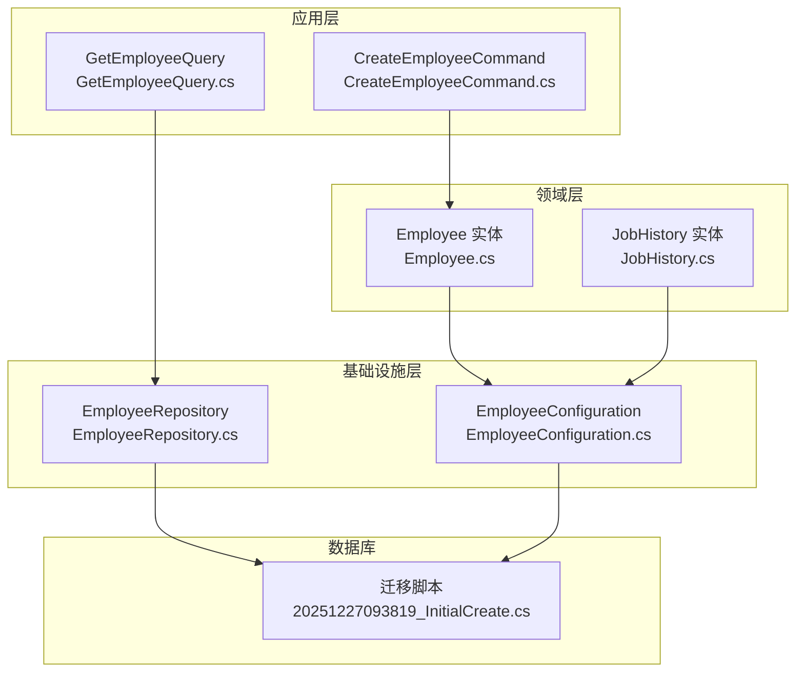
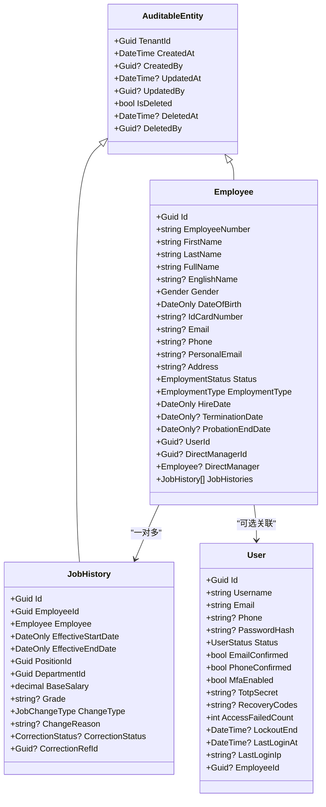
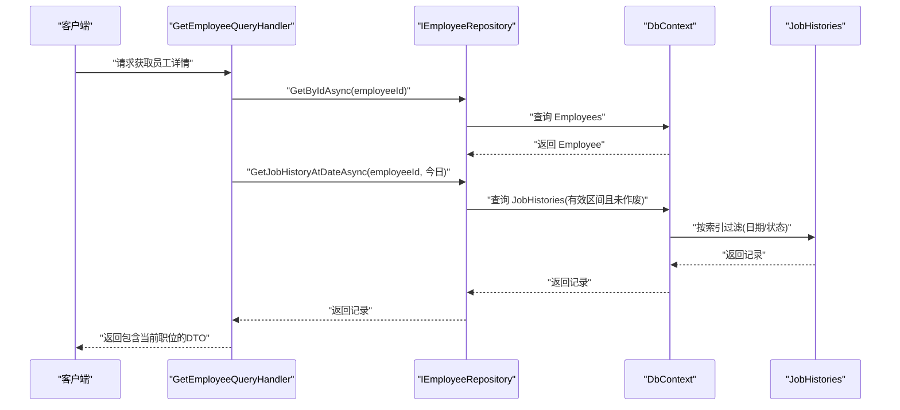
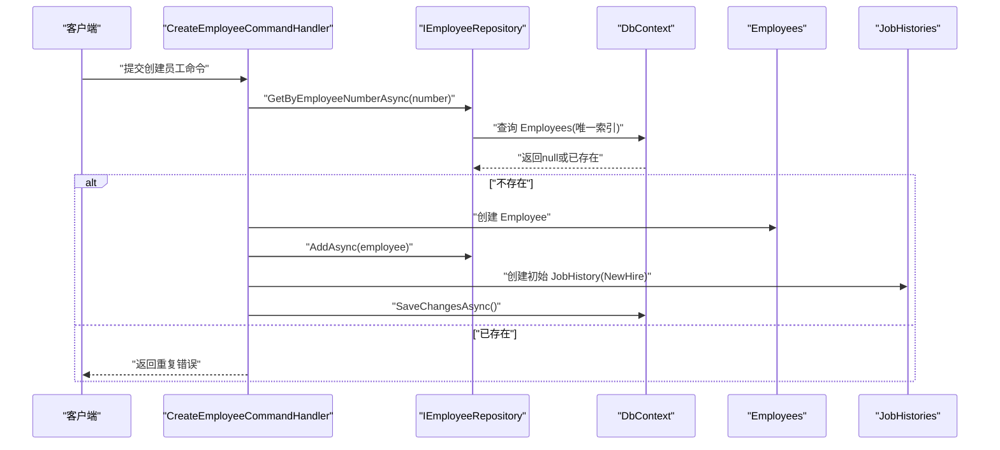
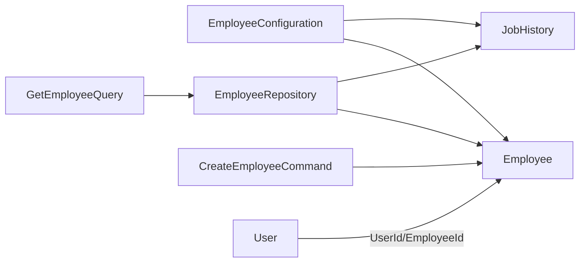

# 员工表 (Employees)

<cite>
**本文引用的文件**
- [Employee.cs](file://Backend/Hrevolve.Domain/Employees/Employee.cs)
- [JobHistory.cs](file://Backend/Hrevolve.Domain/Employees/JobHistory.cs)
- [EmployeeConfiguration.cs](file://Backend/Hrevolve.Infrastructure/Persistence/Configurations/EmployeeConfiguration.cs)
- [EmployeeRepository.cs](file://Backend/Hrevolve.Infrastructure/Persistence/Repositories/EmployeeRepository.cs)
- [GetEmployeeQuery.cs](file://Backend/Hrevolve.Application/Employees/Queries/GetEmployeeQuery.cs)
- [CreateEmployeeCommand.cs](file://Backend/Hrevolve.Application/Employees/Commands/CreateEmployeeCommand.cs)
- [AuditableEntity.cs](file://Backend/Hrevolve.Domain/Common/AuditableEntity.cs)
- [User.cs](file://Backend/Hrevolve.Domain/Identity/User.cs)
- [20251227093819_InitialCreate.cs](file://Backend/Hrevolve.Infrastructure/Migrations/20251227093819_InitialCreate.cs)
</cite>

## 目录
1. [简介](#简介)
2. [项目结构](#项目结构)
3. [核心组件](#核心组件)
4. [架构总览](#架构总览)
5. [详细组件分析](#详细组件分析)
6. [依赖分析](#依赖分析)
7. [性能考虑](#性能考虑)
8. [故障排查指南](#故障排查指南)
9. [结论](#结论)

## 简介
本文件面向“员工表 (Employees)”的完整数据模型文档，围绕以下目标展开：
- 明确定义核心人事字段：EmployeeNumber、FirstName、LastName、DateOfBirth、HireDate 等
- 解释 DirectManagerId 外键如何实现员工层级管理
- 阐述 UserId 字段与 Users 表的关联关系，以及 EmployeeId 在用户-员工映射中的作用
- 说明 JobHistories 表与 Employees 的 SCD Type 2 历史追溯设计，确保员工职位变动的完整记录

## 项目结构
员工相关的核心代码分布在领域层、应用层、基础设施层与数据库迁移脚本中：
- 领域层：定义员工实体、职位历史实体及其枚举与领域事件
- 应用层：提供查询 DTO 与命令处理逻辑，封装业务规则
- 基础设施层：EF Core 配置与仓储实现，负责持久化与索引策略
- 数据库迁移：生成 Employees 与 JobHistories 表及索引

图表来源
- [Employee.cs](file://Backend/Hrevolve.Domain/Employees/Employee.cs#L1-L137)
- [JobHistory.cs](file://Backend/Hrevolve.Domain/Employees/JobHistory.cs#L1-L124)
- [EmployeeConfiguration.cs](file://Backend/Hrevolve.Infrastructure/Persistence/Configurations/EmployeeConfiguration.cs#L1-L110)
- [EmployeeRepository.cs](file://Backend/Hrevolve.Infrastructure/Persistence/Repositories/EmployeeRepository.cs#L1-L82)
- [GetEmployeeQuery.cs](file://Backend/Hrevolve.Application/Employees/Queries/GetEmployeeQuery.cs#L1-L146)
- [CreateEmployeeCommand.cs](file://Backend/Hrevolve.Application/Employees/Commands/CreateEmployeeCommand.cs#L1-L126)
- [20251227093819_InitialCreate.cs](file://Backend/Hrevolve.Infrastructure/Migrations/20251227093819_InitialCreate.cs#L41-L112)

章节来源
- [Employee.cs](file://Backend/Hrevolve.Domain/Employees/Employee.cs#L1-L137)
- [JobHistory.cs](file://Backend/Hrevolve.Domain/Employees/JobHistory.cs#L1-L124)
- [EmployeeConfiguration.cs](file://Backend/Hrevolve.Infrastructure/Persistence/Configurations/EmployeeConfiguration.cs#L1-L110)
- [EmployeeRepository.cs](file://Backend/Hrevolve.Infrastructure/Persistence/Repositories/EmployeeRepository.cs#L1-L82)
- [GetEmployeeQuery.cs](file://Backend/Hrevolve.Application/Employees/Queries/GetEmployeeQuery.cs#L1-L146)
- [CreateEmployeeCommand.cs](file://Backend/Hrevolve.Application/Employees/Commands/CreateEmployeeCommand.cs#L1-L126)
- [20251227093819_InitialCreate.cs](file://Backend/Hrevolve.Infrastructure/Migrations/20251227093819_InitialCreate.cs#L41-L112)

## 核心组件
- 员工实体 Employee：承载员工基本信息、雇佣状态、雇佣类型、入职日期、试用期结束日期、联系方式、性别、身份证号、用户关联、直接上级等，并包含领域事件
- 职位历史 JobHistory：支持 SCD Type 2 的职位变更记录，包含生效起止日期、职位、部门、基本薪资、职级、变更类型、变更原因、冲正状态与关联记录等
- EF Core 配置：定义 Employees 与 JobHistories 的表结构、主键、属性约束、索引与外键关系
- 仓储与查询：提供按日期查询职位历史、按部门查询员工、按直接上级查询下属等能力

章节来源
- [Employee.cs](file://Backend/Hrevolve.Domain/Employees/Employee.cs#L1-L137)
- [JobHistory.cs](file://Backend/Hrevolve.Domain/Employees/JobHistory.cs#L1-L124)
- [EmployeeConfiguration.cs](file://Backend/Hrevolve.Infrastructure/Persistence/Configurations/EmployeeConfiguration.cs#L1-L110)
- [EmployeeRepository.cs](file://Backend/Hrevolve.Infrastructure/Persistence/Repositories/EmployeeRepository.cs#L1-L82)

## 架构总览
员工数据模型贯穿领域、应用与基础设施三层，配合多租户审计字段与索引策略，支撑员工与用户映射、组织架构与薪酬发放等业务场景。

图表来源
- [AuditableEntity.cs](file://Backend/Hrevolve.Domain/Common/AuditableEntity.cs#L1-L48)
- [Employee.cs](file://Backend/Hrevolve.Domain/Employees/Employee.cs#L1-L137)
- [JobHistory.cs](file://Backend/Hrevolve.Domain/Employees/JobHistory.cs#L1-L124)
- [User.cs](file://Backend/Hrevolve.Domain/Identity/User.cs#L1-L194)

## 详细组件分析

### 员工实体 (Employee) 数据模型
- 员工标识与姓名
  - EmployeeNumber：唯一性约束，结合 TenantId 唯一索引，便于跨租户隔离下的快速检索
  - FirstName、LastName：必填，最大长度限制
  - FullName：由 LastName+FirstName 组合生成
  - EnglishName：可空
- 个人信息
  - Gender：枚举，支持男、女、其他
  - DateOfBirth：必填，需早于当前日期
  - IdCardNumber：可空，采用加密存储
  - Email、Phone、PersonalEmail、Address：可空，长度限制
- 雇佣信息
  - Status：枚举，支持在职、休假、停职、离职
  - EmploymentType：枚举，支持全职、兼职、合同工、实习生、顾问
  - HireDate：必填
  - TerminationDate、ProbationEndDate：可空
- 关联与层级
  - UserId：可空，与 Users 表建立一对一映射
  - DirectManagerId：自引用外键，指向 Employee.Id；删除行为 Restrict，避免级联删除导致的层级断裂
  - DirectManager：导航属性，反向引用直接上级
- 历史与事件
  - JobHistories：集合，保存职位历史记录
  - 领域事件：创建、终止、通过试用期

章节来源
- [Employee.cs](file://Backend/Hrevolve.Domain/Employees/Employee.cs#L1-L137)
- [EmployeeConfiguration.cs](file://Backend/Hrevolve.Infrastructure/Persistence/Configurations/EmployeeConfiguration.cs#L1-L71)
- [20251227093819_InitialCreate.cs](file://Backend/Hrevolve.Infrastructure/Migrations/20251227093819_InitialCreate.cs#L41-L81)

### 职位历史 (JobHistory) 数据模型与 SCD Type 2 设计
- 关键字段
  - EmployeeId：外键，指向 Employees
  - EffectiveStartDate、EffectiveEndDate：SCD Type 2 的时间窗口，默认结束日期为极大值表示当前记录
  - PositionId、DepartmentId：职位与部门标识
  - BaseSalary：基本薪资，精度控制
  - Grade：职级
  - ChangeType：变更类型（入职、晋升、降级、调动、调薪、数据修正）
  - ChangeReason：变更原因
  - CorrectionStatus、CorrectionRefId：冲正状态与关联记录，支持历史修正
- 查询策略
  - 通过仓储按日期查询某员工在指定日期有效的职位记录，过滤作废记录
  - EF Core 配置为 JobHistories 提供复合索引，优化时点查询与冲正筛选

章节来源
- [JobHistory.cs](file://Backend/Hrevolve.Domain/Employees/JobHistory.cs#L1-L124)
- [EmployeeRepository.cs](file://Backend/Hrevolve.Infrastructure/Persistence/Repositories/EmployeeRepository.cs#L70-L81)
- [EmployeeConfiguration.cs](file://Backend/Hrevolve.Infrastructure/Persistence/Configurations/EmployeeConfiguration.cs#L73-L110)
- [20251227093819_InitialCreate.cs](file://Backend/Hrevolve.Infrastructure/Migrations/20251227093819_InitialCreate.cs#L368-L401)

### 用户与员工映射 (UserId 与 Users 表)
- 员工实体中的 UserId 字段与 Users 表建立一对一映射
- Users 实体中的 EmployeeId 字段作为反向映射，支持从用户到员工的快速定位
- 业务意义：员工可拥有系统用户身份，便于认证与授权；同时允许无用户身份的员工存在（如临时工）

章节来源
- [Employee.cs](file://Backend/Hrevolve.Domain/Employees/Employee.cs#L32-L41)
- [User.cs](file://Backend/Hrevolve.Domain/Identity/User.cs#L52-L54)
- [20251227093819_InitialCreate.cs](file://Backend/Hrevolve.Infrastructure/Migrations/20251227093819_InitialCreate.cs#L334-L361)

### 层级管理与 DirectManagerId 外键
- 自引用外键 DirectManagerId 指向 Employee.Id
- 删除行为设置为 Restrict，防止误删导致层级断裂
- 仓储提供按直接上级查询下属的能力，支持组织架构树的构建与查询

章节来源
- [EmployeeConfiguration.cs](file://Backend/Hrevolve.Infrastructure/Persistence/Configurations/EmployeeConfiguration.cs#L62-L66)
- [EmployeeRepository.cs](file://Backend/Hrevolve.Infrastructure/Persistence/Repositories/EmployeeRepository.cs#L63-L68)
- [20251227093819_InitialCreate.cs](file://Backend/Hrevolve.Infrastructure/Migrations/20251227093819_InitialCreate.cs#L75-L80)

### 数据库表结构与索引
- Employees 表
  - 主键：Id
  - 唯一索引：TenantId + EmployeeNumber
  - 索引：TenantId + Email、TenantId + Status
  - 外键：DirectManagerId -> Employees.Id（Restrict）
- JobHistories 表
  - 主键：Id
  - 外键：EmployeeId -> Employees.Id（Cascade）
  - 索引：TenantId + EmployeeId + EffectiveStartDate + EffectiveEndDate、TenantId + EmployeeId + CorrectionStatus

章节来源
- [20251227093819_InitialCreate.cs](file://Backend/Hrevolve.Infrastructure/Migrations/20251227093819_InitialCreate.cs#L41-L112)
- [20251227093819_InitialCreate.cs](file://Backend/Hrevolve.Infrastructure/Migrations/20251227093819_InitialCreate.cs#L368-L401)
- [20251227093819_InitialCreate.cs](file://Backend/Hrevolve.Infrastructure/Migrations/20251227093819_InitialCreate.cs#L831-L851)
- [20251227093819_InitialCreate.cs](file://Backend/Hrevolve.Infrastructure/Migrations/20251227093819_InitialCreate.cs#L883-L894)

### 查询与命令流程（时点查询与入职）
- 时点查询流程（当前职位）
  - 应用层查询处理器根据 EmployeeId 获取员工，并使用仓储按“今日”日期查询 JobHistory
  - 将结果映射为 DTO，包含当前职位信息
- 历史时点查询流程
  - 应用层查询处理器根据 EmployeeId 与指定 Date 查询 JobHistory
  - 返回对应日期的有效职位信息
- 新员工入职流程
  - 命令处理器校验唯一性与输入合法性
  - 创建 Employee 并设置联系信息与直接上级
  - 创建初始 JobHistory（NewHire），记录入职日期与初始职位信息

图表来源
- [GetEmployeeQuery.cs](file://Backend/Hrevolve.Application/Employees/Queries/GetEmployeeQuery.cs#L46-L91)
- [EmployeeRepository.cs](file://Backend/Hrevolve.Infrastructure/Persistence/Repositories/EmployeeRepository.cs#L70-L81)
- [EmployeeConfiguration.cs](file://Backend/Hrevolve.Infrastructure/Persistence/Configurations/EmployeeConfiguration.cs#L98-L108)

图表来源
- [CreateEmployeeCommand.cs](file://Backend/Hrevolve.Application/Employees/Commands/CreateEmployeeCommand.cs#L70-L126)
- [EmployeeRepository.cs](file://Backend/Hrevolve.Infrastructure/Persistence/Repositories/EmployeeRepository.cs#L31-L41)
- [EmployeeConfiguration.cs](file://Backend/Hrevolve.Infrastructure/Persistence/Configurations/EmployeeConfiguration.cs#L1-L71)

## 依赖分析
- 组件耦合
  - Employee 与 JobHistory：一对多聚合根，通过 EmployeeId 关联
  - Employee 与 User：可选一对一映射，通过 UserId 与 EmployeeId 双向关联
  - EmployeeConfiguration：集中定义表结构、索引与外键，降低各层对 EF 配置的感知
- 外部依赖
  - EF Core：负责实体映射、索引与外键约束
  - 数据库：Employees 与 JobHistories 表，以及相关索引
- 循环依赖
  - 未发现循环依赖；配置与实体分层清晰

图表来源
- [EmployeeConfiguration.cs](file://Backend/Hrevolve.Infrastructure/Persistence/Configurations/EmployeeConfiguration.cs#L1-L110)
- [EmployeeRepository.cs](file://Backend/Hrevolve.Infrastructure/Persistence/Repositories/EmployeeRepository.cs#L1-L82)
- [GetEmployeeQuery.cs](file://Backend/Hrevolve.Application/Employees/Queries/GetEmployeeQuery.cs#L1-L146)
- [CreateEmployeeCommand.cs](file://Backend/Hrevolve.Application/Employees/Commands/CreateEmployeeCommand.cs#L1-L126)
- [User.cs](file://Backend/Hrevolve.Domain/Identity/User.cs#L1-L194)

章节来源
- [EmployeeConfiguration.cs](file://Backend/Hrevolve.Infrastructure/Persistence/Configurations/EmployeeConfiguration.cs#L1-L110)
- [EmployeeRepository.cs](file://Backend/Hrevolve.Infrastructure/Persistence/Repositories/EmployeeRepository.cs#L1-L82)
- [GetEmployeeQuery.cs](file://Backend/Hrevolve.Application/Employees/Queries/GetEmployeeQuery.cs#L1-L146)
- [CreateEmployeeCommand.cs](file://Backend/Hrevolve.Application/Employees/Commands/CreateEmployeeCommand.cs#L1-L126)
- [User.cs](file://Backend/Hrevolve.Domain/Identity/User.cs#L1-L194)

## 性能考虑
- 索引策略
  - Employees：唯一索引（TenantId, EmployeeNumber）与常用查询字段索引（TenantId, Email）、（TenantId, Status），提升唯一性检查与筛选效率
  - JobHistories：复合索引（TenantId, EmployeeId, EffectiveStartDate, EffectiveEndDate）与（TenantId, EmployeeId, CorrectionStatus），支持高效时点查询与冲正过滤
- 删除行为
  - JobHistories 外键删除行为为 Cascade，确保员工被删除时其历史记录同步清理
  - Employee 的 DirectManagerId 外键删除行为为 Restrict，避免误删破坏组织层级
- 查询复杂度
  - 时点查询通过索引过滤，时间复杂度近似 O(log n) + 扫描匹配，满足高频查询需求
  - 按部门查询员工通过 JobHistories 的有效区间过滤，避免全表扫描

章节来源
- [EmployeeConfiguration.cs](file://Backend/Hrevolve.Infrastructure/Persistence/Configurations/EmployeeConfiguration.cs#L56-L71)
- [EmployeeConfiguration.cs](file://Backend/Hrevolve.Infrastructure/Persistence/Configurations/EmployeeConfiguration.cs#L98-L108)
- [20251227093819_InitialCreate.cs](file://Backend/Hrevolve.Infrastructure/Migrations/20251227093819_InitialCreate.cs#L831-L851)
- [20251227093819_InitialCreate.cs](file://Backend/Hrevolve.Infrastructure/Migrations/20251227093819_InitialCreate.cs#L883-L894)
- [EmployeeRepository.cs](file://Backend/Hrevolve.Infrastructure/Persistence/Repositories/EmployeeRepository.cs#L44-L61)
- [EmployeeRepository.cs](file://Backend/Hrevolve.Infrastructure/Persistence/Repositories/EmployeeRepository.cs#L70-L81)

## 故障排查指南
- 唯一性冲突
  - 现象：创建员工时报错“员工编号已存在”
  - 排查：确认 TenantId 下 EmployeeNumber 是否唯一；检查唯一索引是否生效
  - 参考路径：[CreateEmployeeCommand.cs](file://Backend/Hrevolve.Application/Employees/Commands/CreateEmployeeCommand.cs#L80-L86)
- 无效日期
  - 现象：出生日期晚于当前日期或入职日期为空
  - 排查：核对输入参数与验证规则
  - 参考路径：[CreateEmployeeCommand.cs](file://Backend/Hrevolve.Application/Employees/Commands/CreateEmployeeCommand.cs#L45-L51)
- 时点查询无结果
  - 现象：历史时点查询返回空
  - 排查：确认 JobHistories 中是否存在有效记录且未作废；检查日期范围与 CorrectionStatus
  - 参考路径：[EmployeeRepository.cs](file://Backend/Hrevolve.Infrastructure/Persistence/Repositories/EmployeeRepository.cs#L70-L81)
- 层级异常
  - 现象：删除员工时报外键约束错误
  - 排查：确认删除行为为 Restrict；若需删除，请先清理或调整层级关系
  - 参考路径：[EmployeeConfiguration.cs](file://Backend/Hrevolve.Infrastructure/Persistence/Configurations/EmployeeConfiguration.cs#L62-L66)

章节来源
- [CreateEmployeeCommand.cs](file://Backend/Hrevolve.Application/Employees/Commands/CreateEmployeeCommand.cs#L45-L86)
- [EmployeeRepository.cs](file://Backend/Hrevolve.Infrastructure/Persistence/Repositories/EmployeeRepository.cs#L70-L81)
- [EmployeeConfiguration.cs](file://Backend/Hrevolve.Infrastructure/Persistence/Configurations/EmployeeConfiguration.cs#L62-L66)

## 结论
Employees 与 JobHistories 的设计遵循多租户与 SCD Type 2 的最佳实践，通过完善的索引与外键约束保障了数据一致性与查询性能。员工层级管理通过自引用外键与 Restrict 删除行为实现稳健的组织结构维护；用户-员工映射通过双向关联字段实现灵活的身份集成。整体架构清晰、职责分离明确，适合在复杂的人力资源场景中长期演进。