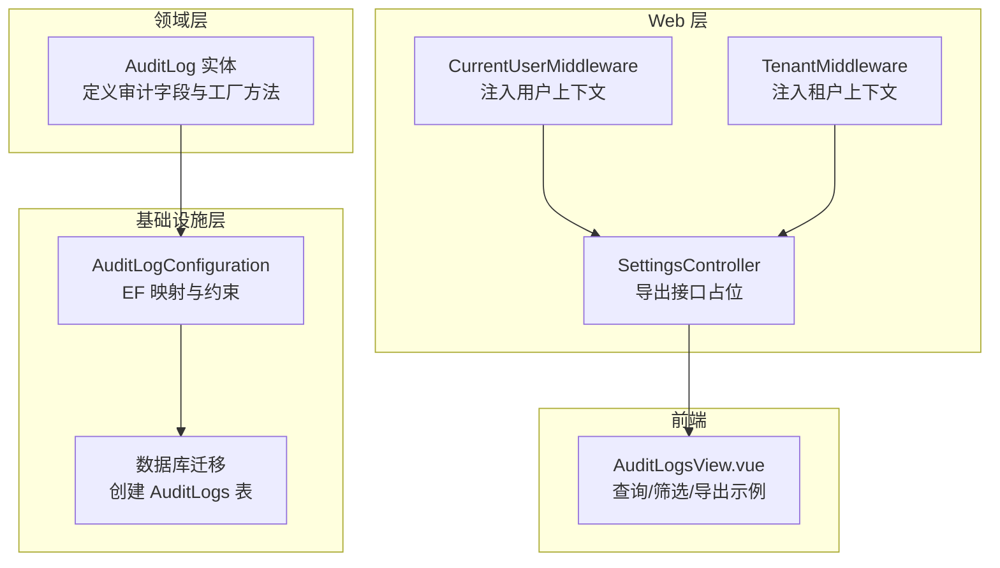
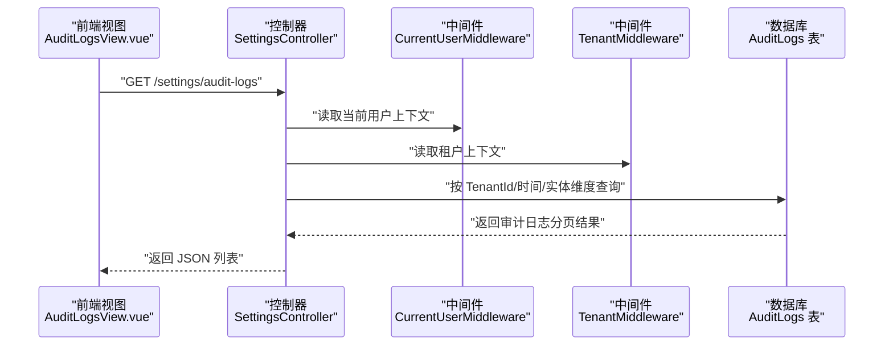
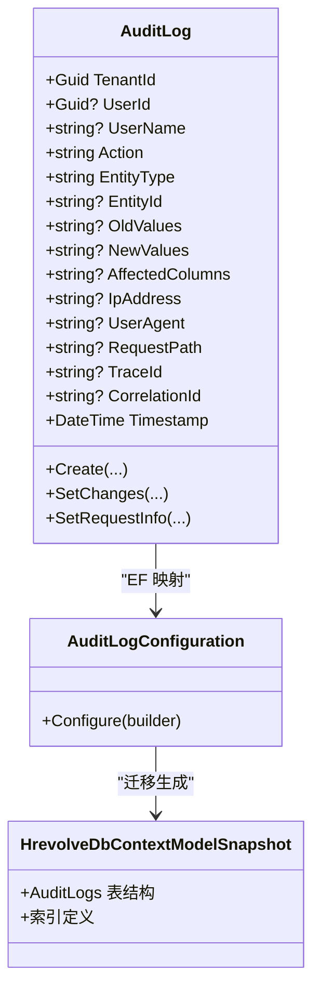
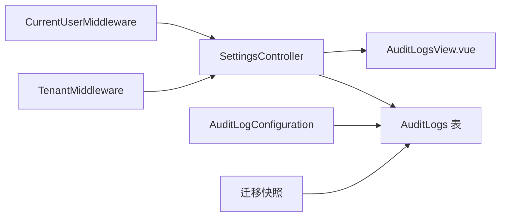

# 审计日志表 (AuditLogs)

<cite>
**本文引用的文件**
- [AuditLog.cs](file://Backend/Hrevolve.Domain/Audit/AuditLog.cs)
- [AuditLogConfiguration.cs](file://Backend/Hrevolve.Infrastructure/Persistence/Configurations/AuditLogConfiguration.cs)
- [20251227093819_InitialCreate.Designer.cs](file://Backend/Hrevolve.Infrastructure/Migrations/20251227093819_InitialCreate.Designer.cs)
- [HrevolveDbContextModelSnapshot.cs](file://Backend/Hrevolve.Infrastructure/Migrations/HrevolveDbContextModelSnapshot.cs)
- [AuditLogsView.vue](file://Frontend/hrevolve-web/src/views/settings/AuditLogsView.vue)
- [SettingsController.cs](file://Backend/Hrevolve.Web/Controllers/SettingsController.cs)
- [CurrentUserMiddleware.cs](file://Backend/Hrevolve.Web/Middleware/CurrentUserMiddleware.cs)
- [TenantMiddleware.cs](file://Backend/Hrevolve.Web/Middleware/TenantMiddleware.cs)
- [AuditActions 常量定义](file://Backend/Hrevolve.Domain/Audit/AuditLog.cs#L110-L125)
</cite>

## 目录
1. [简介](#简介)
2. [项目结构](#项目结构)
3. [核心组件](#核心组件)
4. [架构总览](#架构总览)
5. [详细组件分析](#详细组件分析)
6. [依赖关系分析](#依赖关系分析)
7. [性能考量](#性能考量)
8. [故障排查指南](#故障排查指南)
9. [结论](#结论)
10. [附录](#附录)

## 简介
本文件围绕 AuditLogs 表提供系统化、可操作的数据模型文档，重点解析以下关键审计字段：
- 实体类型与实体标识：EntityType、EntityId
- 操作与变更记录：Action、OldValues、NewValues、AffectedColumns
- 安全与行为分析：IpAddress、UserAgent、RequestPath
- 分布式追踪：TraceId、CorrelationId
- 合规与审计：多租户隔离、时间戳、索引设计与查询优化

通过数据库迁移快照、实体映射配置与前后端视图/控制器的协同，阐明该表如何支撑企业级安全审计与合规要求。

## 项目结构
AuditLogs 的数据模型由领域层实体、基础设施层 EF 配置与数据库迁移共同定义，并由 Web 层中间件与前端视图参与采集与展示。

图表来源
- [AuditLog.cs](file://Backend/Hrevolve.Domain/Audit/AuditLog.cs#L1-L125)
- [AuditLogConfiguration.cs](file://Backend/Hrevolve.Infrastructure/Persistence/Configurations/AuditLogConfiguration.cs#L1-L55)
- [20251227093819_InitialCreate.Designer.cs](file://Backend/Hrevolve.Infrastructure/Migrations/20251227093819_InitialCreate.Designer.cs#L305-L342)
- [HrevolveDbContextModelSnapshot.cs](file://Backend/Hrevolve.Infrastructure/Migrations/HrevolveDbContextModelSnapshot.cs#L302-L339)
- [CurrentUserMiddleware.cs](file://Backend/Hrevolve.Web/Middleware/CurrentUserMiddleware.cs#L1-L58)
- [TenantMiddleware.cs](file://Backend/Hrevolve.Web/Middleware/TenantMiddleware.cs#L1-L133)
- [SettingsController.cs](file://Backend/Hrevolve.Web/Controllers/SettingsController.cs#L193-L207)
- [AuditLogsView.vue](file://Frontend/hrevolve-web/src/views/settings/AuditLogsView.vue#L1-L146)

章节来源
- [AuditLog.cs](file://Backend/Hrevolve.Domain/Audit/AuditLog.cs#L1-L125)
- [AuditLogConfiguration.cs](file://Backend/Hrevolve.Infrastructure/Persistence/Configurations/AuditLogConfiguration.cs#L1-L55)
- [20251227093819_InitialCreate.Designer.cs](file://Backend/Hrevolve.Infrastructure/Migrations/20251227093819_InitialCreate.Designer.cs#L305-L342)
- [HrevolveDbContextModelSnapshot.cs](file://Backend/Hrevolve.Infrastructure/Migrations/HrevolveDbContextModelSnapshot.cs#L302-L339)
- [CurrentUserMiddleware.cs](file://Backend/Hrevolve.Web/Middleware/CurrentUserMiddleware.cs#L1-L58)
- [TenantMiddleware.cs](file://Backend/Hrevolve.Web/Middleware/TenantMiddleware.cs#L1-L133)
- [SettingsController.cs](file://Backend/Hrevolve.Web/Controllers/SettingsController.cs#L193-L207)
- [AuditLogsView.vue](file://Frontend/hrevolve-web/src/views/settings/AuditLogsView.vue#L1-L146)

## 核心组件
- 审计实体：定义审计日志的核心属性与工厂方法，包含操作类型、实体类型与标识、变更内容、客户端信息、分布式追踪信息及时间戳。
- EF 映射：对字段长度、必填性、索引进行约束，确保查询效率与数据完整性。
- 数据库迁移：生成 AuditLogs 表结构，包含字段、索引与类型约束。
- 中间件：在请求生命周期内注入用户与租户上下文，为审计日志提供关键维度。
- 前端视图：提供审计日志的查询、筛选与导出示例，便于合规审查与运营分析。

章节来源
- [AuditLog.cs](file://Backend/Hrevolve.Domain/Audit/AuditLog.cs#L1-L125)
- [AuditLogConfiguration.cs](file://Backend/Hrevolve.Infrastructure/Persistence/Configurations/AuditLogConfiguration.cs#L1-L55)
- [20251227093819_InitialCreate.Designer.cs](file://Backend/Hrevolve.Infrastructure/Migrations/20251227093819_InitialCreate.Designer.cs#L305-L342)
- [HrevolveDbContextModelSnapshot.cs](file://Backend/Hrevolve.Infrastructure/Migrations/HrevolveDbContextModelSnapshot.cs#L302-L339)
- [CurrentUserMiddleware.cs](file://Backend/Hrevolve.Web/Middleware/CurrentUserMiddleware.cs#L1-L58)
- [TenantMiddleware.cs](file://Backend/Hrevolve.Web/Middleware/TenantMiddleware.cs#L1-L133)
- [AuditLogsView.vue](file://Frontend/hrevolve-web/src/views/settings/AuditLogsView.vue#L1-L146)

## 架构总览
AuditLogs 的数据流贯穿“请求采集 -> 上下文注入 -> 实体构建 -> 持久化”的链路，同时通过索引与查询接口支持合规审计与安全分析。

图表来源
- [AuditLogsView.vue](file://Frontend/hrevolve-web/src/views/settings/AuditLogsView.vue#L1-L146)
- [SettingsController.cs](file://Backend/Hrevolve.Web/Controllers/SettingsController.cs#L193-L207)
- [CurrentUserMiddleware.cs](file://Backend/Hrevolve.Web/Middleware/CurrentUserMiddleware.cs#L1-L58)
- [TenantMiddleware.cs](file://Backend/Hrevolve.Web/Middleware/TenantMiddleware.cs#L1-L133)
- [AuditLogConfiguration.cs](file://Backend/Hrevolve.Infrastructure/Persistence/Configurations/AuditLogConfiguration.cs#L1-L55)

## 详细组件分析

### 数据模型与字段设计
- 实体类型与实体标识
  - EntityType：记录被操作的领域实体名称，用于定位业务对象类别。
  - EntityId：记录实体唯一标识，支持按对象粒度检索。
- 操作与变更记录
  - Action：记录操作类型，如创建、更新、删除、登录、登出、导入、导出等。
  - OldValues/NewValues：以 JSON 文本形式记录变更前后的完整值，便于回溯与对比。
  - AffectedColumns：记录发生变更的具体列名集合，辅助快速定位差异字段。
- 安全与行为分析
  - IpAddress：记录客户端 IP，支持安全事件溯源与异常访问检测。
  - UserAgent：记录浏览器或客户端标识，辅助设备/浏览器画像与异常行为分析。
  - RequestPath：记录请求路径，便于定位操作来源与权限校验。
- 分布式追踪
  - TraceId：分布式追踪 ID，支持跨服务链路关联与问题复盘。
  - CorrelationId：业务相关联 ID，便于业务流程与审计日志的关联。
- 时间与多租户
  - Timestamp：UTC 时间戳，统一时间基准。
  - TenantId：多租户隔离键，确保审计数据按租户维度切分。

章节来源
- [AuditLog.cs](file://Backend/Hrevolve.Domain/Audit/AuditLog.cs#L1-L125)
- [AuditLogConfiguration.cs](file://Backend/Hrevolve.Infrastructure/Persistence/Configurations/AuditLogConfiguration.cs#L1-L55)
- [20251227093819_InitialCreate.Designer.cs](file://Backend/Hrevolve.Infrastructure/Migrations/20251227093819_InitialCreate.Designer.cs#L305-L342)
- [HrevolveDbContextModelSnapshot.cs](file://Backend/Hrevolve.Infrastructure/Migrations/HrevolveDbContextModelSnapshot.cs#L302-L339)

### 字段复杂度与存储特性
- 字段长度与类型
  - 字符串类字段采用 varchar(max length)，文本型字段采用 text，满足 JSON 存储需求。
  - 时间戳采用带时区类型，保证跨时区一致性。
- 索引设计
  - 复合索引：TenantId+Timestamp、TenantId+UserId+Timestamp、TenantId+EntityType+EntityId
  - 单列索引：TraceId
  - 用途：支持按租户、用户、实体、时间与追踪 ID 的高效查询，满足合规审计与安全分析。

章节来源
- [AuditLogConfiguration.cs](file://Backend/Hrevolve.Infrastructure/Persistence/Configurations/AuditLogConfiguration.cs#L1-L55)
- [20251227093819_InitialCreate.Designer.cs](file://Backend/Hrevolve.Infrastructure/Migrations/20251227093819_InitialCreate.Designer.cs#L305-L342)
- [HrevolveDbContextModelSnapshot.cs](file://Backend/Hrevolve.Infrastructure/Migrations/HrevolveDbContextModelSnapshot.cs#L302-L339)

### 审计字段的合规与安全价值
- 操作类型常量：统一 Action 值域，便于策略化审计与告警规则配置。
- 变更内容 JSON：支持自动化比对与差异报告，满足监管要求的“可追溯”。
- 客户端信息：结合 IpAddress 与 UserAgent，可识别异常登录、代理访问、设备变化等风险。
- 请求路径：定位具体业务入口，辅助权限与合规检查。
- 分布式追踪：TraceId 与 CorrelationId 提升跨服务问题定位能力，满足高可用与合规审计。

章节来源
- [AuditActions 常量定义](file://Backend/Hrevolve.Domain/Audit/AuditLog.cs#L110-L125)
- [AuditLog.cs](file://Backend/Hrevolve.Domain/Audit/AuditLog.cs#L1-L125)

### 类关系与职责边界

图表来源
- [AuditLog.cs](file://Backend/Hrevolve.Domain/Audit/AuditLog.cs#L1-L125)
- [AuditLogConfiguration.cs](file://Backend/Hrevolve.Infrastructure/Persistence/Configurations/AuditLogConfiguration.cs#L1-L55)
- [HrevolveDbContextModelSnapshot.cs](file://Backend/Hrevolve.Infrastructure/Migrations/HrevolveDbContextModelSnapshot.cs#L302-L339)

## 依赖关系分析
- 中间件依赖
  - CurrentUserMiddleware 注入用户上下文（UserId、TenantId、UserName），为审计日志提供身份与租户信息。
  - TenantMiddleware 注入租户上下文，确保审计日志按租户隔离。
- 控制器与前端
  - SettingsController 提供审计日志查询接口；前端 AuditLogsView.vue 支持筛选、分页与导出示例。
- 数据持久化
  - EF 配置与迁移定义了字段约束与索引，保障查询性能与数据一致性。

图表来源
- [CurrentUserMiddleware.cs](file://Backend/Hrevolve.Web/Middleware/CurrentUserMiddleware.cs#L1-L58)
- [TenantMiddleware.cs](file://Backend/Hrevolve.Web/Middleware/TenantMiddleware.cs#L1-L133)
- [SettingsController.cs](file://Backend/Hrevolve.Web/Controllers/SettingsController.cs#L193-L207)
- [AuditLogsView.vue](file://Frontend/hrevolve-web/src/views/settings/AuditLogsView.vue#L1-L146)
- [AuditLogConfiguration.cs](file://Backend/Hrevolve.Infrastructure/Persistence/Configurations/AuditLogConfiguration.cs#L1-L55)
- [HrevolveDbContextModelSnapshot.cs](file://Backend/Hrevolve.Infrastructure/Migrations/HrevolveDbContextModelSnapshot.cs#L302-L339)

章节来源
- [CurrentUserMiddleware.cs](file://Backend/Hrevolve.Web/Middleware/CurrentUserMiddleware.cs#L1-L58)
- [TenantMiddleware.cs](file://Backend/Hrevolve.Web/Middleware/TenantMiddleware.cs#L1-L133)
- [SettingsController.cs](file://Backend/Hrevolve.Web/Controllers/SettingsController.cs#L193-L207)
- [AuditLogsView.vue](file://Frontend/hrevolve-web/src/views/settings/AuditLogsView.vue#L1-L146)
- [AuditLogConfiguration.cs](file://Backend/Hrevolve.Infrastructure/Persistence/Configurations/AuditLogConfiguration.cs#L1-L55)
- [HrevolveDbContextModelSnapshot.cs](file://Backend/Hrevolve.Infrastructure/Migrations/HrevolveDbContextModelSnapshot.cs#L302-L339)

## 性能考量
- 索引选择性
  - TenantId+Timestamp、TenantId+UserId+Timestamp、TenantId+EntityType+EntityId 的复合索引，适合按租户维度的时间序列与对象维度查询。
  - TraceId 单列索引，便于跨服务链路检索。
- 查询模式建议
  - 按租户与时间范围过滤优先，减少扫描范围。
  - 按实体类型与实体 ID 过滤，缩小变更审计范围。
  - 使用分页与游标式查询，避免大结果集一次性加载。
- 写入吞吐
  - 审计日志写入通常为追加写，建议结合批量提交与异步落库策略（如消息队列）降低主业务延迟。
- 存储与归档
  - 对历史数据进行冷热分离与定期归档，控制表规模与索引维护成本。

[本节为通用性能建议，无需特定文件来源]

## 故障排查指南
- 审计日志缺失
  - 检查中间件是否正确注入用户与租户上下文。
  - 确认控制器调用路径是否触发审计记录逻辑。
- 查询结果为空
  - 核对筛选条件（时间范围、操作类型、实体类型、实体 ID）是否匹配。
  - 确认租户维度是否正确传入。
- 导出接口未实现
  - SettingsController 的导出接口目前为占位，需在后端实现并完善前端交互。

章节来源
- [CurrentUserMiddleware.cs](file://Backend/Hrevolve.Web/Middleware/CurrentUserMiddleware.cs#L1-L58)
- [TenantMiddleware.cs](file://Backend/Hrevolve.Web/Middleware/TenantMiddleware.cs#L1-L133)
- [SettingsController.cs](file://Backend/Hrevolve.Web/Controllers/SettingsController.cs#L193-L207)
- [AuditLogsView.vue](file://Frontend/hrevolve-web/src/views/settings/AuditLogsView.vue#L1-L146)

## 结论
AuditLogs 表通过严谨的字段设计与完善的索引策略，为系统安全与合规提供了坚实基础。结合中间件注入的用户与租户上下文、前端的查询与导出能力，能够有效支撑异常行为分析、合规审计与跨服务追踪。建议在生产环境中配合异步落库、冷热分层与定期归档，持续优化性能与成本。

[本节为总结性内容，无需特定文件来源]

## 附录

### 字段清单与约束摘要
- 字段与类型
  - TenantId：UUID（租户隔离）
  - UserId：UUID（可空）
  - UserName：字符串（最大长度 100）
  - Action：字符串（最大长度 50，必填）
  - EntityType：字符串（最大长度 100，必填）
  - EntityId：字符串（最大长度 100）
  - OldValues：文本（JSON）
  - NewValues：文本（JSON）
  - AffectedColumns：字符串（最大长度 2000）
  - IpAddress：字符串（最大长度 50）
  - UserAgent：字符串（最大长度 500）
  - RequestPath：字符串（最大长度 500）
  - TraceId：字符串（最大长度 100）
  - CorrelationId：字符串（最大长度 100）
  - Timestamp：带时区时间戳
- 索引
  - TenantId+Timestamp
  - TenantId+UserId+Timestamp
  - TenantId+EntityType+EntityId
  - TraceId

章节来源
- [AuditLogConfiguration.cs](file://Backend/Hrevolve.Infrastructure/Persistence/Configurations/AuditLogConfiguration.cs#L1-L55)
- [20251227093819_InitialCreate.Designer.cs](file://Backend/Hrevolve.Infrastructure/Migrations/20251227093819_InitialCreate.Designer.cs#L305-L342)
- [HrevolveDbContextModelSnapshot.cs](file://Backend/Hrevolve.Infrastructure/Migrations/HrevolveDbContextModelSnapshot.cs#L302-L339)