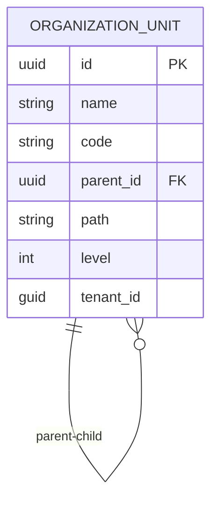
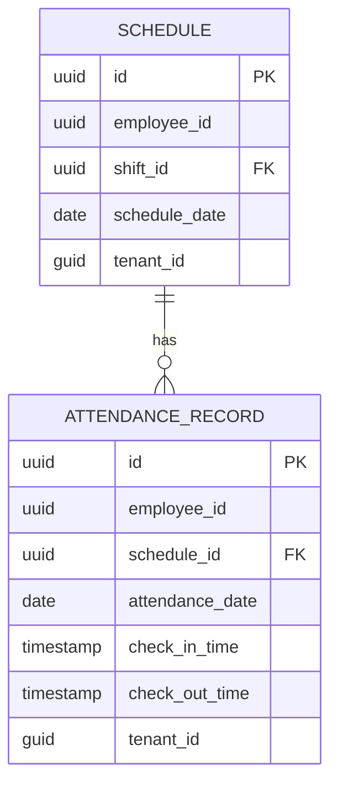
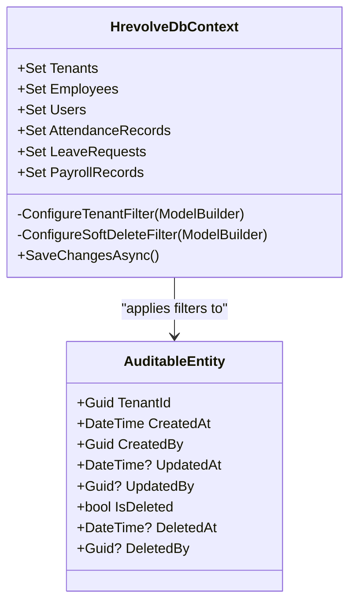

# 物理模型

<cite>
**本文档引用的文件**  
- [InitialCreate.cs](file://Backend/Hrevolve.Infrastructure/Migrations/20251227093819_InitialCreate.cs)
- [HrevolveDbContextModelSnapshot.cs](file://Backend/Hrevolve.Infrastructure/Migrations/HrevolveDbContextModelSnapshot.cs)
- [HrevolveDbContext.cs](file://Backend/Hrevolve.Infrastructure/Persistence/HrevolveDbContext.cs)
- [TenantConfiguration.cs](file://Backend/Hrevolve.Infrastructure/Persistence/Configurations/TenantConfiguration.cs)
- [EmployeeConfiguration.cs](file://Backend/Hrevolve.Infrastructure/Persistence/Configurations/EmployeeConfiguration.cs)
- [OrganizationConfiguration.cs](file://Backend/Hrevolve.Infrastructure/Persistence/Configurations/OrganizationConfiguration.cs)
- [AttendanceConfiguration.cs](file://Backend/Hrevolve.Infrastructure/Persistence/Configurations/AttendanceConfiguration.cs)
- [LeaveConfiguration.cs](file://Backend/Hrevolve.Infrastructure/Persistence/Configurations/LeaveConfiguration.cs)
- [PayrollConfiguration.cs](file://Backend/Hrevolve.Infrastructure/Persistence/Configurations/PayrollConfiguration.cs)
- [IdentityConfiguration.cs](file://Backend/Hrevolve.Infrastructure/Persistence/Configurations/IdentityConfiguration.cs)
</cite>

## 目录
1. [引言](#引言)
2. [核心表结构与字段定义](#核心表结构与字段定义)
3. [复杂关系实现](#复杂关系实现)
4. [HrevolveDbContextModelSnapshot的作用](#hrevolvedbcontextmodelsnapshot的作用)
5. [索引策略](#索引策略)
6. [多租户与软删除实现](#多租户与软删除实现)

## 引言
本文档深入分析Hrevolve系统的初始数据库迁移脚本（InitialCreate.cs）和Fluent API配置文件，详细文档化数据库的物理实现。重点针对Tenant、User、Employee、OrganizationUnit、AttendanceRecord、LeaveRequest、PayrollRecord等核心表，说明各字段的数据类型、长度、约束、默认值及索引策略。同时，解释复杂关系在数据库中的具体实现方式，并分析HrevolveDbContextModelSnapshot在迁移中的重要性。

**Section sources**
- [InitialCreate.cs](file://Backend/Hrevolve.Infrastructure/Migrations/20251227093819_InitialCreate.cs)
- [HrevolveDbContextModelSnapshot.cs](file://Backend/Hrevolve.Infrastructure/Migrations/HrevolveDbContextModelSnapshot.cs)

## 核心表结构与字段定义

### Tenant（租户）
Tenant表是多租户架构的核心，存储系统租户的基本信息。

- **Id**: `uuid`类型，主键，非空
- **Name**: `character varying(200)`类型，租户名称，非空，最大长度200
- **Code**: `character varying(50)`类型，租户代码，非空，唯一，最大长度50
- **Domain**: `character varying(200)`类型，域名，最大长度200
- **Status**: `character varying(20)`类型，状态（如Active, Inactive），非空，最大长度20
- **Plan**: `character varying(20)`类型，订阅计划，非空，最大长度20
- **ConnectionString**: `character varying(1000)`类型，数据库连接字符串，最大长度1000
- **EncryptionKey**: `character varying(500)`类型，加密密钥，最大长度500
- **Settings**: `character varying(2000)`类型，租户设置，以JSON格式存储，非空，最大长度2000
- **CreatedAt**: `timestamp with time zone`类型，创建时间，非空
- **ExpiresAt**: `timestamp with time zone`类型，过期时间，可为空

**Section sources**
- [InitialCreate.cs](file://Backend/Hrevolve.Infrastructure/Migrations/20251227093819_InitialCreate.cs#L316-L326)
- [TenantConfiguration.cs](file://Backend/Hrevolve.Infrastructure/Persistence/Configurations/TenantConfiguration.cs#L15-L45)

### User（用户）
User表存储系统用户的身份认证信息。

- **Id**: `uuid`类型，主键，非空
- **Username**: `character varying(100)`类型，用户名，非空，唯一（租户内），最大长度100
- **Email**: `character varying(256)`类型，邮箱，非空，唯一（租户内），最大长度256
- **Phone**: `character varying(20)`类型，电话，最大长度20
- **PasswordHash**: `character varying(500)`类型，密码哈希值，最大长度500
- **Status**: `character varying(20)`类型，状态，非空，最大长度20
- **EmailConfirmed**: `boolean`类型，邮箱是否已验证
- **MfaEnabled**: `boolean`类型，是否启用多因素认证
- **TotpSecret**: `character varying(500)`类型，TOTP密钥，最大长度500
- **RecoveryCodes**: `character varying(2000)`类型，恢复码，最大长度2000
- **AccessFailedCount**: `integer`类型，连续登录失败次数
- **LockoutEnd**: `timestamp with time zone`类型，锁定结束时间，可为空
- **LastLoginAt**: `timestamp with time zone`类型，最后登录时间，可为空
- **LastLoginIp**: `character varying(50)`类型，最后登录IP，最大长度50
- **EmployeeId**: `uuid`类型，关联的员工ID，可为空
- **TenantId**: `uuid`类型，租户ID，非空
- **CreatedAt**: `timestamp with time zone`类型，创建时间，非空
- **IsDeleted**: `boolean`类型，是否已软删除

**Section sources**
- [InitialCreate.cs](file://Backend/Hrevolve.Infrastructure/Migrations/20251227093819_InitialCreate.cs#L338-L358)
- [IdentityConfiguration.cs](file://Backend/Hrevolve.Infrastructure/Persistence/Configurations/IdentityConfiguration.cs#L13-L38)

### Employee（员工）
Employee表存储员工的核心信息。

- **Id**: `uuid`类型，主键，非空
- **EmployeeNumber**: `character varying(50)`类型，员工编号，非空，唯一（租户内），最大长度50
- **FirstName**: `character varying(50)`类型，名，非空，最大长度50
- **LastName**: `character varying(50)`类型，姓，非空，最大长度50
- **EnglishName**: `character varying(100)`类型，英文名，最大长度100
- **Gender**: `character varying(10)`类型，性别，非空，最大长度10
- **DateOfBirth**: `date`类型，出生日期，非空
- **IdCardNumber**: `character varying(500)`类型，身份证号，最大长度500
- **Email**: `character varying(256)`类型，工作邮箱，最大长度256
- **Phone**: `character varying(20)`类型，电话，最大长度20
- **PersonalEmail**: `character varying(256)`类型，个人邮箱，最大长度256
- **Address**: `character varying(500)`类型，地址，最大长度500
- **Status**: `character varying(20)`类型，状态（如Active, Inactive），非空，最大长度20
- **EmploymentType**: `character varying(20)`类型，雇佣类型，非空，最大长度20
- **HireDate**: `date`类型，入职日期，非空
- **TerminationDate**: `date`类型，离职日期，可为空
- **ProbationEndDate**: `date`类型，试用期结束日期，可为空
- **UserId**: `uuid`类型，关联的用户ID，可为空
- **DirectManagerId**: `uuid`类型，直属上级ID，可为空，外键指向Employees表
- **TenantId**: `uuid`类型，租户ID，非空
- **CreatedAt**: `timestamp with time zone`类型，创建时间，非空

**Section sources**
- [InitialCreate.cs](file://Backend/Hrevolve.Infrastructure/Migrations/20251227093819_InitialCreate.cs#L45-L68)
- [EmployeeConfiguration.cs](file://Backend/Hrevolve.Infrastructure/Persistence/Configurations/EmployeeConfiguration.cs#L13-L62)

### OrganizationUnit（组织单元）
OrganizationUnit表存储组织架构信息，支持树形层级结构。

- **Id**: `uuid`类型，主键，非空
- **Name**: `character varying(100)`类型，名称，非空，最大长度100
- **Code**: `character varying(50)`类型，代码，非空，唯一（租户内），最大长度50
- **Description**: `character varying(500)`类型，描述，最大长度500
- **ParentId**: `uuid`类型，父级组织单元ID，可为空，外键指向OrganizationUnits表
- **Path**: `character varying(1000)`类型，层级路径（如/1/2/3），非空，最大长度1000
- **Level**: `integer`类型，层级深度
- **SortOrder**: `integer`类型，排序序号
- **Type**: `character varying(20)`类型，类型（如Department, Division），非空，最大长度20
- **IsActive**: `boolean`类型，是否激活
- **ManagerId**: `uuid`类型，负责人ID，可为空
- **TenantId**: `uuid`类型，租户ID，非空

**Section sources**
- [InitialCreate.cs](file://Backend/Hrevolve.Infrastructure/Migrations/20251227093819_InitialCreate.cs#L171-L187)
- [OrganizationConfiguration.cs](file://Backend/Hrevolve.Infrastructure/Persistence/Configurations/OrganizationConfiguration.cs#L13-L40)

### AttendanceRecord（考勤记录）
AttendanceRecord表存储员工的每日考勤记录。

- **Id**: `uuid`类型，主键，非空
- **EmployeeId**: `uuid`类型，员工ID，非空
- **AttendanceDate**: `date`类型，考勤日期，非空
- **ScheduleId**: `uuid`类型，排班ID，可为空，外键指向Schedules表，删除时设为NULL
- **CheckInTime**: `timestamp with time zone`类型，上班打卡时间，可为空
- **CheckOutTime**: `timestamp with time zone`类型，下班打卡时间，可为空
- **CheckInMethod**: `character varying(20)`类型，打卡方式，最大长度20
- **CheckOutMethod**: `character varying(20)`类型，打卡方式，最大长度20
- **CheckInLocation**: `character varying(200)`类型，打卡位置，最大长度200
- **CheckOutLocation**: `character varying(200)`类型，打卡位置，最大长度200
- **Status**: `character varying(20)`类型，状态（如Present, Absent），非空，最大长度20
- **LateMinutes**: `integer`类型，迟到分钟数
- **EarlyLeaveMinutes**: `integer`类型，早退分钟数
- **ActualHours**: `numeric(5,2)`类型，实际工时
- **OvertimeHours**: `numeric(5,2)`类型，加班工时
- **Remarks**: `character varying(500)`类型，备注，最大长度500
- **IsApproved**: `boolean`类型，是否已批准
- **ApprovedBy**: `uuid`类型，批准人ID，可为空
- **ApprovedAt**: `timestamp with time zone`类型，批准时间，可为空
- **TenantId**: `uuid`类型，租户ID，非空

**Section sources**
- [InitialCreate.cs](file://Backend/Hrevolve.Infrastructure/Migrations/20251227093819_InitialCreate.cs#L757-L782)
- [AttendanceConfiguration.cs](file://Backend/Hrevolve.Infrastructure/Persistence/Configurations/AttendanceConfiguration.cs#L67-L102)

### LeaveRequest（请假申请）
LeaveRequest表存储员工的请假申请。

- **Id**: `uuid`类型，主键，非空
- **EmployeeId**: `uuid`类型，员工ID，非空
- **LeaveTypeId**: `uuid`类型，请假类型ID，非空，外键指向LeaveTypes表
- **StartDate**: `date`类型，开始日期，非空
- **EndDate**: `date`类型，结束日期，非空
- **StartDayPart**: `character varying(20)`类型，开始时段，非空，最大长度20
- **EndDayPart**: `character varying(20)`类型，结束时段，非空，最大长度20
- **TotalDays**: `numeric(5,2)`类型，总天数
- **Reason**: `character varying(1000)`类型，事由，非空，最大长度1000
- **Attachments**: `character varying(2000)`类型，附件URL，最大长度2000
- **Status**: `character varying(20)`类型，状态，非空，最大长度20
- **CancelReason**: `character varying(500)`类型，取消原因，最大长度500
- **TenantId**: `uuid`类型，租户ID，非空
- **CreatedAt**: `timestamp with time zone`类型，创建时间，非空

**Section sources**
- [InitialCreate.cs](file://Backend/Hrevolve.Infrastructure/Migrations/20251227093819_InitialCreate.cs#L489-L507)
- [LeaveConfiguration.cs](file://Backend/Hrevolve.Infrastructure/Persistence/Configurations/LeaveConfiguration.cs#L82-L105)

### PayrollRecord（薪酬记录）
PayrollRecord表存储员工的薪酬计算结果。

- **Id**: `uuid`类型，主键，非空
- **EmployeeId**: `uuid`类型，员工ID，非空
- **PayrollPeriodId**: `uuid`类型，薪酬周期ID，非空，外键指向PayrollPeriods表
- **BaseSalary**: `numeric(18,2)`类型，基本工资
- **GrossSalary**: `numeric(18,2)`类型，应发工资
- **TotalDeductions**: `numeric(18,2)`类型，总扣款
- **NetSalary**: `numeric(18,2)`类型，实发工资
- **IncomeTax**: `numeric(18,2)`类型，所得税
- **SocialInsuranceEmployee**: `numeric(18,2)`类型，社保个人部分
- **SocialInsuranceEmployer**: `numeric(18,2)`类型，社保公司部分
- **HousingFundEmployee**: `numeric(18,2)`类型，公积金个人部分
- **HousingFundEmployer**: `numeric(18,2)`类型，公积金公司部分
- **Status**: `character varying(20)`类型，状态，非空，最大长度20
- **CalculatedAt**: `timestamp with time zone`类型，计算时间，可为空
- **CalculationLog**: `text`类型，计算日志
- **DataSnapshot**: `text`类型，数据快照
- **TenantId**: `uuid`类型，租户ID，非空
- **CreatedAt**: `timestamp with time zone`类型，创建时间，非空

**Section sources**
- [InitialCreate.cs](file://Backend/Hrevolve.Infrastructure/Migrations/20251227093819_InitialCreate.cs#L559-L581)
- [PayrollConfiguration.cs](file://Backend/Hrevolve.Infrastructure/Persistence/Configurations/PayrollConfiguration.cs#L76-L103)

## 复杂关系实现

### 员工与组织单元的层级路径
组织单元（OrganizationUnit）表通过`ParentId`和`Path`字段实现树形层级结构。`ParentId`作为外键指向父级组织单元，形成父子关系。`Path`字段存储从根节点到当前节点的完整路径（如/1/2/3），便于高效查询子树和层级关系。Fluent API配置中，通过`HasOne(o => o.Parent).WithMany(o => o.Children)`定义了自引用的一对多关系。

**Diagram sources**
- [InitialCreate.cs](file://Backend/Hrevolve.Infrastructure/Migrations/20251227093819_InitialCreate.cs#L174-L175)
- [OrganizationConfiguration.cs](file://Backend/Hrevolve.Infrastructure/Persistence/Configurations/OrganizationConfiguration.cs#L40-L43)

### 考勤记录与班次的关联
考勤记录（AttendanceRecord）与排班（Schedule）通过`ScheduleId`字段关联。`ScheduleId`是外键，指向Schedules表。当排班记录被删除时，相关考勤记录的`ScheduleId`被设为NULL（`OnDelete(DeleteBehavior.SetNull)`），实现了弱关联，保证了历史考勤数据的完整性。一个排班记录可以对应多个考勤记录（如班次调整后的历史记录）。

**Diagram sources**
- [InitialCreate.cs](file://Backend/Hrevolve.Infrastructure/Migrations/20251227093819_InitialCreate.cs#L788-L792)
- [AttendanceConfiguration.cs](file://Backend/Hrevolve.Infrastructure/Persistence/Configurations/AttendanceConfiguration.cs#L99-L102)

## HrevolveDbContextModelSnapshot的作用
`HrevolveDbContextModelSnapshot`是Entity Framework Core生成的快照类，其主要作用是：

1. **迁移一致性**：存储了`HrevolveDbContext`的完整模型定义，包括所有实体、属性、关系和约束。当执行迁移时，EF Core会将当前模型与快照中的模型进行比较，以确定需要生成的迁移脚本。
2. **增量迁移**：确保每次生成的迁移只包含自上次迁移以来模型的变更，而不是整个数据库的重新创建。
3. **模型验证**：在运行时，EF Core可以使用快照来验证当前模型与数据库结构的一致性。
4. **设计时工具支持**：为`Add-Migration`和`Update-Database`等命令提供必要的元数据。

该类通过`BuildModel`方法使用Fluent API重新构建了整个模型，其内容与`InitialCreate.Designer.cs`文件中的`BuildTargetModel`方法高度一致，确保了代码与数据库结构的同步。

**Section sources**
- [HrevolveDbContextModelSnapshot.cs](file://Backend/Hrevolve.Infrastructure/Migrations/HrevolveDbContextModelSnapshot.cs)
- [20251227093819_InitialCreate.Designer.cs](file://Backend/Hrevolve.Infrastructure/Migrations/20251227093819_InitialCreate.Designer.cs)

## 索引策略
数据库为关键查询场景设计了高效的索引策略：

- **唯一索引**：在`Tenant.Code`、`User.Username`、`User.Email`、`Employee.EmployeeNumber`等字段上创建唯一索引，确保业务关键字段的唯一性。
- **复合索引**：在`AttendanceRecord(TenantId, EmployeeId, AttendanceDate)`上创建唯一复合索引，确保租户内每个员工每天只有一条考勤记录。
- **查询优化索引**：在`AttendanceRecord(TenantId, AttendanceDate, Status)`上创建索引，优化按日期和状态查询考勤的性能。
- **外键索引**：为所有外键字段（如`Employee.DirectManagerId`、`AttendanceRecord.ScheduleId`）创建索引，加速JOIN操作和级联删除。
- **审计索引**：在`AuditLog(TenantId, Timestamp)`上创建索引，支持按时间范围查询审计日志。

这些索引策略显著提升了数据查询、约束检查和关系导航的性能。

**Section sources**
- [InitialCreate.cs](file://Backend/Hrevolve.Infrastructure/Migrations/20251227093819_InitialCreate.cs)
- [HrevolveDbContextModelSnapshot.cs](file://Backend/Hrevolve.Infrastructure/Migrations/HrevolveDbContextModelSnapshot.cs)

## 多租户与软删除实现
系统通过全局查询过滤器（Global Query Filters）实现了多租户隔离和软删除：

- **多租户隔离**：在`HrevolveDbContext`中，`ConfigureTenantFilter`方法为所有继承自`AuditableEntity`的实体添加了`TenantId`过滤器。这意味着所有查询都会自动包含`WHERE TenantId = @currentTenantId`条件，确保租户间数据隔离。
- **软删除**：`ConfigureSoftDeleteFilter`方法为所有实体添加了`!IsDeleted`过滤器。当实体被“删除”时，`IsDeleted`字段被设为`true`，但数据仍保留在数据库中。查询时自动过滤掉已删除的记录，实现了软删除功能。
- **审计字段**：通过重写`SaveChangesAsync`方法，在创建、修改和删除操作时自动填充`CreatedAt`、`CreatedBy`、`UpdatedAt`、`UpdatedBy`、`DeletedAt`、`DeletedBy`等审计字段。

**Diagram sources**
- [HrevolveDbContext.cs](file://Backend/Hrevolve.Infrastructure/Persistence/HrevolveDbContext.cs#L77-L118)
- [HrevolveDbContext.cs](file://Backend/Hrevolve.Infrastructure/Persistence/HrevolveDbContext.cs#L120-L155)