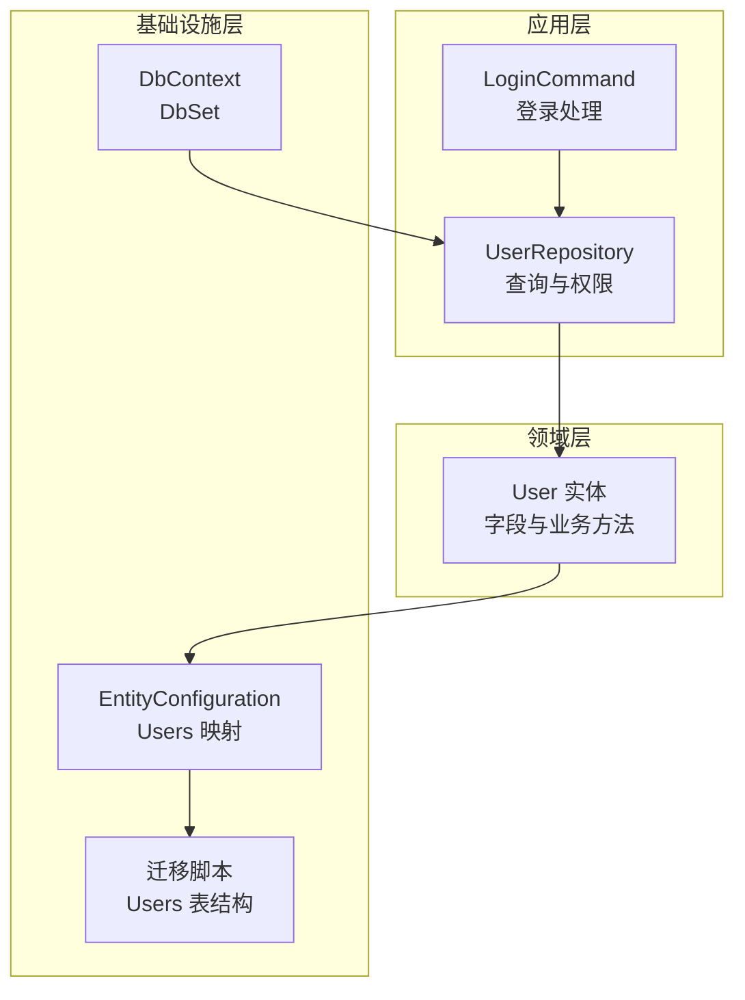
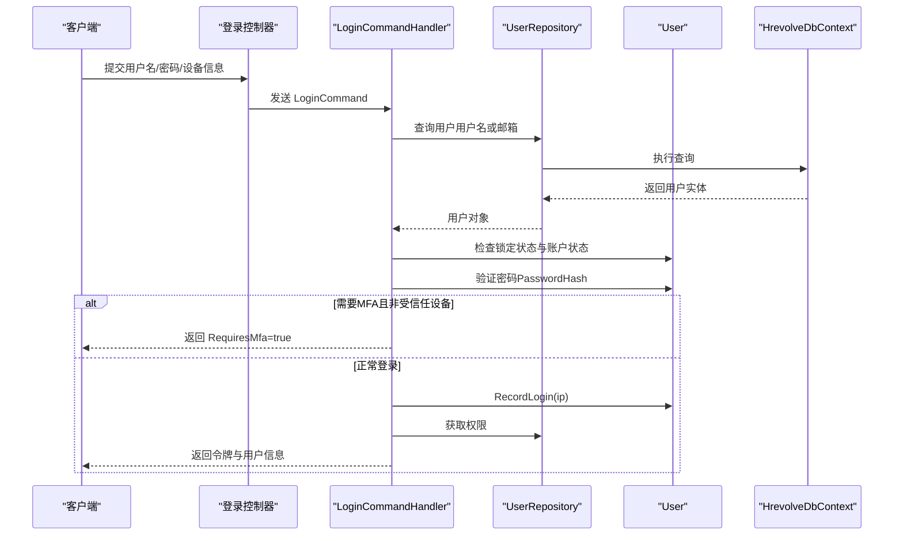
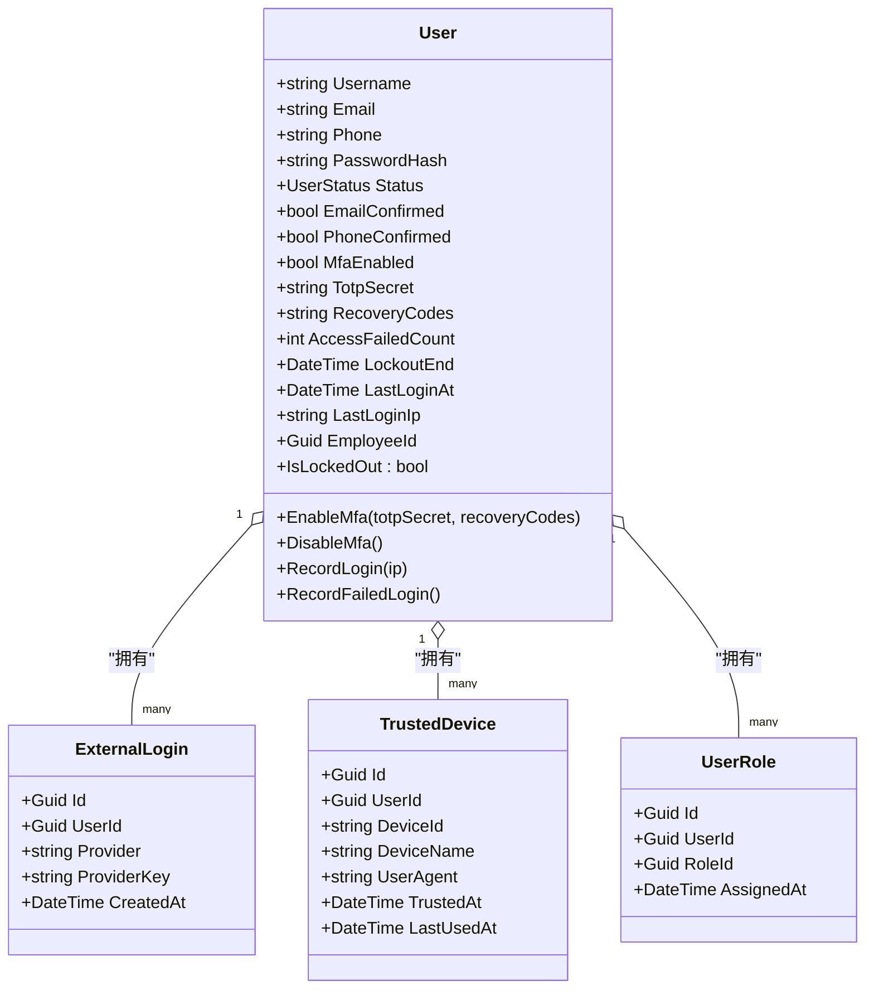
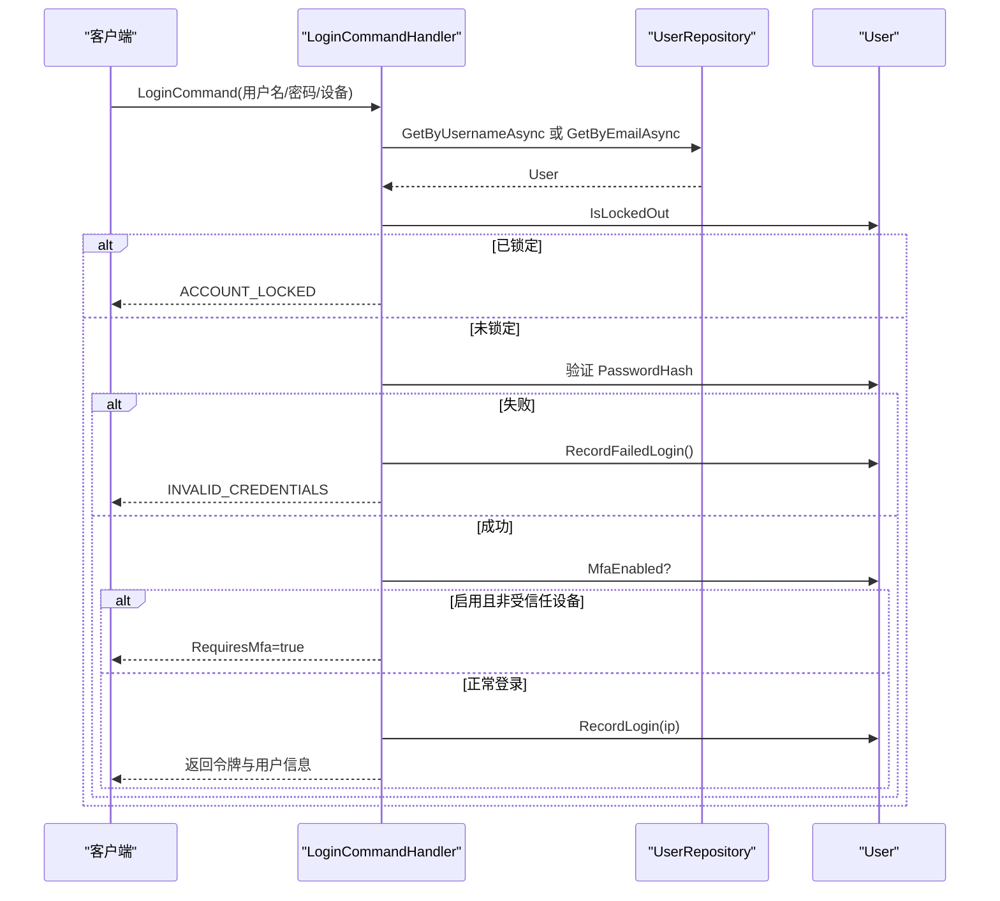
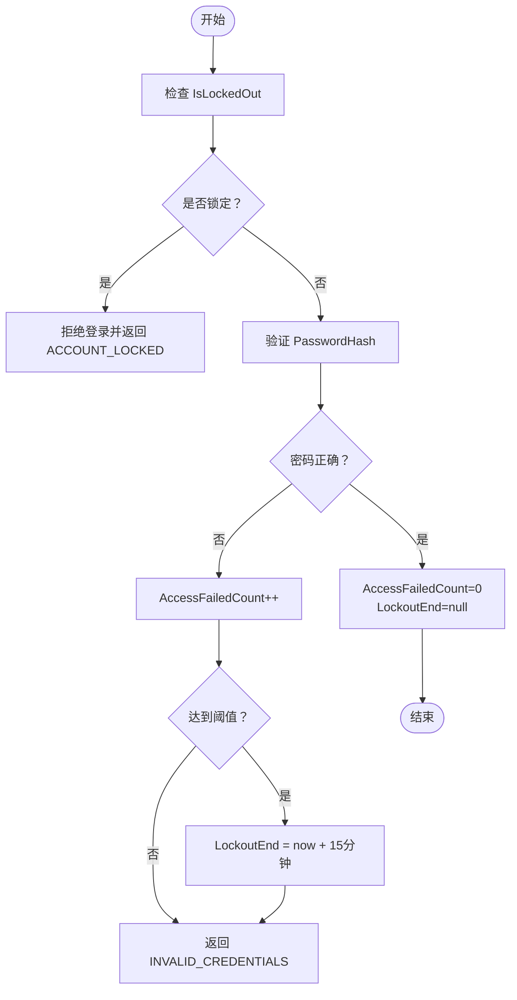
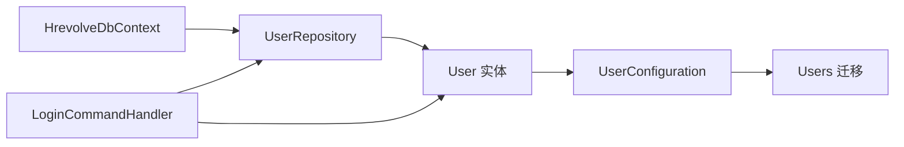

# 用户表 (Users)

<cite>
**本文引用的文件列表**
- [User.cs](file://Backend/Hrevolve.Domain/Identity/User.cs)
- [IdentityConfiguration.cs](file://Backend/Hrevolve.Infrastructure/Persistence/Configurations/IdentityConfiguration.cs)
- [20251227093819_InitialCreate.cs](file://Backend/Hrevolve.Infrastructure/Migrations/20251227093819_InitialCreate.cs)
- [LoginCommand.cs](file://Backend/Hrevolve.Application/Identity/Commands/LoginCommand.cs)
- [UserRepository.cs](file://Backend/Hrevolve.Infrastructure/Persistence/Repositories/UserRepository.cs)
- [HrevolveDbContext.cs](file://Backend/Hrevolve.Infrastructure/Persistence/HrevolveDbContext.cs)
</cite>

## 目录
1. [简介](#简介)
2. [项目结构](#项目结构)
3. [核心组件](#核心组件)
4. [架构总览](#架构总览)
5. [详细组件分析](#详细组件分析)
6. [依赖关系分析](#依赖关系分析)
7. [性能考量](#性能考量)
8. [故障排查指南](#故障排查指南)
9. [结论](#结论)

## 简介
本文件聚焦于系统中“用户”数据模型，围绕 Users 表展开，深入解析以下身份认证相关字段：
- Username：用户名
- Email：邮箱
- PasswordHash：密码哈希（BCrypt）
- MfaEnabled：是否启用多因素认证（MFA）
- TotpSecret：TOTP 密钥（加密存储）
- RecoveryCodes：备用恢复代码（加密存储）
- EmailConfirmed、PhoneConfirmed：账户激活流程中的确认字段
- AccessFailedCount、LockoutEnd：账户锁定安全机制

同时，结合应用层登录流程与仓储查询逻辑，说明这些字段在认证与安全控制中的作用与协作方式。

## 项目结构
Users 表的定义由三层共同构成：
- 领域层：User 实体定义字段与行为
- 基础设施层：EF Core 映射配置与数据库迁移
- 应用层：登录命令处理与仓储接口

图表来源
- [User.cs](file://Backend/Hrevolve.Domain/Identity/User.cs#L1-L141)
- [IdentityConfiguration.cs](file://Backend/Hrevolve.Infrastructure/Persistence/Configurations/IdentityConfiguration.cs#L1-L69)
- [20251227093819_InitialCreate.cs](file://Backend/Hrevolve.Infrastructure/Migrations/20251227093819_InitialCreate.cs#L333-L365)
- [HrevolveDbContext.cs](file://Backend/Hrevolve.Infrastructure/Persistence/HrevolveDbContext.cs#L35-L35)
- [LoginCommand.cs](file://Backend/Hrevolve.Application/Identity/Commands/LoginCommand.cs#L51-L119)
- [UserRepository.cs](file://Backend/Hrevolve.Infrastructure/Persistence/Repositories/UserRepository.cs#L1-L68)

章节来源
- [User.cs](file://Backend/Hrevolve.Domain/Identity/User.cs#L1-L141)
- [IdentityConfiguration.cs](file://Backend/Hrevolve.Infrastructure/Persistence/Configurations/IdentityConfiguration.cs#L1-L69)
- [20251227093819_InitialCreate.cs](file://Backend/Hrevolve.Infrastructure/Migrations/20251227093819_InitialCreate.cs#L333-L365)
- [HrevolveDbContext.cs](file://Backend/Hrevolve.Infrastructure/Persistence/HrevolveDbContext.cs#L35-L35)
- [LoginCommand.cs](file://Backend/Hrevolve.Application/Identity/Commands/LoginCommand.cs#L51-L119)
- [UserRepository.cs](file://Backend/Hrevolve.Infrastructure/Persistence/Repositories/UserRepository.cs#L1-L68)

## 核心组件
- User 实体：包含 Username、Email、PasswordHash、EmailConfirmed、PhoneConfirmed、MfaEnabled、TotpSecret、RecoveryCodes、AccessFailedCount、LockoutEnd 等字段，并提供设置密码、启用/禁用 MFA、记录登录与失败、判断锁定等业务方法。
- EF Core 映射：通过 UserConfiguration 将实体属性映射到 Users 表列，设置长度、唯一索引与外键关系。
- 数据库迁移：迁移脚本定义 Users 表的完整列结构与索引。
- 登录命令：应用层 LoginCommand 在认证前检查锁定状态与账户状态，验证密码后根据 MfaEnabled 与受信任设备策略决定是否要求二次验证。
- 用户仓储：UserRepository 提供按用户名/邮箱查询、获取权限等能力。

章节来源
- [User.cs](file://Backend/Hrevolve.Domain/Identity/User.cs#L1-L141)
- [IdentityConfiguration.cs](file://Backend/Hrevolve.Infrastructure/Persistence/Configurations/IdentityConfiguration.cs#L1-L69)
- [20251227093819_InitialCreate.cs](file://Backend/Hrevolve.Infrastructure/Migrations/20251227093819_InitialCreate.cs#L333-L365)
- [LoginCommand.cs](file://Backend/Hrevolve.Application/Identity/Commands/LoginCommand.cs#L51-L119)
- [UserRepository.cs](file://Backend/Hrevolve.Infrastructure/Persistence/Repositories/UserRepository.cs#L1-L68)

## 架构总览
Users 表在系统中的位置与交互如下：

图表来源
- [LoginCommand.cs](file://Backend/Hrevolve.Application/Identity/Commands/LoginCommand.cs#L51-L119)
- [UserRepository.cs](file://Backend/Hrevolve.Infrastructure/Persistence/Repositories/UserRepository.cs#L1-L68)
- [User.cs](file://Backend/Hrevolve.Domain/Identity/User.cs#L103-L120)
- [HrevolveDbContext.cs](file://Backend/Hrevolve.Infrastructure/Persistence/HrevolveDbContext.cs#L35-L35)

## 详细组件分析

### 字段设计与实现要点

- Username（用户名）
  - 领域层：字符串，必填；创建时初始化。
  - 映射层：最大长度 100，必填；与 TenantId 组合唯一索引。
  - 用途：登录凭据之一，支持用户名或邮箱登录。
  - 章节来源
    - [User.cs](file://Backend/Hrevolve.Domain/Identity/User.cs#L10-L10)
    - [IdentityConfiguration.cs](file://Backend/Hrevolve.Infrastructure/Persistence/Configurations/IdentityConfiguration.cs#L13-L16)
    - [20251227093819_InitialCreate.cs](file://Backend/Hrevolve.Infrastructure/Migrations/20251227093819_InitialCreate.cs#L338-L338)

- Email（邮箱）
  - 领域层：字符串，必填；创建时转换为小写。
  - 映射层：最大长度 256，必填；与 TenantId 组合唯一索引。
  - 用途：登录凭据之一，支持用户名或邮箱登录。
  - 章节来源
    - [User.cs](file://Backend/Hrevolve.Domain/Identity/User.cs#L10-L12)
    - [IdentityConfiguration.cs](file://Backend/Hrevolve.Infrastructure/Persistence/Configurations/IdentityConfiguration.cs#L17-L20)
    - [20251227093819_InitialCreate.cs](file://Backend/Hrevolve.Infrastructure/Migrations/20251227093819_InitialCreate.cs#L339-L339)

- PasswordHash（密码哈希）
  - 领域层：字符串，可空；通过 SetPassword 设置。
  - 映射层：最大长度 500；类型为 character varying(500)。
  - 用途：登录时验证密码（示例中以字符串比较演示，实际应使用 BCrypt）。
  - 章节来源
    - [User.cs](file://Backend/Hrevolve.Domain/Identity/User.cs#L17-L17)
    - [IdentityConfiguration.cs](file://Backend/Hrevolve.Infrastructure/Persistence/Configurations/IdentityConfiguration.cs#L24-L26)
    - [20251227093819_InitialCreate.cs](file://Backend/Hrevolve.Infrastructure/Migrations/20251227093819_InitialCreate.cs#L341-L341)
    - [LoginCommand.cs](file://Backend/Hrevolve.Application/Identity/Commands/LoginCommand.cs#L121-L126)

- EmailConfirmed（邮箱已确认）
  - 领域层：布尔值，默认 false。
  - 映射层：布尔类型；与 PhoneConfirmed 同属账户激活确认。
  - 用途：配合注册/重置流程标记邮箱已验证，影响后续业务校验。
  - 章节来源
    - [User.cs](file://Backend/Hrevolve.Domain/Identity/User.cs#L19-L21)
    - [20251227093819_InitialCreate.cs](file://Backend/Hrevolve.Infrastructure/Migrations/20251227093819_InitialCreate.cs#L343-L343)

- PhoneConfirmed（手机已确认）
  - 领域层：布尔值，默认 false。
  - 映射层：布尔类型。
  - 用途：配合注册/重置流程标记手机号已验证，影响后续业务校验。
  - 章节来源
    - [User.cs](file://Backend/Hrevolve.Domain/Identity/User.cs#L19-L21)
    - [20251227093819_InitialCreate.cs](file://Backend/Hrevolve.Infrastructure/Migrations/20251227093819_InitialCreate.cs#L344-L344)

- MfaEnabled（启用 MFA）
  - 领域层：布尔值，默认 false；通过 EnableMfa/DisableMfa 设置。
  - 映射层：布尔类型。
  - 用途：登录时若启用且非受信任设备，返回 RequiresMfa=true，引导进行二次验证。
  - 章节来源
    - [User.cs](file://Backend/Hrevolve.Domain/Identity/User.cs#L26-L31)
    - [IdentityConfiguration.cs](file://Backend/Hrevolve.Infrastructure/Persistence/Configurations/IdentityConfiguration.cs#L1-L69)
    - [20251227093819_InitialCreate.cs](file://Backend/Hrevolve.Infrastructure/Migrations/20251227093819_InitialCreate.cs#L345-L345)
    - [LoginCommand.cs](file://Backend/Hrevolve.Application/Identity/Commands/LoginCommand.cs#L81-L98)

- TotpSecret（TOTP 密钥）
  - 领域层：字符串，可空；与 EnableMfa 联动设置。
  - 映射层：最大长度 500；类型为 character varying(500)。
  - 用途：MFA 二次验证的核心密钥，需加密存储。
  - 章节来源
    - [User.cs](file://Backend/Hrevolve.Domain/Identity/User.cs#L31-L31)
    - [IdentityConfiguration.cs](file://Backend/Hrevolve.Infrastructure/Persistence/Configurations/IdentityConfiguration.cs#L27-L29)
    - [20251227093819_InitialCreate.cs](file://Backend/Hrevolve.Infrastructure/Migrations/20251227093819_InitialCreate.cs#L346-L346)

- RecoveryCodes（备用恢复代码）
  - 领域层：字符串，可空；与 EnableMfa 联动设置。
  - 映射层：最大长度 2000；类型为 character varying(2000)。
  - 用途：MFA 恢复场景下的一次性或有限次恢复凭证，需加密存储。
  - 章节来源
    - [User.cs](file://Backend/Hrevolve.Domain/Identity/User.cs#L36-L36)
    - [IdentityConfiguration.cs](file://Backend/Hrevolve.Infrastructure/Persistence/Configurations/IdentityConfiguration.cs#L30-L32)
    - [20251227093819_InitialCreate.cs](file://Backend/Hrevolve.Infrastructure/Migrations/20251227093819_InitialCreate.cs#L347-L347)

- AccessFailedCount（登录失败次数）
  - 领域层：整型，默认 0；失败时自增，成功时清零。
  - 映射层：整数类型。
  - 用途：触发账户锁定阈值（达到阈值后设置 LockoutEnd）。
  - 章节来源
    - [User.cs](file://Backend/Hrevolve.Domain/Identity/User.cs#L41-L41)
    - [IdentityConfiguration.cs](file://Backend/Hrevolve.Infrastructure/Persistence/Configurations/IdentityConfiguration.cs#L1-L69)
    - [20251227093819_InitialCreate.cs](file://Backend/Hrevolve.Infrastructure/Migrations/20251227093819_InitialCreate.cs#L348-L348)

- LockoutEnd（锁定结束时间）
  - 领域层：日期时间，可空；IsLockedOut 基于当前时间判断。
  - 映射层：timestamp with time zone。
  - 用途：登录前检查是否处于锁定期内，阻止登录。
  - 章节来源
    - [User.cs](file://Backend/Hrevolve.Domain/Identity/User.cs#L46-L46)
    - [User.cs](file://Backend/Hrevolve.Domain/Identity/User.cs#L119-L120)
    - [IdentityConfiguration.cs](file://Backend/Hrevolve.Infrastructure/Persistence/Configurations/IdentityConfiguration.cs#L1-L69)
    - [20251227093819_InitialCreate.cs](file://Backend/Hrevolve.Infrastructure/Migrations/20251227093819_InitialCreate.cs#L349-L349)
    - [LoginCommand.cs](file://Backend/Hrevolve.Application/Identity/Commands/LoginCommand.cs#L63-L66)

- LastLoginAt、LastLoginIp（最近登录信息）
  - 领域层：LastLoginAt 与 LastLoginIp 分别记录最近登录时间与 IP。
  - 映射层：LastLoginAt 与 LastLoginIp 对应 timestamp 与 varchar(50)。
  - 用途：登录成功时更新，便于审计与风控。
  - 章节来源
    - [User.cs](file://Backend/Hrevolve.Domain/Identity/User.cs#L48-L49)
    - [IdentityConfiguration.cs](file://Backend/Hrevolve.Infrastructure/Persistence/Configurations/IdentityConfiguration.cs#L37-L39)
    - [20251227093819_InitialCreate.cs](file://Backend/Hrevolve.Infrastructure/Migrations/20251227093819_InitialCreate.cs#L350-L351)

- EmployeeId（关联员工 ID）
  - 领域层：Guid，可空；LinkEmployee 关联员工。
  - 映射层：uuid，可空；存在与 TenantId 的组合索引。
  - 用途：将用户与员工记录关联，支持单点登录与权限继承。
  - 章节来源
    - [User.cs](file://Backend/Hrevolve.Domain/Identity/User.cs#L54-L54)
    - [IdentityConfiguration.cs](file://Backend/Hrevolve.Infrastructure/Persistence/Configurations/IdentityConfiguration.cs#L47-L48)
    - [20251227093819_InitialCreate.cs](file://Backend/Hrevolve.Infrastructure/Migrations/20251227093819_InitialCreate.cs#L352-L352)

- Status（账户状态）
  - 领域层：枚举 UserStatus（Active/Inactive/Suspended）。
  - 映射层：字符串，最大长度 20；转换为字符串存储。
  - 用途：登录前检查账户状态，禁用账户不可登录。
  - 章节来源
    - [User.cs](file://Backend/Hrevolve.Domain/Identity/User.cs#L18-L18)
    - [IdentityConfiguration.cs](file://Backend/Hrevolve.Infrastructure/Persistence/Configurations/IdentityConfiguration.cs#L33-L36)
    - [20251227093819_InitialCreate.cs](file://Backend/Hrevolve.Infrastructure/Migrations/20251227093819_InitialCreate.cs#L342-L342)

### 字段关系图（类图）

图表来源
- [User.cs](file://Backend/Hrevolve.Domain/Identity/User.cs#L1-L141)
- [User.cs](file://Backend/Hrevolve.Domain/Identity/User.cs#L150-L194)

章节来源
- [User.cs](file://Backend/Hrevolve.Domain/Identity/User.cs#L1-L141)
- [User.cs](file://Backend/Hrevolve.Domain/Identity/User.cs#L150-L194)

### 登录流程与字段联动（序列图）

图表来源
- [LoginCommand.cs](file://Backend/Hrevolve.Application/Identity/Commands/LoginCommand.cs#L51-L119)
- [UserRepository.cs](file://Backend/Hrevolve.Infrastructure/Persistence/Repositories/UserRepository.cs#L27-L44)
- [User.cs](file://Backend/Hrevolve.Domain/Identity/User.cs#L103-L120)

章节来源
- [LoginCommand.cs](file://Backend/Hrevolve.Application/Identity/Commands/LoginCommand.cs#L51-L119)
- [UserRepository.cs](file://Backend/Hrevolve.Infrastructure/Persistence/Repositories/UserRepository.cs#L27-L44)
- [User.cs](file://Backend/Hrevolve.Domain/Identity/User.cs#L103-L120)

### 账户锁定机制（流程图）

图表来源
- [User.cs](file://Backend/Hrevolve.Domain/Identity/User.cs#L111-L118)
- [User.cs](file://Backend/Hrevolve.Domain/Identity/User.cs#L103-L109)
- [LoginCommand.cs](file://Backend/Hrevolve.Application/Identity/Commands/LoginCommand.cs#L63-L79)

章节来源
- [User.cs](file://Backend/Hrevolve.Domain/Identity/User.cs#L111-L118)
- [User.cs](file://Backend/Hrevolve.Domain/Identity/User.cs#L103-L109)
- [LoginCommand.cs](file://Backend/Hrevolve.Application/Identity/Commands/LoginCommand.cs#L63-L79)

### MFA 恢复场景设计
- RecoveryCodes 字段用于在用户无法访问 TOTP 设备时进行一次性或有限次恢复登录。
- 建议：
  - RecoveryCodes 存储为加密文本，避免明文泄露。
  - 使用一次性消费机制，每次使用后立即失效并生成新的恢复码集合。
  - 限制 RecoveryCodes 的使用次数与有效期，防止滥用。
- 本仓库中 RecoveryCodes 字段已具备相应映射与长度约束，具体消费逻辑需在应用层进一步完善。

章节来源
- [User.cs](file://Backend/Hrevolve.Domain/Identity/User.cs#L36-L36)
- [IdentityConfiguration.cs](file://Backend/Hrevolve.Infrastructure/Persistence/Configurations/IdentityConfiguration.cs#L30-L32)
- [20251227093819_InitialCreate.cs](file://Backend/Hrevolve.Infrastructure/Migrations/20251227093819_InitialCreate.cs#L347-L347)

## 依赖关系分析
- User 实体依赖 AuditableEntity（审计字段），并维护 ExternalLogin、UserRole、TrustedDevice 关联集合。
- EF Core 映射通过 UserConfiguration 将实体属性映射到 Users 表，并建立唯一索引与外键级联删除。
- DbContext 暴露 DbSet<User>，仓储基于此进行查询与权限聚合。
- 登录命令处理器依赖仓储获取用户并执行认证与 MFA 判定。

图表来源
- [User.cs](file://Backend/Hrevolve.Domain/Identity/User.cs#L1-L141)
- [IdentityConfiguration.cs](file://Backend/Hrevolve.Infrastructure/Persistence/Configurations/IdentityConfiguration.cs#L1-L69)
- [20251227093819_InitialCreate.cs](file://Backend/Hrevolve.Infrastructure/Migrations/20251227093819_InitialCreate.cs#L333-L365)
- [HrevolveDbContext.cs](file://Backend/Hrevolve.Infrastructure/Persistence/HrevolveDbContext.cs#L35-L35)
- [UserRepository.cs](file://Backend/Hrevolve.Infrastructure/Persistence/Repositories/UserRepository.cs#L1-L68)
- [LoginCommand.cs](file://Backend/Hrevolve.Application/Identity/Commands/LoginCommand.cs#L51-L119)

章节来源
- [User.cs](file://Backend/Hrevolve.Domain/Identity/User.cs#L1-L141)
- [IdentityConfiguration.cs](file://Backend/Hrevolve.Infrastructure/Persistence/Configurations/IdentityConfiguration.cs#L1-L69)
- [20251227093819_InitialCreate.cs](file://Backend/Hrevolve.Infrastructure/Migrations/20251227093819_InitialCreate.cs#L333-L365)
- [HrevolveDbContext.cs](file://Backend/Hrevolve.Infrastructure/Persistence/HrevolveDbContext.cs#L35-L35)
- [UserRepository.cs](file://Backend/Hrevolve.Infrastructure/Persistence/Repositories/UserRepository.cs#L1-L68)
- [LoginCommand.cs](file://Backend/Hrevolve.Application/Identity/Commands/LoginCommand.cs#L51-L119)

## 性能考量
- 唯一索引：Users 表对 TenantId+Username 与 TenantId+Email 建有唯一索引，确保登录凭据唯一性与查询效率。
- 复合索引：TenantId+EmployeeId 有利于员工关联查询。
- 字段长度：PasswordHash、TotpSecret、RecoveryCodes 设置了较大长度，满足加密存储需求；IP 与状态字段长度合理，兼顾性能与扩展性。
- 登录路径：LoginCommand 先按用户名/邮箱快速定位用户，再进行密码与 MFA 判定，减少不必要的复杂查询。

章节来源
- [IdentityConfiguration.cs](file://Backend/Hrevolve.Infrastructure/Persistence/Configurations/IdentityConfiguration.cs#L41-L48)
- [20251227093819_InitialCreate.cs](file://Backend/Hrevolve.Infrastructure/Migrations/20251227093819_InitialCreate.cs#L1049-L1063)
- [UserRepository.cs](file://Backend/Hrevolve.Infrastructure/Persistence/Repositories/UserRepository.cs#L27-L44)

## 故障排查指南
- 登录失败过多被锁定
  - 现象：提示 ACCOUNT_LOCKED。
  - 排查：检查 LockoutEnd 是否大于当前时间；AccessFailedCount 是否达到阈值。
  - 处理：等待锁定结束或联系管理员解除。
  - 章节来源
    - [LoginCommand.cs](file://Backend/Hrevolve.Application/Identity/Commands/LoginCommand.cs#L63-L66)
    - [User.cs](file://Backend/Hrevolve.Domain/Identity/User.cs#L119-L120)

- 密码错误
  - 现象：返回 INVALID_CREDENTIALS。
  - 排查：确认 PasswordHash 是否正确；注意演示中使用的是字符串比较，生产环境应使用 BCrypt。
  - 章节来源
    - [LoginCommand.cs](file://Backend/Hrevolve.Application/Identity/Commands/LoginCommand.cs#L73-L79)
    - [LoginCommand.cs](file://Backend/Hrevolve.Application/Identity/Commands/LoginCommand.cs#L121-L126)

- 需要 MFA 但非受信任设备
  - 现象：RequiresMfa=true。
  - 排查：确认 MfaEnabled 是否启用；设备是否在 TrustedDevices 中。
  - 章节来源
    - [LoginCommand.cs](file://Backend/Hrevolve.Application/Identity/Commands/LoginCommand.cs#L81-L98)
    - [User.cs](file://Backend/Hrevolve.Domain/Identity/User.cs#L136-L140)

- 账户状态异常
  - 现象：返回 ACCOUNT_DISABLED。
  - 排查：确认 Status 是否为 Active。
  - 章节来源
    - [LoginCommand.cs](file://Backend/Hrevolve.Application/Identity/Commands/LoginCommand.cs#L68-L71)

## 结论
Users 表在本系统中承担了身份认证与安全控制的核心职责。通过 PasswordHash、MfaEnabled/TotpSecret/RecoveryCodes、EmailConfirmed/PhoneConfirmed、AccessFailedCount/LockoutEnd 等字段的协同，实现了从基础登录到多因素认证与账户锁定的完整安全闭环。EF Core 映射与迁移保证了字段约束与索引策略，应用层 LoginCommand 则将这些字段在运行时转化为可操作的安全策略。建议在生产环境中强化密码哈希算法、完善 RecoveryCodes 的加密与消费机制，并持续监控登录失败与锁定情况以优化用户体验与安全强度。