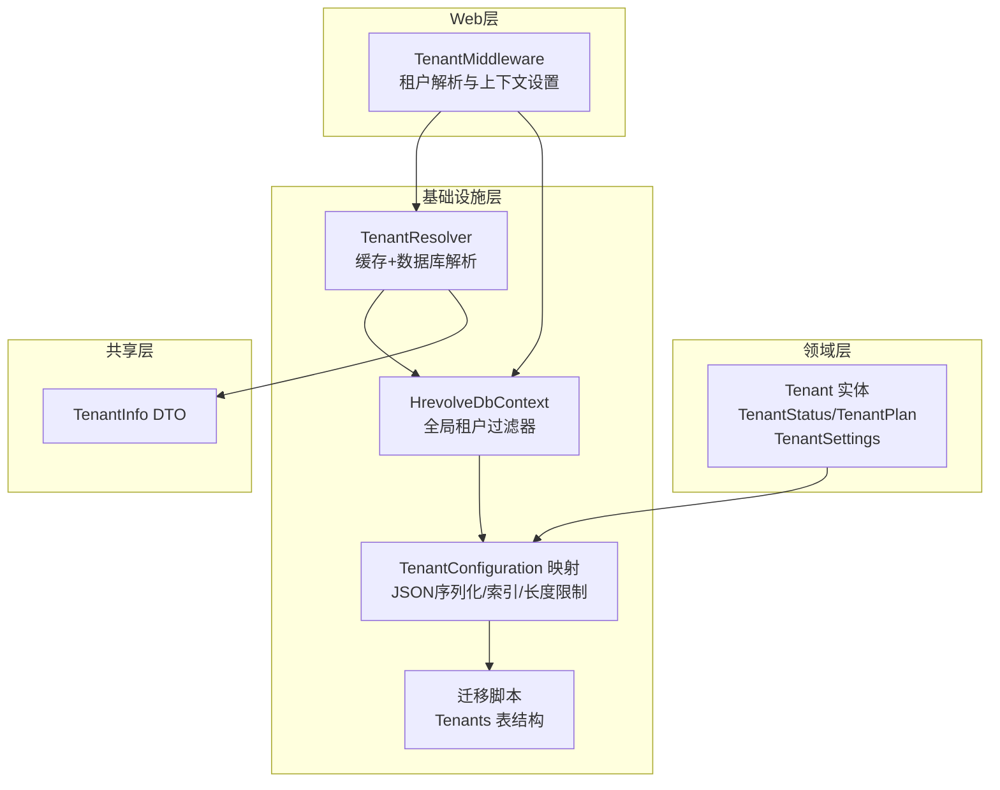
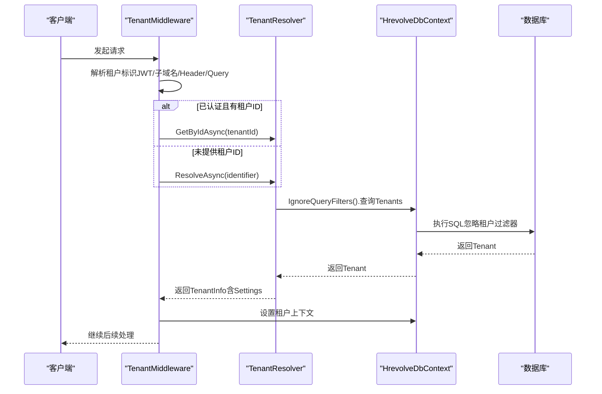
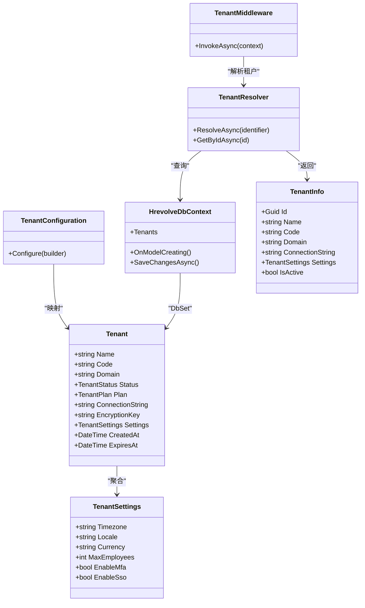

# 租户表 (Tenants)

<cite>
**本文引用的文件**
- [Tenant.cs](file://Backend/Hrevolve.Domain/Tenants/Tenant.cs)
- [TenantConfiguration.cs](file://Backend/Hrevolve.Infrastructure/Persistence/Configurations/TenantConfiguration.cs)
- [20251227093819_InitialCreate.cs](file://Backend/Hrevolve.Infrastructure/Migrations/20251227093819_InitialCreate.cs)
- [HrevolveDbContext.cs](file://Backend/Hrevolve.Infrastructure/Persistence/HrevolveDbContext.cs)
- [TenantResolver.cs](file://Backend/Hrevolve.Infrastructure/MultiTenancy/TenantResolver.cs)
- [TenantMiddleware.cs](file://Backend/Hrevolve.Web/Middleware/TenantMiddleware.cs)
- [TenantInfo.cs](file://Backend/Hrevolve.Shared/MultiTenancy/TenantInfo.cs)
</cite>

## 目录
1. [简介](#简介)
2. [项目结构](#项目结构)
3. [核心组件](#核心组件)
4. [架构总览](#架构总览)
5. [详细组件分析](#详细组件分析)
6. [依赖关系分析](#依赖关系分析)
7. [性能考量](#性能考量)
8. [故障排查指南](#故障排查指南)
9. [结论](#结论)
10. [附录](#附录)

## 简介
本文件聚焦于多租户架构中的核心数据模型“租户表（Tenants）”，系统性梳理其字段定义、数据类型、长度限制、约束（非空、唯一性）、用途，并深入解释Settings字段的JSON结构设计及其在多租户配置管理中的作用；同时结合实际实现，分析ConnectionString与EncryptionKey字段的安全存储策略，以及该表在数据隔离中的关键角色。

## 项目结构
围绕租户表的关键代码分布在领域层、基础设施层与Web层：
- 领域层：定义租户实体与状态/套餐枚举、租户设置值对象
- 基础设施层：EF Core映射配置、数据库迁移脚本、全局查询过滤器
- Web层：多租户中间件负责租户解析与上下文设置
- 共享层：租户信息DTO与解析器接口

图表来源
- [Tenant.cs](file://Backend/Hrevolve.Domain/Tenants/Tenant.cs#L1-L66)
- [TenantConfiguration.cs](file://Backend/Hrevolve.Infrastructure/Persistence/Configurations/TenantConfiguration.cs#L1-L55)
- [20251227093819_InitialCreate.cs](file://Backend/Hrevolve.Infrastructure/Migrations/20251227093819_InitialCreate.cs#L312-L331)
- [HrevolveDbContext.cs](file://Backend/Hrevolve.Infrastructure/Persistence/HrevolveDbContext.cs#L63-L118)
- [TenantResolver.cs](file://Backend/Hrevolve.Infrastructure/MultiTenancy/TenantResolver.cs#L1-L108)
- [TenantMiddleware.cs](file://Backend/Hrevolve.Web/Middleware/TenantMiddleware.cs#L1-L133)
- [TenantInfo.cs](file://Backend/Hrevolve.Shared/MultiTenancy/TenantInfo.cs#L1-L45)

章节来源
- [Tenant.cs](file://Backend/Hrevolve.Domain/Tenants/Tenant.cs#L1-L66)
- [TenantConfiguration.cs](file://Backend/Hrevolve.Infrastructure/Persistence/Configurations/TenantConfiguration.cs#L1-L55)
- [20251227093819_InitialCreate.cs](file://Backend/Hrevolve.Infrastructure/Migrations/20251227093819_InitialCreate.cs#L312-L331)
- [HrevolveDbContext.cs](file://Backend/Hrevolve.Infrastructure/Persistence/HrevolveDbContext.cs#L63-L118)
- [TenantResolver.cs](file://Backend/Hrevolve.Infrastructure/MultiTenancy/TenantResolver.cs#L1-L108)
- [TenantMiddleware.cs](file://Backend/Hrevolve.Web/Middleware/TenantMiddleware.cs#L1-L133)
- [TenantInfo.cs](file://Backend/Hrevolve.Shared/MultiTenancy/TenantInfo.cs#L1-L45)

## 核心组件
- 租户实体：包含名称、编码、域名、状态、套餐、连接串、加密密钥、设置、创建时间、到期时间等属性
- 租户设置值对象：包含时区、语言、货币、最大员工数、MFA开关、SSO开关等
- EF Core映射：定义字段长度、必填、索引、状态/套餐枚举转换、Settings JSON序列化
- 数据库迁移：生成Tenants表的完整结构
- 全局租户过滤器：基于租户上下文对审计实体进行自动租户隔离
- 租户解析器：支持按代码/域名解析租户，带分布式缓存
- 多租户中间件：从JWT、子域名、Header、查询参数解析租户，设置租户上下文

章节来源
- [Tenant.cs](file://Backend/Hrevolve.Domain/Tenants/Tenant.cs#L1-L66)
- [TenantConfiguration.cs](file://Backend/Hrevolve.Infrastructure/Persistence/Configurations/TenantConfiguration.cs#L1-L55)
- [20251227093819_InitialCreate.cs](file://Backend/Hrevolve.Infrastructure/Migrations/20251227093819_InitialCreate.cs#L312-L331)
- [HrevolveDbContext.cs](file://Backend/Hrevolve.Infrastructure/Persistence/HrevolveDbContext.cs#L63-L118)
- [TenantResolver.cs](file://Backend/Hrevolve.Infrastructure/MultiTenancy/TenantResolver.cs#L1-L108)
- [TenantMiddleware.cs](file://Backend/Hrevolve.Web/Middleware/TenantMiddleware.cs#L1-L133)
- [TenantInfo.cs](file://Backend/Hrevolve.Shared/MultiTenancy/TenantInfo.cs#L1-L45)

## 架构总览
租户表是多租户的核心载体，贯穿以下流程：
- 请求进入Web层后，中间件解析租户标识并设置租户上下文
- 解析器从缓存或数据库加载租户信息（含Settings）
- 基础设施层的全局租户过滤器在查询/保存时自动注入租户隔离条件
- 领域层实体与设置值对象承载业务配置

图表来源
- [TenantMiddleware.cs](file://Backend/Hrevolve.Web/Middleware/TenantMiddleware.cs#L1-L133)
- [TenantResolver.cs](file://Backend/Hrevolve.Infrastructure/MultiTenancy/TenantResolver.cs#L1-L108)
- [HrevolveDbContext.cs](file://Backend/Hrevolve.Infrastructure/Persistence/HrevolveDbContext.cs#L63-L118)

## 详细组件分析

### 字段定义与约束（基于实体与映射）
- Id
  - 类型：Guid
  - 约束：主键
  - 用途：租户唯一标识
  - 参考：[HrevolveDbContext.cs](file://Backend/Hrevolve.Infrastructure/Persistence/HrevolveDbContext.cs#L24-L26)，[20251227093819_InitialCreate.cs](file://Backend/Hrevolve.Infrastructure/Migrations/20251227093819_InitialCreate.cs#L312-L331)

- Name
  - 类型：字符串
  - 长度：最大200
  - 约束：必填
  - 用途：租户显示名称
  - 参考：[Tenant.cs](file://Backend/Hrevolve.Domain/Tenants/Tenant.cs#L10-L11)，[TenantConfiguration.cs](file://Backend/Hrevolve.Infrastructure/Persistence/Configurations/TenantConfiguration.cs#L15-L17)，[20251227093819_InitialCreate.cs](file://Backend/Hrevolve.Infrastructure/Migrations/20251227093819_InitialCreate.cs#L317-L320)

- Code
  - 类型：字符串
  - 长度：最大50
  - 约束：必填、唯一索引
  - 用途：租户业务编码（小写存储）
  - 参考：[Tenant.cs](file://Backend/Hrevolve.Domain/Tenants/Tenant.cs#L10-L11)，[TenantConfiguration.cs](file://Backend/Hrevolve.Infrastructure/Persistence/Configurations/TenantConfiguration.cs#L19-L21)，[TenantConfiguration.cs](file://Backend/Hrevolve.Infrastructure/Persistence/Configurations/TenantConfiguration.cs#L47-L49)，[20251227093819_InitialCreate.cs](file://Backend/Hrevolve.Infrastructure/Migrations/20251227093819_InitialCreate.cs#L318-L321)

- Domain
  - 类型：字符串
  - 长度：最大200
  - 约束：可空、唯一索引
  - 用途：租户域名（用于子域名解析）
  - 参考：[Tenant.cs](file://Backend/Hrevolve.Domain/Tenants/Tenant.cs#L11-L12)，[TenantConfiguration.cs](file://Backend/Hrevolve.Infrastructure/Persistence/Configurations/TenantConfiguration.cs#L23-L24)，[TenantConfiguration.cs](file://Backend/Hrevolve.Infrastructure/Persistence/Configurations/TenantConfiguration.cs#L50-L51)，[20251227093819_InitialCreate.cs](file://Backend/Hrevolve.Infrastructure/Migrations/20251227093819_InitialCreate.cs#L319-L322)

- Status
  - 类型：枚举字符串表示
  - 长度：最大20
  - 约束：必填
  - 可选值：Active、Suspended、Expired
  - 用途：租户状态控制（影响中间件是否允许访问）
  - 参考：[Tenant.cs](file://Backend/Hrevolve.Domain/Tenants/Tenant.cs#L12-L14)，[TenantConfiguration.cs](file://Backend/Hrevolve.Infrastructure/Persistence/Configurations/TenantConfiguration.cs#L26-L29)，[Tenant.cs](file://Backend/Hrevolve.Domain/Tenants/Tenant.cs#L40-L45)，[20251227093819_InitialCreate.cs](file://Backend/Hrevolve.Infrastructure/Migrations/20251227093819_InitialCreate.cs#L320-L323)

- Plan
  - 类型：枚举字符串表示
  - 长度：最大20
  - 约束：必填
  - 可选值：Free、Standard、Professional、Enterprise
  - 用途：租户套餐级别（可用于功能/容量限制）
  - 参考：[Tenant.cs](file://Backend/Hrevolve.Domain/Tenants/Tenant.cs#L13-L15)，[TenantConfiguration.cs](file://Backend/Hrevolve.Infrastructure/Persistence/Configurations/TenantConfiguration.cs#L30-L33)，[Tenant.cs](file://Backend/Hrevolve.Domain/Tenants/Tenant.cs#L47-L53)，[20251227093819_InitialCreate.cs](file://Backend/Hrevolve.Infrastructure/Migrations/20251227093819_InitialCreate.cs#L321-L324)

- ConnectionString
  - 类型：字符串
  - 长度：最大1000
  - 约束：可空
  - 用途：独立数据库模式下的租户连接串（按需使用）
  - 参考：[Tenant.cs](file://Backend/Hrevolve.Domain/Tenants/Tenant.cs#L14-L16)，[TenantConfiguration.cs](file://Backend/Hrevolve.Infrastructure/Persistence/Configurations/TenantConfiguration.cs#L34-L36)，[20251227093819_InitialCreate.cs](file://Backend/Hrevolve.Infrastructure/Migrations/20251227093819_InitialCreate.cs#L322-L325)

- EncryptionKey
  - 类型：字符串
  - 长度：最大500
  - 约束：可空
  - 用途：每租户加密密钥（按需使用）
  - 参考：[Tenant.cs](file://Backend/Hrevolve.Domain/Tenants/Tenant.cs#L15-L17)，[TenantConfiguration.cs](file://Backend/Hrevolve.Infrastructure/Persistence/Configurations/TenantConfiguration.cs#L37-L39)，[20251227093819_InitialCreate.cs](file://Backend/Hrevolve.Infrastructure/Migrations/20251227093819_InitialCreate.cs#L323-L326)

- Settings
  - 类型：JSON字符串（EF Core HasConversion）
  - 长度：最大2000
  - 约束：必填（持久化层默认值保证）
  - 结构：包含时区、语言、货币、最大员工数、MFA开关、SSO开关
  - 用途：租户级配置中心，供运行时读取
  - 参考：[Tenant.cs](file://Backend/Hrevolve.Domain/Tenants/Tenant.cs#L16-L18)，[TenantConfiguration.cs](file://Backend/Hrevolve.Infrastructure/Persistence/Configurations/TenantConfiguration.cs#L40-L46)，[TenantInfo.cs](file://Backend/Hrevolve.Shared/MultiTenancy/TenantInfo.cs#L1-L15)，[20251227093819_InitialCreate.cs](file://Backend/Hrevolve.Infrastructure/Migrations/20251227093819_InitialCreate.cs#L324-L327)

- CreatedAt
  - 类型：时间戳（UTC）
  - 约束：必填
  - 用途：租户记录创建时间
  - 参考：[Tenant.cs](file://Backend/Hrevolve.Domain/Tenants/Tenant.cs#L17-L19)，[20251227093819_InitialCreate.cs](file://Backend/Hrevolve.Infrastructure/Migrations/20251227093819_InitialCreate.cs#L325-L327)

- ExpiresAt
  - 类型：时间戳（UTC）
  - 约束：可空
  - 用途：租户到期时间（可用于过期控制）
  - 参考：[Tenant.cs](file://Backend/Hrevolve.Domain/Tenants/Tenant.cs#L18-L20)，[20251227093819_InitialCreate.cs](file://Backend/Hrevolve.Infrastructure/Migrations/20251227093819_InitialCreate.cs#L326-L327)

章节来源
- [Tenant.cs](file://Backend/Hrevolve.Domain/Tenants/Tenant.cs#L1-L66)
- [TenantConfiguration.cs](file://Backend/Hrevolve.Infrastructure/Persistence/Configurations/TenantConfiguration.cs#L1-L55)
- [20251227093819_InitialCreate.cs](file://Backend/Hrevolve.Infrastructure/Migrations/20251227093819_InitialCreate.cs#L312-L331)
- [TenantInfo.cs](file://Backend/Hrevolve.Shared/MultiTenancy/TenantInfo.cs#L1-L15)

### Settings字段的JSON结构设计与作用
- 结构要点
  - 时区：Asia/Shanghai（默认）
  - 语言：zh-CN（默认）
  - 货币：CNY（默认）
  - 最大员工数：100（默认）
  - MFA开关：true（默认）
  - SSO开关：false（默认）
- 设计意图
  - 将租户级配置以JSON形式序列化存储，便于灵活扩展与版本演进
  - 在解析器与中间件中统一读取，避免硬编码与分散配置
- 运行时使用
  - 中间件与服务层可直接读取Settings，用于国际化、本地化、合规与功能开关
- 参考
  - [Tenant.cs](file://Backend/Hrevolve.Domain/Tenants/Tenant.cs#L55-L66)
  - [TenantConfiguration.cs](file://Backend/Hrevolve.Infrastructure/Persistence/Configurations/TenantConfiguration.cs#L40-L46)
  - [TenantInfo.cs](file://Backend/Hrevolve.Shared/MultiTenancy/TenantInfo.cs#L17-L29)

章节来源
- [Tenant.cs](file://Backend/Hrevolve.Domain/Tenants/Tenant.cs#L55-L66)
- [TenantConfiguration.cs](file://Backend/Hrevolve.Infrastructure/Persistence/Configurations/TenantConfiguration.cs#L40-L46)
- [TenantInfo.cs](file://Backend/Hrevolve.Shared/MultiTenancy/TenantInfo.cs#L17-L29)

### ConnectionString与EncryptionKey的安全存储策略
- ConnectionString
  - 仅在“独立数据库”模式下使用，通常由平台管理员在租户创建或升级时配置
  - 建议采用环境变量或密钥管理服务（KMS）注入，避免明文落库
  - 访问路径：解析器返回TenantInfo，中间件设置租户上下文，具体数据库连接在运行时按需建立
  - 参考：[Tenant.cs](file://Backend/Hrevolve.Domain/Tenants/Tenant.cs#L14-L16)，[TenantResolver.cs](file://Backend/Hrevolve.Infrastructure/MultiTenancy/TenantResolver.cs#L75-L107)，[TenantMiddleware.cs](file://Backend/Hrevolve.Web/Middleware/TenantMiddleware.cs#L1-L133)
- EncryptionKey
  - 每租户独立密钥，用于敏感数据加密/解密
  - 建议与KMS集成，支持密钥轮换与权限控制
  - 参考：[Tenant.cs](file://Backend/Hrevolve.Domain/Tenants/Tenant.cs#L15-L17)，[TenantConfiguration.cs](file://Backend/Hrevolve.Infrastructure/Persistence/Configurations/TenantConfiguration.cs#L37-L39)
- 通用建议
  - 对存储的敏感字段进行最小化暴露与访问控制
  - 在传输链路使用TLS，避免明文泄露
  - 定期审计访问日志与密钥使用情况

章节来源
- [Tenant.cs](file://Backend/Hrevolve.Domain/Tenants/Tenant.cs#L14-L17)
- [TenantConfiguration.cs](file://Backend/Hrevolve.Infrastructure/Persistence/Configurations/TenantConfiguration.cs#L34-L39)
- [TenantResolver.cs](file://Backend/Hrevolve.Infrastructure/MultiTenancy/TenantResolver.cs#L75-L107)
- [TenantMiddleware.cs](file://Backend/Hrevolve.Web/Middleware/TenantMiddleware.cs#L1-L133)

### 数据隔离中的关键作用
- 全局租户过滤器
  - 对所有继承自审计基类的实体，在查询时自动附加租户隔离条件
  - 保存时自动填充租户ID（若未显式设置）
  - 参考：[HrevolveDbContext.cs](file://Backend/Hrevolve.Infrastructure/Persistence/HrevolveDbContext.cs#L77-L99)，[HrevolveDbContext.cs](file://Backend/Hrevolve.Infrastructure/Persistence/HrevolveDbContext.cs#L120-L155)
- 中间件与解析器
  - 通过中间件解析租户并设置上下文，确保后续仓储/服务均受租户隔离
  - 解析器优先命中缓存，降低数据库压力
  - 参考：[TenantMiddleware.cs](file://Backend/Hrevolve.Web/Middleware/TenantMiddleware.cs#L1-L133)，[TenantResolver.cs](file://Backend/Hrevolve.Infrastructure/MultiTenancy/TenantResolver.cs#L1-L108)
- 唯一性与可用性
  - Code与Domain均为唯一索引，防止重复与歧义
  - Status用于快速禁用/启用租户，保障安全与合规
  - 参考：[TenantConfiguration.cs](file://Backend/Hrevolve.Infrastructure/Persistence/Configurations/TenantConfiguration.cs#L47-L51)，[TenantMiddleware.cs](file://Backend/Hrevolve.Web/Middleware/TenantMiddleware.cs#L75-L78)

章节来源
- [HrevolveDbContext.cs](file://Backend/Hrevolve.Infrastructure/Persistence/HrevolveDbContext.cs#L77-L99)
- [HrevolveDbContext.cs](file://Backend/Hrevolve.Infrastructure/Persistence/HrevolveDbContext.cs#L120-L155)
- [TenantMiddleware.cs](file://Backend/Hrevolve.Web/Middleware/TenantMiddleware.cs#L75-L78)
- [TenantResolver.cs](file://Backend/Hrevolve.Infrastructure/MultiTenancy/TenantResolver.cs#L1-L108)
- [TenantConfiguration.cs](file://Backend/Hrevolve.Infrastructure/Persistence/Configurations/TenantConfiguration.cs#L47-L51)

## 依赖关系分析
- 实体到映射
  - Tenant实体通过TenantConfiguration映射到数据库列，包含长度、必填、索引与JSON转换
- 映射到迁移
  - TenantConfiguration生成的模型与迁移脚本一致，确保部署一致性
- 上下文到过滤器
  - HrevolveDbContext注册全局租户过滤器，遍历实体类型并为审计实体设置过滤条件
- 中间件到解析器
  - TenantMiddleware依赖ITenantResolver解析租户，TenantResolver依赖HrevolveDbContext与分布式缓存
- 解析器到DTO
  - TenantResolver将Domain/TenantSettings等映射到TenantInfo，供中间件与服务层使用

图表来源
- [Tenant.cs](file://Backend/Hrevolve.Domain/Tenants/Tenant.cs#L1-L66)
- [TenantConfiguration.cs](file://Backend/Hrevolve.Infrastructure/Persistence/Configurations/TenantConfiguration.cs#L1-L55)
- [HrevolveDbContext.cs](file://Backend/Hrevolve.Infrastructure/Persistence/HrevolveDbContext.cs#L63-L118)
- [TenantResolver.cs](file://Backend/Hrevolve.Infrastructure/MultiTenancy/TenantResolver.cs#L1-L108)
- [TenantMiddleware.cs](file://Backend/Hrevolve.Web/Middleware/TenantMiddleware.cs#L1-L133)
- [TenantInfo.cs](file://Backend/Hrevolve.Shared/MultiTenancy/TenantInfo.cs#L1-L45)

## 性能考量
- 缓存策略
  - TenantResolver使用分布式缓存，Key包含标识与ID，提升解析性能
  - 建议合理设置过期时间，平衡一致性与性能
- 查询优化
  - Code与Domain建立唯一索引，加速解析
  - 解析器查询时忽略租户过滤器，避免循环依赖
- 序列化成本
  - Settings为JSON序列化，注意字段数量与大小，避免过度膨胀
- 连接串与密钥
  - ConnectionString/EncryptionKey为可空字段，按需加载，减少不必要的IO

章节来源
- [TenantResolver.cs](file://Backend/Hrevolve.Infrastructure/MultiTenancy/TenantResolver.cs#L1-L108)
- [TenantConfiguration.cs](file://Backend/Hrevolve.Infrastructure/Persistence/Configurations/TenantConfiguration.cs#L47-L51)

## 故障排查指南
- 无法识别租户
  - 检查中间件是否正确解析JWT中的租户ID或请求头/子域名/查询参数
  - 参考：[TenantMiddleware.cs](file://Backend/Hrevolve.Web/Middleware/TenantMiddleware.cs#L34-L66)
- 租户不存在
  - 解析器返回null时抛出异常，确认Code/Domain是否正确
  - 参考：[TenantResolver.cs](file://Backend/Hrevolve.Infrastructure/MultiTenancy/TenantResolver.cs#L39-L45)
- 租户被禁用
  - Status非Active时拒绝访问
  - 参考：[TenantMiddleware.cs](file://Backend/Hrevolve.Web/Middleware/TenantMiddleware.cs#L75-L78)
- 数据隔离失效
  - 确认全局租户过滤器已注册，且实体继承审计基类
  - 参考：[HrevolveDbContext.cs](file://Backend/Hrevolve.Infrastructure/Persistence/HrevolveDbContext.cs#L77-L99)
- Settings反序列化失败
  - 检查JSON格式与字段兼容性，必要时提供默认值
  - 参考：[TenantConfiguration.cs](file://Backend/Hrevolve.Infrastructure/Persistence/Configurations/TenantConfiguration.cs#L40-L46)

章节来源
- [TenantMiddleware.cs](file://Backend/Hrevolve.Web/Middleware/TenantMiddleware.cs#L34-L78)
- [TenantResolver.cs](file://Backend/Hrevolve.Infrastructure/MultiTenancy/TenantResolver.cs#L39-L45)
- [HrevolveDbContext.cs](file://Backend/Hrevolve.Infrastructure/Persistence/HrevolveDbContext.cs#L77-L99)
- [TenantConfiguration.cs](file://Backend/Hrevolve.Infrastructure/Persistence/Configurations/TenantConfiguration.cs#L40-L46)

## 结论
租户表（Tenants）是多租户架构的基石，通过严格的字段约束、唯一索引与全局租户过滤器实现了强隔离；Settings的JSON化设计提供了灵活的租户级配置能力；ConnectionString与EncryptionKey的可空设计支持多种部署形态与安全策略。结合中间件与解析器的协同，系统在性能与安全性之间取得良好平衡。

## 附录
- 字段一览与参考
  - Id：Guid，主键，参考 [HrevolveDbContext.cs](file://Backend/Hrevolve.Infrastructure/Persistence/HrevolveDbContext.cs#L24-L26)，[20251227093819_InitialCreate.cs](file://Backend/Hrevolve.Infrastructure/Migrations/20251227093819_InitialCreate.cs#L312-L331)
  - Name：字符串，最大200，必填，参考 [Tenant.cs](file://Backend/Hrevolve.Domain/Tenants/Tenant.cs#L10-L11)，[TenantConfiguration.cs](file://Backend/Hrevolve.Infrastructure/Persistence/Configurations/TenantConfiguration.cs#L15-L17)，[20251227093819_InitialCreate.cs](file://Backend/Hrevolve.Infrastructure/Migrations/20251227093819_InitialCreate.cs#L317-L320)
  - Code：字符串，最大50，必填且唯一，参考 [Tenant.cs](file://Backend/Hrevolve.Domain/Tenants/Tenant.cs#L10-L11)，[TenantConfiguration.cs](file://Backend/Hrevolve.Infrastructure/Persistence/Configurations/TenantConfiguration.cs#L19-L21)，[TenantConfiguration.cs](file://Backend/Hrevolve.Infrastructure/Persistence/Configurations/TenantConfiguration.cs#L47-L49)，[20251227093819_InitialCreate.cs](file://Backend/Hrevolve.Infrastructure/Migrations/20251227093819_InitialCreate.cs#L318-L321)
  - Domain：字符串，最大200，可空且唯一，参考 [Tenant.cs](file://Backend/Hrevolve.Domain/Tenants/Tenant.cs#L11-L12)，[TenantConfiguration.cs](file://Backend/Hrevolve.Infrastructure/Persistence/Configurations/TenantConfiguration.cs#L23-L24)，[TenantConfiguration.cs](file://Backend/Hrevolve.Infrastructure/Persistence/Configurations/TenantConfiguration.cs#L50-L51)，[20251227093819_InitialCreate.cs](file://Backend/Hrevolve.Infrastructure/Migrations/20251227093819_InitialCreate.cs#L319-L322)
  - Status：枚举字符串，最大20，必填，参考 [Tenant.cs](file://Backend/Hrevolve.Domain/Tenants/Tenant.cs#L12-L14)，[TenantConfiguration.cs](file://Backend/Hrevolve.Infrastructure/Persistence/Configurations/TenantConfiguration.cs#L26-L29)，[20251227093819_InitialCreate.cs](file://Backend/Hrevolve.Infrastructure/Migrations/20251227093819_InitialCreate.cs#L320-L323)
  - Plan：枚举字符串，最大20，必填，参考 [Tenant.cs](file://Backend/Hrevolve.Domain/Tenants/Tenant.cs#L13-L15)，[TenantConfiguration.cs](file://Backend/Hrevolve.Infrastructure/Persistence/Configurations/TenantConfiguration.cs#L30-L33)，[20251227093819_InitialCreate.cs](file://Backend/Hrevolve.Infrastructure/Migrations/20251227093819_InitialCreate.cs#L321-L324)
  - ConnectionString：字符串，最大1000，可空，参考 [Tenant.cs](file://Backend/Hrevolve.Domain/Tenants/Tenant.cs#L14-L16)，[TenantConfiguration.cs](file://Backend/Hrevolve.Infrastructure/Persistence/Configurations/TenantConfiguration.cs#L34-L36)，[20251227093819_InitialCreate.cs](file://Backend/Hrevolve.Infrastructure/Migrations/20251227093819_InitialCreate.cs#L322-L325)
  - EncryptionKey：字符串，最大500，可空，参考 [Tenant.cs](file://Backend/Hrevolve.Domain/Tenants/Tenant.cs#L15-L17)，[TenantConfiguration.cs](file://Backend/Hrevolve.Infrastructure/Persistence/Configurations/TenantConfiguration.cs#L37-L39)，[20251227093819_InitialCreate.cs](file://Backend/Hrevolve.Infrastructure/Migrations/20251227093819_InitialCreate.cs#L323-L326)
  - Settings：JSON字符串，最大2000，必填，参考 [Tenant.cs](file://Backend/Hrevolve.Domain/Tenants/Tenant.cs#L16-L18)，[TenantConfiguration.cs](file://Backend/Hrevolve.Infrastructure/Persistence/Configurations/TenantConfiguration.cs#L40-L46)，[TenantInfo.cs](file://Backend/Hrevolve.Shared/MultiTenancy/TenantInfo.cs#L1-L15)，[20251227093819_InitialCreate.cs](file://Backend/Hrevolve.Infrastructure/Migrations/20251227093819_InitialCreate.cs#L324-L327)
  - CreatedAt：时间戳，必填，参考 [Tenant.cs](file://Backend/Hrevolve.Domain/Tenants/Tenant.cs#L17-L19)，[20251227093819_InitialCreate.cs](file://Backend/Hrevolve.Infrastructure/Migrations/20251227093819_InitialCreate.cs#L325-L327)
  - ExpiresAt：时间戳，可空，参考 [Tenant.cs](file://Backend/Hrevolve.Domain/Tenants/Tenant.cs#L18-L20)，[20251227093819_InitialCreate.cs](file://Backend/Hrevolve.Infrastructure/Migrations/20251227093819_InitialCreate.cs#L326-L327)