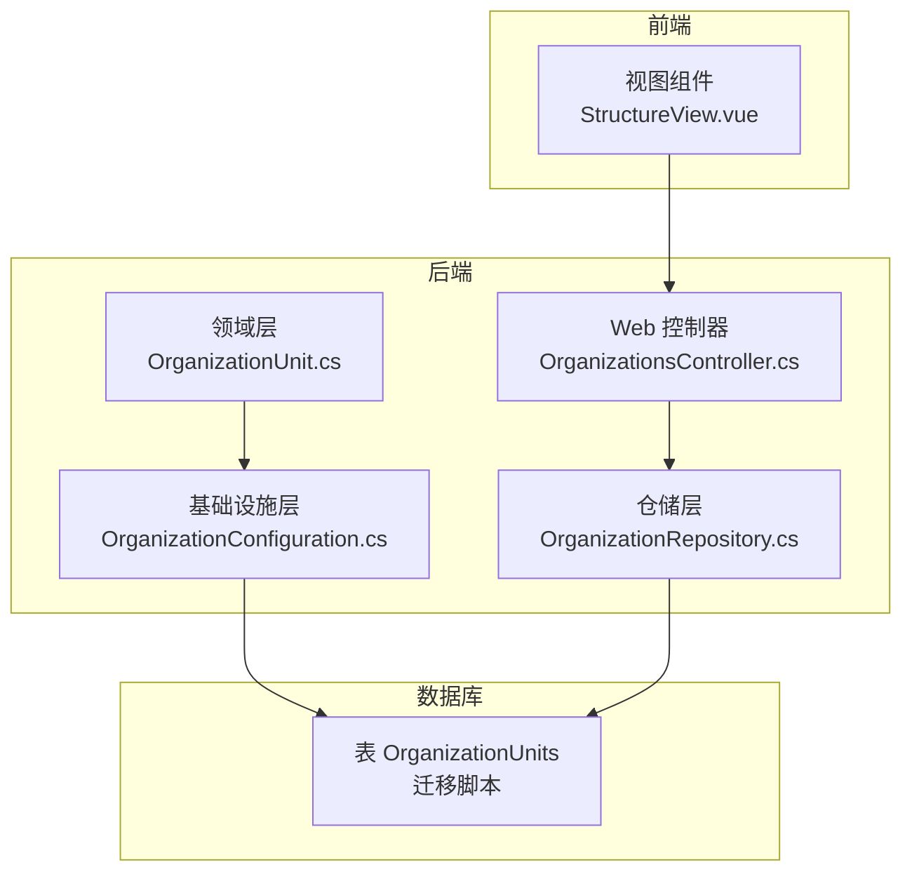
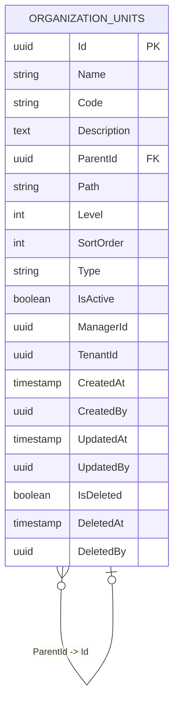
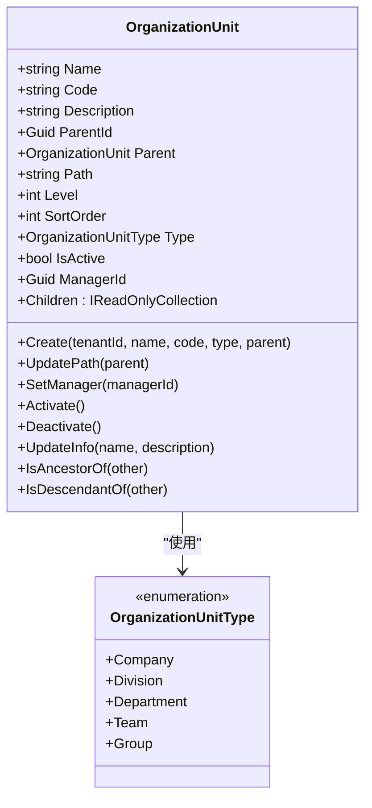
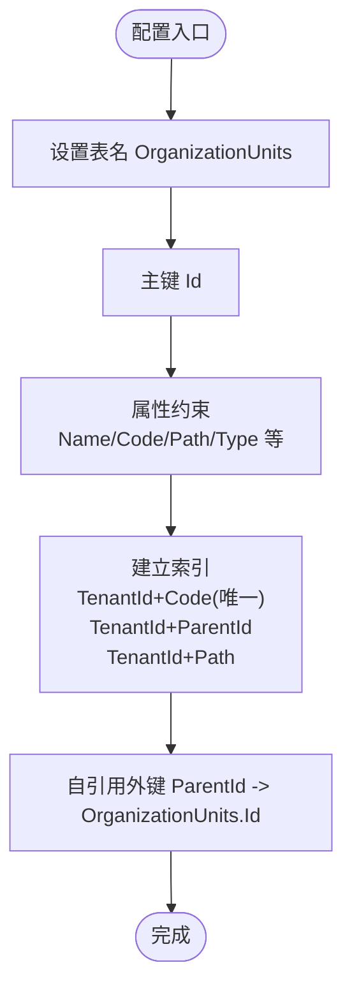
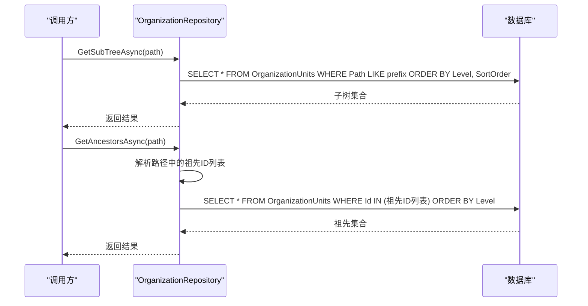
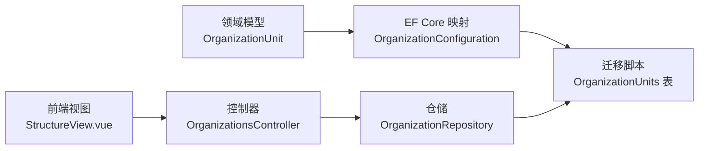

# 组织单元表 (OrganizationUnits)

<cite>
**本文引用的文件**
- [OrganizationUnit.cs](file://Backend/Hrevolve.Domain/Organizations/OrganizationUnit.cs)
- [OrganizationConfiguration.cs](file://Backend/Hrevolve.Infrastructure/Persistence/Configurations/OrganizationConfiguration.cs)
- [20251227093819_InitialCreate.cs](file://Backend/Hrevolve.Infrastructure/Migrations/20251227093819_InitialCreate.cs)
- [20251227093819_InitialCreate.Designer.cs](file://Backend/Hrevolve.Infrastructure/Migrations/20251227093819_InitialCreate.Designer.cs)
- [OrganizationRepository.cs](file://Backend/Hrevolve.Infrastructure/Persistence/Repositories/OrganizationRepository.cs)
- [OrganizationsController.cs](file://Backend/Hrevolve.Web/Controllers/OrganizationsController.cs)
- [StructureView.vue](file://Frontend/hrevolve-web/src/views/organization/StructureView.vue)
</cite>

## 目录
1. [简介](#简介)
2. [项目结构与定位](#项目结构与定位)
3. [核心数据模型](#核心数据模型)
4. [架构总览](#架构总览)
5. [关键组件详解](#关键组件详解)
6. [依赖关系分析](#依赖关系分析)
7. [性能特性与优化](#性能特性与优化)
8. [故障排查指南](#故障排查指南)
9. [结论](#结论)

## 简介
本文件聚焦于组织单元表 OrganizationUnits 的数据模型设计，系统阐释以下要点：
- ParentId 外键与 Path 字段协同构建树状组织架构；
- Path 字段采用“路径枚举”（Path Enumeration）设计以优化层级查询性能；
- Level 与 SortOrder 在组织树遍历与排序中的作用；
- Type 字段支持多组织类型（公司、事业部、部门、团队、小组）扩展。

该文档面向开发者与产品/运维人员，既提供代码级细节，也给出可操作的性能与扩展建议。

## 项目结构与定位
- 后端领域层定义实体与业务规则；
- 基础设施层通过 EF Core 映射到数据库，并建立索引；
- 迁移脚本创建表结构并约束父子关系；
- 控制器与前端视图负责组织树的展示与交互。

图表来源
- [OrganizationUnit.cs](file://Backend/Hrevolve.Domain/Organizations/OrganizationUnit.cs#L1-L108)
- [OrganizationConfiguration.cs](file://Backend/Hrevolve.Infrastructure/Persistence/Configurations/OrganizationConfiguration.cs#L1-L47)
- [20251227093819_InitialCreate.cs](file://Backend/Hrevolve.Infrastructure/Migrations/20251227093819_InitialCreate.cs#L166-L199)
- [OrganizationRepository.cs](file://Backend/Hrevolve.Infrastructure/Persistence/Repositories/OrganizationRepository.cs#L1-L76)
- [OrganizationsController.cs](file://Backend/Hrevolve.Web/Controllers/OrganizationsController.cs#L1-L98)
- [StructureView.vue](file://Frontend/hrevolve-web/src/views/organization/StructureView.vue#L1-L43)

章节来源
- [OrganizationUnit.cs](file://Backend/Hrevolve.Domain/Organizations/OrganizationUnit.cs#L1-L108)
- [OrganizationConfiguration.cs](file://Backend/Hrevolve.Infrastructure/Persistence/Configurations/OrganizationConfiguration.cs#L1-L47)
- [20251227093819_InitialCreate.cs](file://Backend/Hrevolve.Infrastructure/Migrations/20251227093819_InitialCreate.cs#L166-L199)
- [OrganizationRepository.cs](file://Backend/Hrevolve.Infrastructure/Persistence/Repositories/OrganizationRepository.cs#L1-L76)
- [OrganizationsController.cs](file://Backend/Hrevolve.Web/Controllers/OrganizationsController.cs#L1-L98)
- [StructureView.vue](file://Frontend/hrevolve-web/src/views/organization/StructureView.vue#L1-L43)

## 核心数据模型
- 表名：OrganizationUnits
- 关键列：
  - Id：主键
  - Name、Code、Description：名称、编码、描述
  - ParentId：自引用外键，指向父级组织单元
  - Path：路径枚举，形如 “/根ID/父ID/本ID/”，用于快速判断上下级与查询子树
  - Level：层级深度（根为 0）
  - SortOrder：同级排序序号
  - Type：组织类型（字符串枚举映射）
  - IsActive、ManagerId：启用状态、负责人
  - TenantId：租户隔离
  - 审计字段：CreatedAt、CreatedBy、UpdatedAt、UpdatedBy、IsDeleted、DeletedAt、DeletedBy

章节来源
- [20251227093819_InitialCreate.cs](file://Backend/Hrevolve.Infrastructure/Migrations/20251227093819_InitialCreate.cs#L166-L199)
- [20251227093819_InitialCreate.Designer.cs](file://Backend/Hrevolve.Infrastructure/Migrations/20251227093819_InitialCreate.Designer.cs#L1323-L1361)
- [OrganizationConfiguration.cs](file://Backend/Hrevolve.Infrastructure/Persistence/Configurations/OrganizationConfiguration.cs#L1-L47)

## 架构总览
组织单元采用“邻接表 + 路径枚举”的混合模型：
- 邻接表（ParentId）：直观表达父子关系，便于插入/移动等变更；
- 路径枚举（Path）：以字符串路径快速判定上下级、查询整棵子树；
- EF Core 映射与索引：通过配置类与迁移脚本确保查询性能与一致性；
- 仓储与控制器：提供根节点、子树、祖先节点等查询能力，并由前端树形控件渲染。

图表来源
- [20251227093819_InitialCreate.cs](file://Backend/Hrevolve.Infrastructure/Migrations/20251227093819_InitialCreate.cs#L166-L199)
- [OrganizationConfiguration.cs](file://Backend/Hrevolve.Infrastructure/Persistence/Configurations/OrganizationConfiguration.cs#L1-L47)

## 关键组件详解

### 1) 领域模型：OrganizationUnit
- 责任边界清晰：封装组织单元的属性、行为与不变式；
- 路径计算：根据父节点 Path 拼接生成；根节点 Path 为 “/Id/”，Level 为 0；
- 上下级判断：通过 Path 前缀匹配实现；
- 类型枚举：支持公司、事业部、部门、团队、小组等扩展。

图表来源
- [OrganizationUnit.cs](file://Backend/Hrevolve.Domain/Organizations/OrganizationUnit.cs#L1-L108)

章节来源
- [OrganizationUnit.cs](file://Backend/Hrevolve.Domain/Organizations/OrganizationUnit.cs#L1-L108)

### 2) EF Core 映射与索引：OrganizationUnitConfiguration
- 表与键：表名为 OrganizationUnits，主键为 Id；
- 属性约束：Name/Code/Path/Type/Level/SortOrder 等长度与必填约束；
- 索引策略：
  - 唯一索引：TenantId + Code
  - 外键索引：TenantId + ParentId
  - 路径索引：TenantId + Path
- 自引用关系：Parent 与 Children 双向导航，删除策略 Restrict。

图表来源
- [OrganizationConfiguration.cs](file://Backend/Hrevolve.Infrastructure/Persistence/Configurations/OrganizationConfiguration.cs#L1-L47)

章节来源
- [OrganizationConfiguration.cs](file://Backend/Hrevolve.Infrastructure/Persistence/Configurations/OrganizationConfiguration.cs#L1-L47)

### 3) 数据库迁移：OrganizationUnits 表
- 字段定义与约束：包含 Id、Name、Code、Description、ParentId、Path、Level、SortOrder、Type、IsActive、ManagerId、TenantId 等；
- 外键约束：ParentId 引用 OrganizationUnits.Id；
- 索引：与配置一致，保证查询效率。

章节来源
- [20251227093819_InitialCreate.cs](file://Backend/Hrevolve.Infrastructure/Migrations/20251227093819_InitialCreate.cs#L166-L199)
- [20251227093819_InitialCreate.Designer.cs](file://Backend/Hrevolve.Infrastructure/Migrations/20251227093819_InitialCreate.Designer.cs#L1323-L1361)

### 4) 仓储与查询：OrganizationRepository
- 根节点查询：按 ParentId 为空并按 SortOrder 排序；
- 子树查询：基于 Path.StartsWith(path)，先按 Level 再按 SortOrder 排序；
- 祖先查询：从路径解析出各级祖先 ID，再按 Level 排序返回。

图表来源
- [OrganizationRepository.cs](file://Backend/Hrevolve.Infrastructure/Persistence/Repositories/OrganizationRepository.cs#L1-L76)

章节来源
- [OrganizationRepository.cs](file://Backend/Hrevolve.Infrastructure/Persistence/Repositories/OrganizationRepository.cs#L1-L76)

### 5) 控制器与前端：OrganizationsController 与 StructureView.vue
- 控制器：提供组织树、详情、创建、更新、员工/职位查询等接口占位；
- 前端：通过 API 获取树数据并渲染树形组件，默认展开全部节点。

章节来源
- [OrganizationsController.cs](file://Backend/Hrevolve.Web/Controllers/OrganizationsController.cs#L1-L98)
- [StructureView.vue](file://Frontend/hrevolve-web/src/views/organization/StructureView.vue#L1-L43)

## 依赖关系分析
- 领域层依赖基础层的审计基类（AuditableEntity），但不直接依赖数据库；
- 基础层通过 EF Core 配置与迁移脚本落地到数据库；
- 仓储层封装对 OrganizationUnits 的读写与复杂查询；
- 控制器依赖 Mediator 与仓储，前端通过 API 与后端交互。

图表来源
- [OrganizationUnit.cs](file://Backend/Hrevolve.Domain/Organizations/OrganizationUnit.cs#L1-L108)
- [OrganizationConfiguration.cs](file://Backend/Hrevolve.Infrastructure/Persistence/Configurations/OrganizationConfiguration.cs#L1-L47)
- [20251227093819_InitialCreate.cs](file://Backend/Hrevolve.Infrastructure/Migrations/20251227093819_InitialCreate.cs#L166-L199)
- [OrganizationRepository.cs](file://Backend/Hrevolve.Infrastructure/Persistence/Repositories/OrganizationRepository.cs#L1-L76)
- [OrganizationsController.cs](file://Backend/Hrevolve.Web/Controllers/OrganizationsController.cs#L1-L98)
- [StructureView.vue](file://Frontend/hrevolve-web/src/views/organization/StructureView.vue#L1-L43)

## 性能特性与优化

### 1) 路径枚举（Path Enumeration）设计
- 查询优势：
  - 子树查询：仅需一次前缀匹配（Path.StartsWith），避免递归或多次 JOIN；
  - 上下级判断：通过前缀判断，时间复杂度低；
  - 祖先查询：从路径解析祖先 ID 列表，再一次性查询返回。
- 索引配合：
  - TenantId + Path 唯一索引可显著提升按租户维度的路径查询性能；
  - TenantId + ParentId 索引有助于根节点与父子关系扫描。

章节来源
- [OrganizationRepository.cs](file://Backend/Hrevolve.Infrastructure/Persistence/Repositories/OrganizationRepository.cs#L48-L76)
- [OrganizationConfiguration.cs](file://Backend/Hrevolve.Infrastructure/Persistence/Configurations/OrganizationConfiguration.cs#L32-L38)

### 2) Level 与 SortOrder 的作用
- Level：用于子树查询结果的层级排序，保证从上到下的顺序输出；
- SortOrder：用于同层级内的稳定排序，结合 Level 实现“层级优先、同层次序稳定”的展示效果。

章节来源
- [OrganizationRepository.cs](file://Backend/Hrevolve.Infrastructure/Persistence/Repositories/OrganizationRepository.cs#L48-L58)

### 3) Type 字段的扩展性
- Type 为字符串枚举映射，支持新增类型（如项目组、中心等）而无需修改数据库结构；
- 前端/后端可基于 Type 进行差异化展示与权限控制。

章节来源
- [OrganizationConfiguration.cs](file://Backend/Hrevolve.Infrastructure/Persistence/Configurations/OrganizationConfiguration.cs#L28-L31)
- [OrganizationUnit.cs](file://Backend/Hrevolve.Domain/Organizations/OrganizationUnit.cs#L100-L108)

## 故障排查指南
- 子树查询异常
  - 现象：返回空或顺序异常
  - 排查要点：确认 Path 是否正确更新（创建/移动后应重新计算）；检查 TenantId 条件与索引是否生效
- 上下级判断错误
  - 现象：IsAncestorOf/IsDescendantOf 返回不符合预期
  - 排查要点：确认 Path 格式为 “/Id/” 形式且末尾斜杠一致
- 祖先查询缺失
  - 现象：返回祖先数量不足
  - 排查要点：确认路径分隔符与 Guid 解析逻辑正确
- 前端树形显示问题
  - 现象：树形组件无法展开或节点错位
  - 排查要点：确认后端返回的数据包含 children 字段（若需要）以及排序字段有效

章节来源
- [OrganizationRepository.cs](file://Backend/Hrevolve.Infrastructure/Persistence/Repositories/OrganizationRepository.cs#L48-L76)
- [StructureView.vue](file://Frontend/hrevolve-web/src/views/organization/StructureView.vue#L1-L43)

## 结论
OrganizationUnits 表通过“邻接表 + 路径枚举”的组合实现了高效、可扩展的树状组织管理：
- ParentId 提供直观的父子关系；
- Path 实现低成本的层级查询与上下级判断；
- Level 与 SortOrder 保障了稳定的树形展示；
- Type 支持多组织类型的灵活扩展；
- EF Core 索引与仓储查询进一步强化了性能与可维护性。