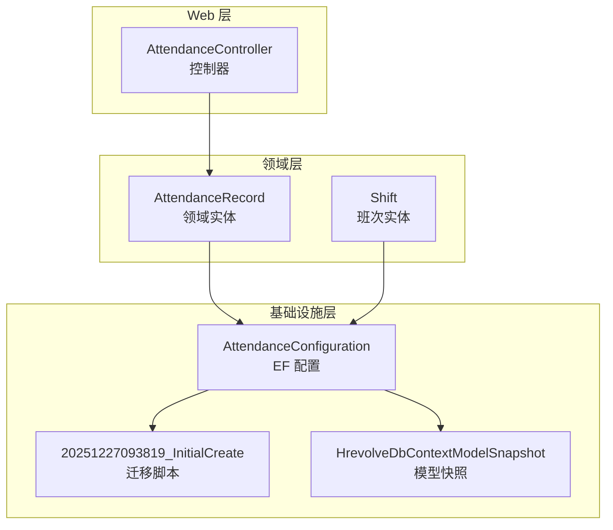
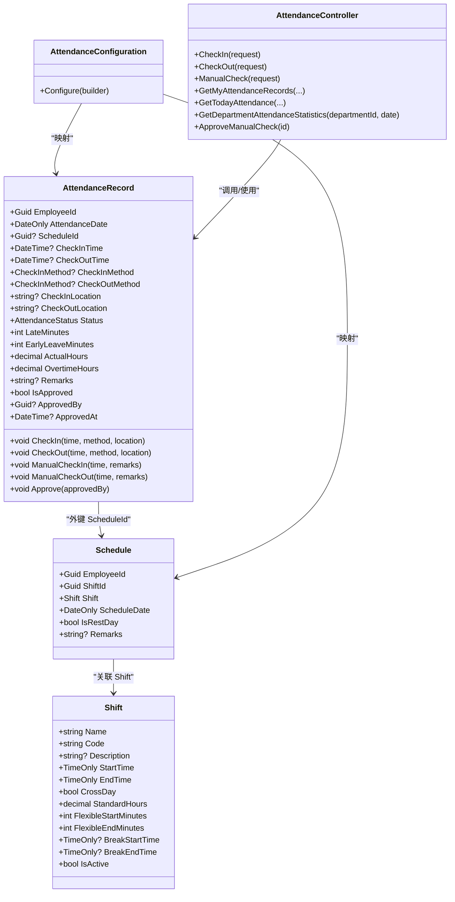
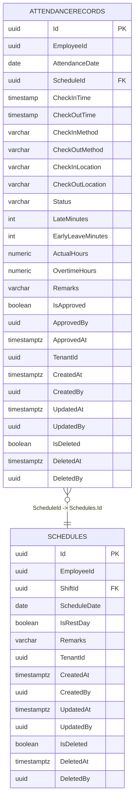
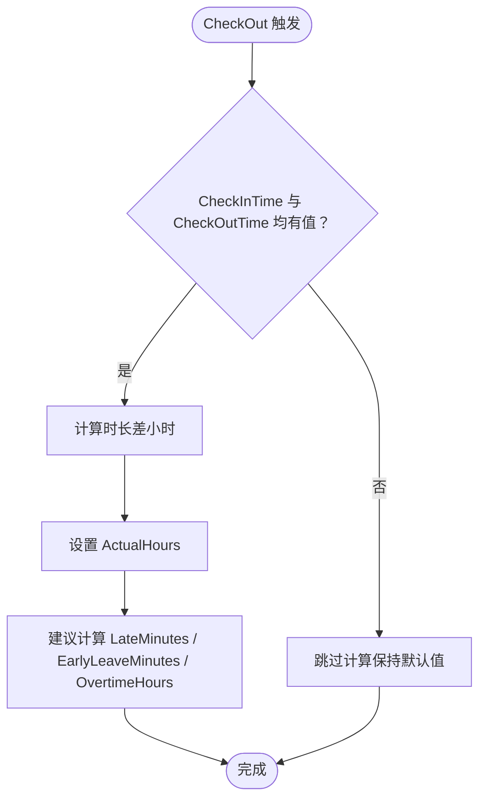
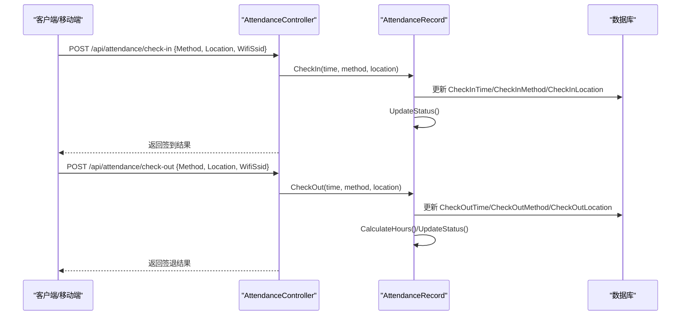
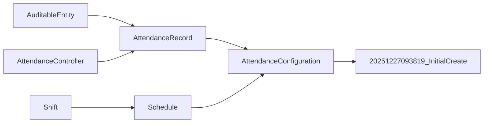

# 考勤记录表（AttendanceRecords）

<cite>
**本文引用的文件**
- [AttendanceRecord.cs](file://Backend/Hrevolve.Domain/Attendance/AttendanceRecord.cs)
- [Shift.cs](file://Backend/Hrevolve.Domain/Attendance/Shift.cs)
- [AttendanceConfiguration.cs](file://Backend/Hrevolve.Infrastructure/Persistence/Configurations/AttendanceConfiguration.cs)
- [20251227093819_InitialCreate.cs](file://Backend/Hrevolve.Infrastructure/Migrations/20251227093819_InitialCreate.cs)
- [20251227093819_InitialCreate.Designer.cs](file://Backend/Hrevolve.Infrastructure/Migrations/20251227093819_InitialCreate.Designer.cs)
- [HrevolveDbContextModelSnapshot.cs](file://Backend/Hrevolve.Infrastructure/Migrations/HrevolveDbContextModelSnapshot.cs)
- [AuditableEntity.cs](file://Backend/Hrevolve.Domain/Common/AuditableEntity.cs)
- [AttendanceController.cs](file://Backend/Hrevolve.Web/Controllers/AttendanceController.cs)
</cite>

## 目录
1. [简介](#简介)
2. [项目结构](#项目结构)
3. [核心组件](#核心组件)
4. [架构总览](#架构总览)
5. [详细组件分析](#详细组件分析)
6. [依赖关系分析](#依赖关系分析)
7. [性能考量](#性能考量)
8. [故障排查指南](#故障排查指南)
9. [结论](#结论)
10. [附录](#附录)

## 简介
本文件面向“考勤记录表（AttendanceRecords）”的数据模型进行系统化说明，重点覆盖以下方面：
- 核心字段：AttendanceDate、CheckInTime、CheckOutTime、Status 的业务含义与取值约束
- 外键关系：ScheduleId 与 Schedules 表的关联，以及如何通过该关系实现“排班与打卡”的绑定
- 计算字段：LateMinutes、EarlyLeaveMinutes、OvertimeHours 的业务来源与计算逻辑
- 打卡方式：CheckInMethod 和 CheckOutMethod 支持多种打卡方式（如 App/GPS、WiFi、设备、Web、手动），体现灵活的多源打卡能力

## 项目结构
围绕考勤记录表，涉及领域层、基础设施层与迁移脚本的关键文件如下图所示：

图表来源
- [AttendanceRecord.cs](file://Backend/Hrevolve.Domain/Attendance/AttendanceRecord.cs#L1-L191)
- [Shift.cs](file://Backend/Hrevolve.Domain/Attendance/Shift.cs#L1-L130)
- [AttendanceConfiguration.cs](file://Backend/Hrevolve.Infrastructure/Persistence/Configurations/AttendanceConfiguration.cs#L59-L106)
- [20251227093819_InitialCreate.cs](file://Backend/Hrevolve.Infrastructure/Migrations/20251227093819_InitialCreate.cs#L750-L820)
- [HrevolveDbContextModelSnapshot.cs](file://Backend/Hrevolve.Infrastructure/Migrations/HrevolveDbContextModelSnapshot.cs#L34-L101)
- [AttendanceController.cs](file://Backend/Hrevolve.Web/Controllers/AttendanceController.cs#L1-L126)

章节来源
- [AttendanceRecord.cs](file://Backend/Hrevolve.Domain/Attendance/AttendanceRecord.cs#L1-L191)
- [Shift.cs](file://Backend/Hrevolve.Domain/Attendance/Shift.cs#L1-L130)
- [AttendanceConfiguration.cs](file://Backend/Hrevolve.Infrastructure/Persistence/Configurations/AttendanceConfiguration.cs#L59-L106)
- [20251227093819_InitialCreate.cs](file://Backend/Hrevolve.Infrastructure/Migrations/20251227093819_InitialCreate.cs#L750-L820)
- [HrevolveDbContextModelSnapshot.cs](file://Backend/Hrevolve.Infrastructure/Migrations/HrevolveDbContextModelSnapshot.cs#L34-L101)
- [AttendanceController.cs](file://Backend/Hrevolve.Web/Controllers/AttendanceController.cs#L1-L126)

## 核心组件
- 考勤记录实体（AttendanceRecord）：承载单日员工的出勤事实与状态，包含签到/签退时间、方式、位置、状态、计算字段及审批信息等。
- 班次实体（Shift）：描述标准上下班时间、是否跨日、弹性上下班分钟数、休息时段等，为排班与打卡提供基准。
- EF 配置（AttendanceConfiguration）：定义表名、主键、索引、枚举转换、精度控制、外键关系等。
- 迁移脚本（20251227093819_InitialCreate）：生成 AttendanceRecords 表结构，并建立与 Schedules 的外键约束。
- 控制器（AttendanceController）：对外暴露签到/签退/补卡等接口契约，便于前端与移动端集成。

章节来源
- [AttendanceRecord.cs](file://Backend/Hrevolve.Domain/Attendance/AttendanceRecord.cs#L1-L191)
- [Shift.cs](file://Backend/Hrevolve.Domain/Attendance/Shift.cs#L1-L130)
- [AttendanceConfiguration.cs](file://Backend/Hrevolve.Infrastructure/Persistence/Configurations/AttendanceConfiguration.cs#L59-L106)
- [20251227093819_InitialCreate.cs](file://Backend/Hrevolve.Infrastructure/Migrations/20251227093819_InitialCreate.cs#L750-L820)
- [AttendanceController.cs](file://Backend/Hrevolve.Web/Controllers/AttendanceController.cs#L1-L126)

## 架构总览
下图展示“考勤记录表”在领域、配置与迁移层面的映射关系，以及与控制器的交互入口。

图表来源
- [AttendanceRecord.cs](file://Backend/Hrevolve.Domain/Attendance/AttendanceRecord.cs#L1-L191)
- [Shift.cs](file://Backend/Hrevolve.Domain/Attendance/Shift.cs#L1-L130)
- [AttendanceConfiguration.cs](file://Backend/Hrevolve.Infrastructure/Persistence/Configurations/AttendanceConfiguration.cs#L59-L106)
- [AttendanceController.cs](file://Backend/Hrevolve.Web/Controllers/AttendanceController.cs#L1-L126)

## 详细组件分析

### 数据模型字段详解
- AttendanceDate：记录某员工的某日考勤日期，作为唯一索引的一部分，确保“员工+日期”维度的唯一性。
- CheckInTime / CheckOutTime：签到/签退时间，采用带时区的时间类型；两者均允许为空，用于表示未完成或缺勤。
- CheckInMethod / CheckOutMethod：枚举类型，支持 App（GPS）、WiFi、Device（考勤机）、Manual（手动补卡）、Web 等多种方式，体现灵活的多源打卡能力。
- CheckInLocation / CheckOutLocation：签到/签退位置信息（如 GPS 坐标字符串），用于定位与合规校验。
- Status：考勤状态枚举，包括 Pending、Normal、Late、EarlyLeave、Absent、Incomplete、Leave、BusinessTrip 等，由签到/签退事件驱动更新。
- LateMinutes / EarlyLeaveMinutes：迟到与早退分钟数，当前代码中未直接计算实现，通常应结合排班 Shift 的标准上下班时间推导而来。
- ActualHours：实际工时（小时），在 CheckOut 时根据签到/签退时间差计算得出。
- OvertimeHours：加班时长（小时），当前代码中未直接计算实现，通常应基于标准工时与实际工时的差异推导。
- Remarks / IsApproved / ApprovedBy / ApprovedAt：备注与审批信息，支持补卡流程的审批闭环。

章节来源
- [AttendanceRecord.cs](file://Backend/Hrevolve.Domain/Attendance/AttendanceRecord.cs#L1-L191)
- [20251227093819_InitialCreate.Designer.cs](file://Backend/Hrevolve.Infrastructure/Migrations/20251227093819_InitialCreate.Designer.cs#L36-L103)
- [HrevolveDbContextModelSnapshot.cs](file://Backend/Hrevolve.Infrastructure/Migrations/HrevolveDbContextModelSnapshot.cs#L34-L101)

### 外键关系与排班绑定
- 外键字段：AttendanceRecords 中的 ScheduleId 指向 Schedules 表的 Id。
- 关系约束：迁移脚本中定义了从 AttendanceRecords.SchedulId 到 Schedules.Id 的外键，删除策略为 SetNull，避免级联删除影响历史考勤数据。
- 绑定机制：通过 ScheduleId 将“某员工某日”的考勤记录与“排班计划”绑定，从而在业务上实现“按排班计算迟到/早退/加班”的基础条件。

图表来源
- [20251227093819_InitialCreate.cs](file://Backend/Hrevolve.Infrastructure/Migrations/20251227093819_InitialCreate.cs#L750-L820)
- [AttendanceConfiguration.cs](file://Backend/Hrevolve.Infrastructure/Persistence/Configurations/AttendanceConfiguration.cs#L99-L103)

章节来源
- [20251227093819_InitialCreate.cs](file://Backend/Hrevolve.Infrastructure/Migrations/20251227093819_InitialCreate.cs#L750-L820)
- [AttendanceConfiguration.cs](file://Backend/Hrevolve.Infrastructure/Persistence/Configurations/AttendanceConfiguration.cs#L99-L103)

### 计算字段的业务来源与实现现状
- ActualHours：在 CheckOut 时，若签到与签退时间均存在，则按“签退时间 - 签到时间”的总小时数计算。
- LateMinutes / EarlyLeaveMinutes / OvertimeHours：当前领域模型中未直接实现这些字段的计算逻辑。它们通常应结合排班 Shift 的标准上下班时间、弹性时间与跨日规则推导而来。建议在业务层补充如下逻辑：
  - 基于 Schedule.Date + Shift.StartTime/EndTime 计算“应打时间”
  - 结合 CheckInTime/CheckOutTime 与应打时间比较，得到迟到/早退分钟数
  - 基于 ActualHours 与 Shift.StandardHours 计算加班时长
- 当前状态：这些字段在迁移脚本中存在列定义，但未在领域实体中实现自动计算，属于“待补齐”的业务逻辑。

图表来源
- [AttendanceRecord.cs](file://Backend/Hrevolve.Domain/Attendance/AttendanceRecord.cs#L138-L161)

章节来源
- [AttendanceRecord.cs](file://Backend/Hrevolve.Domain/Attendance/AttendanceRecord.cs#L138-L161)
- [20251227093819_InitialCreate.cs](file://Backend/Hrevolve.Infrastructure/Migrations/20251227093819_InitialCreate.cs#L750-L820)

### 打卡方式的灵活性设计
- CheckInMethod / CheckOutMethod 使用枚举，支持 App（GPS）、WiFi、Device（考勤机）、Manual（手动补卡）、Web 等方式，满足多终端、多场景的打卡需求。
- 控制器契约中定义了签到/签退请求体包含 Method、Location、WifiSsid 等字段，便于前端/移动端上报不同来源的打卡证据。

图表来源
- [AttendanceController.cs](file://Backend/Hrevolve.Web/Controllers/AttendanceController.cs#L11-L44)
- [AttendanceRecord.cs](file://Backend/Hrevolve.Domain/Attendance/AttendanceRecord.cs#L101-L116)

章节来源
- [AttendanceController.cs](file://Backend/Hrevolve.Web/Controllers/AttendanceController.cs#L11-L44)
- [AttendanceRecord.cs](file://Backend/Hrevolve.Domain/Attendance/AttendanceRecord.cs#L101-L116)

### 索引与唯一性约束
- 唯一索引：(TenantId, EmployeeId, AttendanceDate)，保证同一租户下“员工+日期”的考勤记录唯一。
- 辅助索引：(TenantId, AttendanceDate, Status)，便于按日期与状态筛选统计。
- 外键索引：ScheduleId，加速关联查询。

章节来源
- [AttendanceConfiguration.cs](file://Backend/Hrevolve.Infrastructure/Persistence/Configurations/AttendanceConfiguration.cs#L94-L103)
- [20251227093819_InitialCreate.cs](file://Backend/Hrevolve.Infrastructure/Migrations/20251227093819_InitialCreate.cs#L800-L810)

## 依赖关系分析
- 领域层依赖：AttendanceRecord 继承自可审计实体基类，具备多租户隔离与审计字段。
- 映射层依赖：EF 配置将枚举转换为字符串存储，限制长度并设置精度；外键指向 Schedules。
- 迁移层依赖：迁移脚本定义表结构、索引与外键约束，确保数据库一致性。
- 控制器依赖：控制器通过请求体传递 Method、Location、WifiSsid 等信息，驱动领域行为。

图表来源
- [AuditableEntity.cs](file://Backend/Hrevolve.Domain/Common/AuditableEntity.cs#L1-L48)
- [AttendanceRecord.cs](file://Backend/Hrevolve.Domain/Attendance/AttendanceRecord.cs#L1-L191)
- [Shift.cs](file://Backend/Hrevolve.Domain/Attendance/Shift.cs#L1-L130)
- [AttendanceConfiguration.cs](file://Backend/Hrevolve.Infrastructure/Persistence/Configurations/AttendanceConfiguration.cs#L59-L106)
- [20251227093819_InitialCreate.cs](file://Backend/Hrevolve.Infrastructure/Migrations/20251227093819_InitialCreate.cs#L750-L820)
- [AttendanceController.cs](file://Backend/Hrevolve.Web/Controllers/AttendanceController.cs#L1-L126)

章节来源
- [AuditableEntity.cs](file://Backend/Hrevolve.Domain/Common/AuditableEntity.cs#L1-L48)
- [AttendanceRecord.cs](file://Backend/Hrevolve.Domain/Attendance/AttendanceRecord.cs#L1-L191)
- [Shift.cs](file://Backend/Hrevolve.Domain/Attendance/Shift.cs#L1-L130)
- [AttendanceConfiguration.cs](file://Backend/Hrevolve.Infrastructure/Persistence/Configurations/AttendanceConfiguration.cs#L59-L106)
- [20251227093819_InitialCreate.cs](file://Backend/Hrevolve.Infrastructure/Migrations/20251227093819_InitialCreate.cs#L750-L820)
- [AttendanceController.cs](file://Backend/Hrevolve.Web/Controllers/AttendanceController.cs#L1-L126)

## 性能考量
- 唯一索引（TenantId, EmployeeId, AttendanceDate）：确保插入与查询高效，避免重复记录。
- 辅助索引（TenantId, AttendanceDate, Status）：支持按日期与状态快速统计。
- 字段精度控制：ActualHours/OvertimeHours 使用 numeric(5,2)，避免浮点误差累积。
- 外键删除策略：SetNull，避免删除排班导致考勤记录被级联删除，利于历史数据保留。

章节来源
- [AttendanceConfiguration.cs](file://Backend/Hrevolve.Infrastructure/Persistence/Configurations/AttendanceConfiguration.cs#L85-L103)
- [20251227093819_InitialCreate.cs](file://Backend/Hrevolve.Infrastructure/Migrations/20251227093819_InitialCreate.cs#L800-L810)

## 故障排查指南
- 签到/签退后状态异常
  - 检查 CheckInTime/CheckOutTime 是否正确写入，以及 UpdateStatus 是否被调用。
  - 若仅签到或仅签退，状态应为 Incomplete；若均未发生则为 Absent。
- 计算字段未更新
  - 确认 CheckOut 已触发 CalculateHours；LateMinutes/EarlyLeaveMinutes/OvertimeHours 需要在业务层补齐计算逻辑。
- 外键关联问题
  - 确认 ScheduleId 存在且未被删除（因删除策略为 SetNull）；检查 Schedules 表是否存在对应记录。
- 打卡方式识别
  - 确认请求体中的 Method 与 Location/WifiSsid 是否正确传入；后端会据此更新 CheckInMethod/CheckOutMethod 与位置信息。

章节来源
- [AttendanceRecord.cs](file://Backend/Hrevolve.Domain/Attendance/AttendanceRecord.cs#L101-L161)
- [20251227093819_InitialCreate.cs](file://Backend/Hrevolve.Infrastructure/Migrations/20251227093819_InitialCreate.cs#L787-L793)
- [AttendanceController.cs](file://Backend/Hrevolve.Web/Controllers/AttendanceController.cs#L11-L44)

## 结论
- AttendanceRecords 表以“员工+日期”为核心维度，结合 ScheduleId 与 Shift 提供排班绑定的基础能力。
- 当前实现了签到/签退时间与方式、位置、状态、实际工时等关键字段；迟到/早退/加班等计算字段需在业务层补齐。
- 打卡方式的枚举设计体现了多源、多终端的灵活性，配合控制器契约可支撑移动端与 Web 的多样化接入。
- 建议尽快完善 LateMinutes/EarlyLeaveMinutes/OvertimeHours 的计算逻辑，并在查询侧充分利用现有索引提升统计效率。

## 附录
- 多租户与审计字段：所有实体继承自 AuditableEntity，具备 TenantId、创建/更新/删除审计字段，便于多租户隔离与审计追踪。
- 控制器接口：提供签到、签退、补卡、统计等接口契约，便于前后端协同开发。

章节来源
- [AuditableEntity.cs](file://Backend/Hrevolve.Domain/Common/AuditableEntity.cs#L1-L48)
- [AttendanceController.cs](file://Backend/Hrevolve.Web/Controllers/AttendanceController.cs#L1-L126)