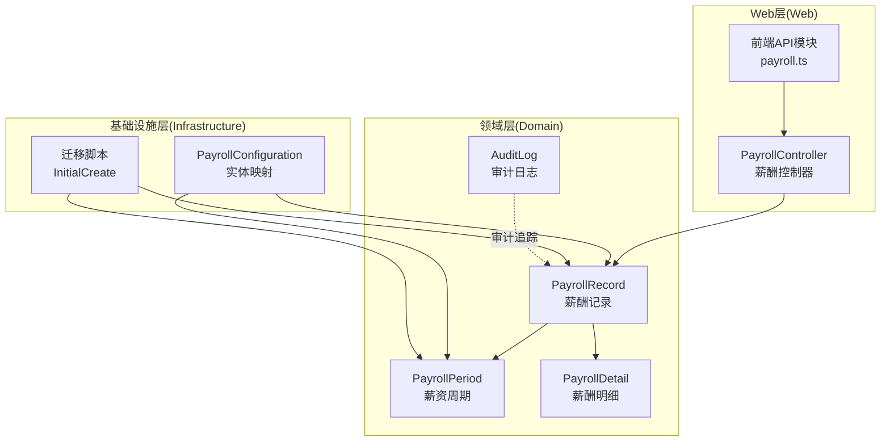
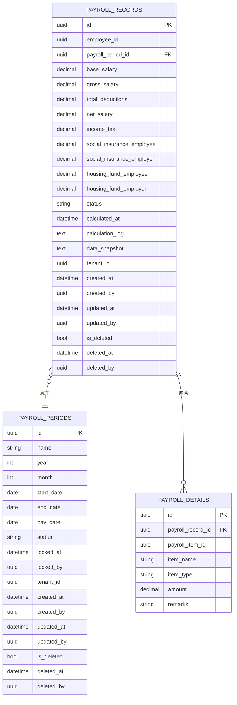
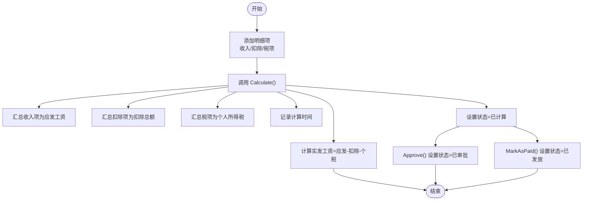
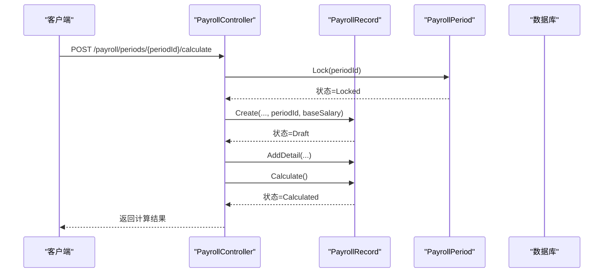
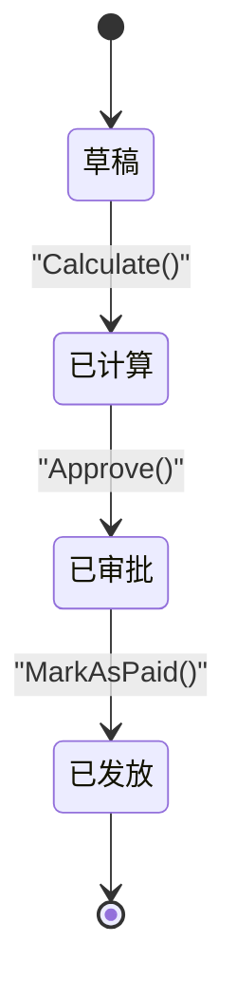
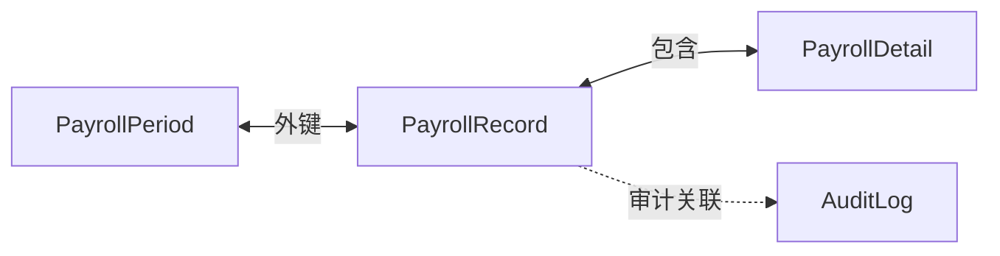

# 薪酬记录表 (PayrollRecords)

<cite>
**本文引用的文件**
- [PayrollRecord.cs](file://Backend/Hrevolve.Domain/Payroll/PayrollRecord.cs)
- [PayrollPeriod.cs](file://Backend/Hrevolve.Domain/Payroll/PayrollPeriod.cs)
- [PayrollConfiguration.cs](file://Backend/Hrevolve.Infrastructure/Persistence/Configurations/PayrollConfiguration.cs)
- [20251227093819_InitialCreate.cs](file://Backend/Hrevolve.Infrastructure/Migrations/20251227093819_InitialCreate.cs)
- [PayrollController.cs](file://Backend/Hrevolve.Web/Controllers/PayrollController.cs)
- [payroll.ts](file://Backend/Hrevolve.Web/Controllers/PayrollController.cs)
- [AuditLog.cs](file://Backend/Hrevolve.Domain/Audit/AuditLog.cs)
- [AuditLogConfiguration.cs](file://Backend/Hrevolve.Infrastructure/Persistence/Configurations/AuditLogConfiguration.cs)
- [HrevolveDbContextModelSnapshot.cs](file://Backend/Hrevolve.Infrastructure/Migrations/HrevolveDbContextModelSnapshot.cs)
</cite>

## 目录
1. [简介](#简介)
2. [项目结构](#项目结构)
3. [核心组件](#核心组件)
4. [架构总览](#架构总览)
5. [详细组件分析](#详细组件分析)
6. [依赖关系分析](#依赖关系分析)
7. [性能考量](#性能考量)
8. [故障排查指南](#故障排查指南)
9. [结论](#结论)

## 简介
本文件聚焦于薪酬记录表 PayrollRecords 的数据模型与业务流程，围绕以下目标展开：
- 明确 BaseSalary、GrossSalary、NetSalary、IncomeTax、SocialInsuranceEmployee 等核心薪酬字段的含义与计算逻辑
- 解释 PayrollPeriodId 外键与 PayrollPeriods 表的关联，确保薪酬计算的周期性
- 阐述 CalculationLog 与 DataSnapshot 字段在薪酬计算过程追溯与审计中的关键作用
- 说明 Status 字段如何管理薪酬记录的状态流转（草稿、已计算、已审批、已发放）

## 项目结构
- 后端采用分层架构：Domain（领域）、Infrastructure（基础设施）、Application（应用）、Web（接口）、Agent（AI代理）、Shared（共享）
- 薪酬相关的核心实体位于 Domain 层，数据持久化与约束定义位于 Infrastructure 层，API 控制器位于 Web 层

图表来源
- [PayrollRecord.cs](file://Backend/Hrevolve.Domain/Payroll/PayrollRecord.cs#L1-L162)
- [PayrollPeriod.cs](file://Backend/Hrevolve.Domain/Payroll/PayrollPeriod.cs#L1-L158)
- [PayrollConfiguration.cs](file://Backend/Hrevolve.Infrastructure/Persistence/Configurations/PayrollConfiguration.cs#L68-L122)
- [20251227093819_InitialCreate.cs](file://Backend/Hrevolve.Infrastructure/Migrations/20251227093819_InitialCreate.cs#L554-L592)
- [PayrollController.cs](file://Backend/Hrevolve.Web/Controllers/PayrollController.cs#L1-L131)
- [payroll.ts](file://Backend/Hrevolve.Web/Controllers/PayrollController.cs#L1-L35)
- [AuditLog.cs](file://Backend/Hrevolve.Domain/Audit/AuditLog.cs#L51-L107)
- [AuditLogConfiguration.cs](file://Backend/Hrevolve.Infrastructure/Persistence/Configurations/AuditLogConfiguration.cs#L1-L55)

章节来源
- [PayrollRecord.cs](file://Backend/Hrevolve.Domain/Payroll/PayrollRecord.cs#L1-L162)
- [PayrollPeriod.cs](file://Backend/Hrevolve.Domain/Payroll/PayrollPeriod.cs#L1-L158)
- [PayrollConfiguration.cs](file://Backend/Hrevolve.Infrastructure/Persistence/Configurations/PayrollConfiguration.cs#L68-L122)
- [20251227093819_InitialCreate.cs](file://Backend/Hrevolve.Infrastructure/Migrations/20251227093819_InitialCreate.cs#L554-L592)
- [PayrollController.cs](file://Backend/Hrevolve.Web/Controllers/PayrollController.cs#L1-L131)
- [payroll.ts](file://Backend/Hrevolve.Web/Controllers/PayrollController.cs#L1-L35)
- [AuditLog.cs](file://Backend/Hrevolve.Domain/Audit/AuditLog.cs#L51-L107)
- [AuditLogConfiguration.cs](file://Backend/Hrevolve.Infrastructure/Persistence/Configurations/AuditLogConfiguration.cs#L1-L55)

## 核心组件
- PayrollRecord（薪酬记录）
  - 关键字段：BaseSalary、GrossSalary、TotalDeductions、NetSalary、IncomeTax、SocialInsuranceEmployee、SocialInsuranceEmployer、HousingFundEmployee、HousingFundEmployer、Status、CalculatedAt、CalculationLog、DataSnapshot
  - 计算逻辑：Calculate() 基于明细项汇总计算应发、扣除、个税与实发，并更新状态与时点
- PayrollPeriod（薪资周期）
  - 关键字段：Year、Month、StartDate、EndDate、PayDate、Status、LockedAt、LockedBy
  - 周期管理：Lock() 将周期锁定，配合薪酬记录状态形成“周期-记录”的闭环
- PayrollDetail（薪酬明细）
  - 关键字段：PayrollRecordId、PayrollItemId、ItemName、ItemType、Amount、Remarks
  - 类型：Earning/Deduction/Benefit/Tax
- PayrollConfiguration（实体映射）
  - 对 PayrollRecord 的字段精度、索引、外键约束进行配置
- 迁移脚本（InitialCreate）
  - 定义 PayrollRecords 与 PayrollPeriods 的表结构及外键关系
- AuditLog（审计日志）
  - 用于审计追踪，支持按租户、实体类型/ID、时间等维度检索

章节来源
- [PayrollRecord.cs](file://Backend/Hrevolve.Domain/Payroll/PayrollRecord.cs#L1-L162)
- [PayrollPeriod.cs](file://Backend/Hrevolve.Domain/Payroll/PayrollPeriod.cs#L1-L158)
- [PayrollConfiguration.cs](file://Backend/Hrevolve.Infrastructure/Persistence/Configurations/PayrollConfiguration.cs#L68-L122)
- [20251227093819_InitialCreate.cs](file://Backend/Hrevolve.Infrastructure/Migrations/20251227093819_InitialCreate.cs#L554-L592)
- [AuditLog.cs](file://Backend/Hrevolve.Domain/Audit/AuditLog.cs#L51-L107)
- [AuditLogConfiguration.cs](file://Backend/Hrevolve.Infrastructure/Persistence/Configurations/AuditLogConfiguration.cs#L1-L55)

## 架构总览
薪酬记录与周期的关系通过外键约束保证，计算过程由领域模型驱动，审计日志贯穿关键变更。

图表来源
- [20251227093819_InitialCreate.cs](file://Backend/Hrevolve.Infrastructure/Migrations/20251227093819_InitialCreate.cs#L230-L252)
- [20251227093819_InitialCreate.cs](file://Backend/Hrevolve.Infrastructure/Migrations/20251227093819_InitialCreate.cs#L554-L592)
- [20251227093819_InitialCreate.cs](file://Backend/Hrevolve.Infrastructure/Migrations/20251227093819_InitialCreate.cs#L730-L750)
- [PayrollConfiguration.cs](file://Backend/Hrevolve.Infrastructure/Persistence/Configurations/PayrollConfiguration.cs#L68-L122)

## 详细组件分析

### PayrollRecord（薪酬记录）数据模型与计算逻辑
- 字段说明
  - BaseSalary：基本工资（作为初始输入）
  - GrossSalary：应发工资（收入项合计）
  - TotalDeductions：扣除总额（扣除项合计）
  - NetSalary：实发工资（应发-扣除-个税）
  - IncomeTax：个人所得税（税项合计）
  - SocialInsuranceEmployee/SocialInsuranceEmployer：社保个人/公司部分
  - HousingFundEmployee/HousingFundEmployer：公积金个人/公司部分
  - Status：记录状态（Draft/Calculated/Approved/Paid）
  - CalculatedAt：计算完成时间
  - CalculationLog：计算日志（JSON），用于记录计算步骤与参数
  - DataSnapshot：数据快照（JSON），用于审计对比
- 计算流程
  - 通过 AddDetail(...) 添加明细项（含类型与金额）
  - 调用 Calculate() 汇总明细，计算 GrossSalary、TotalDeductions、IncomeTax、NetSalary，并设置 CalculatedAt 与 Status=Calculated
  - Approve() 将状态推进至 Approved
  - MarkAsPaid() 将状态推进至 Paid

图表来源
- [PayrollRecord.cs](file://Backend/Hrevolve.Domain/Payroll/PayrollRecord.cs#L100-L124)

章节来源
- [PayrollRecord.cs](file://Backend/Hrevolve.Domain/Payroll/PayrollRecord.cs#L1-L162)

### PayrollPeriod（薪资周期）与外键关联
- PayrollRecord.PayrollPeriodId 引用 PayrollPeriod.Id
- PayrollPeriod.Status 与锁定机制（Lock）影响薪酬记录的可用性与审批流程
- 唯一索引：TenantId + Year + Month，避免重复周期

图表来源
- [PayrollController.cs](file://Backend/Hrevolve.Web/Controllers/PayrollController.cs#L41-L50)
- [PayrollPeriod.cs](file://Backend/Hrevolve.Domain/Payroll/PayrollPeriod.cs#L61-L66)
- [PayrollRecord.cs](file://Backend/Hrevolve.Domain/Payroll/PayrollRecord.cs#L84-L98)
- [PayrollRecord.cs](file://Backend/Hrevolve.Domain/Payroll/PayrollRecord.cs#L100-L113)

章节来源
- [PayrollPeriod.cs](file://Backend/Hrevolve.Domain/Payroll/PayrollPeriod.cs#L1-L158)
- [20251227093819_InitialCreate.cs](file://Backend/Hrevolve.Infrastructure/Migrations/20251227093819_InitialCreate.cs#L230-L252)
- [20251227093819_InitialCreate.cs](file://Backend/Hrevolve.Infrastructure/Migrations/20251227093819_InitialCreate.cs#L554-L592)
- [PayrollConfiguration.cs](file://Backend/Hrevolve.Infrastructure/Persistence/Configurations/PayrollConfiguration.cs#L103-L119)

### CalculationLog 与 DataSnapshot 的审计与追溯
- CalculationLog（JSON）：记录计算过程的关键参数与步骤，便于复盘与问题定位
- DataSnapshot（JSON）：记录薪酬计算前后的关键数据快照，用于审计比对
- 建议在 Calculate() 时写入 CalculationLog 与 DataSnapshot，确保审计完整性

章节来源
- [PayrollRecord.cs](file://Backend/Hrevolve.Domain/Payroll/PayrollRecord.cs#L61-L74)
- [AuditLog.cs](file://Backend/Hrevolve.Domain/Audit/AuditLog.cs#L51-L107)
- [AuditLogConfiguration.cs](file://Backend/Hrevolve.Infrastructure/Persistence/Configurations/AuditLogConfiguration.cs#L1-L55)
- [HrevolveDbContextModelSnapshot.cs](file://Backend/Hrevolve.Infrastructure/Migrations/HrevolveDbContextModelSnapshot.cs#L302-L342)

### Status 字段的状态流转与业务流程
- Draft：草稿，尚未计算
- Calculated：已计算，等待审批
- Approved：已审批，准备发放
- Paid：已发放，完成结算
- 前端 API 模块提供“计算薪资”、“审批薪资”等入口，控制器标注了权限注解

图表来源
- [PayrollRecord.cs](file://Backend/Hrevolve.Domain/Payroll/PayrollRecord.cs#L126-L132)
- [PayrollController.cs](file://Backend/Hrevolve.Web/Controllers/PayrollController.cs#L41-L50)
- [payroll.ts](file://Backend/Hrevolve.Web/Controllers/PayrollController.cs#L26-L35)

章节来源
- [PayrollRecord.cs](file://Backend/Hrevolve.Domain/Payroll/PayrollRecord.cs#L126-L132)
- [PayrollController.cs](file://Backend/Hrevolve.Web/Controllers/PayrollController.cs#L1-L131)
- [payroll.ts](file://Backend/Hrevolve.Web/Controllers/PayrollController.cs#L1-L35)

## 依赖关系分析
- PayrollRecord 与 PayrollPeriod 的外键关系由迁移脚本与实体映射共同保障
- PayrollRecord 与 PayrollDetails 为一对多关系，明细项驱动计算
- 审计日志与薪酬记录无直接外键，但可通过实体类型/ID进行关联查询

图表来源
- [20251227093819_InitialCreate.cs](file://Backend/Hrevolve.Infrastructure/Migrations/20251227093819_InitialCreate.cs#L554-L592)
- [20251227093819_InitialCreate.cs](file://Backend/Hrevolve.Infrastructure/Migrations/20251227093819_InitialCreate.cs#L730-L750)
- [AuditLogConfiguration.cs](file://Backend/Hrevolve.Infrastructure/Persistence/Configurations/AuditLogConfiguration.cs#L47-L52)

章节来源
- [PayrollConfiguration.cs](file://Backend/Hrevolve.Infrastructure/Persistence/Configurations/PayrollConfiguration.cs#L68-L122)
- [20251227093819_InitialCreate.cs](file://Backend/Hrevolve.Infrastructure/Migrations/20251227093819_InitialCreate.cs#L554-L592)
- [20251227093819_InitialCreate.cs](file://Backend/Hrevolve.Infrastructure/Migrations/20251227093819_InitialCreate.cs#L730-L750)
- [AuditLogConfiguration.cs](file://Backend/Hrevolve.Infrastructure/Persistence/Configurations/AuditLogConfiguration.cs#L47-L52)

## 性能考量
- 字段精度：所有金额字段均使用高精度（18,2），避免浮点误差
- 索引设计：PayrollRecord 的 TenantId + EmployeeId + PayrollPeriodId 唯一索引，确保按周期与员工唯一性；PayrollPeriod 的 TenantId + Year + Month 唯一索引，避免重复周期
- 外键约束：PayrollRecord.PayrollPeriodId 采用 Restrict 删除行为，防止误删周期导致记录悬挂

章节来源
- [PayrollConfiguration.cs](file://Backend/Hrevolve.Infrastructure/Persistence/Configurations/PayrollConfiguration.cs#L76-L108)
- [20251227093819_InitialCreate.cs](file://Backend/Hrevolve.Infrastructure/Migrations/20251227093819_InitialCreate.cs#L554-L592)

## 故障排查指南
- 计算失败或结果异常
  - 检查 CalculationLog 与 DataSnapshot 是否存在，确认计算步骤与输入是否一致
  - 核对明细项类型（收入/扣除/税项）与金额是否正确
- 状态不一致
  - 确认是否执行了 Approve() 与 MarkAsPaid()，以及调用顺序
- 周期锁定问题
  - PayrollPeriod.Lock() 后，薪酬记录不应再被修改；若仍出现异常，检查前端是否绕过锁定流程
- 审计追踪
  - 使用 AuditLog 的索引（按租户、实体类型/ID、时间）快速定位相关变更

章节来源
- [PayrollRecord.cs](file://Backend/Hrevolve.Domain/Payroll/PayrollRecord.cs#L100-L124)
- [PayrollPeriod.cs](file://Backend/Hrevolve.Domain/Payroll/PayrollPeriod.cs#L61-L66)
- [AuditLogConfiguration.cs](file://Backend/Hrevolve.Infrastructure/Persistence/Configurations/AuditLogConfiguration.cs#L47-L52)

## 结论
- PayrollRecords 表通过明细项驱动计算，核心字段清晰对应应发、扣除、个税与实发
- PayrollPeriodId 外键确保薪酬记录与周期强关联，结合周期锁定机制形成稳定的业务闭环
- CalculationLog 与 DataSnapshot 为薪酬计算提供了可追溯与可审计的数据基础
- Status 字段的状态机驱动了从计算到审批再到发放的完整流程，建议在前端与后端严格遵循该流程