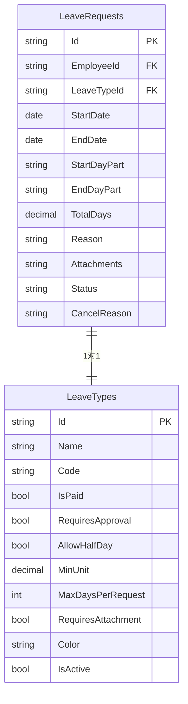
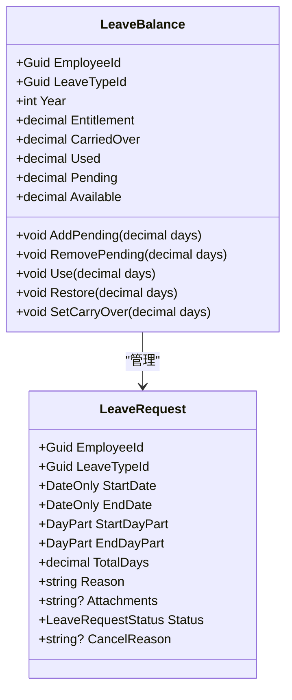
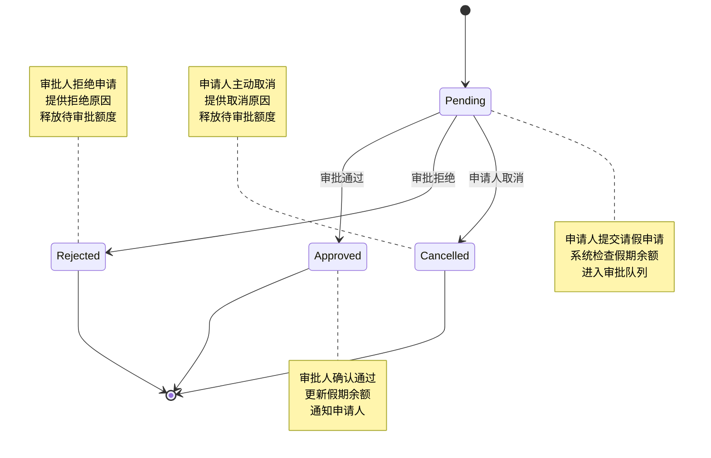

# 请假申请表 (LeaveRequests)

<cite>
**本文档引用文件**   
- [LeaveRequest.cs](file://Backend/Hrevolve.Domain/Leave/LeaveRequest.cs)
- [LeaveType.cs](file://Backend/Hrevolve.Domain/Leave/LeaveType.cs)
- [LeaveConfiguration.cs](file://Backend/Hrevolve.Infrastructure/Persistence/Configurations/LeaveConfiguration.cs)
- [20251227093819_InitialCreate.cs](file://Backend/Hrevolve.Infrastructure/Migrations/20251227093819_InitialCreate.cs)
- [CreateLeaveRequestCommand.cs](file://Backend/Hrevolve.Application/Leave/Commands/CreateLeaveRequestCommand.cs)
- [LeaveController.cs](file://Backend/Hrevolve.Web/Controllers/LeaveController.cs)
</cite>

## 目录
1. [请假时间字段设计](#请假时间字段设计)
2. [假期类型关联](#假期类型关联)
3. [假期余额管理](#假期余额管理)
4. [状态机流转](#状态机流转)
5. [附件上传实现](#附件上传实现)

## 请假时间字段设计

请假申请表中的时间相关字段设计旨在精确计算请假天数，支持灵活的请假时段选择。核心字段包括：

- **StartDate (开始日期)**: 请假的起始日期，使用 `DateOnly` 类型确保日期精度
- **EndDate (结束日期)**: 请假的结束日期，与开始日期共同确定请假周期
- **StartDayPart (开始时段)**: 表示请假开始的具体时段，支持全天、上午、下午三种选择
- **EndDayPart (结束时段)**: 表示请假结束的具体时段，与开始时段配合实现精确计算
- **TotalDays (总天数)**: 自动计算的请假总天数，考虑了开始和结束时段的影响

系统通过 `CalculateTotalDays` 方法计算实际请假天数。计算逻辑如下：
1. 基础天数 = 结束日期序号 - 开始日期序号 + 1
2. 如果开始时段为"下午"，则减去0.5天
3. 如果结束时段为"上午"，则减去0.5天

这种设计允许员工申请半天假期，提高了假期管理的灵活性。例如，员工可以在周五下午开始休假，周一上午返回工作，系统会自动计算为2.5天假期。

**Section sources**
- [LeaveRequest.cs](file://Backend/Hrevolve.Domain/Leave/LeaveRequest.cs#L17-L37)
- [CreateLeaveRequestCommand.cs](file://Backend/Hrevolve.Application/Leave/Commands/CreateLeaveRequestCommand.cs#L127-L134)

## 假期类型关联

请假申请表通过外键 `LeaveTypeId` 与 `LeaveTypes` 表建立关联，实现了不同假期类型的灵活管理。这种设计模式遵循了数据库规范化原则，避免了数据冗余。

`LeaveType` 实体包含以下关键属性：
- **Name**: 假期类型的名称（如年假、病假、事假）
- **Code**: 唯一的假期类型代码，用于系统内部识别
- **IsPaid**: 布尔值，指示该假期是否带薪
- **RequiresApproval**: 是否需要审批流程
- **AllowHalfDay**: 是否允许申请半天假期
- **MinUnit**: 最小请假单位（小时）
- **MaxDaysPerRequest**: 单次申请的最大天数限制
- **RequiresAttachment**: 是否需要上传证明附件
- **Color**: 在日历视图中显示的颜色标识

当创建请假申请时，系统会验证所选假期类型的有效性，确保 `LeaveTypeId` 对应的假期类型存在且处于激活状态。这种关联设计使得管理员可以灵活配置不同类型的假期规则，而无需修改核心代码。

**Diagram sources**
- [LeaveRequest.cs](file://Backend/Hrevolve.Domain/Leave/LeaveRequest.cs#L10-L12)
- [LeaveType.cs](file://Backend/Hrevolve.Domain/Leave/LeaveType.cs#L8-L50)
- [20251227093819_InitialCreate.cs](file://Backend/Hrevolve.Infrastructure/Migrations/20251227093819_InitialCreate.cs#L485-L507)

**Section sources**
- [LeaveRequest.cs](file://Backend/Hrevolve.Domain/Leave/LeaveRequest.cs#L10-L12)
- [LeaveType.cs](file://Backend/Hrevolve.Domain/Leave/LeaveType.cs#L8-L50)

## 假期余额管理

系统通过 `LeaveBalance` 实体实现假期余额的精细化管理，确保员工不会超出其可用假期额度。`LeaveBalance` 表与 `LeaveRequests` 表协同工作，形成完整的假期管理闭环。

`LeaveBalance` 实体包含以下核心字段：
- **Entitlement**: 年度基础额度
- **CarriedOver**: 从上一年度结转的额度
- **Used**: 已使用的假期天数
- **Pending**: 待审批的假期天数
- **Available**: 可用余额，计算公式为：`Entitlement + CarriedOver - Used - Pending`

系统在创建请假申请时执行余额检查流程：
1. 查询员工当前年度的假期余额
2. 计算本次申请的假期天数
3. 验证可用余额是否充足
4. 如果余额充足，将申请天数添加到 `Pending` 状态

当请假申请获得批准时，系统会调用 `Use` 方法，将 `Pending` 天数转移到 `Used` 天数；如果申请被拒绝或取消，则调用 `RemovePending` 方法，将天数从 `Pending` 状态移除。

这种设计确保了假期余额的实时性和准确性，防止了超额请假的情况发生。

**Diagram sources**
- [LeaveRequest.cs](file://Backend/Hrevolve.Domain/Leave/LeaveRequest.cs#L169-L229)
- [CreateLeaveRequestCommand.cs](file://Backend/Hrevolve.Application/Leave/Commands/CreateLeaveRequestCommand.cs#L73-L85)

**Section sources**
- [LeaveRequest.cs](file://Backend/Hrevolve.Domain/Leave/LeaveRequest.cs#L169-L229)
- [CreateLeaveRequestCommand.cs](file://Backend/Hrevolve.Application/Leave/Commands/CreateLeaveRequestCommand.cs#L70-L85)

## 状态机流转

请假申请的状态管理采用状态机模式，通过 `Status` 字段实现清晰的审批流程控制。系统定义了四种主要状态，形成完整的状态流转闭环。

**状态定义**:
- **Pending (待审批)**: 请假申请已提交，等待审批人处理
- **Approved (已批准)**: 请假申请已获得批准
- **Rejected (已拒绝)**: 请假申请被审批人拒绝
- **Cancelled (已取消)**: 申请人主动取消请假申请

状态流转流程如下：
1. 创建请假申请时，状态初始化为 `Pending`
2. 审批人批准申请时，状态变为 `Approved`
3. 审批人拒绝申请时，状态变为 `Rejected`
4. 申请人在审批完成前取消申请，状态变为 `Cancelled`

系统通过领域方法实现状态转换，确保状态变更的业务逻辑集中管理。例如，`Approve` 方法不仅更新状态，还会触发 `LeaveRequestApprovedEvent` 领域事件，通知相关系统组件。

这种设计确保了状态流转的可控性和可追溯性，避免了非法状态转换。同时，每个状态变更都会记录在审计日志中，满足合规性要求。

**Diagram sources**
- [LeaveRequest.cs](file://Backend/Hrevolve.Domain/Leave/LeaveRequest.cs#L49-L120)
- [LeaveRequest.cs](file://Backend/Hrevolve.Domain/Leave/LeaveRequest.cs#L130-L136)

**Section sources**
- [LeaveRequest.cs](file://Backend/Hrevolve.Domain/Leave/LeaveRequest.cs#L49-L120)

## 附件上传实现

系统通过 `Attachments` 字段支持多附件上传功能，满足不同假期类型对证明材料的要求。该字段设计体现了灵活性和扩展性。

**实现方式**:
- **字段类型**: `Attachments` 字段为可空字符串类型，用于存储附件信息的JSON序列化数据
- **数据结构**: 采用JSON格式存储多个附件的元数据，包括附件名称、URL、上传时间等信息
- **前端集成**: 在请假申请表单中提供文件上传组件，支持多文件选择
- **后端处理**: 接收上传文件，存储到文件服务器或云存储，生成访问URL并保存到数据库

`LeaveType` 实体中的 `RequiresAttachment` 属性决定了特定假期类型是否强制要求上传附件。例如，病假可能需要医疗证明，而年假则不需要。系统在提交申请时会根据此属性进行验证。

附件功能在请假流程中的作用包括：
1. **合规性支持**: 为需要证明材料的假期类型提供证据支持
2. **审批辅助**: 为审批人提供决策依据，提高审批质量
3. **审计追踪**: 保留完整的申请证据链，满足审计要求
4. **纠纷预防**: 在发生争议时提供客观证据

这种设计平衡了用户体验和管理需求，既允许必要的证明材料上传，又不会对简单假期申请造成不必要的负担。

**Section sources**
- [LeaveRequest.cs](file://Backend/Hrevolve.Domain/Leave/LeaveRequest.cs#L44-L47)
- [LeaveType.cs](file://Backend/Hrevolve.Domain/Leave/LeaveType.cs#L40-L42)
- [CreateLeaveRequestCommand.cs](file://Backend/Hrevolve.Application/Leave/Commands/CreateLeaveRequestCommand.cs#L14-L15)