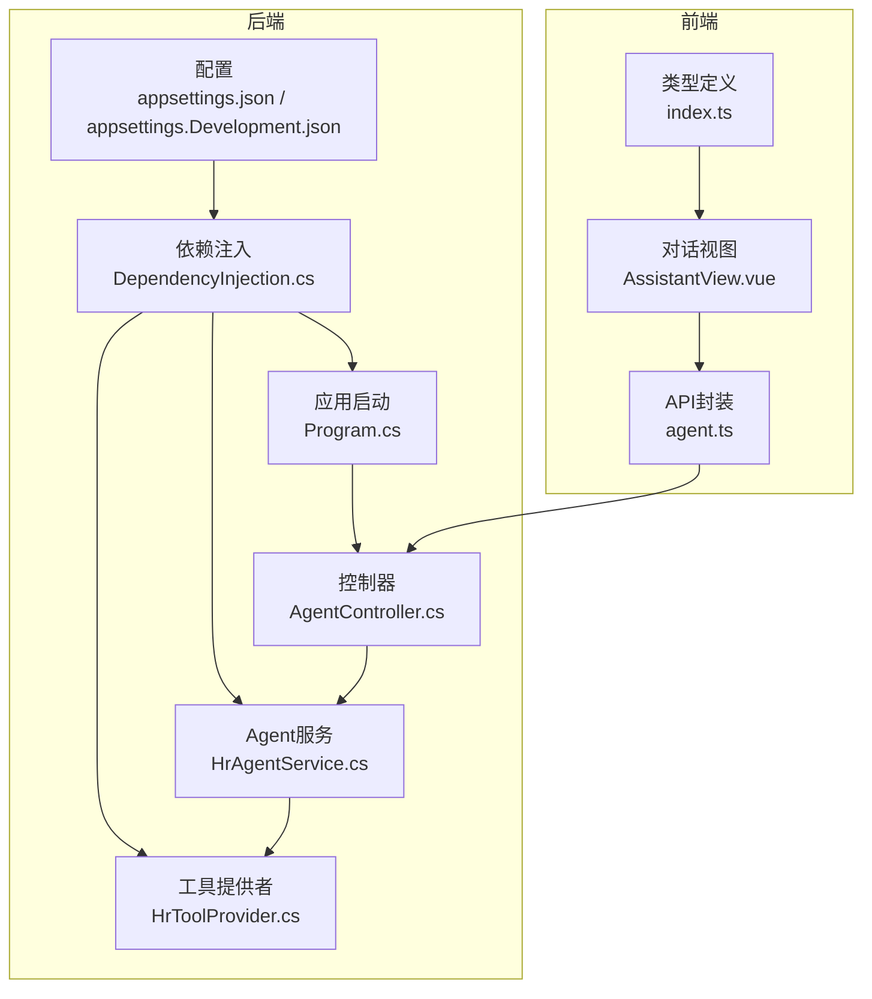
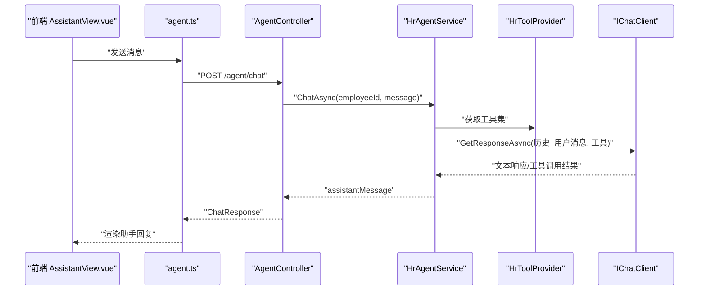
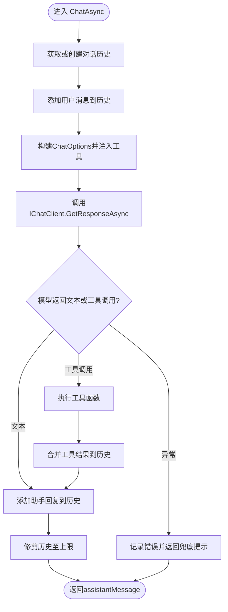
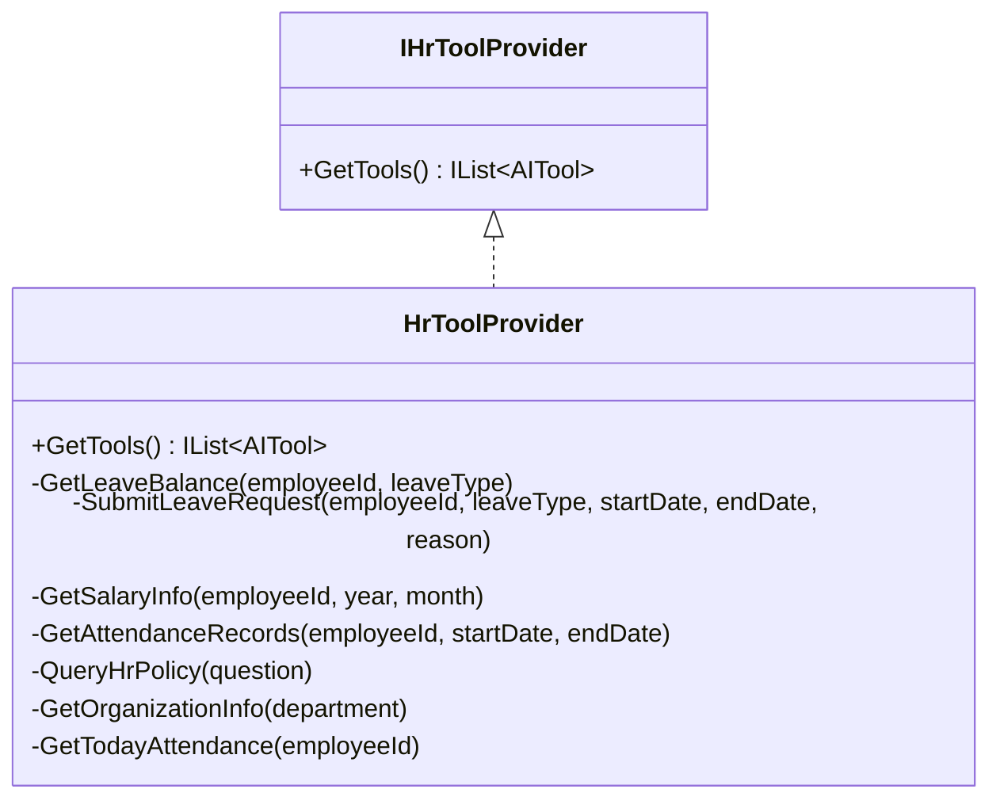
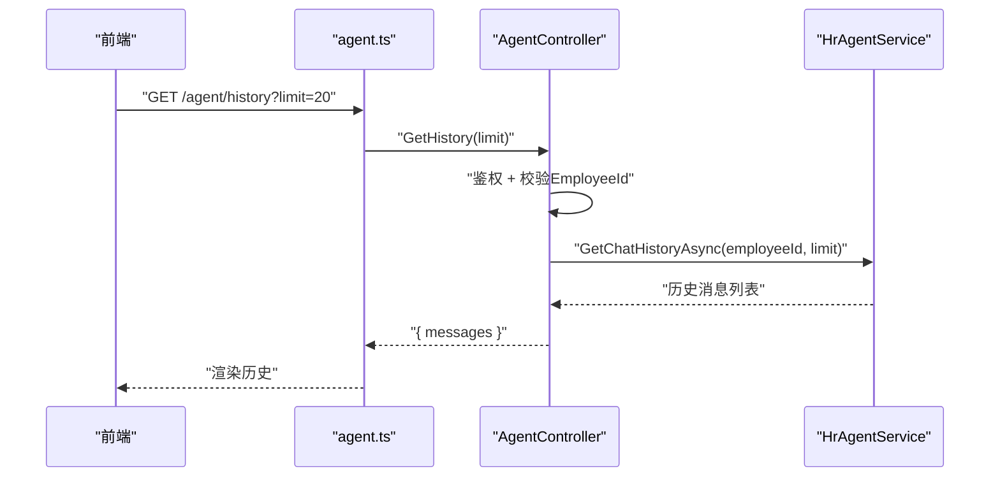
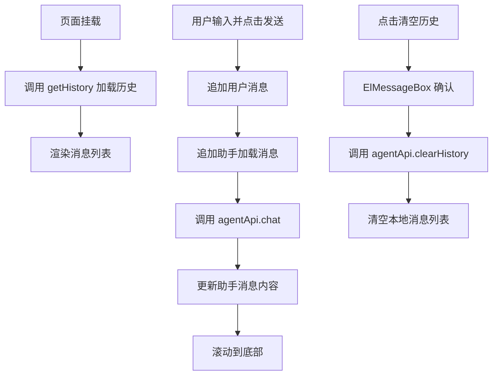
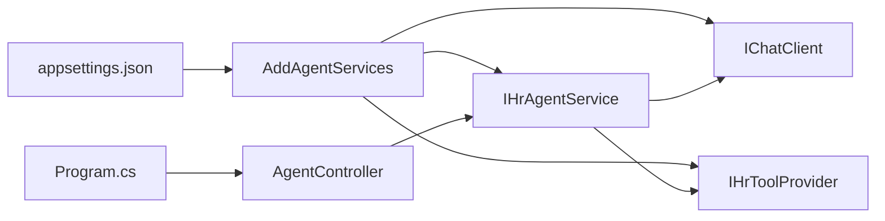

# AI助手

<cite>
**本文引用的文件**
- [HrAgentService.cs](file://Backend/Hrevolve.Agent/Services/HrAgentService.cs)
- [HrToolProvider.cs](file://Backend/Hrevolve.Agent/Services/HrToolProvider.cs)
- [AgentController.cs](file://Backend/Hrevolve.Web/Controllers/AgentController.cs)
- [DependencyInjection.cs](file://Backend/Hrevolve.Agent/DependencyInjection.cs)
- [Program.cs](file://Backend/Hrevolve.Web/Program.cs)
- [appsettings.json](file://Backend/Hrevolve.Web/appsettings.json)
- [appsettings.Development.json](file://Backend/Hrevolve.Web/appsettings.Development.json)
- [AssistantView.vue](file://Frontend/hrevolve-web/src/views/assistant/AssistantView.vue)
- [agent.ts](file://Frontend/hrevolve-web/src/api/modules/agent.ts)
- [index.ts](file://Frontend/hrevolve-web/src/types/index.ts)
</cite>

## 目录
1. [简介](#简介)
2. [项目结构](#项目结构)
3. [核心组件](#核心组件)
4. [架构总览](#架构总览)
5. [详细组件分析](#详细组件分析)
6. [依赖关系分析](#依赖关系分析)
7. [性能考虑](#性能考虑)
8. [故障排查指南](#故障排查指南)
9. [结论](#结论)
10. [附录](#附录)

## 简介
本文件面向开发与运维人员，系统性阐述基于 Microsoft Agent Framework 的 HR 智能助手模块设计与实现，涵盖：
- 自然语言理解、意图识别与响应生成机制
- HR 业务工具集成（查询员工信息、提交请假等）
- AgentController 的 API 设计与安全验证
- 前端 AssistantView.vue 的对话界面实现与用户体验设计
- 实际对话流程示例、上下文管理、对话历史存储与性能监控策略

## 项目结构
该模块横跨后端 Agent 层、Web 控制器层、前端视图与 API 层，并通过依赖注入与配置文件实现解耦与可替换性。

图表来源
- [DependencyInjection.cs](file://Backend/Hrevolve.Agent/DependencyInjection.cs#L1-L74)
- [Program.cs](file://Backend/Hrevolve.Web/Program.cs#L101-L110)
- [appsettings.json](file://Backend/Hrevolve.Web/appsettings.json#L1-L39)
- [AgentController.cs](file://Backend/Hrevolve.Web/Controllers/AgentController.cs#L1-L87)
- [HrAgentService.cs](file://Backend/Hrevolve.Agent/Services/HrAgentService.cs#L1-L151)
- [HrToolProvider.cs](file://Backend/Hrevolve.Agent/Services/HrToolProvider.cs#L1-L250)
- [AssistantView.vue](file://Frontend/hrevolve-web/src/views/assistant/AssistantView.vue#L1-L550)
- [agent.ts](file://Frontend/hrevolve-web/src/api/modules/agent.ts#L1-L21)
- [index.ts](file://Frontend/hrevolve-web/src/types/index.ts#L670-L690)

章节来源
- [DependencyInjection.cs](file://Backend/Hrevolve.Agent/DependencyInjection.cs#L1-L74)
- [Program.cs](file://Backend/Hrevolve.Web/Program.cs#L101-L110)
- [appsettings.json](file://Backend/Hrevolve.Web/appsettings.json#L1-L39)

## 核心组件
- HrAgentService：基于 Microsoft.Extensions.AI 的统一抽象层，负责对话历史管理、工具注入与模型调用，返回自然语言响应。
- HrToolProvider：提供一组 AI 可调用的 HR 工具函数，覆盖假期余额、请假申请、薪资、考勤、HR 政策、组织架构、今日考勤等。
- AgentController：受保护的 API 控制器，提供聊天、历史查询与清空历史接口，依赖当前用户上下文获取员工标识。
- 前端 AssistantView.vue：提供对话输入、快捷建议、历史加载、清空历史与滚动行为，配合 agent.ts 与后端 API 交互。

章节来源
- [HrAgentService.cs](file://Backend/Hrevolve.Agent/Services/HrAgentService.cs#L1-L151)
- [HrToolProvider.cs](file://Backend/Hrevolve.Agent/Services/HrToolProvider.cs#L1-L250)
- [AgentController.cs](file://Backend/Hrevolve.Web/Controllers/AgentController.cs#L1-L87)
- [AssistantView.vue](file://Frontend/hrevolve-web/src/views/assistant/AssistantView.vue#L1-L224)
- [agent.ts](file://Frontend/hrevolve-web/src/api/modules/agent.ts#L1-L21)

## 架构总览
整体采用“控制器-服务-工具”的分层设计，AI 模型通过 IChatClient 抽象接入，工具通过 AITool/AIFunctionFactory 注入，形成“自然语言 -> 工具选择 -> 业务执行 -> 结果合成”的闭环。

图表来源
- [AgentController.cs](file://Backend/Hrevolve.Web/Controllers/AgentController.cs#L18-L41)
- [HrAgentService.cs](file://Backend/Hrevolve.Agent/Services/HrAgentService.cs#L37-L73)
- [HrToolProvider.cs](file://Backend/Hrevolve.Agent/Services/HrToolProvider.cs#L20-L32)
- [AssistantView.vue](file://Frontend/hrevolve-web/src/views/assistant/AssistantView.vue#L38-L82)
- [agent.ts](file://Frontend/hrevolve-web/src/api/modules/agent.ts#L7-L9)

## 详细组件分析

### HrAgentService：自然语言理解、意图识别与响应生成
- 自然语言理解与意图识别
  - 通过 Microsoft.Extensions.AI 的 IChatClient 接收历史消息与工具集合，由模型自动识别用户意图并决定是否调用工具。
  - 系统提示词（System Prompt）明确角色定位与职责边界，确保回复专业、友好且合规。
- 响应生成机制
  - 将用户消息加入历史，调用模型生成文本响应；若模型返回工具调用，则由工具提供者执行业务逻辑并回填结果。
  - 历史长度限制与去重策略保证上下文有效性与性能。
- 上下文管理
  - 每个员工独立的历史字典，首次会注入系统提示词；历史按最大条目修剪，避免无限增长。
- 错误处理
  - 捕获异常并返回兜底提示，同时记录日志便于追踪。

图表来源
- [HrAgentService.cs](file://Backend/Hrevolve.Agent/Services/HrAgentService.cs#L37-L101)
- [HrAgentService.cs](file://Backend/Hrevolve.Agent/Services/HrAgentService.cs#L103-L145)

章节来源
- [HrAgentService.cs](file://Backend/Hrevolve.Agent/Services/HrAgentService.cs#L1-L151)

### HrToolProvider：HR业务工具集成
- 工具清单
  - 查询假期余额、提交请假申请、查询薪资信息、查询考勤记录、查询HR政策、查询组织架构、获取今日考勤。
- 工具签名与参数
  - 每个工具均标注描述与参数注解，便于模型理解用途与约束。
- 工具执行
  - 当前为模拟实现（TODO 标记），后续可替换为真实服务调用（LeaveService、PayrollService、AttendanceService 等）。
- RAG与关键词匹配
  - HR政策查询采用关键词匹配示例，未来可接入向量检索实现更精准的 RAG。

图表来源
- [HrToolProvider.cs](file://Backend/Hrevolve.Agent/Services/HrToolProvider.cs#L1-L32)
- [HrToolProvider.cs](file://Backend/Hrevolve.Agent/Services/HrToolProvider.cs#L34-L249)

章节来源
- [HrToolProvider.cs](file://Backend/Hrevolve.Agent/Services/HrToolProvider.cs#L1-L250)

### AgentController：API设计与安全验证
- 接口设计
  - POST /agent/chat：发送消息并返回助手回复
  - GET /agent/history：按员工维度拉取历史（支持 limit）
  - DELETE /agent/history：清空历史
- 安全验证
  - 控制器启用 Authorize 特性，要求携带有效 JWT。
  - 通过 ICurrentUserAccessor 获取当前用户上下文，校验是否存在员工标识，避免匿名或无员工绑定的用户访问。
- 响应结构
  - ChatResponse 返回消息内容与时间戳；历史接口返回消息数组。

图表来源
- [AgentController.cs](file://Backend/Hrevolve.Web/Controllers/AgentController.cs#L43-L77)
- [HrAgentService.cs](file://Backend/Hrevolve.Agent/Services/HrAgentService.cs#L75-L101)

章节来源
- [AgentController.cs](file://Backend/Hrevolve.Web/Controllers/AgentController.cs#L1-L87)

### 前端 AssistantView.vue：对话界面与用户体验
- 功能要点
  - 消息列表渲染、自动滚动到底部、加载态指示、快捷建议按钮、清空历史弹窗确认。
  - 输入框支持回车发送，禁用状态下阻止重复提交。
- 与后端交互
  - 通过 agentApi.chat、agentApi.getHistory、agentApi.clearHistory 与后端 API 对接。
  - ChatMessage 类型定义包含 role、content、timestamp、isLoading 字段，便于 UI 渲染。
- 用户体验
  - 黑金主题配色、渐变背景、消息气泡圆角与时间戳显示，增强可读性与沉浸感。
  - 欢迎消息与快捷建议引导用户提问，降低使用门槛。

图表来源
- [AssistantView.vue](file://Frontend/hrevolve-web/src/views/assistant/AssistantView.vue#L38-L115)
- [agent.ts](file://Frontend/hrevolve-web/src/api/modules/agent.ts#L7-L19)
- [index.ts](file://Frontend/hrevolve-web/src/types/index.ts#L672-L689)

章节来源
- [AssistantView.vue](file://Frontend/hrevolve-web/src/views/assistant/AssistantView.vue#L1-L224)
- [agent.ts](file://Frontend/hrevolve-web/src/api/modules/agent.ts#L1-L21)
- [index.ts](file://Frontend/hrevolve-web/src/types/index.ts#L672-L689)

## 依赖关系分析
- 依赖注入
  - 通过 AddAgentServices 注册 IChatClient（支持 OpenAI/Azure/Mock）、IHrToolProvider、IHrAgentService。
  - 在 Program.cs 中统一注册并启用 Swagger/JWT/CORS/中间件链。
- 配置驱动
  - appsettings.json 中的 AI.Provider 决定 AI 客户端类型；开发环境默认使用 Mock。
- 控制器依赖
  - AgentController 依赖 IHrAgentService、ICurrentUserAccessor，确保每个请求都与当前登录员工绑定。

图表来源
- [DependencyInjection.cs](file://Backend/Hrevolve.Agent/DependencyInjection.cs#L1-L74)
- [Program.cs](file://Backend/Hrevolve.Web/Program.cs#L101-L110)
- [appsettings.json](file://Backend/Hrevolve.Web/appsettings.json#L11-L17)

章节来源
- [DependencyInjection.cs](file://Backend/Hrevolve.Agent/DependencyInjection.cs#L1-L74)
- [Program.cs](file://Backend/Hrevolve.Web/Program.cs#L101-L110)
- [appsettings.json](file://Backend/Hrevolve.Web/appsettings.json#L11-L17)

## 性能考虑
- 历史长度控制
  - HrAgentService 对历史进行修剪，避免上下文膨胀导致延迟与成本上升。
- 工具调用与模型推理
  - 工具函数当前为模拟实现，建议在生产环境替换为真实服务调用，并对工具执行进行超时与重试策略。
- AI 客户端选择
  - 通过配置切换 OpenAI/Azure/Mock，开发阶段使用 Mock 降低外部依赖；生产环境建议使用稳定可靠的云厂商服务。
- 前端渲染优化
  - AssistantView.vue 使用虚拟滚动与懒加载策略（如需）可进一步优化长历史列表渲染性能。
- 日志与监控
  - Program.cs 使用 Serilog 记录请求与异常；建议补充指标埋点（如响应时间、工具调用成功率、错误率）以便持续优化。

章节来源
- [HrAgentService.cs](file://Backend/Hrevolve.Agent/Services/HrAgentService.cs#L137-L145)
- [DependencyInjection.cs](file://Backend/Hrevolve.Agent/DependencyInjection.cs#L12-L28)
- [Program.cs](file://Backend/Hrevolve.Web/Program.cs#L20-L33)

## 故障排查指南
- 未授权访问
  - 现象：返回 401/403 或提示“当前用户未关联员工信息”
  - 排查：确认 JWT 是否正确传递；检查 ICurrentUserAccessor 是否能解析出 EmployeeId
- AI 客户端不可用
  - 现象：Mock 返回通用兜底提示或异常
  - 排查：检查 appsettings.json 中 AI.Provider 与密钥配置；生产环境需安装对应 SDK 并正确配置
- 历史为空或不一致
  - 现象：GET /agent/history 返回空列表
  - 排查：确认员工上下文是否正确；HrAgentService 的内存历史仅用于演示，生产需持久化
- 前端发送失败
  - 现象：发送消息后出现错误提示
  - 排查：检查 agent.ts 请求路径与后端路由一致性；查看浏览器网络面板与后端日志

章节来源
- [AgentController.cs](file://Backend/Hrevolve.Web/Controllers/AgentController.cs#L23-L31)
- [DependencyInjection.cs](file://Backend/Hrevolve.Agent/DependencyInjection.cs#L12-L28)
- [Program.cs](file://Backend/Hrevolve.Web/Program.cs#L141-L155)
- [AssistantView.vue](file://Frontend/hrevolve-web/src/views/assistant/AssistantView.vue#L64-L81)

## 结论
本模块以 Microsoft Agent Framework 为基础，通过统一的 IChatClient 抽象与工具注入机制，实现了 HR 场景下的自然语言交互闭环。后端服务与前端视图分工明确、协作顺畅，具备良好的扩展性与可维护性。建议在生产环境中：
- 替换工具函数的真实实现
- 引入持久化的历史存储与缓存
- 集成 RAG 与更精细的意图识别
- 完善监控与告警体系

## 附录

### 实际对话流程示例（代码路径）
- 用户发送“我想查一下我的年假余额”
  - 前端：AssistantView.vue 调用 agentApi.chat
  - 后端：AgentController 接收请求并调用 HrAgentService.ChatAsync
  - 服务：注入 HrToolProvider 的“查询假期余额”工具，模型识别意图后调用工具
  - 工具：返回余额信息，服务将其写入历史并返回给控制器
  - 前端：渲染助手回复并滚动到底部

章节来源
- [AssistantView.vue](file://Frontend/hrevolve-web/src/views/assistant/AssistantView.vue#L38-L82)
- [AgentController.cs](file://Backend/Hrevolve.Web/Controllers/AgentController.cs#L18-L41)
- [HrAgentService.cs](file://Backend/Hrevolve.Agent/Services/HrAgentService.cs#L37-L73)
- [HrToolProvider.cs](file://Backend/Hrevolve.Agent/Services/HrToolProvider.cs#L34-L57)

### 上下文管理与历史存储
- 上下文管理
  - 每个员工拥有独立的历史列表，首次会注入系统提示词
- 历史存储
  - 当前为内存字典，适合开发测试；生产建议迁移到 Redis 或数据库，支持多实例共享与持久化

章节来源
- [HrAgentService.cs](file://Backend/Hrevolve.Agent/Services/HrAgentService.cs#L103-L114)
- [HrAgentService.cs](file://Backend/Hrevolve.Agent/Services/HrAgentService.cs#L137-L145)

### 安全与权限
- JWT 认证
  - Program.cs 配置了 JWT 验证参数，AgentController 使用 Authorize 特性保护接口
- 员工绑定校验
  - 控制器在处理请求前校验当前用户是否关联员工 ID，防止越权访问

章节来源
- [Program.cs](file://Backend/Hrevolve.Web/Program.cs#L70-L88)
- [AgentController.cs](file://Backend/Hrevolve.Web/Controllers/AgentController.cs#L23-L31)