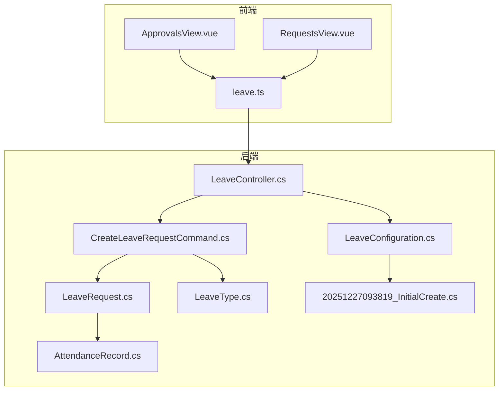
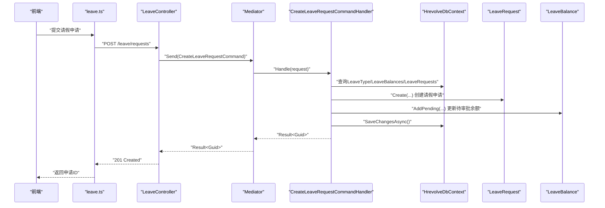
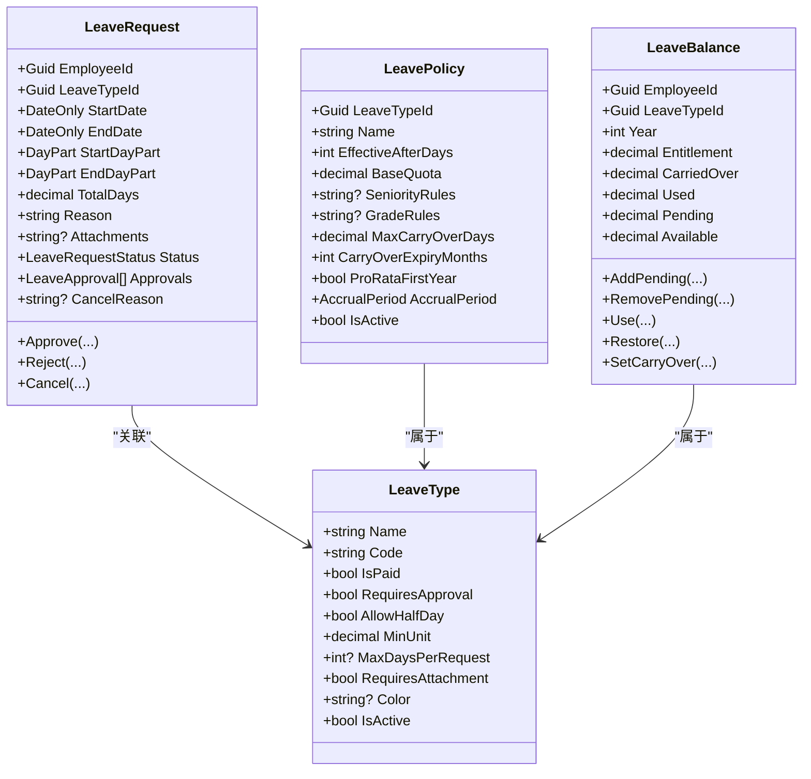
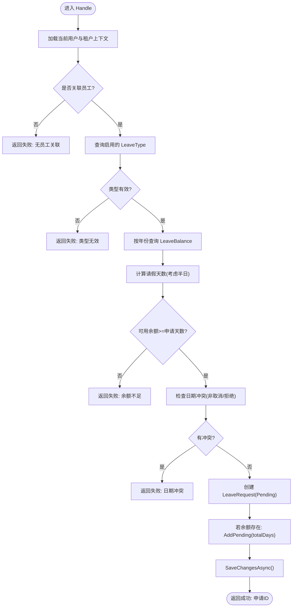
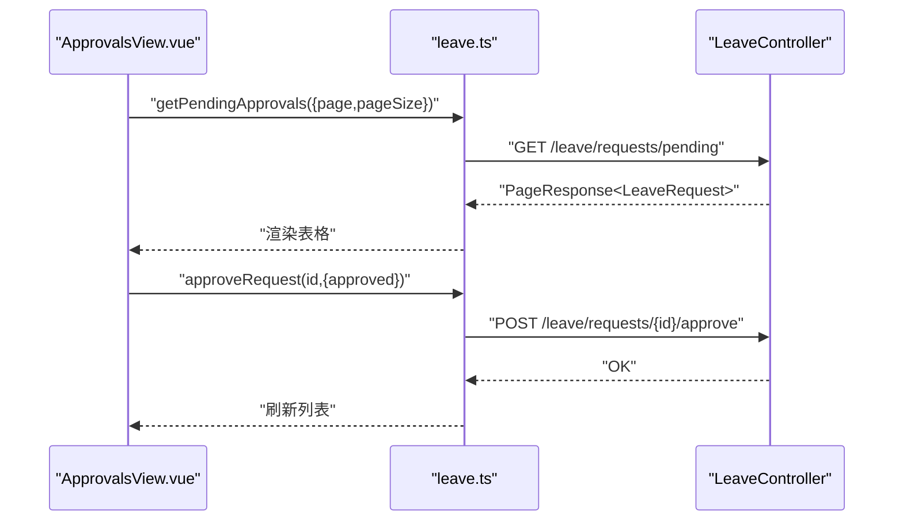
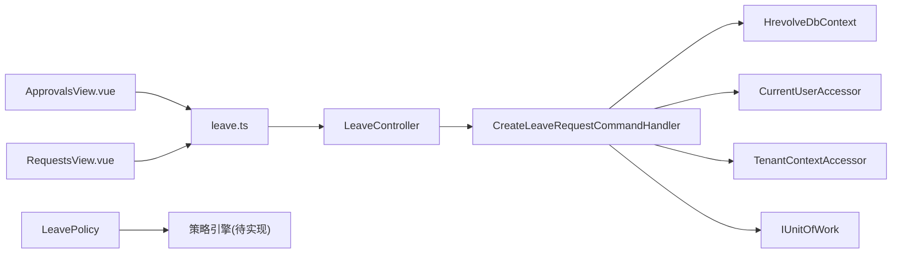

# 假期管理

<cite>
**本文引用的文件**
- [LeaveRequest.cs](file://Backend/Hrevolve.Domain/Leave/LeaveRequest.cs)
- [LeaveType.cs](file://Backend/Hrevolve.Domain/Leave/LeaveType.cs)
- [CreateLeaveRequestCommand.cs](file://Backend/Hrevolve.Application/Leave/Commands/CreateLeaveRequestCommand.cs)
- [LeaveConfiguration.cs](file://Backend/Hrevolve.Infrastructure/Persistence/Configurations/LeaveConfiguration.cs)
- [LeaveController.cs](file://Backend/Hrevolve.Web/Controllers/LeaveController.cs)
- [leave.ts](file://Frontend/hrevolve-web/src/api/modules/leave.ts)
- [ApprovalsView.vue](file://Frontend/hrevolve-web/src/views/leave/ApprovalsView.vue)
- [RequestsView.vue](file://Frontend/hrevolve-web/src/views/leave/RequestsView.vue)
- [20251227093819_InitialCreate.cs](file://Backend/Hrevolve.Infrastructure/Migrations/20251227093819_InitialCreate.cs)
- [AttendanceRecord.cs](file://Backend/Hrevolve.Domain/Attendance/AttendanceRecord.cs)
- [SettingsController.cs](file://Backend/Hrevolve.Web/Controllers/SettingsController.cs)
- [ApprovalFlowsView.vue](file://Frontend/hrevolve-web/src/views/settings/ApprovalFlowsView.vue)
</cite>

## 目录
1. [简介](#简介)
2. [项目结构](#项目结构)
3. [核心组件](#核心组件)
4. [架构总览](#架构总览)
5. [详细组件分析](#详细组件分析)
6. [依赖关系分析](#依赖关系分析)
7. [性能考虑](#性能考虑)
8. [故障排查指南](#故障排查指南)
9. [结论](#结论)
10. [附录](#附录)

## 简介
本文件系统化梳理假期管理模块的设计与实现，覆盖以下关键主题：
- LeaveRequest 与 LeaveType 的领域模型设计
- 假期类型配置、余额计算与审批状态机
- CreateLeaveRequestCommand 的业务验证与审批流程触发机制
- 策略引擎在不同假期类型上的可扩展性
- EF Core 配置中的状态转换约束与索引优化
- 前端 ApprovalsView.vue 与 RequestsView.vue 的审批与申请界面实现
- 与考勤统计模块的集成逻辑

## 项目结构
假期管理模块横跨后端领域层、应用层、基础设施层与前端视图层，形成清晰的分层职责：
- 领域层：定义 LeaveRequest、LeaveType、LeaveBalance、LeavePolicy 等实体与值对象
- 应用层：封装 CreateLeaveRequestCommand 及其验证器与处理器
- 基础设施层：EF Core 映射配置与数据库迁移
- 前端：请假审批与申请列表视图，以及 API 封装



图表来源
- [LeaveController.cs](file://Backend/Hrevolve.Web/Controllers/LeaveController.cs#L1-L122)
- [CreateLeaveRequestCommand.cs](file://Backend/Hrevolve.Application/Leave/Commands/CreateLeaveRequestCommand.cs#L1-L137)
- [LeaveRequest.cs](file://Backend/Hrevolve.Domain/Leave/LeaveRequest.cs#L1-L234)
- [LeaveType.cs](file://Backend/Hrevolve.Domain/Leave/LeaveType.cs#L1-L146)
- [LeaveConfiguration.cs](file://Backend/Hrevolve.Infrastructure/Persistence/Configurations/LeaveConfiguration.cs#L1-L167)
- [20251227093819_InitialCreate.cs](file://Backend/Hrevolve.Infrastructure/Migrations/20251227093819_InitialCreate.cs#L484-L520)
- [AttendanceRecord.cs](file://Backend/Hrevolve.Domain/Attendance/AttendanceRecord.cs#L1-L191)

章节来源
- [LeaveController.cs](file://Backend/Hrevolve.Web/Controllers/LeaveController.cs#L1-L122)
- [CreateLeaveRequestCommand.cs](file://Backend/Hrevolve.Application/Leave/Commands/CreateLeaveRequestCommand.cs#L1-L137)
- [LeaveRequest.cs](file://Backend/Hrevolve.Domain/Leave/LeaveRequest.cs#L1-L234)
- [LeaveType.cs](file://Backend/Hrevolve.Domain/Leave/LeaveType.cs#L1-L146)
- [LeaveConfiguration.cs](file://Backend/Hrevolve.Infrastructure/Persistence/Configurations/LeaveConfiguration.cs#L1-L167)
- [20251227093819_InitialCreate.cs](file://Backend/Hrevolve.Infrastructure/Migrations/20251227093819_InitialCreate.cs#L484-L520)
- [AttendanceRecord.cs](file://Backend/Hrevolve.Domain/Attendance/AttendanceRecord.cs#L1-L191)

## 核心组件
- LeaveType：定义假期类型的基础属性与策略字段，如是否带薪、是否需要审批、最小请假单位、单次最大天数、附件要求、颜色标识等；并包含 LeavePolicy 用于配置额度规则（基础配额、司龄/职级规则、结转上限与有效期、按比例发放、发放周期等）。
- LeaveRequest：表示一次请假申请，包含起止日期、时段（全天/上午/下午）、总天数、原因、附件、状态、审批记录等；内置 Approve/Reject/Cancel 状态转换方法与领域事件。
- LeaveBalance：维护员工年度假期余额，包含额度、结转、已使用、待审批等维度，并提供可用余额计算与待审批变更的加减操作。
- CreateLeaveRequestCommand：应用层命令，负责校验输入、检查余额与日期冲突、创建请假申请并更新待审批余额，返回结果。

章节来源
- [LeaveType.cs](file://Backend/Hrevolve.Domain/Leave/LeaveType.cs#L1-L146)
- [LeaveRequest.cs](file://Backend/Hrevolve.Domain/Leave/LeaveRequest.cs#L1-L234)
- [CreateLeaveRequestCommand.cs](file://Backend/Hrevolve.Application/Leave/Commands/CreateLeaveRequestCommand.cs#L1-L137)

## 架构总览
后端采用 CQRS + 领域驱动设计：
- 控制器接收请求，通过 Mediator 发送命令
- 应用层命令处理器执行业务规则与数据访问
- 领域模型负责状态机与领域事件
- EF Core 负责持久化与索引优化



图表来源
- [LeaveController.cs](file://Backend/Hrevolve.Web/Controllers/LeaveController.cs#L12-L30)
- [CreateLeaveRequestCommand.cs](file://Backend/Hrevolve.Application/Leave/Commands/CreateLeaveRequestCommand.cs#L50-L125)
- [LeaveRequest.cs](file://Backend/Hrevolve.Domain/Leave/LeaveRequest.cs#L64-L90)
- [LeaveConfiguration.cs](file://Backend/Hrevolve.Infrastructure/Persistence/Configurations/LeaveConfiguration.cs#L74-L122)

## 详细组件分析

### LeaveRequest 与 LeaveType 设计
- LeaveRequest 关键点
  - 时段计算：根据 StartDayPart 与 EndDayPart 对总天数进行半日扣减
  - 状态机：Pending -> Approved/Rejected/Cancelled；Approve/Reject/Cancel 分别写入审批记录并更新状态
  - 领域事件：创建与批准分别触发领域事件，便于后续流程或审计
- LeaveType 关键点
  - 基础属性：名称、编码、是否带薪、是否需要审批、是否允许半天、最小请假单位、单次最大天数、附件要求、颜色、启用状态
  - LeavePolicy：配置额度规则（基础配额、司龄/职级规则、结转上限、有效期、按比例发放、发放周期），为策略引擎提供扩展点



图表来源
- [LeaveRequest.cs](file://Backend/Hrevolve.Domain/Leave/LeaveRequest.cs#L1-L234)
- [LeaveType.cs](file://Backend/Hrevolve.Domain/Leave/LeaveType.cs#L1-L146)

章节来源
- [LeaveRequest.cs](file://Backend/Hrevolve.Domain/Leave/LeaveRequest.cs#L1-L234)
- [LeaveType.cs](file://Backend/Hrevolve.Domain/Leave/LeaveType.cs#L1-L146)

### CreateLeaveRequestCommand 的业务验证与审批流程触发
- 输入验证
  - 必填项：LeaveTypeId、StartDate、EndDate、Reason
  - 日期约束：EndDate >= StartDate
  - 字符长度：Reason 最大 1000
- 业务规则
  - 假期类型有效性：必须存在且启用
  - 余额检查：按申请年份查找 LeaveBalance，判断可用余额是否足够
  - 日期冲突：排除 Cancelled/Rejected 状态，检查重叠区间
- 流程触发
  - 创建 LeaveRequest 并设置初始状态为 Pending
  - 若余额存在，先 AddPending(totalDays)，保存后由后续流程或定时任务完成 Use/Restore
  - 返回申请 ID



图表来源
- [CreateLeaveRequestCommand.cs](file://Backend/Hrevolve.Application/Leave/Commands/CreateLeaveRequestCommand.cs#L50-L125)

章节来源
- [CreateLeaveRequestCommand.cs](file://Backend/Hrevolve.Application/Leave/Commands/CreateLeaveRequestCommand.cs#L1-L137)

### 策略引擎与假期类型自定义规则
- LeavePolicy 为策略引擎提供扩展点：通过 SeniorityRules/GradeRules 描述按司龄/职级的额度增长规则；通过 MaxCarryOverDays、CarryOverExpiryMonths 控制结转上限与有效期；通过 ProRataFirstYear 与 AccrualPeriod 控制发放节奏
- 策略执行建议
  - 在额度计算阶段读取并解析 SeniorityRules/GradeRules，结合员工司龄与职级确定年度配额
  - 在年结时根据 AccrualPeriod 与 ProRataFirstYear 计算应发额度
  - 在到期日自动清理过期结转额度
- 当前代码现状
  - 领域模型具备策略字段，但应用层暂未实现具体策略解析与执行逻辑；可在后续版本中引入策略解析器或规则引擎组件

章节来源
- [LeaveType.cs](file://Backend/Hrevolve.Domain/Leave/LeaveType.cs#L69-L146)

### EF Core 配置：状态转换约束与索引优化
- LeaveRequest
  - 状态与时段枚举以字符串形式存储，配合 HasConversion 与长度限制
  - 复合索引：TenantId+EmployeeId+Status、TenantId+StartDate+EndDate，提升查询效率
  - 审批记录外键级联删除（Cascade），保证数据一致性
- LeaveType
  - 唯一索引：TenantId+Code，避免重复编码
- LeaveBalance
  - 唯一索引：TenantId+EmployeeId+LeaveTypeId+Year，确保年度余额唯一
- 数据库迁移
  - 初始迁移包含 LeaveRequests、LeaveTypes、LeaveBalances、LeavePolicies、LeaveApprovals 等表及主外键约束

```mermaid
erDiagram
LEAVE_TYPES ||--o{ LEAVE_POLICIES : "拥有"
LEAVE_TYPES ||--o{ LEAVE_REQUESTS : "被使用"
LEAVE_REQUESTS ||--o{ LEAVE_APPROVALS : "包含"
LEAVE_BALANCES {
uuid id PK
uuid employeeId
uuid leaveTypeId
int year
numeric(5,2) entitlement
numeric(5,2) carriedOver
numeric(5,2) used
numeric(5,2) pending
}
LEAVE_REQUESTS {
uuid id PK
uuid employeeId
uuid leaveTypeId
date startDate
date endDate
string startDayPart
string endDayPart
numeric(5,2) totalDays
string reason
string attachments
string status
string cancelReason
}
LEAVE_TYPES {
uuid id PK
string name
string code
bool isPaid
bool requiresApproval
bool allowHalfDay
numeric(5,2) minUnit
int maxDaysPerRequest
bool requiresAttachment
string color
bool isActive
}
LEAVE_POLICIES {
uuid id PK
uuid leaveTypeId FK
string name
int effectiveAfterDays
numeric(5,2) baseQuota
string seniorityRules
string gradeRules
numeric(5,2) maxCarryOverDays
int carryOverExpiryMonths
bool proRataFirstYear
string accrualPeriod
bool isActive
}
LEAVE_APPROVALS {
uuid id PK
uuid leaveRequestId FK
uuid approverId
string action
string comments
datetime approvedAt
}
```

图表来源
- [LeaveConfiguration.cs](file://Backend/Hrevolve.Infrastructure/Persistence/Configurations/LeaveConfiguration.cs#L1-L167)
- [20251227093819_InitialCreate.cs](file://Backend/Hrevolve.Infrastructure/Migrations/20251227093819_InitialCreate.cs#L484-L520)

章节来源
- [LeaveConfiguration.cs](file://Backend/Hrevolve.Infrastructure/Persistence/Configurations/LeaveConfiguration.cs#L1-L167)
- [20251227093819_InitialCreate.cs](file://Backend/Hrevolve.Infrastructure/Migrations/20251227093819_InitialCreate.cs#L484-L520)

### 前端实现：ApprovalsView.vue 与 RequestsView.vue
- ApprovalsView.vue
  - 加载待审批列表，调用 getPendingApprovals 接口
  - 支持“批准/拒绝”操作，调用 approveRequest 接口
  - 展示员工名、假期类型、起止日期、天数、原因与操作按钮
- RequestsView.vue
  - 加载请假申请列表，调用 getRequests 接口
  - 展示状态标签（Pending/Approved/Rejected/Cancelled），并进行本地国际化映射
- API 封装
  - leave.ts 提供 getPendingApprovals、getRequests、submitRequest、approveRequest、cancelRequest 等方法



图表来源
- [ApprovalsView.vue](file://Frontend/hrevolve-web/src/views/leave/ApprovalsView.vue#L1-L58)
- [RequestsView.vue](file://Frontend/hrevolve-web/src/views/leave/RequestsView.vue#L1-L54)
- [leave.ts](file://Frontend/hrevolve-web/src/api/modules/leave.ts#L1-L51)
- [LeaveController.cs](file://Backend/Hrevolve.Web/Controllers/LeaveController.cs#L55-L81)

章节来源
- [ApprovalsView.vue](file://Frontend/hrevolve-web/src/views/leave/ApprovalsView.vue#L1-L58)
- [RequestsView.vue](file://Frontend/hrevolve-web/src/views/leave/RequestsView.vue#L1-L54)
- [leave.ts](file://Frontend/hrevolve-web/src/api/modules/leave.ts#L1-L51)
- [LeaveController.cs](file://Backend/Hrevolve.Web/Controllers/LeaveController.cs#L55-L81)

### 与考勤统计模块的集成逻辑
- AttendanceRecord 中定义了多种状态，其中包含 Leave 状态，用于标记某日因请假而产生的考勤状态
- 在请假批准后，可结合 AttendanceRecord 的 Approve 流程，将对应日期的考勤状态标记为 Leave，以便后续统计与报表生成
- 建议在批准 LeaveRequest 后，触发 AttendanceRecord 的状态更新或批量同步，确保考勤统计与请假记录一致

章节来源
- [AttendanceRecord.cs](file://Backend/Hrevolve.Domain/Attendance/AttendanceRecord.cs#L1-L191)
- [LeaveRequest.cs](file://Backend/Hrevolve.Domain/Leave/LeaveRequest.cs#L103-L121)

## 依赖关系分析
- 组件耦合
  - 应用层命令处理器依赖 DbContext、当前用户与租户上下文、工作单元
  - 领域模型之间通过关联与值对象保持低耦合
- 外部依赖
  - EF Core 提供 ORM 映射与索引优化
  - 前端通过 API 封装与后端交互
- 审批流程配置
  - 后端控制器预留了审批接口，前端 ApprovalFlowsView.vue 提供审批流程配置页面
  - 当前控制器接口为占位实现，实际审批流程需在后续完善



图表来源
- [CreateLeaveRequestCommand.cs](file://Backend/Hrevolve.Application/Leave/Commands/CreateLeaveRequestCommand.cs#L43-L125)
- [LeaveController.cs](file://Backend/Hrevolve.Web/Controllers/LeaveController.cs#L12-L122)
- [leave.ts](file://Frontend/hrevolve-web/src/api/modules/leave.ts#L1-L51)
- [LeaveType.cs](file://Backend/Hrevolve.Domain/Leave/LeaveType.cs#L69-L146)

章节来源
- [CreateLeaveRequestCommand.cs](file://Backend/Hrevolve.Application/Leave/Commands/CreateLeaveRequestCommand.cs#L43-L125)
- [LeaveController.cs](file://Backend/Hrevolve.Web/Controllers/LeaveController.cs#L12-L122)
- [leave.ts](file://Frontend/hrevolve-web/src/api/modules/leave.ts#L1-L51)
- [LeaveType.cs](file://Backend/Hrevolve.Domain/Leave/LeaveType.cs#L69-L146)

## 性能考虑
- 查询优化
  - LeaveRequest 的复合索引 TenantId+EmployeeId+Status、TenantId+StartDate+EndDate 可显著降低筛选与排序成本
  - LeaveBalance 的唯一索引避免重复插入与并发冲突
- 数值精度
  - EF Core 配置对金额/天数使用 numeric(5,2)，避免浮点误差
- 批量处理
  - 年结与额度发放建议采用后台作业或计划任务，避免阻塞请求路径
- 前端缓存
  - 列表页可采用本地缓存与分页参数缓存，减少重复请求

## 故障排查指南
- 余额不足
  - 现象：提交失败，错误码 INSUFFICIENT_BALANCE
  - 排查：确认 LeaveBalance 年度额度、已使用、待审批与可用余额
- 日期冲突
  - 现象：提交失败，错误码 DATE_CONFLICT
  - 排查：检查是否存在未取消/未拒绝的重叠请假
- 类型无效
  - 现象：提交失败，错误码 INVALID_LEAVE_TYPE
  - 排查：确认 LeaveType 是否启用且存在
- 审批接口未实现
  - 现象：前端点击“批准/拒绝”无响应
  - 排查：后端 LeaveController 对应接口仍为占位实现，需补充审批命令与处理器

章节来源
- [CreateLeaveRequestCommand.cs](file://Backend/Hrevolve.Application/Leave/Commands/CreateLeaveRequestCommand.cs#L62-L101)
- [LeaveController.cs](file://Backend/Hrevolve.Web/Controllers/LeaveController.cs#L55-L81)

## 结论
假期管理模块在领域建模、应用验证与 EF Core 索引方面具备良好基础。LeaveType/LeavePolicy 为策略引擎提供了扩展点；LeaveRequest 的状态机与 LeaveBalance 的余额模型支撑了核心业务闭环。前端 ApprovalsView 与 RequestsView 提供了直观的审批与申请界面。下一步建议完善审批流程的后端实现与策略引擎的具体规则解析，并强化与考勤模块的状态联动。

## 附录
- 审批流程配置
  - SettingsController 提供审批流程的增删改查接口
  - ApprovalFlowsView.vue 提供前端配置界面，支持新增/编辑/删除流程

章节来源
- [SettingsController.cs](file://Backend/Hrevolve.Web/Controllers/SettingsController.cs#L141-L176)
- [ApprovalFlowsView.vue](file://Frontend/hrevolve-web/src/views/settings/ApprovalFlowsView.vue#L31-L72)