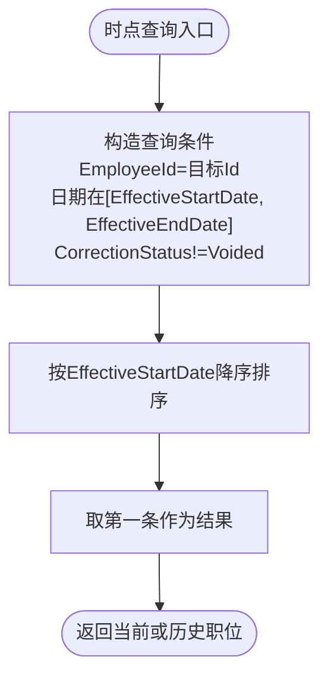

# 员工全生命周期管理

<cite>
**本文引用的文件**
- [Employee.cs](file://Backend/Hrevolve.Domain/Employees/Employee.cs)
- [JobHistory.cs](file://Backend/Hrevolve.Domain/Employees/JobHistory.cs)
- [CreateEmployeeCommand.cs](file://Backend/Hrevolve.Application/Employees/Commands/CreateEmployeeCommand.cs)
- [GetEmployeeQuery.cs](file://Backend/Hrevolve.Application/Employees/Queries/GetEmployeeQuery.cs)
- [EmployeeConfiguration.cs](file://Backend/Hrevolve.Infrastructure/Persistence/Configurations/EmployeeConfiguration.cs)
- [EmployeeRepository.cs](file://Backend/Hrevolve.Infrastructure/Persistence/Repositories/EmployeeRepository.cs)
- [HrevolveDbContext.cs](file://Backend/Hrevolve.Infrastructure/Persistence/HrevolveDbContext.cs)
- [AuditableEntity.cs](file://Backend/Hrevolve.Domain/Common/AuditableEntity.cs)
- [ValidationBehavior.cs](file://Backend/Hrevolve.Application/Behaviors/ValidationBehavior.cs)
- [EmployeeDetailView.vue](file://Frontend/hrevolve-web/src/views/employees/EmployeeDetailView.vue)
</cite>

## 目录
1. [简介](#简介)
2. [项目结构](#项目结构)
3. [核心组件](#核心组件)
4. [架构总览](#架构总览)
5. [详细组件分析](#详细组件分析)
6. [依赖分析](#依赖分析)
7. [性能考虑](#性能考虑)
8. [故障排查指南](#故障排查指南)
9. [结论](#结论)
10. [附录](#附录)

## 简介
本文件围绕“员工全生命周期管理”主题，系统梳理了以下内容：
- Employee聚合根的设计原则：属性、行为方法与状态管理
- JobHistory实体如何实现SCD Type 2缓慢变化维度以追踪员工历史信息
- CreateEmployeeCommand的验证逻辑与处理流程
- GetEmployeeQuery的查询优化策略
- EF Core配置中的软删除、审计字段映射与历史表关联
- 前端EmployeeDetailView.vue的数据绑定与状态更新实践

## 项目结构
系统采用分层架构，包含领域层、应用层、基础设施层与Web层；前端使用Vue 3 + TypeScript构建视图层。员工相关的核心代码集中在：
- 领域层：Employee与JobHistory实体及枚举
- 应用层：命令与查询（CreateEmployeeCommand、GetEmployeeQuery）及验证行为
- 基础设施层：EF Core配置、仓储与上下文
- 前端：EmployeeDetailView.vue负责数据展示与交互

图表来源
- [EmployeeDetailView.vue](file://Frontend/hrevolve-web/src/views/employees/EmployeeDetailView.vue#L1-L64)
- [CreateEmployeeCommand.cs](file://Backend/Hrevolve.Application/Employees/Commands/CreateEmployeeCommand.cs#L1-L126)
- [GetEmployeeQuery.cs](file://Backend/Hrevolve.Application/Employees/Queries/GetEmployeeQuery.cs#L1-L146)
- [ValidationBehavior.cs](file://Backend/Hrevolve.Application/Behaviors/ValidationBehavior.cs#L1-L43)
- [EmployeeRepository.cs](file://Backend/Hrevolve.Infrastructure/Persistence/Repositories/EmployeeRepository.cs#L1-L82)
- [EmployeeConfiguration.cs](file://Backend/Hrevolve.Infrastructure/Persistence/Configurations/EmployeeConfiguration.cs#L1-L110)
- [HrevolveDbContext.cs](file://Backend/Hrevolve.Infrastructure/Persistence/HrevolveDbContext.cs#L70-L157)
- [Employee.cs](file://Backend/Hrevolve.Domain/Employees/Employee.cs#L1-L137)
- [JobHistory.cs](file://Backend/Hrevolve.Domain/Employees/JobHistory.cs#L1-L124)

章节来源
- [Employee.cs](file://Backend/Hrevolve.Domain/Employees/Employee.cs#L1-L137)
- [JobHistory.cs](file://Backend/Hrevolve.Domain/Employees/JobHistory.cs#L1-L124)
- [CreateEmployeeCommand.cs](file://Backend/Hrevolve.Application/Employees/Commands/CreateEmployeeCommand.cs#L1-L126)
- [GetEmployeeQuery.cs](file://Backend/Hrevolve.Application/Employees/Queries/GetEmployeeQuery.cs#L1-L146)
- [EmployeeConfiguration.cs](file://Backend/Hrevolve.Infrastructure/Persistence/Configurations/EmployeeConfiguration.cs#L1-L110)
- [EmployeeRepository.cs](file://Backend/Hrevolve.Infrastructure/Persistence/Repositories/EmployeeRepository.cs#L1-L82)
- [HrevolveDbContext.cs](file://Backend/Hrevolve.Infrastructure/Persistence/HrevolveDbContext.cs#L70-L157)
- [AuditableEntity.cs](file://Backend/Hrevolve.Domain/Common/AuditableEntity.cs#L1-L48)
- [ValidationBehavior.cs](file://Backend/Hrevolve.Application/Behaviors/ValidationBehavior.cs#L1-L43)
- [EmployeeDetailView.vue](file://Frontend/hrevolve-web/src/views/employees/EmployeeDetailView.vue#L1-L64)

## 核心组件
- Employee聚合根：承载员工基本信息、联系信息、雇佣状态与直接上级关系；维护JobHistory集合；发布领域事件。
- JobHistory实体：实现SCD Type 2，支持按任意日期查询员工在该时点的职位与薪酬等信息。
- CreateEmployeeCommand：封装创建员工的输入、验证与处理流程，创建初始JobHistory记录。
- GetEmployeeQuery：提供当前时点与历史时点的员工详情查询，返回DTO。
- EF Core配置：多租户过滤、软删除过滤、审计字段自动填充、历史表索引与外键约束。
- 前端EmployeeDetailView.vue：异步加载员工详情与职位历史，进行数据绑定与状态渲染。

章节来源
- [Employee.cs](file://Backend/Hrevolve.Domain/Employees/Employee.cs#L1-L137)
- [JobHistory.cs](file://Backend/Hrevolve.Domain/Employees/JobHistory.cs#L1-L124)
- [CreateEmployeeCommand.cs](file://Backend/Hrevolve.Application/Employees/Commands/CreateEmployeeCommand.cs#L1-L126)
- [GetEmployeeQuery.cs](file://Backend/Hrevolve.Application/Employees/Queries/GetEmployeeQuery.cs#L1-L146)
- [EmployeeConfiguration.cs](file://Backend/Hrevolve.Infrastructure/Persistence/Configurations/EmployeeConfiguration.cs#L1-L110)
- [EmployeeRepository.cs](file://Backend/Hrevolve.Infrastructure/Persistence/Repositories/EmployeeRepository.cs#L1-L82)
- [HrevolveDbContext.cs](file://Backend/Hrevolve.Infrastructure/Persistence/HrevolveDbContext.cs#L70-L157)
- [AuditableEntity.cs](file://Backend/Hrevolve.Domain/Common/AuditableEntity.cs#L1-L48)
- [EmployeeDetailView.vue](file://Frontend/hrevolve-web/src/views/employees/EmployeeDetailView.vue#L1-L64)

## 架构总览
系统遵循CQRS与分层架构，命令负责写入，查询负责读取；应用层通过仓储访问数据库；EF Core在上下文中统一实现多租户与软删除过滤，自动填充审计字段；前端通过API获取数据并渲染。

图表来源
- [GetEmployeeQuery.cs](file://Backend/Hrevolve.Application/Employees/Queries/GetEmployeeQuery.cs#L46-L91)
- [EmployeeRepository.cs](file://Backend/Hrevolve.Infrastructure/Persistence/Repositories/EmployeeRepository.cs#L70-L81)
- [HrevolveDbContext.cs](file://Backend/Hrevolve.Infrastructure/Persistence/HrevolveDbContext.cs#L70-L157)
- [EmployeeDetailView.vue](file://Frontend/hrevolve-web/src/views/employees/EmployeeDetailView.vue#L16-L24)

## 详细组件分析

### Employee聚合根设计
- 属性与职责
  - 基本信息：员工编号、姓名、性别、出生日期、联系方式、地址
  - 雇佣信息：状态、雇佣类型、入职日期、离职日期、试用期结束日期
  - 关联信息：用户账号ID、直接上级ID与导航属性
  - 历史集合：JobHistories只读集合，由JobHistory实体组成
- 行为方法
  - 创建：静态工厂方法初始化基础信息并发布“员工创建”领域事件
  - 更新联系信息：SetContactInfo
  - 设置身份证号：SetIdCardNumber（加密存储）
  - 设置直接上级：SetDirectManager
  - 绑定用户：LinkUser
  - 离职：Terminate，设置状态与终止日期并发布“员工离职”领域事件
  - 通过试用期：PassProbation，清除试用期结束日期并发布“通过试用期”领域事件
- 状态管理
  - EmploymentStatus枚举：Active、OnLeave、Suspended、Terminated
  - EmploymentType枚举：FullTime、PartTime、Contract、Intern、Consultant
  - Gender枚举：Male、Female、Other
- 领域事件
  - EmployeeCreatedEvent、EmployeeTerminatedEvent、EmployeeProbationPassedEvent

图表来源
- [Employee.cs](file://Backend/Hrevolve.Domain/Employees/Employee.cs#L1-L137)
- [JobHistory.cs](file://Backend/Hrevolve.Domain/Employees/JobHistory.cs#L1-L124)

章节来源
- [Employee.cs](file://Backend/Hrevolve.Domain/Employees/Employee.cs#L1-L137)

### JobHistory实体与SCD Type 2实现
- 设计要点
  - 生效开始/结束日期：默认结束日期为极大值表示当前记录
  - 时点查询：通过日期范围与非作废状态过滤
  - 冲正机制：CorrectionStatus与CorrectionRefId支持历史修正
  - 变更类型：NewHire、Promotion、Demotion、Transfer、SalaryChange、Correction
- 业务能力
  - Close：关闭当前记录（设置结束日期）
  - Void：标记为作废（冲正）
  - IsEffectiveOn：判断某日期是否在有效期内且未被作废
- EF Core映射
  - 表名：JobHistories
  - 主键：Id
  - 数值精度：BaseSalary使用18,2精度
  - 索引：支持时点查询与冲正状态过滤
  - 外键：与Employee的多对一关系，删除级联

图表来源
- [EmployeeRepository.cs](file://Backend/Hrevolve.Infrastructure/Persistence/Repositories/EmployeeRepository.cs#L70-L81)
- [JobHistory.cs](file://Backend/Hrevolve.Domain/Employees/JobHistory.cs#L1-L124)

章节来源
- [JobHistory.cs](file://Backend/Hrevolve.Domain/Employees/JobHistory.cs#L1-L124)
- [EmployeeRepository.cs](file://Backend/Hrevolve.Infrastructure/Persistence/Repositories/EmployeeRepository.cs#L70-L81)
- [EmployeeConfiguration.cs](file://Backend/Hrevolve.Infrastructure/Persistence/Configurations/EmployeeConfiguration.cs#L73-L110)

### CreateEmployeeCommand：验证与处理流程
- 输入模型
  - 员工基本信息、雇佣类型、联系方式、直接上级ID
  - 初始职位信息：PositionId、DepartmentId、BaseSalary
- 验证规则（FluentValidation）
  - 员工编号：非空、长度限制
  - 姓名：非空、长度限制
  - 出生日期：必须早于今天
  - 入职日期：非空
  - 邮箱：可选，格式校验
  - 职位/部门：非空
  - 基本工资：非负
- 处理流程
  - 读取租户上下文
  - 校验员工编号唯一性
  - 使用Employee.Create工厂方法创建员工并设置联系信息
  - 可选设置直接上级
  - 添加到仓储并保存
  - 创建初始JobHistory记录（NewHire），并持久化
  - 返回员工ID

图表来源
- [CreateEmployeeCommand.cs](file://Backend/Hrevolve.Application/Employees/Commands/CreateEmployeeCommand.cs#L1-L126)
- [ValidationBehavior.cs](file://Backend/Hrevolve.Application/Behaviors/ValidationBehavior.cs#L1-L43)
- [EmployeeRepository.cs](file://Backend/Hrevolve.Infrastructure/Persistence/Repositories/EmployeeRepository.cs#L1-L31)
- [HrevolveDbContext.cs](file://Backend/Hrevolve.Infrastructure/Persistence/HrevolveDbContext.cs#L120-L157)

章节来源
- [CreateEmployeeCommand.cs](file://Backend/Hrevolve.Application/Employees/Commands/CreateEmployeeCommand.cs#L1-L126)
- [ValidationBehavior.cs](file://Backend/Hrevolve.Application/Behaviors/ValidationBehavior.cs#L1-L43)
- [EmployeeRepository.cs](file://Backend/Hrevolve.Infrastructure/Persistence/Repositories/EmployeeRepository.cs#L1-L31)
- [HrevolveDbContext.cs](file://Backend/Hrevolve.Infrastructure/Persistence/HrevolveDbContext.cs#L120-L157)

### GetEmployeeQuery：查询优化策略
- 查询类型
  - 当前时点：基于今日日期查询JobHistory
  - 历史时点：基于指定日期查询JobHistory
- DTO设计
  - EmployeeDto：包含员工基本信息与CurrentJobDto
  - CurrentJobDto：包含职位、部门、基本工资、职级与生效日期
- 优化要点
  - 时点查询使用JobHistory的复合索引（TenantId、EmployeeId、EffectiveStartDate、EffectiveEndDate）
  - 排序按EffectiveStartDate降序，确保取到最新有效记录
  - 仓储中对JobHistory进行CorrectionStatus过滤，避免作废记录影响结果
  - 多租户与软删除通过全局过滤器自动生效

图表来源
- [GetEmployeeQuery.cs](file://Backend/Hrevolve.Application/Employees/Queries/GetEmployeeQuery.cs#L46-L91)
- [EmployeeRepository.cs](file://Backend/Hrevolve.Infrastructure/Persistence/Repositories/EmployeeRepository.cs#L70-L81)

章节来源
- [GetEmployeeQuery.cs](file://Backend/Hrevolve.Application/Employees/Queries/GetEmployeeQuery.cs#L1-L146)
- [EmployeeRepository.cs](file://Backend/Hrevolve.Infrastructure/Persistence/Repositories/EmployeeRepository.cs#L70-L81)
- [EmployeeConfiguration.cs](file://Backend/Hrevolve.Infrastructure/Persistence/Configurations/EmployeeConfiguration.cs#L73-L110)

### EF Core配置：软删除、审计字段与历史表关联
- 多租户过滤
  - 对所有继承自AuditableEntity的实体，动态注册HasQueryFilter，仅返回当前租户数据
- 软删除过滤
  - 对所有继承自AuditableEntity的实体，注册HasQueryFilter，隐藏IsDeleted=true的记录
- 审计字段自动填充
  - SaveChangesAsync中根据实体状态自动填充CreatedAt/CreatedBy、UpdatedAt/UpdatedBy、软删除时填充IsDeleted/DeletedAt/DeletedBy
  - 若当前上下文有租户且实体TenantId为空，则自动赋值
- 历史表关联
  - JobHistories表映射与Employees表建立多对一关系，删除级联保证历史数据一致性
  - 员工表的自引用关系（DirectManagerId）使用Restrict删除策略，避免误删

章节来源
- [HrevolveDbContext.cs](file://Backend/Hrevolve.Infrastructure/Persistence/HrevolveDbContext.cs#L70-L157)
- [AuditableEntity.cs](file://Backend/Hrevolve.Domain/Common/AuditableEntity.cs#L1-L48)
- [EmployeeConfiguration.cs](file://Backend/Hrevolve.Infrastructure/Persistence/Configurations/EmployeeConfiguration.cs#L1-L110)

### 前端集成：EmployeeDetailView.vue的数据绑定与状态更新
- 数据加载
  - 使用路由参数获取员工ID，同时并发请求员工详情与职位历史
  - 加载完成后分别绑定到employee与jobHistory响应式变量
- 数据绑定
  - 员工头像、姓名、职位与部门、状态标签、联系方式、入职日期、直接上级等字段绑定
  - 职位历史以时间轴形式展示，按生效开始日期排序
- 状态更新
  - 使用Day.js格式化日期
  - 根据状态枚举映射不同Tag类型，提升可读性
- 错误处理
  - try/catch捕获异常，finally统一关闭loading

章节来源
- [EmployeeDetailView.vue](file://Frontend/hrevolve-web/src/views/employees/EmployeeDetailView.vue#L1-L64)

## 依赖分析
- 组件耦合
  - Employee与JobHistory强关联，JobHistory依赖Employee导航属性
  - 应用层命令/查询依赖仓储接口，便于替换实现
  - EF Core配置与上下文集中管理过滤与审计
- 外部依赖
  - FluentValidation用于命令验证
  - Vue生态用于前端展示与API调用

图表来源
- [Employee.cs](file://Backend/Hrevolve.Domain/Employees/Employee.cs#L1-L137)
- [JobHistory.cs](file://Backend/Hrevolve.Domain/Employees/JobHistory.cs#L1-L124)
- [CreateEmployeeCommand.cs](file://Backend/Hrevolve.Application/Employees/Commands/CreateEmployeeCommand.cs#L1-L126)
- [GetEmployeeQuery.cs](file://Backend/Hrevolve.Application/Employees/Queries/GetEmployeeQuery.cs#L1-L146)
- [EmployeeRepository.cs](file://Backend/Hrevolve.Infrastructure/Persistence/Repositories/EmployeeRepository.cs#L1-L82)
- [EmployeeConfiguration.cs](file://Backend/Hrevolve.Infrastructure/Persistence/Configurations/EmployeeConfiguration.cs#L1-L110)
- [HrevolveDbContext.cs](file://Backend/Hrevolve.Infrastructure/Persistence/HrevolveDbContext.cs#L70-L157)
- [EmployeeDetailView.vue](file://Frontend/hrevolve-web/src/views/employees/EmployeeDetailView.vue#L1-L64)

章节来源
- [Employee.cs](file://Backend/Hrevolve.Domain/Employees/Employee.cs#L1-L137)
- [JobHistory.cs](file://Backend/Hrevolve.Domain/Employees/JobHistory.cs#L1-L124)
- [CreateEmployeeCommand.cs](file://Backend/Hrevolve.Application/Employees/Commands/CreateEmployeeCommand.cs#L1-L126)
- [GetEmployeeQuery.cs](file://Backend/Hrevolve.Application/Employees/Queries/GetEmployeeQuery.cs#L1-L146)
- [EmployeeRepository.cs](file://Backend/Hrevolve.Infrastructure/Persistence/Repositories/EmployeeRepository.cs#L1-L82)
- [EmployeeConfiguration.cs](file://Backend/Hrevolve.Infrastructure/Persistence/Configurations/EmployeeConfiguration.cs#L1-L110)
- [HrevolveDbContext.cs](file://Backend/Hrevolve.Infrastructure/Persistence/HrevolveDbContext.cs#L70-L157)
- [EmployeeDetailView.vue](file://Frontend/hrevolve-web/src/views/employees/EmployeeDetailView.vue#L1-L64)

## 性能考虑
- 查询优化
  - JobHistory时点查询使用复合索引，避免全表扫描
  - 仓储中对CorrectionStatus进行过滤，减少无效记录参与计算
- 写入优化
  - 批量保存：命令处理中一次SaveChangesAsync提交多个变更
  - 避免不必要的跟踪：查询时尽量只投影所需字段（当前DTO已按需设计）
- 前端优化
  - 并发请求员工详情与职位历史，缩短首屏等待
  - 使用响应式数据绑定，避免重复渲染

## 故障排查指南
- 员工编号重复
  - 现象：创建命令返回重复错误
  - 排查：确认仓储GetByEmployeeNumberAsync是否命中现有记录
  - 参考路径：[CreateEmployeeCommand.cs](file://Backend/Hrevolve.Application/Employees/Commands/CreateEmployeeCommand.cs#L80-L86)
- 验证失败
  - 现象：命令被ValidationBehavior拦截并抛出异常
  - 排查：检查各字段规则与消息
  - 参考路径：[CreateEmployeeCommand.cs](file://Backend/Hrevolve.Application/Employees/Commands/CreateEmployeeCommand.cs#L31-L65)、[ValidationBehavior.cs](file://Backend/Hrevolve.Application/Behaviors/ValidationBehavior.cs#L1-L43)
- 历史查询无结果
  - 现象：GetEmployeeQuery返回CurrentJob为null
  - 排查：确认JobHistory是否存在有效记录且未被作废；检查日期范围与租户过滤
  - 参考路径：[GetEmployeeQuery.cs](file://Backend/Hrevolve.Application/Employees/Queries/GetEmployeeQuery.cs#L58-L61)、[EmployeeRepository.cs](file://Backend/Hrevolve.Infrastructure/Persistence/Repositories/EmployeeRepository.cs#L70-L81)
- 多租户隔离问题
  - 现象：看不到其他租户数据
  - 排查：确认上下文TenantId是否正确设置；检查全局过滤器
  - 参考路径：[HrevolveDbContext.cs](file://Backend/Hrevolve.Infrastructure/Persistence/HrevolveDbContext.cs#L77-L98)
- 软删除导致数据不可见
  - 现象：查询不到已删除记录
  - 排查：确认IsDeleted=false；检查软删除过滤器
  - 参考路径：[HrevolveDbContext.cs](file://Backend/Hrevolve.Infrastructure/Persistence/HrevolveDbContext.cs#L100-L118)、[AuditableEntity.cs](file://Backend/Hrevolve.Domain/Common/AuditableEntity.cs#L1-L48)

章节来源
- [CreateEmployeeCommand.cs](file://Backend/Hrevolve.Application/Employees/Commands/CreateEmployeeCommand.cs#L80-L86)
- [ValidationBehavior.cs](file://Backend/Hrevolve.Application/Behaviors/ValidationBehavior.cs#L1-L43)
- [GetEmployeeQuery.cs](file://Backend/Hrevolve.Application/Employees/Queries/GetEmployeeQuery.cs#L58-L61)
- [EmployeeRepository.cs](file://Backend/Hrevolve.Infrastructure/Persistence/Repositories/EmployeeRepository.cs#L70-L81)
- [HrevolveDbContext.cs](file://Backend/Hrevolve.Infrastructure/Persistence/HrevolveDbContext.cs#L77-L118)
- [AuditableEntity.cs](file://Backend/Hrevolve.Domain/Common/AuditableEntity.cs#L1-L48)

## 结论
本系统通过清晰的领域建模与分层架构，实现了员工全生命周期管理的关键能力：
- Employee聚合根定义了员工的核心属性与行为
- JobHistory通过SCD Type 2完整记录员工历史，支持任意时点查询
- CreateEmployeeCommand与GetEmployeeQuery分别覆盖写入与读取场景，配合EF Core的多租户与软删除机制，确保数据安全与一致性
- 前端EmployeeDetailView.vue展示了从API到UI的完整数据流与状态渲染

## 附录
- 关键实现路径参考
  - 员工创建与初始历史：[CreateEmployeeCommand.cs](file://Backend/Hrevolve.Application/Employees/Commands/CreateEmployeeCommand.cs#L76-L124)
  - 员工详情与时点查询：[GetEmployeeQuery.cs](file://Backend/Hrevolve.Application/Employees/Queries/GetEmployeeQuery.cs#L46-L91)
  - 时点查询仓储实现：[EmployeeRepository.cs](file://Backend/Hrevolve.Infrastructure/Persistence/Repositories/EmployeeRepository.cs#L70-L81)
  - EF Core全局过滤与审计：[HrevolveDbContext.cs](file://Backend/Hrevolve.Infrastructure/Persistence/HrevolveDbContext.cs#L70-L157)
  - 前端数据绑定与状态更新：[EmployeeDetailView.vue](file://Frontend/hrevolve-web/src/views/employees/EmployeeDetailView.vue#L1-L64)