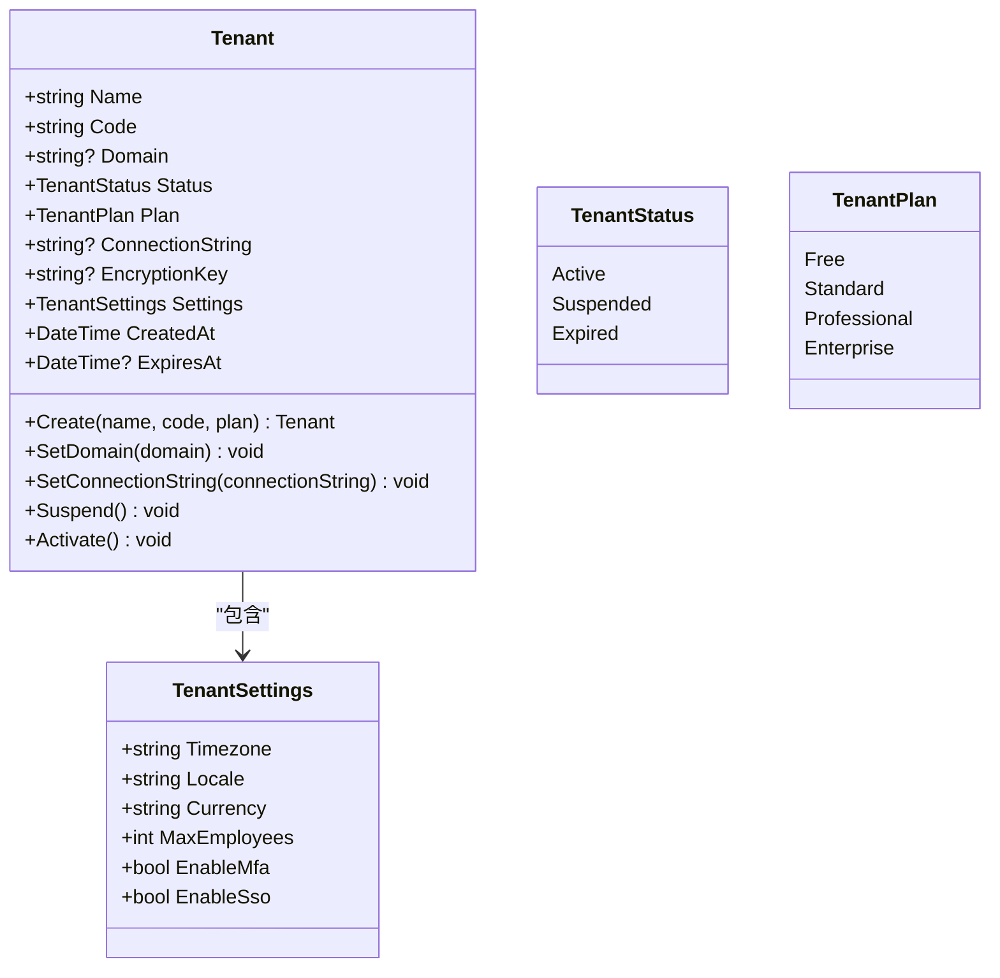
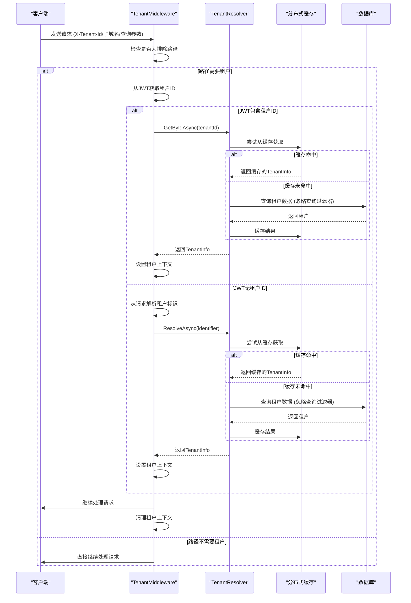
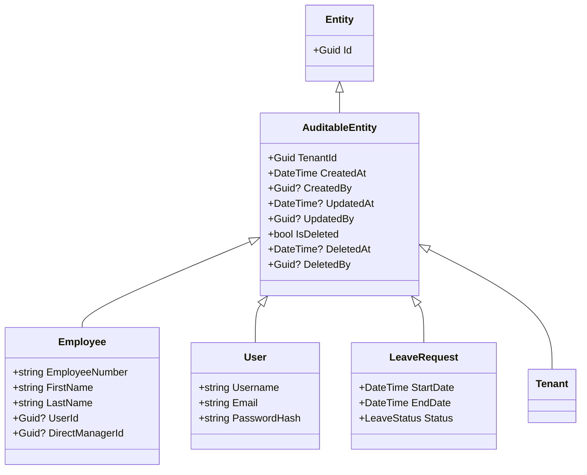
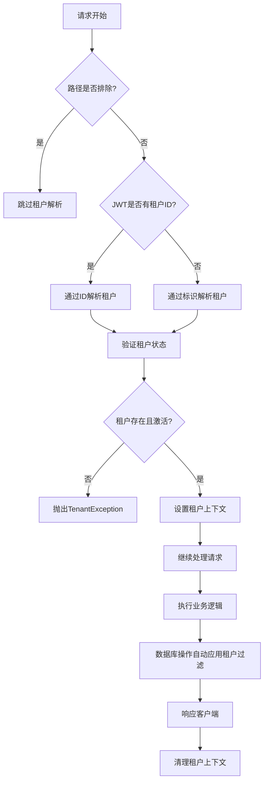

# 多租户架构

<cite>
**本文档引用的文件**  
- [Tenant.cs](file://Backend/Hrevolve.Domain/Tenants/Tenant.cs)
- [ITenantContext.cs](file://Backend/Hrevolve.Shared/MultiTenancy/ITenantContext.cs)
- [TenantInfo.cs](file://Backend/Hrevolve.Shared/MultiTenancy/TenantInfo.cs)
- [TenantResolver.cs](file://Backend/Hrevolve.Infrastructure/MultiTenancy/TenantResolver.cs)
- [HrevolveDbContext.cs](file://Backend/Hrevolve.Infrastructure/Persistence/HrevolveDbContext.cs)
- [TenantMiddleware.cs](file://Backend/Hrevolve.Web/Middleware/TenantMiddleware.cs)
- [AuditableEntity.cs](file://Backend/Hrevolve.Domain/Common/AuditableEntity.cs)
- [DependencyInjection.cs](file://Backend/Hrevolve.Infrastructure/DependencyInjection.cs)
- [Program.cs](file://Backend/Hrevolve.Web/Program.cs)
- [appsettings.json](file://Backend/Hrevolve.Web/appsettings.json)
- [TenantConfiguration.cs](file://Backend/Hrevolve.Infrastructure/Persistence/Configurations/TenantConfiguration.cs)
</cite>

## 目录
1. [多租户架构概述](#多租户架构概述)
2. [租户实体设计](#租户实体设计)
3. [租户上下文与解析机制](#租户上下文与解析机制)
4. [数据隔离与查询重写](#数据隔离与查询重写)
5. [租户上下文在请求管道中的传播](#租户上下文在请求管道中的传播)
6. [敏感数据加密策略](#敏感数据加密策略)
7. [多数据库支持设计](#多数据库支持设计)
8. [性能优化与安全性最佳实践](#性能优化与安全性最佳实践)

## 多租户架构概述

Hrevolve系统采用单数据库多租户（Single Database, Multiple Tenants）架构，通过租户ID（TenantId）字段实现数据隔离。该架构支持SaaS模式下的多租户管理，确保不同租户的数据在逻辑上完全隔离，同时共享同一套应用实例和数据库资源。系统通过全局查询过滤器、租户中间件和上下文传播机制，实现了高效、安全的多租户支持。

**Section sources**
- [Tenant.cs](file://Backend/Hrevolve.Domain/Tenants/Tenant.cs#L1-L67)
- [HrevolveDbContext.cs](file://Backend/Hrevolve.Infrastructure/Persistence/HrevolveDbContext.cs#L1-L157)

## 租户实体设计

租户实体（Tenant）是多租户架构的核心，包含租户的基本信息、状态、配置和连接信息。每个租户拥有唯一的代码（Code）和可选的域名（Domain），用于租户识别。系统支持租户级别的数据库连接字符串和加密密钥，为未来支持独立数据库和数据加密提供了扩展能力。

**Diagram sources**
- [Tenant.cs](file://Backend/Hrevolve.Domain/Tenants/Tenant.cs#L8-L38)
- [TenantConfiguration.cs](file://Backend/Hrevolve.Infrastructure/Persistence/Configurations/TenantConfiguration.cs#L7-L43)

**Section sources**
- [Tenant.cs](file://Backend/Hrevolve.Domain/Tenants/Tenant.cs#L1-L67)
- [TenantConfiguration.cs](file://Backend/Hrevolve.Infrastructure/Persistence/Configurations/TenantConfiguration.cs#L1-L43)

## 租户上下文与解析机制

系统通过ITenantContext和TenantResolver实现租户解析机制。ITenantContext提供当前请求的租户信息，而TenantResolver负责从数据库中解析租户信息，并使用分布式缓存提高性能。租户解析支持多种标识方式，包括HTTP头、子域名和查询参数。

**Diagram sources**
- [TenantMiddleware.cs](file://Backend/Hrevolve.Web/Middleware/TenantMiddleware.cs#L6-L133)
- [TenantResolver.cs](file://Backend/Hrevolve.Infrastructure/MultiTenancy/TenantResolver.cs#L13-L108)
- [ITenantContext.cs](file://Backend/Hrevolve.Shared/MultiTenancy/ITenantContext.cs#L6-L81)

**Section sources**
- [ITenantContext.cs](file://Backend/Hrevolve.Shared/MultiTenancy/ITenantContext.cs#L6-L81)
- [TenantResolver.cs](file://Backend/Hrevolve.Infrastructure/MultiTenancy/TenantResolver.cs#L13-L108)
- [TenantMiddleware.cs](file://Backend/Hrevolve.Web/Middleware/TenantMiddleware.cs#L6-L133)

## 数据隔离与查询重写

系统通过EF Core的全局查询过滤器实现数据隔离（行级安全，RLS）。所有继承自AuditableEntity的实体都会自动应用租户过滤器，确保查询结果仅包含当前租户的数据。这种机制在数据库查询层面实现了自动的查询重写，无需在业务代码中手动添加租户条件。

**Diagram sources**
- [AuditableEntity.cs](file://Backend/Hrevolve.Domain/Common/AuditableEntity.cs#L6-L48)
- [Employee.cs](file://Backend/Hrevolve.Domain/Employees/Employee.cs#L6-L137)
- [HrevolveDbContext.cs](file://Backend/Hrevolve.Infrastructure/Persistence/HrevolveDbContext.cs#L77-L98)

**Section sources**
- [AuditableEntity.cs](file://Backend/Hrevolve.Domain/Common/AuditableEntity.cs#L1-L48)
- [HrevolveDbContext.cs](file://Backend/Hrevolve.Infrastructure/Persistence/HrevolveDbContext.cs#L77-L98)

## 租户上下文在请求管道中的传播

租户上下文通过AsyncLocal机制在请求管道中传播，确保在异步操作中租户信息的一致性。系统在Startup中注册ITenantContextAccessor的单例服务，并通过TenantMiddleware在请求开始时解析和设置租户上下文，在请求结束时清理上下文，避免内存泄漏。

**Diagram sources**
- [TenantContextAccessor.cs](file://Backend/Hrevolve.Shared/MultiTenancy/ITenantContext.cs#L54-L81)
- [DependencyInjection.cs](file://Backend/Hrevolve.Infrastructure/DependencyInjection.cs#L35-L36)
- [Program.cs](file://Backend/Hrevolve.Web/Program.cs#L149-L151)

**Section sources**
- [ITenantContext.cs](file://Backend/Hrevolve.Shared/MultiTenancy/ITenantContext.cs#L54-L81)
- [DependencyInjection.cs](file://Backend/Hrevolve.Infrastructure/DependencyInjection.cs#L35-L36)
- [Program.cs](file://Backend/Hrevolve.Web/Program.cs#L103-L151)

## 敏感数据加密策略

系统为每个租户提供独立的加密密钥（EncryptionKey），用于加密敏感数据如身份证号。租户的加密密钥存储在Tenant实体中，通过租户上下文在运行时获取，确保数据加密的租户隔离性。这种设计支持租户级别的数据安全策略，满足不同租户的合规要求。

**Section sources**
- [Tenant.cs](file://Backend/Hrevolve.Domain/Tenants/Tenant.cs#L16)
- [Employee.cs](file://Backend/Hrevolve.Domain/Employees/Employee.cs#L19)

## 多数据库支持设计

虽然当前系统采用单数据库架构，但通过Tenant实体中的ConnectionString字段为未来支持独立数据库（Per-Tenant Database）提供了扩展能力。当租户需要更高的数据隔离级别或性能保障时，可以为其配置独立的数据库连接字符串，系统将根据租户信息动态切换数据库连接。

**Section sources**
- [Tenant.cs](file://Backend/Hrevolve.Domain/Tenants/Tenant.cs#L15)
- [appsettings.json](file://Backend/Hrevolve.Web/appsettings.json#L2-L5)

## 性能优化与安全性最佳实践

系统通过分布式缓存（Redis）缓存租户信息，减少数据库查询次数，提高租户解析性能。租户中间件在认证后执行，优先从JWT获取租户ID，减少解析开销。安全性方面，系统通过全局查询过滤器确保数据隔离，防止租户间数据泄露，并通过租户状态检查确保仅激活租户可访问系统。

**Section sources**
- [TenantResolver.cs](file://Backend/Hrevolve.Infrastructure/MultiTenancy/TenantResolver.cs#L16-L18)
- [TenantMiddleware.cs](file://Backend/Hrevolve.Web/Middleware/TenantMiddleware.cs#L34-L45)
- [HrevolveDbContext.cs](file://Backend/Hrevolve.Infrastructure/Persistence/HrevolveDbContext.cs#L95-L98)