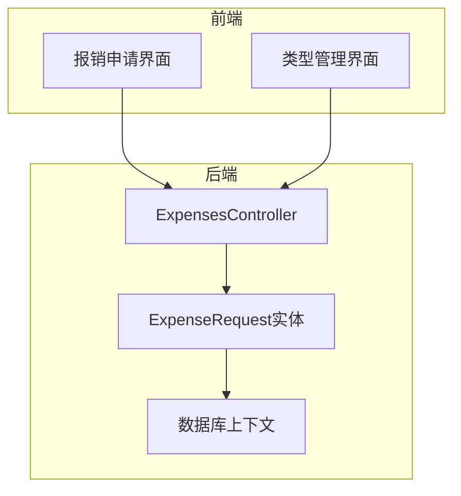
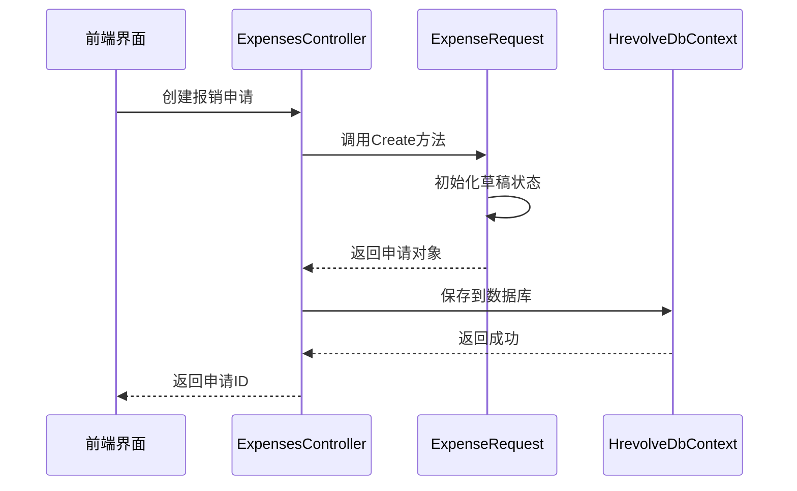
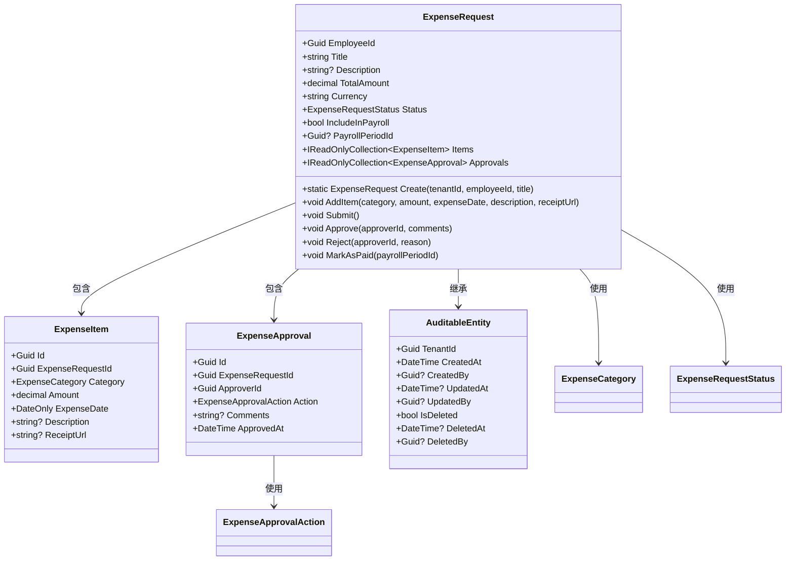
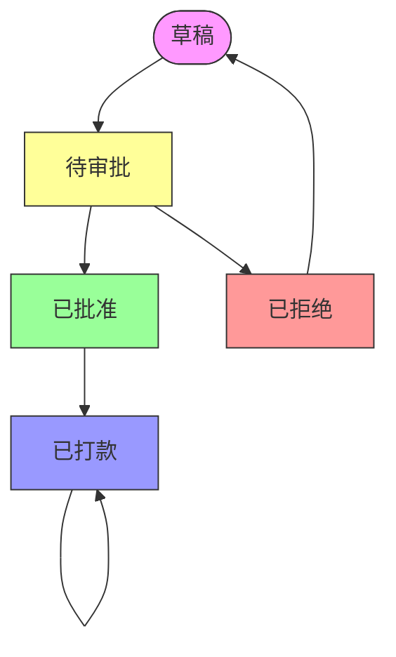
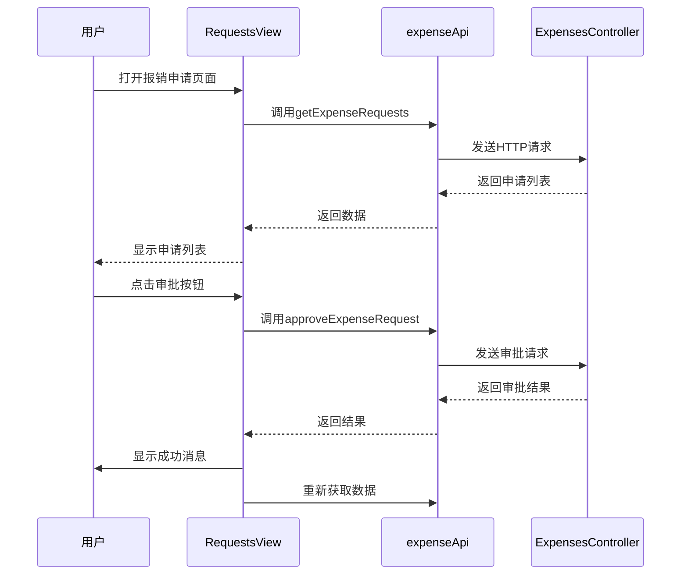
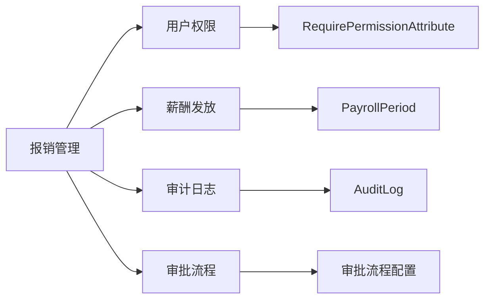

# 报销管理

<cite>
**本文档引用的文件**
- [ExpenseRequest.cs](file://Backend/Hrevolve.Domain/Expense/ExpenseRequest.cs)
- [ExpenseConfiguration.cs](file://Backend/Hrevolve.Infrastructure/Persistence/Configurations/ExpenseConfiguration.cs)
- [ExpensesController.cs](file://Backend/Hrevolve.Web/Controllers/ExpensesController.cs)
- [RequestsView.vue](file://Frontend/hrevolve-web/src/views/expense/RequestsView.vue)
- [TypesView.vue](file://Frontend/hrevolve-web/src/views/expense/TypesView.vue)
- [AuditableEntity.cs](file://Backend/Hrevolve.Domain/Common/AuditableEntity.cs)
- [HrevolveDbContext.cs](file://Backend/Hrevolve.Infrastructure/Persistence/HrevolveDbContext.cs)
- [AuditLog.cs](file://Backend/Hrevolve.Domain/Audit/AuditLog.cs)
- [RequirePermissionAttribute.cs](file://Backend/Hrevolve.Web/Filters/RequirePermissionAttribute.cs)
</cite>

## 目录
1. [引言](#引言)
2. [项目结构](#项目结构)
3. [核心组件](#核心组件)
4. [架构概述](#架构概述)
5. [详细组件分析](#详细组件分析)
6. [依赖分析](#依赖分析)
7. [性能考虑](#性能考虑)
8. [故障排除指南](#故障排除指南)
9. [结论](#结论)

## 引言
报销管理模块是Hrevolve系统中用于管理员工费用报销的核心功能。该模块支持员工提交报销申请、上传票据附件、跟踪审批状态，并与薪酬发放模块集成实现自动打款。系统通过多租户架构支持企业集团的集中管理，同时确保数据隔离和安全性。

## 项目结构
报销管理模块采用分层架构设计，包含领域层、应用层、基础设施层和Web层。前端使用Vue 3框架构建响应式界面，后端采用.NET 8实现业务逻辑和数据持久化。

**图表来源**
- [RequestsView.vue](file://Frontend/hrevolve-web/src/views/expense/RequestsView.vue)
- [TypesView.vue](file://Frontend/hrevolve-web/src/views/expense/TypesView.vue)
- [ExpensesController.cs](file://Backend/Hrevolve.Web/Controllers/ExpensesController.cs)
- [ExpenseRequest.cs](file://Backend/Hrevolve.Domain/Expense/ExpenseRequest.cs)
- [HrevolveDbContext.cs](file://Backend/Hrevolve.Infrastructure/Persistence/HrevolveDbContext.cs)

**章节来源**
- [ExpenseRequest.cs](file://Backend/Hrevolve.Domain/Expense/ExpenseRequest.cs)
- [ExpensesController.cs](file://Backend/Hrevolve.Web/Controllers/ExpensesController.cs)

## 核心组件
报销管理模块的核心是`ExpenseRequest`实体，它封装了报销申请的所有业务逻辑，包括费用明细、审批流程和状态转换。该实体继承自`AuditableEntity`，自动记录创建、修改和删除的审计信息。

**章节来源**
- [ExpenseRequest.cs](file://Backend/Hrevolve.Domain/Expense/ExpenseRequest.cs)
- [AuditableEntity.cs](file://Backend/Hrevolve.Domain/Common/AuditableEntity.cs)

## 架构概述
系统采用CQRS模式分离读写操作，通过MediatR实现命令查询职责分离。应用层通过依赖注入配置验证和日志行为，确保所有操作都经过验证和审计。

**图表来源**
- [ExpenseRequest.cs](file://Backend/Hrevolve.Domain/Expense/ExpenseRequest.cs)
- [ExpensesController.cs](file://Backend/Hrevolve.Web/Controllers/ExpensesController.cs)
- [HrevolveDbContext.cs](file://Backend/Hrevolve.Infrastructure/Persistence/HrevolveDbContext.cs)

## 详细组件分析

### ExpenseRequest实体分析
`ExpenseRequest`实体是报销管理的核心，包含费用类型、金额、票据附件和审批状态等关键属性。

#### 实体类图

**图表来源**
- [ExpenseRequest.cs](file://Backend/Hrevolve.Domain/Expense/ExpenseRequest.cs)

**章节来源**
- [ExpenseRequest.cs](file://Backend/Hrevolve.Domain/Expense/ExpenseRequest.cs)

### 审批流程实现
报销申请的审批流程通过状态模式实现，支持从草稿到已打款的完整生命周期管理。

#### 状态转换流程图

**图表来源**
- [ExpenseRequest.cs](file://Backend/Hrevolve.Domain/Expense/ExpenseRequest.cs)

**章节来源**
- [ExpenseRequest.cs](file://Backend/Hrevolve.Domain/Expense/ExpenseRequest.cs)

### 前端界面分析
前端提供了两个主要视图：`RequestsView.vue`用于管理报销申请，`TypesView.vue`用于管理报销类型。

#### 报销申请界面流程

**图表来源**
- [RequestsView.vue](file://Frontend/hrevolve-web/src/views/expense/RequestsView.vue)
- [expense.ts](file://Frontend/hrevolve-web/src/api/modules/expense.ts)
- [ExpensesController.cs](file://Backend/Hrevolve.Web/Controllers/ExpensesController.cs)

**章节来源**
- [RequestsView.vue](file://Frontend/hrevolve-web/src/views/expense/RequestsView.vue)

## 依赖分析
报销管理模块与其他系统组件存在紧密集成，包括用户权限控制、财务规则引擎和薪酬发放模块。

**图表来源**
- [RequirePermissionAttribute.cs](file://Backend/Hrevolve.Web/Filters/RequirePermissionAttribute.cs)
- [PayrollPeriod.cs](file://Backend/Hrevolve.Domain/Payroll/PayrollPeriod.cs)
- [AuditLog.cs](file://Backend/Hrevolve.Domain/Audit/AuditLog.cs)
- [SettingsController.cs](file://Backend/Hrevolve.Web/Controllers/SettingsController.cs)

**章节来源**
- [ExpenseRequest.cs](file://Backend/Hrevolve.Domain/Expense/ExpenseRequest.cs)
- [ExpensesController.cs](file://Backend/Hrevolve.Web/Controllers/ExpensesController.cs)

## 性能考虑
系统通过以下方式优化性能：
- 使用EF Core的查询过滤器实现多租户数据隔离
- 通过`IReadOnlyCollection`暴露集合属性，防止外部修改
- 在数据库层面创建复合索引提高查询效率
- 使用管道行为实现日志和验证的非侵入式集成

## 故障排除指南
常见问题及解决方案：

1. **报销申请无法提交**
   - 检查是否至少添加了一项费用明细
   - 确认用户具有"expense:submit"权限

2. **审批操作无响应**
   - 检查网络连接
   - 验证当前用户是否在审批流程中

3. **数据不一致**
   - 检查审计日志中的操作记录
   - 验证数据库事务完整性

**章节来源**
- [ExpenseRequest.cs](file://Backend/Hrevolve.Domain/Expense/ExpenseRequest.cs)
- [ExpensesController.cs](file://Backend/Hrevolve.Web/Controllers/ExpensesController.cs)
- [AuditLog.cs](file://Backend/Hrevolve.Domain/Audit/AuditLog.cs)

## 结论
报销管理模块通过清晰的分层架构和领域驱动设计，实现了完整的费用报销生命周期管理。系统通过多租户支持、权限控制和审计日志确保了数据安全和合规性，同时与薪酬发放模块的集成实现了财务流程的自动化。