# 核心功能模块

<cite>
**本文档引用的文件**  
- [Employee.cs](file://Backend/Hrevolve.Domain/Employees/Employee.cs)
- [JobHistory.cs](file://Backend/Hrevolve.Domain/Employees/JobHistory.cs)
- [OrganizationUnit.cs](file://Backend/Hrevolve.Domain/Organizations/OrganizationUnit.cs)
- [AttendanceRecord.cs](file://Backend/Hrevolve.Domain/Attendance/AttendanceRecord.cs)
- [LeaveRequest.cs](file://Backend/Hrevolve.Domain/Leave/LeaveRequest.cs)
- [PayrollRecord.cs](file://Backend/Hrevolve.Domain/Payroll/PayrollRecord.cs)
- [ExpenseRequest.cs](file://Backend/Hrevolve.Domain/Expense/ExpenseRequest.cs)
- [Tenant.cs](file://Backend/Hrevolve.Domain/Tenants/Tenant.cs)
- [CreateEmployeeCommand.cs](file://Backend/Hrevolve.Application/Employees/Commands/CreateEmployeeCommand.cs)
- [GetEmployeeQuery.cs](file://Backend/Hrevolve.Application/Employees/Queries/GetEmployeeQuery.cs)
- [CreateLeaveRequestCommand.cs](file://Backend/Hrevolve.Application/Leave/Commands/CreateLeaveRequestCommand.cs)
- [AuditLog.cs](file://Backend/Hrevolve.Domain/Audit/AuditLog.cs)
- [HrevolveDbContext.cs](file://Backend/Hrevolve.Infrastructure/Persistence/HrevolveDbContext.cs)
- [TenantResolver.cs](file://Backend/Hrevolve.Infrastructure/MultiTenancy/TenantResolver.cs)
- [EmployeesController.cs](file://Backend/Hrevolve.Web/Controllers/EmployeesController.cs)
- [EmployeeConfiguration.cs](file://Backend/Hrevolve.Infrastructure/Persistence/Configurations/EmployeeConfiguration.cs)
- [DependencyInjection.cs](file://Backend/Hrevolve.Application/DependencyInjection.cs)
- [DependencyInjection.cs](file://Backend/Hrevolve.Infrastructure/DependencyInjection.cs)
</cite>

## 目录
1. [多租户管理](#多租户管理)
2. [组织架构](#组织架构)
3. [员工全生命周期](#员工全生命周期)
4. [考勤管理](#考勤管理)
5. [假期管理](#假期管理)
6. [薪酬管理](#薪酬管理)
7. [报销管理](#报销管理)
8. [SCD Type 2历史追溯](#scd-type-2历史追溯)
9. [软删除与审计日志](#软删除与审计日志)
10. [应用层命令与查询处理](#应用层命令与查询处理)
11. [基础设施层EF Core配置](#基础设施层ef-core配置)
12. [模块间交互示例](#模块间交互示例)

## 多租户管理

Hrevolve系统采用SaaS多租户架构，通过`Tenant`实体实现租户隔离。每个租户拥有独立的配置、用户和数据空间，支持不同企业客户在同一平台独立运营。

`Tenant`实体包含租户基本信息如名称、代码、域名、状态和套餐计划。系统通过`TenantResolver`实现租户解析，支持基于域名或租户代码的自动识别。租户上下文通过`ITenantContextAccessor`在请求生命周期中传递，确保数据隔离。

多租户数据隔离通过EF Core的全局查询过滤器实现，在`HrevolveDbContext`中为所有`AuditableEntity`类型实体自动添加租户ID过滤条件，确保每个租户只能访问自己的数据。

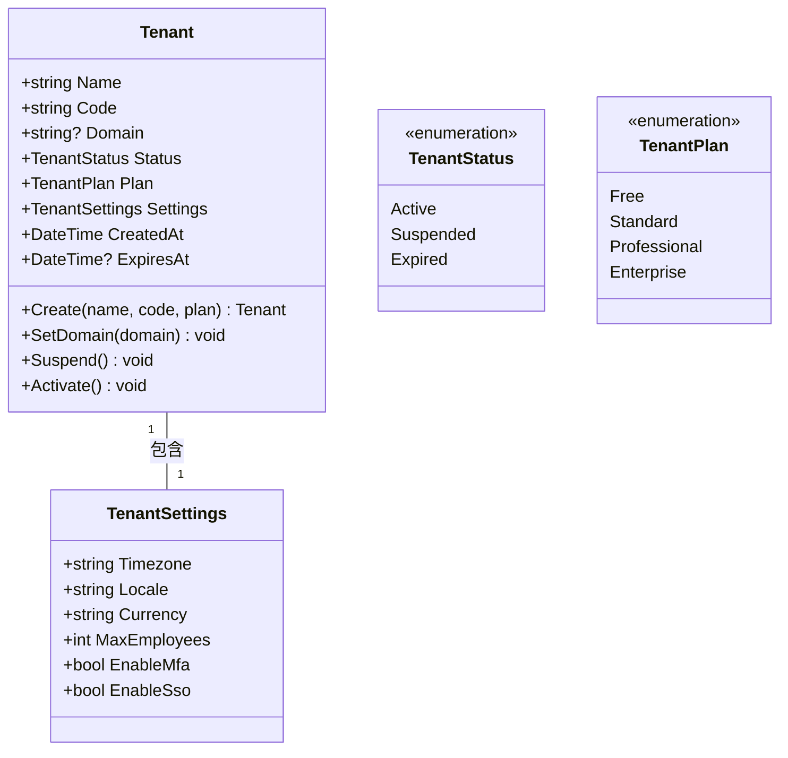

**图示来源**
- [Tenant.cs](file://Backend/Hrevolve.Domain/Tenants/Tenant.cs#L8-L67)

**本节来源**
- [Tenant.cs](file://Backend/Hrevolve.Domain/Tenants/Tenant.cs#L8-L67)
- [TenantResolver.cs](file://Backend/Hrevolve.Infrastructure/MultiTenancy/TenantResolver.cs#L13-L108)
- [HrevolveDbContext.cs](file://Backend/Hrevolve.Infrastructure/Persistence/HrevolveDbContext.cs#L77-L98)

## 组织架构

组织架构模块通过`OrganizationUnit`实体实现树状组织结构，支持公司、事业部、部门、团队和小组等多层级组织单元。系统采用邻接表模型（parent_id）结合路径枚举模型（path）实现高效的层级查询。

`OrganizationUnit`实体包含组织单元的名称、代码、类型、层级深度和路径信息。路径字段存储如"/1/5/23/"格式的路径枚举，支持快速查询子树和判断上下级关系。系统提供`IsAncestorOf`和`IsDescendantOf`方法用于层级关系判断。

组织架构支持负责人设置、激活/停用状态管理，以及组织信息更新。通过`Children`集合属性维护子组织单元的导航关系。

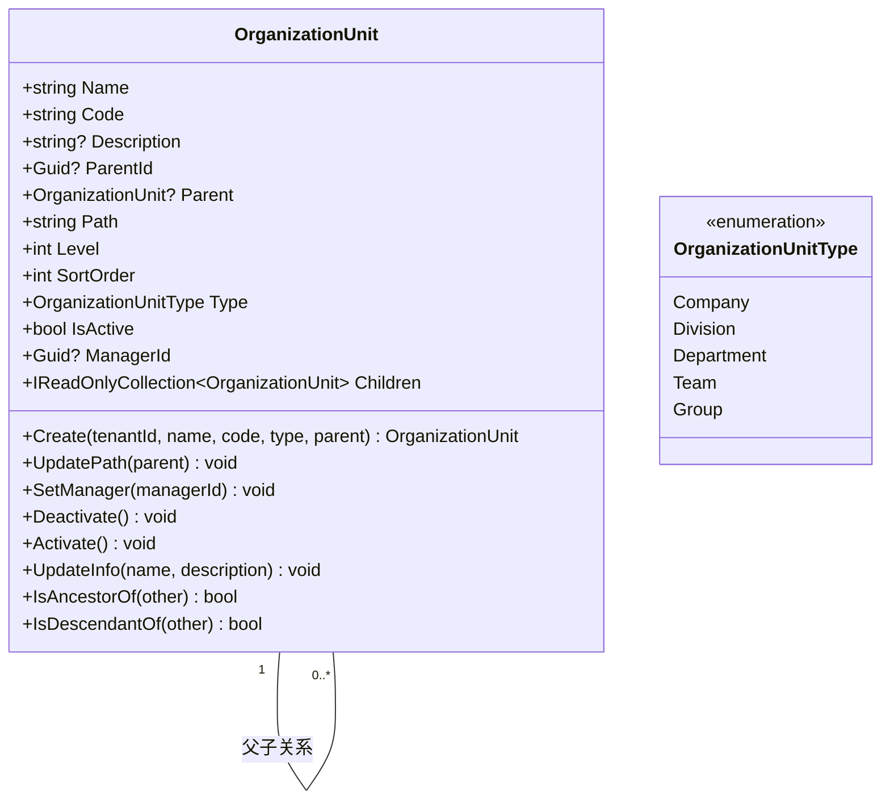

**图示来源**
- [OrganizationUnit.cs](file://Backend/Hrevolve.Domain/Organizations/OrganizationUnit.cs#L9-L108)

**本节来源**
- [OrganizationUnit.cs](file://Backend/Hrevolve.Domain/Organizations/OrganizationUnit.cs#L9-L108)

## 员工全生命周期

员工全生命周期管理通过`Employee`实体实现，涵盖员工从入职到离职的完整生命周期。`Employee`继承自`AuditableEntity`，包含员工基本信息、联系方式、雇佣状态和职业信息。

员工状态通过`EmploymentStatus`枚举管理，包括在职、休假中、停职和离职四种状态。雇佣类型支持全职、兼职、合同工、实习生和顾问。系统提供`Create`工厂方法创建新员工，`Terminate`方法处理离职，以及`PassProbation`方法处理试用期通过。

员工与直属上级通过`DirectManagerId`和`DirectManager`导航属性建立自引用关系。员工与用户账号通过`UserId`关联，实现系统访问权限控制。

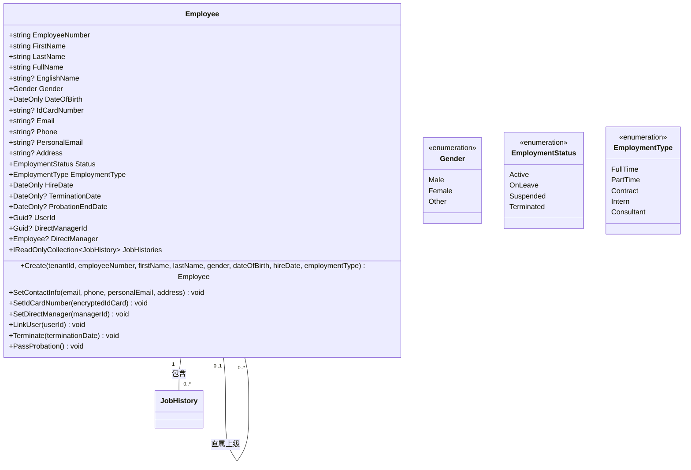

**图示来源**
- [Employee.cs](file://Backend/Hrevolve.Domain/Employees/Employee.cs#L6-L137)

**本节来源**
- [Employee.cs](file://Backend/Hrevolve.Domain/Employees/Employee.cs#L6-L137)

## 考勤管理

考勤管理模块通过`AttendanceRecord`实体记录员工每日考勤情况。每个考勤记录关联员工、日期、班次安排和打卡信息，支持多种打卡方式和位置记录。

考勤状态通过`AttendanceStatus`枚举管理，包括待处理、正常、迟到、早退、缺勤、打卡不完整、请假和出差。系统根据签到签退时间自动计算实际工时和加班时长，并更新考勤状态。

`AttendanceRecord`提供`CheckIn`、`CheckOut`和`ManualCheckIn`等方法处理不同场景的打卡操作。补卡操作通过`Manual`方式记录，并添加备注说明。考勤记录支持审核流程，通过`Approve`方法标记为已审核。

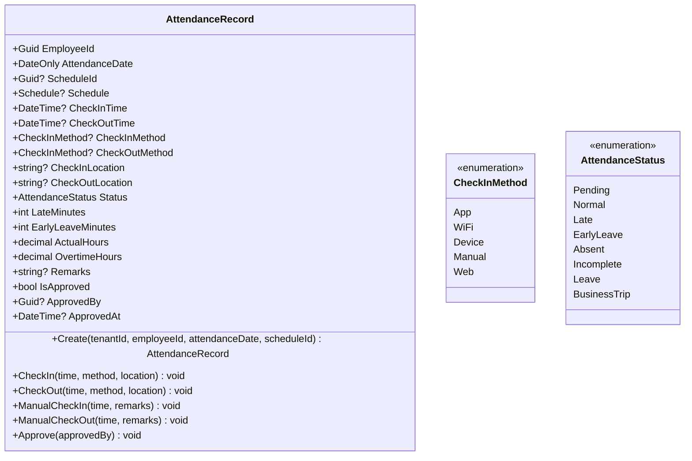

**图示来源**
- [AttendanceRecord.cs](file://Backend/Hrevolve.Domain/Attendance/AttendanceRecord.cs#L8-L191)

**本节来源**
- [AttendanceRecord.cs](file://Backend/Hrevolve.Domain/Attendance/AttendanceRecord.cs#L8-L191)

## 假期管理

假期管理模块通过`LeaveRequest`实体处理请假申请流程。请假申请包含请假类型、时间范围、天数计算和审批状态，支持半天请假和附件上传。

请假状态通过`LeaveRequestStatus`枚举管理，包括待审批、已批准、已拒绝和已取消。系统提供`Approve`、`Reject`和`Cancel`方法处理审批流程。每次审批操作都会创建`LeaveApproval`记录，保存审批人、操作、评论和时间。

`LeaveBalance`实体管理员工假期余额，包含年度额度、结转额度、已使用、待审批和可用余额。系统在创建请假申请时检查假期余额，并在审批通过后更新余额。

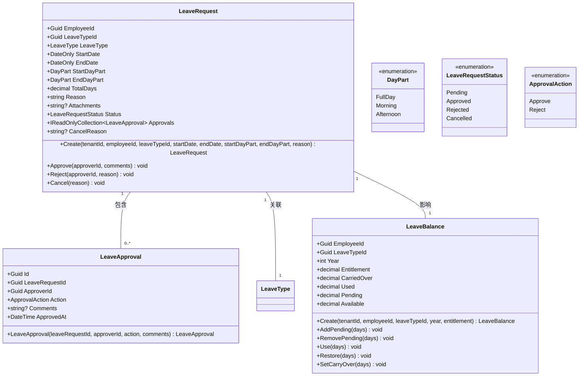

**图示来源**
- [LeaveRequest.cs](file://Backend/Hrevolve.Domain/Leave/LeaveRequest.cs#L8-L234)

**本节来源**
- [LeaveRequest.cs](file://Backend/Hrevolve.Domain/Leave/LeaveRequest.cs#L8-L234)

## 薪酬管理

薪酬管理模块通过`PayrollRecord`实体记录员工薪资信息。薪资记录关联员工、薪资周期和明细项，包含基本工资、应发工资、扣除总额、实发工资和个人所得税等财务数据。

薪资状态通过`PayrollRecordStatus`枚举管理，包括草稿、已计算、已审批和已发放。系统提供`Calculate`方法计算薪资总额，`Approve`方法审批薪资，以及`MarkAsPaid`方法标记为已发放。

`PayrollDetail`实体记录薪资明细，包含薪资项目、金额和类型（收入、扣除、税收）。系统在计算薪资时汇总各类明细，生成最终薪资结果。

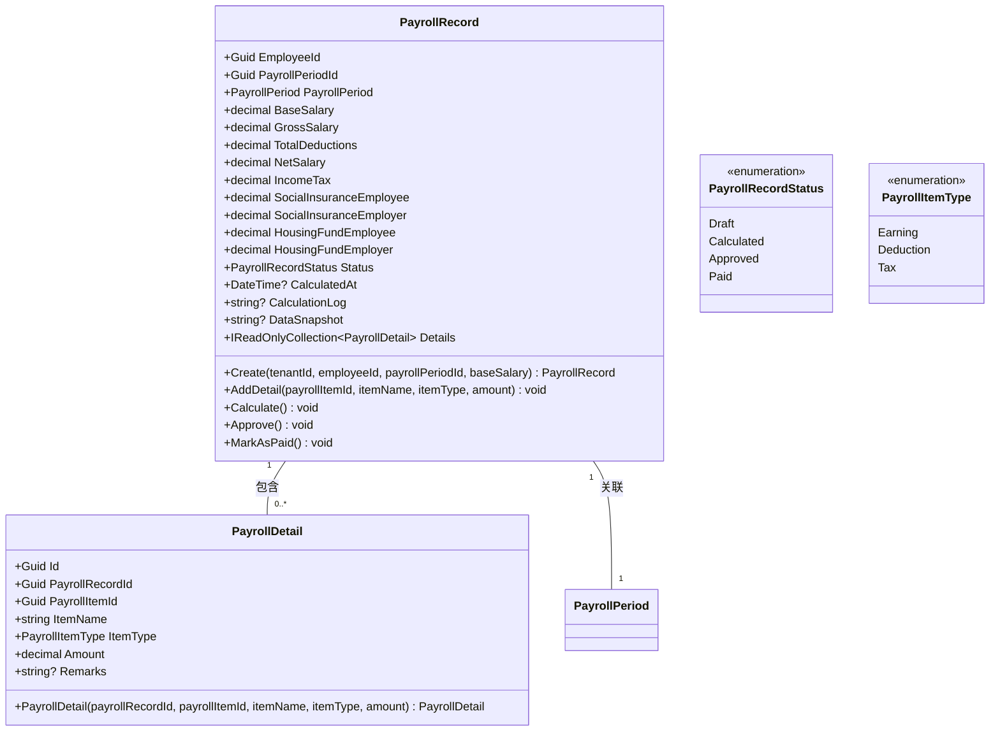

**图示来源**
- [PayrollRecord.cs](file://Backend/Hrevolve.Domain/Payroll/PayrollRecord.cs#L8-L162)

**本节来源**
- [PayrollRecord.cs](file://Backend/Hrevolve.Domain/Payroll/PayrollRecord.cs#L8-L162)

## 报销管理

报销管理模块通过`ExpenseRequest`实体处理报销申请流程。报销申请包含标题、描述、总金额、币种和明细项，支持关联薪资周期发放。

报销状态通过`ExpenseRequestStatus`枚举管理，包括草稿、待审批、已批准、已拒绝和已打款。系统提供`Submit`、`Approve`、`Reject`和`MarkAsPaid`方法处理审批流程。每次审批操作都会创建`ExpenseApproval`记录。

`ExpenseItem`实体记录报销明细，包含类别、金额、日期、描述和发票URL。系统在提交报销申请时验证至少包含一项费用，并在审批通过后更新状态。

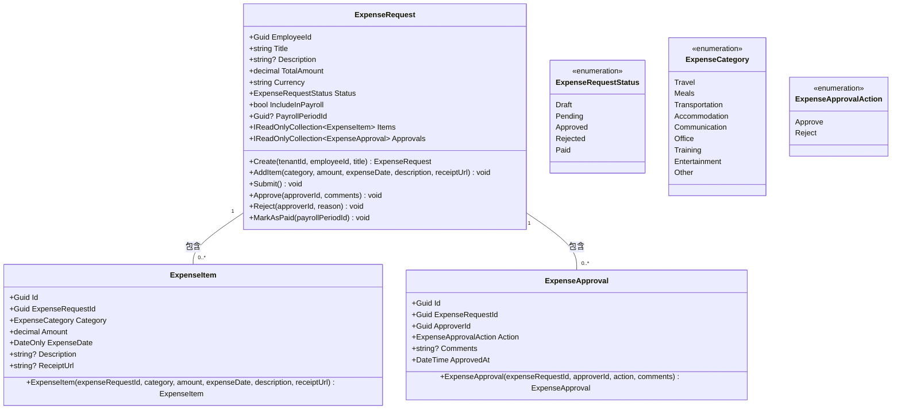

**图示来源**
- [ExpenseRequest.cs](file://Backend/Hrevolve.Domain/Expense/ExpenseRequest.cs#L8-L187)

**本节来源**
- [ExpenseRequest.cs](file://Backend/Hrevolve.Domain/Expense/ExpenseRequest.cs#L8-L187)

## SCD Type 2历史追溯

SCD Type 2（缓慢变化维度类型2）历史追溯在`JobHistory`实体中实现，用于记录员工职位、部门和薪资的变更历史。每个`JobHistory`记录包含生效开始日期和结束日期，通过时间区间管理历史数据。

`JobHistory`实体包含员工ID、职位ID、部门ID、基本薪资、职级、变更类型和变更原因。`EffectiveStartDate`和`EffectiveEndDate`字段定义记录的有效时间范围，`EffectiveEndDate`默认为9999-12-31表示当前有效记录。

系统提供`Close`方法关闭历史记录（设置结束日期），`IsEffectiveOn`方法判断指定日期是否在有效期内。当员工职位变更时，系统会创建新的`JobHistory`记录，并关闭旧记录，实现完整的变更历史追踪。

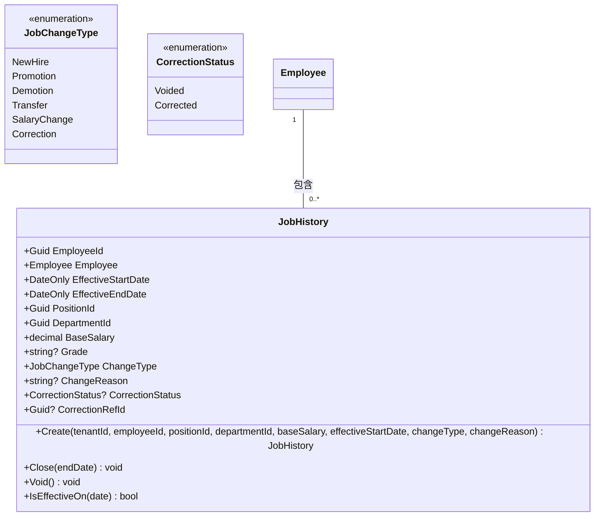

**图示来源**
- [JobHistory.cs](file://Backend/Hrevolve.Domain/Employees/JobHistory.cs#L9-L124)

**本节来源**
- [JobHistory.cs](file://Backend/Hrevolve.Domain/Employees/JobHistory.cs#L9-L124)
- [GetEmployeeQuery.cs](file://Backend/Hrevolve.Application/Employees/Queries/GetEmployeeQuery.cs#L41-L158)

## 软删除与审计日志

系统实现软删除与审计日志的自动记录机制。软删除通过`AuditableEntity`基类中的`IsDeleted`字段实现，在`HrevolveDbContext`的`SaveChangesAsync`方法中拦截删除操作，将其转换为更新操作并设置`IsDeleted`为true。

审计日志通过`AuditLog`实体记录所有关键操作，包括创建、更新、删除、登录等。`HrevolveDbContext`在`SaveChangesAsync`方法中自动捕获实体变更，创建审计日志记录。审计日志包含操作类型、实体类型、实体ID、旧值、新值、变更字段、用户信息和请求信息。

`AuditLog`实体通过`SetChanges`和`SetRequestInfo`方法设置变更和请求信息，确保审计信息的完整性。系统通过全局查询过滤器确保软删除的实体在查询中被自动过滤。

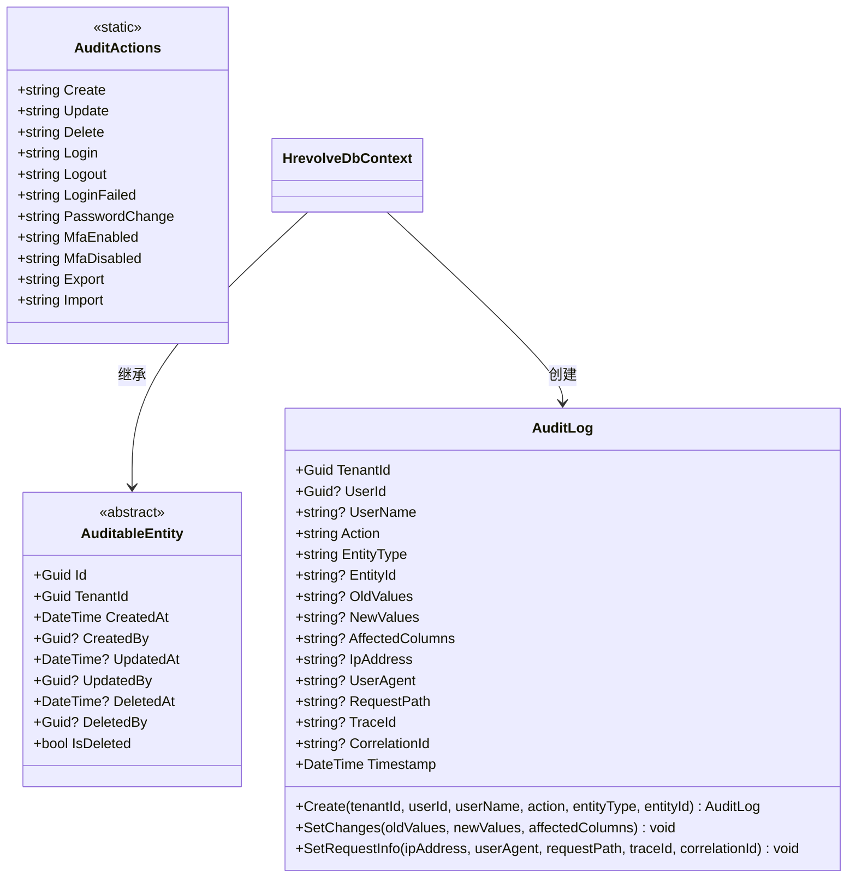

**图示来源**
- [AuditLog.cs](file://Backend/Hrevolve.Domain/Audit/AuditLog.cs#L8-L126)
- [HrevolveDbContext.cs](file://Backend/Hrevolve.Infrastructure/Persistence/HrevolveDbContext.cs#L120-L155)

**本节来源**
- [AuditLog.cs](file://Backend/Hrevolve.Domain/Audit/AuditLog.cs#L8-L126)
- [HrevolveDbContext.cs](file://Backend/Hrevolve.Infrastructure/Persistence/HrevolveDbContext.cs#L120-L155)

## 应用层命令与查询处理

应用层采用CQRS模式，通过MediatR实现命令与查询的分离。命令处理写操作，查询处理读操作，确保关注点分离和性能优化。

`CreateEmployeeCommand`命令处理员工创建流程，包含验证、业务规则检查和领域对象创建。命令处理器`CreateEmployeeCommandHandler`注入`IEmployeeRepository`和`IUnitOfWork`，执行数据持久化。系统通过`ValidationBehavior`和`LoggingBehavior`管道行为实现自动验证和日志记录。

`GetEmployeeQuery`查询处理员工详情获取，返回`EmployeeDto`数据传输对象。查询处理器`GetEmployeeQueryHandler`通过仓储获取领域对象，并转换为DTO返回。`GetEmployeeAtDateQuery`查询支持历史时点查询，通过`JobHistory`实现SCD Type 2查询。

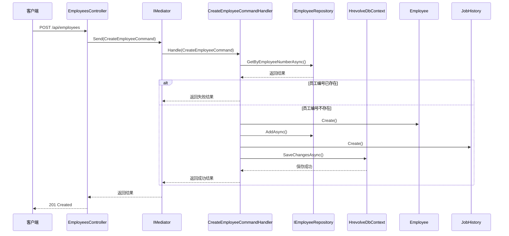

**图示来源**
- [CreateEmployeeCommand.cs](file://Backend/Hrevolve.Application/Employees/Commands/CreateEmployeeCommand.cs#L6-L136)
- [CreateEmployeeCommandHandler.cs](file://Backend/Hrevolve.Application/Employees/Commands/CreateEmployeeCommand.cs#L70-L136)
- [EmployeesController.cs](file://Backend/Hrevolve.Web/Controllers/EmployeesController.cs#L60-L72)

**本节来源**
- [CreateEmployeeCommand.cs](file://Backend/Hrevolve.Application/Employees/Commands/CreateEmployeeCommand.cs#L6-L136)
- [GetEmployeeQuery.cs](file://Backend/Hrevolve.Application/Employees/Queries/GetEmployeeQuery.cs#L41-L158)
- [DependencyInjection.cs](file://Backend/Hrevolve.Application/DependencyInjection.cs#L8-L26)

## 基础设施层EF Core配置

基础设施层通过EF Core实现数据持久化，采用代码优先（Code First）方式管理数据库模式。`HrevolveDbContext`继承自`DbContext`，定义所有实体的DbSet属性。

系统通过`IEntityTypeConfiguration`接口实现实体配置分离。`EmployeeConfiguration`配置员工实体的表名、字段长度、索引和关系。`JobHistoryConfiguration`配置职位历史实体，包括时间范围索引和级联删除关系。

`HrevolveDbContext`在`OnModelCreating`方法中应用所有配置，并设置全局查询过滤器实现多租户隔离和软删除。`SaveChangesAsync`方法重写实现审计字段自动填充和软删除转换。

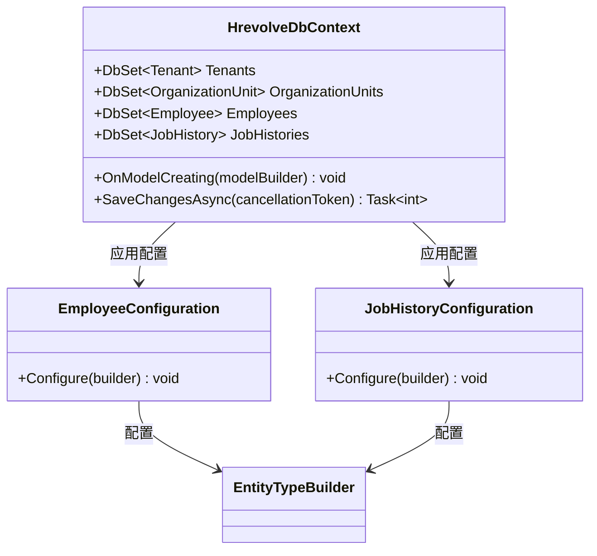

**图示来源**
- [HrevolveDbContext.cs](file://Backend/Hrevolve.Infrastructure/Persistence/HrevolveDbContext.cs#L9-L157)
- [EmployeeConfiguration.cs](file://Backend/Hrevolve.Infrastructure/Persistence/Configurations/EmployeeConfiguration.cs#L5-L110)

**本节来源**
- [HrevolveDbContext.cs](file://Backend/Hrevolve.Infrastructure/Persistence/HrevolveDbContext.cs#L9-L157)
- [EmployeeConfiguration.cs](file://Backend/Hrevolve.Infrastructure/Persistence/Configurations/EmployeeConfiguration.cs#L5-L110)
- [DependencyInjection.cs](file://Backend/Hrevolve.Infrastructure/DependencyInjection.cs#L11-L58)

## 模块间交互示例

各模块通过领域事件和应用服务实现交互。请假审批影响考勤统计的交互流程如下：当请假申请被批准时，系统触发`LeaveRequestApprovedEvent`领域事件，该事件可被考勤服务监听，自动更新相关日期的考勤记录状态为"请假"。

具体流程：员工提交请假申请 → 系统检查假期余额和日期冲突 → 审批人批准申请 → 系统更新请假状态为"已批准" → 触发`LeaveRequestApprovedEvent` → 考勤服务监听事件 → 更新指定日期范围的考勤记录状态 → 考勤统计包含请假数据。

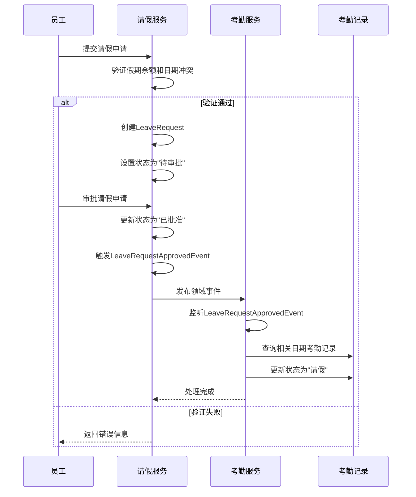

**图示来源**
- [LeaveRequest.cs](file://Backend/Hrevolve.Domain/Leave/LeaveRequest.cs#L87-L108)
- [CreateLeaveRequestCommand.cs](file://Backend/Hrevolve.Application/Leave/Commands/CreateLeaveRequestCommand.cs#L62-L137)
- [AttendanceRecord.cs](file://Backend/Hrevolve.Domain/Attendance/AttendanceRecord.cs#L163-L168)

**本节来源**
- [LeaveRequest.cs](file://Backend/Hrevolve.Domain/Leave/LeaveRequest.cs#L87-L108)
- [CreateLeaveRequestCommand.cs](file://Backend/Hrevolve.Application/Leave/Commands/CreateLeaveRequestCommand.cs#L62-L137)
- [AttendanceRecord.cs](file://Backend/Hrevolve.Domain/Attendance/AttendanceRecord.cs#L163-L168)