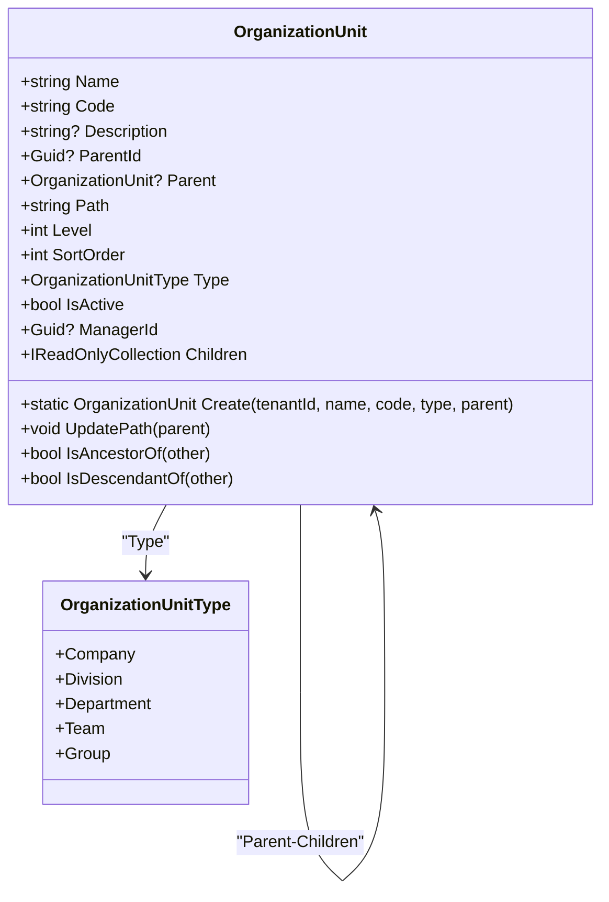
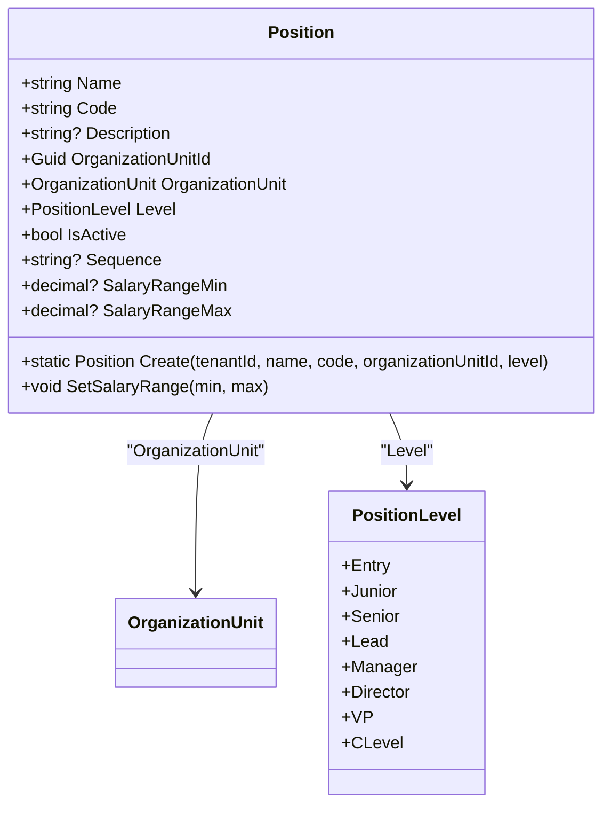
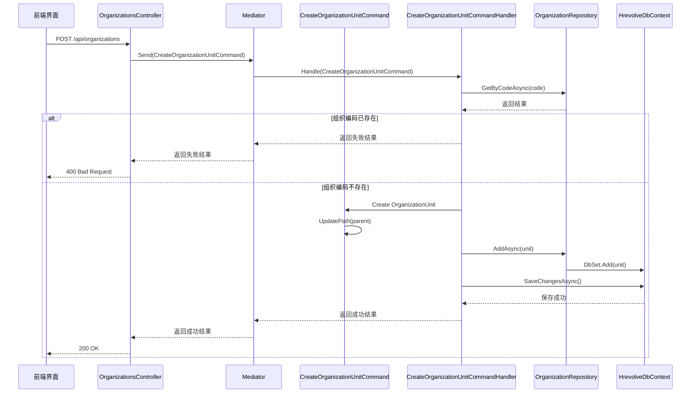
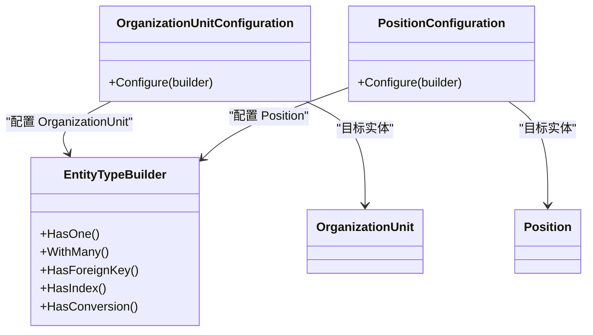
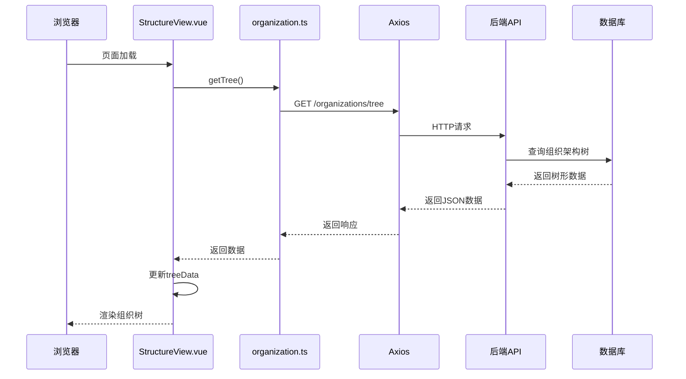

# 组织架构管理

<cite>
**本文档引用的文件**
- [OrganizationUnit.cs](file://Backend/Hrevolve.Domain/Organizations/OrganizationUnit.cs)
- [Position.cs](file://Backend/Hrevolve.Domain/Organizations/Position.cs)
- [OrganizationConfiguration.cs](file://Backend/Hrevolve.Infrastructure/Persistence/Configurations/OrganizationConfiguration.cs)
- [OrganizationRepository.cs](file://Backend/Hrevolve.Infrastructure/Persistence/Repositories/OrganizationRepository.cs)
- [OrganizationsController.cs](file://Backend/Hrevolve.Web/Controllers/OrganizationsController.cs)
- [StructureView.vue](file://Frontend/hrevolve-web/src/views/organization/StructureView.vue)
- [organization.ts](file://Frontend/hrevolve-web/src/api/modules/organization.ts)
- [HrevolveDbContext.cs](file://Backend/Hrevolve.Infrastructure/Persistence/HrevolveDbContext.cs)
</cite>

## 目录
1. [引言](#引言)
2. [组织单元实体设计](#组织单元实体设计)
3. [职位模型设计](#职位模型设计)
4. [应用层命令处理流程](#应用层命令处理流程)
5. [EF Core 配置实现](#ef-core-配置实现)
6. [前后端交互示例](#前后端交互示例)
7. [查询性能优化策略](#查询性能优化策略)

## 引言
本文档详细描述了Hrevolve系统中组织架构管理模块的设计与实现。该模块采用混合数据模型来支持复杂的树状组织结构，结合了邻接表和路径枚举两种模式的优势。文档涵盖了从领域模型设计、数据访问配置到前后端交互的完整技术实现，重点说明了如何维护树结构的完整性以及在大规模数据场景下的性能优化策略。

## 组织单元实体设计

组织单元实体（OrganizationUnit）采用邻接表模型与路径枚举模型相结合的混合实现方式，以平衡查询性能和数据一致性。



**图示来源**
- [OrganizationUnit.cs](file://Backend/Hrevolve.Domain/Organizations/OrganizationUnit.cs#L9-L98)

**组织单元实体属性说明：**

| 属性 | 类型 | 说明 |
|------|------|------|
| Name | string | 组织单元名称 |
| Code | string | 组织单元编码，租户内唯一 |
| Description | string? | 描述信息 |
| ParentId | Guid? | 父级组织单元ID（邻接表模型） |
| Parent | OrganizationUnit? | 父级组织单元导航属性 |
| Path | string | 路径枚举，格式为"/父ID/本ID/"，用于快速子树查询 |
| Level | int | 层级深度，根节点为0 |
| SortOrder | int | 同级排序序号 |
| Type | OrganizationUnitType | 组织单元类型（公司、部门等） |
| IsActive | bool | 是否激活状态 |
| ManagerId | Guid? | 负责人ID |
| Children | IReadOnlyCollection | 子组织单元只读集合 |

**Section sources**
- [OrganizationUnit.cs](file://Backend/Hrevolve.Domain/Organizations/OrganizationUnit.cs#L9-L98)

## 职位模型设计

职位模型（Position）定义了组织中的岗位信息，与组织单元建立关联关系。



**图示来源**
- [Position.cs](file://Backend/Hrevolve.Domain/Organizations/Position.cs#L8-L59)

**职位模型属性说明：**

| 属性 | 类型 | 说明 |
|------|------|------|
| Name | string | 职位名称 |
| Code | string | 职位编码，租户内唯一 |
| Description | string? | 职位描述 |
| OrganizationUnitId | Guid | 所属组织单元ID |
| OrganizationUnit | OrganizationUnit | 所属组织单元导航属性 |
| Level | PositionLevel | 职位级别 |
| IsActive | bool | 是否激活状态 |
| Sequence | string? | 职位序列（如技术序列、管理序列） |
| SalaryRangeMin | decimal? | 薪资范围下限 |
| SalaryRangeMax | decimal? | 薪资范围上限 |

**Section sources**
- [Position.cs](file://Backend/Hrevolve.Domain/Organizations/Position.cs#L8-L59)

## 应用层命令处理流程

组织单元的增删改查操作通过CQRS模式在应用层进行处理，确保业务逻辑的清晰分离和可维护性。



**图示来源**
- [OrganizationsController.cs](file://Backend/Hrevolve.Web/Controllers/OrganizationsController.cs#L37-L45)
- [OrganizationUnit.cs](file://Backend/Hrevolve.Domain/Organizations/OrganizationUnit.cs#L45-L64)
- [OrganizationRepository.cs](file://Backend/Hrevolve.Infrastructure/Persistence/Repositories/OrganizationRepository.cs#L14-L25)

组织单元的树结构完整性通过以下机制维护：

1. **路径更新机制**：当创建或移动组织单元时，自动更新其路径（Path）和层级（Level）属性
2. **循环引用检测**：通过路径前缀检查防止循环引用
3. **级联操作限制**：使用DeleteBehavior.Restrict防止意外删除父节点导致的数据不一致
4. **事务性操作**：所有变更操作在数据库事务中执行，确保数据一致性

**Section sources**
- [OrganizationsController.cs](file://Backend/Hrevolve.Web/Controllers/OrganizationsController.cs#L37-L45)
- [OrganizationUnit.cs](file://Backend/Hrevolve.Domain/Organizations/OrganizationUnit.cs#L66-L78)
- [OrganizationRepository.cs](file://Backend/Hrevolve.Infrastructure/Persistence/Repositories/OrganizationRepository.cs#L14-L25)

## EF Core 配置实现

EF Core 配置中针对组织单元的自引用外键和索引进行了专门优化。



**图示来源**
- [OrganizationConfiguration.cs](file://Backend/Hrevolve.Infrastructure/Persistence/Configurations/OrganizationConfiguration.cs#L5-L94)

**自引用外键配置：**

```csharp
builder.HasOne(o => o.Parent)
    .WithMany(o => o.Children)
    .HasForeignKey(o => o.ParentId)
    .OnDelete(DeleteBehavior.Restrict);
```

该配置建立了组织单元实体的自引用关系，其中：
- `HasOne(o => o.Parent)`：定义一个可空的父级引用
- `WithMany(o => o.Children)`：定义一对多的子级集合
- `HasForeignKey(o => o.ParentId)`：指定外键字段
- `OnDelete(DeleteBehavior.Restrict)`：删除父级时限制操作，防止意外删除

**关键索引配置：**

| 索引 | 字段 | 说明 |
|------|------|------|
| 唯一索引 | TenantId, Code | 确保租户内组织编码唯一 |
| 普通索引 | TenantId, ParentId | 优化按父级查询的性能 |
| 普通索引 | TenantId, Path | 优化路径前缀查询的性能 |

这些索引对于大规模组织树的查询性能至关重要，特别是Path索引支持高效的子树查询。

**Section sources**
- [OrganizationConfiguration.cs](file://Backend/Hrevolve.Infrastructure/Persistence/Configurations/OrganizationConfiguration.cs#L5-L94)

## 前后端交互示例

前端组件StructureView.vue与后端API通过RESTful接口进行交互，实现组织架构的可视化展示。



**图示来源**
- [StructureView.vue](file://Frontend/hrevolve-web/src/views/organization/StructureView.vue#L12-L17)
- [organization.ts](file://Frontend/hrevolve-web/src/api/modules/organization.ts#L7-L9)
- [OrganizationsController.cs](file://Backend/Hrevolve.Web/Controllers/OrganizationsController.cs#L15-L21)

**前端组件关键代码：**

```vue
<script setup lang="ts">
const fetchTree = async () => {
  loading.value = true;
  try {
    const res = await organizationApi.getTree();
    treeData.value = res.data;
  } catch { /* ignore */ } finally { loading.value = false; }
};

onMounted(() => fetchTree());
</script>

<template>
  <el-tree :data="treeData" :props="defaultProps" default-expand-all node-key="id">
    <template #default="{ node, data }">
      <span class="tree-node">
        <span>{{ node.label }}</span>
        <span class="node-info">{{ t('orgAdmin.employeeCount', { count: data.employeeCount || 0 }) }}</span>
      </span>
    </template>
  </el-tree>
</template>
```

该组件使用Element Plus的el-tree组件展示组织架构，通过API调用获取数据，并在页面加载时自动初始化。

**Section sources**
- [StructureView.vue](file://Frontend/hrevolve-web/src/views/organization/StructureView.vue#L12-L43)
- [organization.ts](file://Frontend/hrevolve-web/src/api/modules/organization.ts#L7-L9)

## 查询性能优化策略

针对大规模组织树的查询性能，系统采用了多种优化策略。

```mermaid
flowchart TD
A[查询请求] --> B{查询类型}
B --> |获取根节点| C[GetRootUnitsAsync]
B --> |获取子树| D[GetSubTreeAsync]
B --> |获取祖先| E[GetAncestorsAsync]
B --> |获取单个节点| F[GetByIdAsync]
C --> G[WHERE ParentId IS NULL]
D --> H[WHERE Path.StartsWith(path)]
E --> I[解析Path获取祖先ID]
F --> J[直接通过ID查询]
G --> K[使用TenantId,ParentId索引]
H --> L[使用TenantId,Path索引]
I --> M[批量ID查询]
J --> N[主键索引]
K --> O[返回结果]
L --> O
M --> O
N --> O
```

**图示来源**
- [OrganizationRepository.cs](file://Backend/Hrevolve.Infrastructure/Persistence/Repositories/OrganizationRepository.cs#L40-L75)

**主要性能优化策略包括：**

1. **混合查询模型**：
   - 使用邻接表模型进行直接父子关系查询
   - 使用路径枚举模型进行子树和祖先查询

2. **索引优化**：
   - 为TenantId, Path创建复合索引，支持高效的子树查询
   - 为TenantId, ParentId创建复合索引，优化同级节点查询
   - 为Code创建唯一索引，确保编码唯一性的同时提升查询性能

3. **批量查询优化**：
   - 获取祖先节点时，通过解析Path字段批量获取所有祖先ID，然后进行一次IN查询
   - 避免递归查询导致的N+1问题

4. **查询过滤**：
   - 所有查询都包含租户ID过滤，确保多租户环境下的数据隔离
   - 使用IQueryable延迟执行，避免不必要的数据加载

5. **缓存策略**：
   - 虽然当前代码未实现，但建议对不频繁变更的组织架构树进行缓存
   - 可以使用Redis等内存数据库存储序列化的树结构

这些优化策略确保了即使在拥有数千个组织单元的大型企业中，组织架构的查询和操作也能保持良好的性能表现。

**Section sources**
- [OrganizationRepository.cs](file://Backend/Hrevolve.Infrastructure/Persistence/Repositories/OrganizationRepository.cs#L40-L75)
- [OrganizationConfiguration.cs](file://Backend/Hrevolve.Infrastructure/Persistence/Configurations/OrganizationConfiguration.cs#L33-L37)