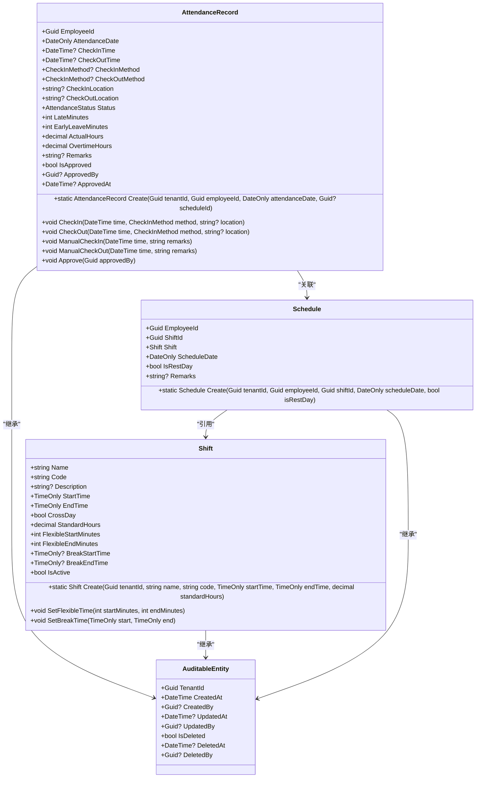
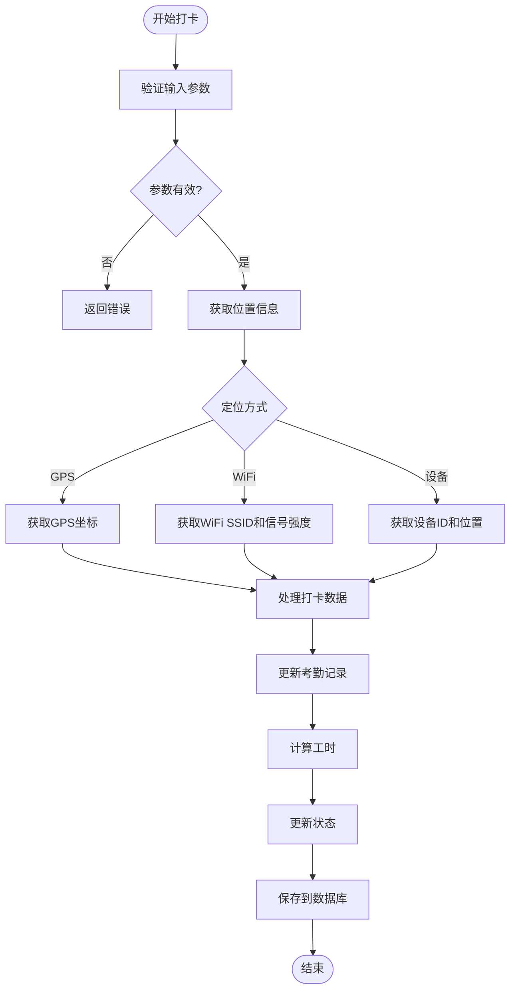
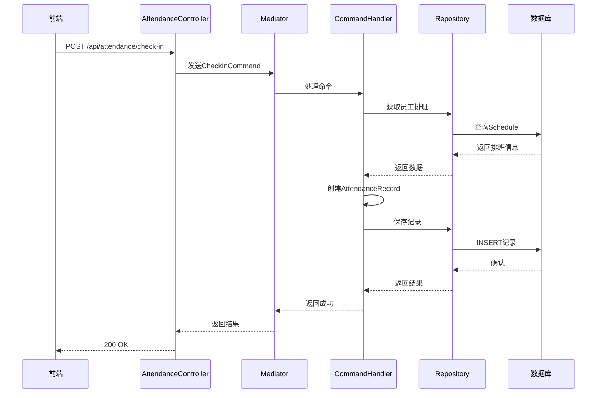
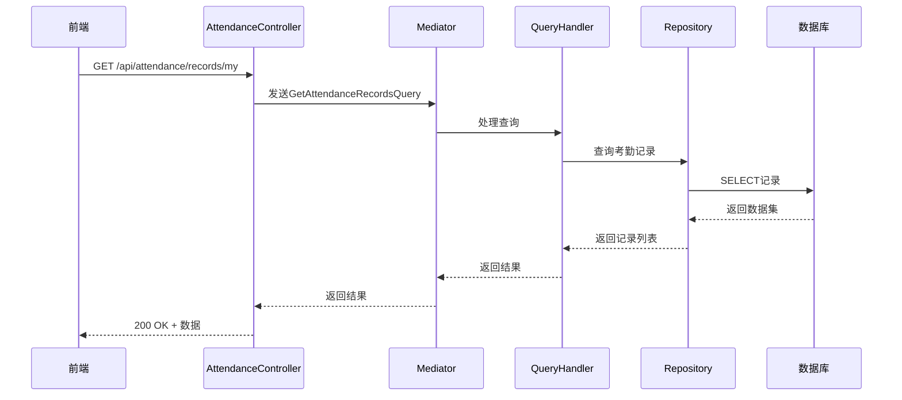
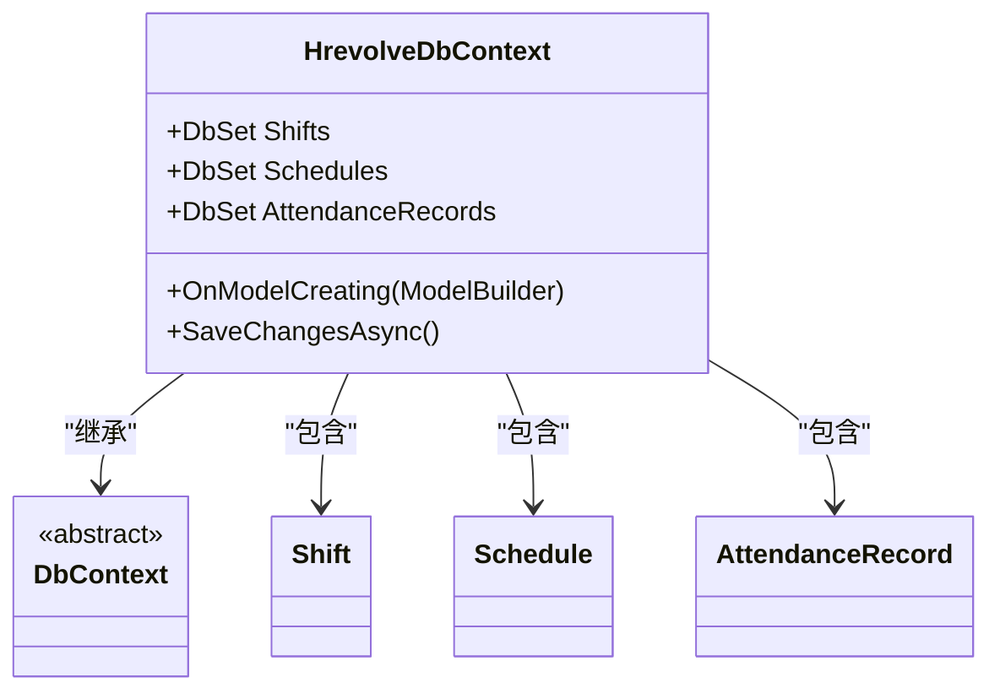

# 考勤管理

<cite>
**本文档引用文件**  
- [AttendanceRecord.cs](file://Backend/Hrevolve.Domain/Attendance/AttendanceRecord.cs)
- [Shift.cs](file://Backend/Hrevolve.Domain/Attendance/Shift.cs)
- [AttendanceConfiguration.cs](file://Backend/Hrevolve.Infrastructure/Persistence/Configurations/AttendanceConfiguration.cs)
- [HrevolveDbContext.cs](file://Backend/Hrevolve.Infrastructure/Persistence/HrevolveDbContext.cs)
- [AttendanceController.cs](file://Backend/Hrevolve.Web/Controllers/AttendanceController.cs)
- [RecordsView.vue](file://Frontend/hrevolve-web/src/views/attendance/RecordsView.vue)
- [ShiftsView.vue](file://Frontend/hrevolve-web/src/views/attendance/ShiftsView.vue)
- [attendance.ts](file://Frontend/hrevolve-web/src/api/modules/attendance.ts)
- [index.ts](file://Frontend/hrevolve-web/src/types/index.ts)
</cite>

## 目录
1. [引言](#引言)
2. [领域模型设计](#领域模型设计)
3. [多源打卡数据处理逻辑](#多源打卡数据处理逻辑)
4. [智能排班算法集成](#智能排班算法集成)
5. [应用层流程分析](#应用层流程分析)
6. [基础设施层配置](#基础设施层配置)
7. [前后端交互模式](#前后端交互模式)
8. [高并发场景优化](#高并发场景优化)
9. [结论](#结论)

## 引言
本技术文档详细阐述了Hrevolve系统中考勤管理模块的设计与实现。文档涵盖领域模型、数据处理逻辑、应用流程、基础设施配置及前后端交互等关键方面，旨在为开发人员提供全面的技术参考。

## 领域模型设计

### AttendanceRecord实体设计
`AttendanceRecord`类继承自`AuditableEntity`，实现了完整的考勤记录领域模型。核心字段包括：

- **打卡时间**：`CheckInTime`和`CheckOutTime`分别记录签到与签退时间
- **异常标记**：通过`LateMinutes`、`EarlyLeaveMinutes`和`Status`字段标识迟到、早退等异常状态
- **位置信息**：`CheckInLocation`和`CheckOutLocation`存储GPS坐标或WiFi定位信息
- **工时计算**：`ActualHours`和`OvertimeHours`自动计算实际工作时长与加班时长

该实体通过私有构造函数和静态工厂方法`Create`确保对象创建的一致性，并通过`CheckIn`、`CheckOut`等方法封装业务逻辑。

### Shift实体设计
`Shift`类定义了班次的核心规则：

- **时间规则**：`StartTime`和`EndTime`定义标准上下班时间
- **跨天支持**：`CrossDay`标志位处理夜间班次
- **弹性时间**：`FlexibleStartMinutes`和`FlexibleEndMinutes`支持弹性上下班
- **休息时段**：`BreakStartTime`和`BreakEndTime`定义休息时间

班次实体采用工厂模式创建，通过`SetFlexibleTime`和`SetBreakTime`等方法实现配置的逐步构建。

### 领域关系模型


**图示来源**  
- [AttendanceRecord.cs](file://Backend/Hrevolve.Domain/Attendance/AttendanceRecord.cs)
- [Shift.cs](file://Backend/Hrevolve.Domain/Attendance/Shift.cs)

**本节来源**  
- [AttendanceRecord.cs](file://Backend/Hrevolve.Domain/Attendance/AttendanceRecord.cs)
- [Shift.cs](file://Backend/Hrevolve.Domain/Attendance/Shift.cs)

## 多源打卡数据处理逻辑

### 打卡方式枚举
系统支持多种打卡方式，通过`CheckInMethod`枚举定义：
- App（GPS定位）
- WiFi（无线网络定位）
- Device（考勤机）
- Manual（手动补卡）
- Web（网页打卡）

### 数据处理流程


**图示来源**  
- [AttendanceRecord.cs](file://Backend/Hrevolve.Domain/Attendance/AttendanceRecord.cs)
- [AttendanceController.cs](file://Backend/Hrevolve.Web/Controllers/AttendanceController.cs)

**本节来源**  
- [AttendanceRecord.cs](file://Backend/Hrevolve.Domain/Attendance/AttendanceRecord.cs)
- [AttendanceController.cs](file://Backend/Hrevolve.Web/Controllers/AttendanceController.cs)

## 智能排班算法集成

### 排班模型关系
```mermaid
erDiagram
EMPLOYEE ||--o{ SCHEDULE : "拥有"
SHIFT ||--o{ SCHEDULE : "定义"
SCHEDULE ||--o{ ATTENDANCE_RECORD : "生成"
EMPLOYEE {
string id PK
string employeeNo
string name
string departmentId FK
string positionId FK
}
SHIFT {
string id PK
string code
string name
time startTime
time endTime
decimal standardHours
int flexibleStartMinutes
int flexibleEndMinutes
}
SCHEDULE {
string id PK
string employeeId FK
string shiftId FK
date scheduleDate
bool isRestDay
}
ATTENDANCE_RECORD {
string id PK
string employeeId FK
date attendanceDate
datetime? checkInTime
datetime? checkOutTime
string? checkInLocation
string? checkOutLocation
string status
int lateMinutes
int earlyLeaveMinutes
decimal actualHours
}
```

**图示来源**  
- [Shift.cs](file://Backend/Hrevolve.Domain/Attendance/Shift.cs)
- [HrevolveDbContext.cs](file://Backend/Hrevolve.Infrastructure/Persistence/HrevolveDbContext.cs)

**本节来源**  
- [Shift.cs](file://Backend/Hrevolve.Domain/Attendance/Shift.cs)
- [SchedulesController.cs](file://Backend/Hrevolve.Web/Controllers/SchedulesController.cs)

## 应用层流程分析

### 考勤记录创建流程


**图示来源**  
- [AttendanceController.cs](file://Backend/Hrevolve.Web/Controllers/AttendanceController.cs)
- [AttendanceRecord.cs](file://Backend/Hrevolve.Domain/Attendance/AttendanceRecord.cs)

### 考勤记录查询流程


**图示来源**  
- [AttendanceController.cs](file://Backend/Hrevolve.Web/Controllers/AttendanceController.cs)
- [RecordsView.vue](file://Frontend/hrevolve-web/src/views/attendance/RecordsView.vue)

**本节来源**  
- [AttendanceController.cs](file://Backend/Hrevolve.Web/Controllers/AttendanceController.cs)

## 基础设施层配置

### EF Core实体配置
`AttendanceConfiguration.cs`文件定义了考勤相关实体的数据库映射规则：

- **Shift配置**：映射到`Shifts`表，确保租户内班次代码唯一
- **Schedule配置**：映射到`Schedules`表，确保租户、员工、日期组合唯一
- **AttendanceRecord配置**：映射到`AttendanceRecords`表，确保租户、员工、考勤日期组合唯一

### 数据库上下文配置


**图示来源**  
- [AttendanceConfiguration.cs](file://Backend/Hrevolve.Infrastructure/Persistence/Configurations/AttendanceConfiguration.cs)
- [HrevolveDbContext.cs](file://Backend/Hrevolve.Infrastructure/Persistence/HrevolveDbContext.cs)

**本节来源**  
- [AttendanceConfiguration.cs](file://Backend/Hrevolve.Infrastructure/Persistence/Configurations/AttendanceConfiguration.cs)
- [HrevolveDbContext.cs](file://Backend/Hrevolve.Infrastructure/Persistence/HrevolveDbContext.cs)

## 前后端交互模式

### RecordsView.vue组件分析
前端考勤记录视图通过`attendanceApi.getRecords`方法获取数据，展示以下信息：
- 员工姓名
- 考勤日期
- 签到/签退时间
- 考勤状态（通过标签颜色区分正常、迟到、缺勤等）

状态映射使用计算属性实现国际化支持。

### ShiftsView.vue组件分析
班次管理视图通过`attendanceApi.getShifts`获取班次列表，展示：
- 班次代码和名称
- 上下班时间
- 休息时长
- 弹性工作标志

### API模块定义
```mermaid
flowchart LR
A[前端组件] --> B[attendanceApi]
B --> C[/attendance/check-in]
B --> D[/attendance/check-out]
B --> E[/attendance/records/my]
B --> F[/attendance/shifts]
B --> G[/attendance/correction]
C --> H[AttendanceController]
D --> H
E --> H
F --> H
G --> H
H --> I[领域模型]
I --> J[数据库]
```

**图示来源**  
- [RecordsView.vue](file://Frontend/hrevolve-web/src/views/attendance/RecordsView.vue)
- [ShiftsView.vue](file://Frontend/hrevolve-web/src/views/attendance/ShiftsView.vue)
- [attendance.ts](file://Frontend/hrevolve-web/src/api/modules/attendance.ts)

**本节来源**  
- [RecordsView.vue](file://Frontend/hrevolve-web/src/views/attendance/RecordsView.vue)
- [ShiftsView.vue](file://Frontend/hrevolve-web/src/views/attendance/ShiftsView.vue)
- [attendance.ts](file://Frontend/hrevolve-web/src/api/modules/attendance.ts)

## 高并发场景优化

### 性能优化策略
1. **数据库索引优化**：
   - 在`AttendanceRecords`表上创建`(TenantId, EmployeeId, AttendanceDate)`唯一索引
   - 在`AttendanceRecords`表上创建`(TenantId, AttendanceDate, Status)`复合索引

2. **缓存机制**：
   - 缓存常用班次配置
   - 缓存当日考勤状态

3. **异步处理**：
   - 考勤记录创建后异步更新统计信息
   - 使用消息队列处理批量打卡请求

### 数据一致性保障
- **事务管理**：使用EF Core的`SaveChangesAsync`确保数据原子性
- **乐观并发控制**：通过`UpdatedAt`时间戳检测并发修改
- **唯一约束**：数据库层面保证考勤记录的唯一性
- **软删除**：通过`IsDeleted`标志实现数据安全删除

**本节来源**  
- [AttendanceConfiguration.cs](file://Backend/Hrevolve.Infrastructure/Persistence/Configurations/AttendanceConfiguration.cs)
- [HrevolveDbContext.cs](file://Backend/Hrevolve.Infrastructure/Persistence/HrevolveDbContext.cs)

## 结论
Hrevolve系统的考勤管理模块采用领域驱动设计，实现了清晰的分层架构。通过合理的领域模型设计、完善的多源数据处理机制和高效的前后端交互，系统能够满足企业级考勤管理的需求。在高并发场景下，通过索引优化、缓存和异步处理等手段确保了系统的性能和数据一致性。