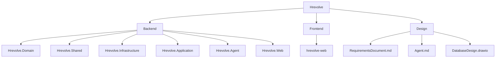
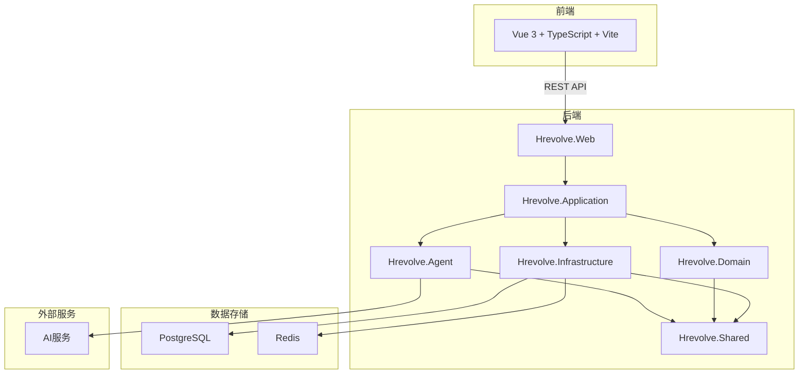
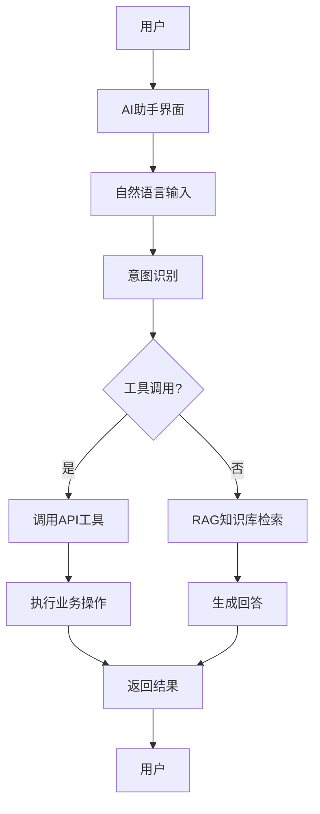
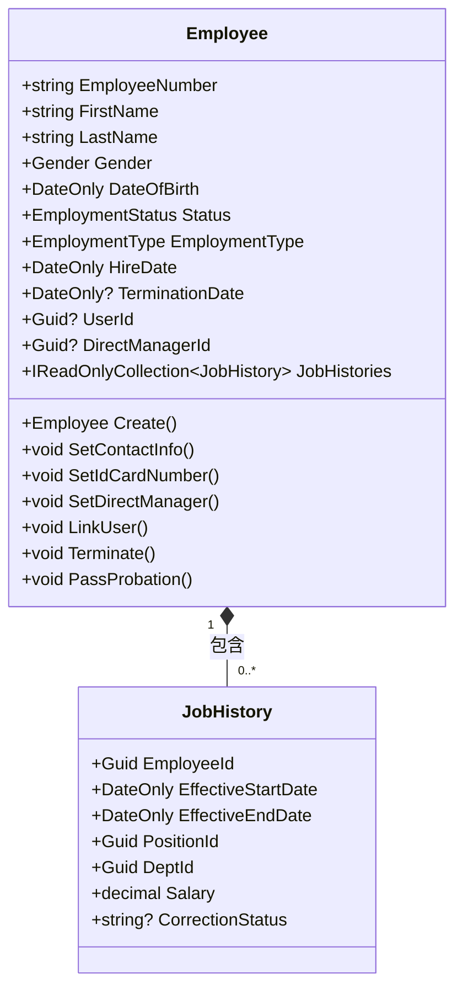
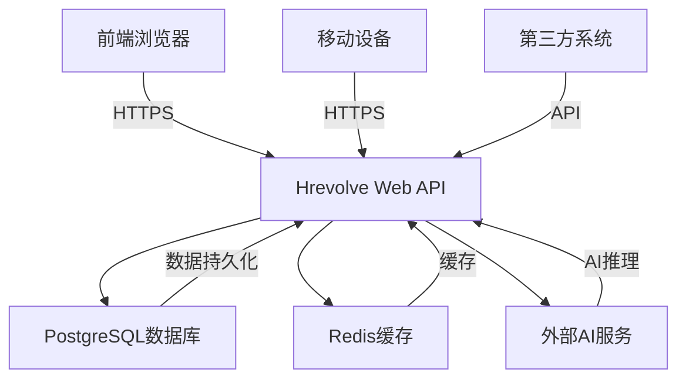
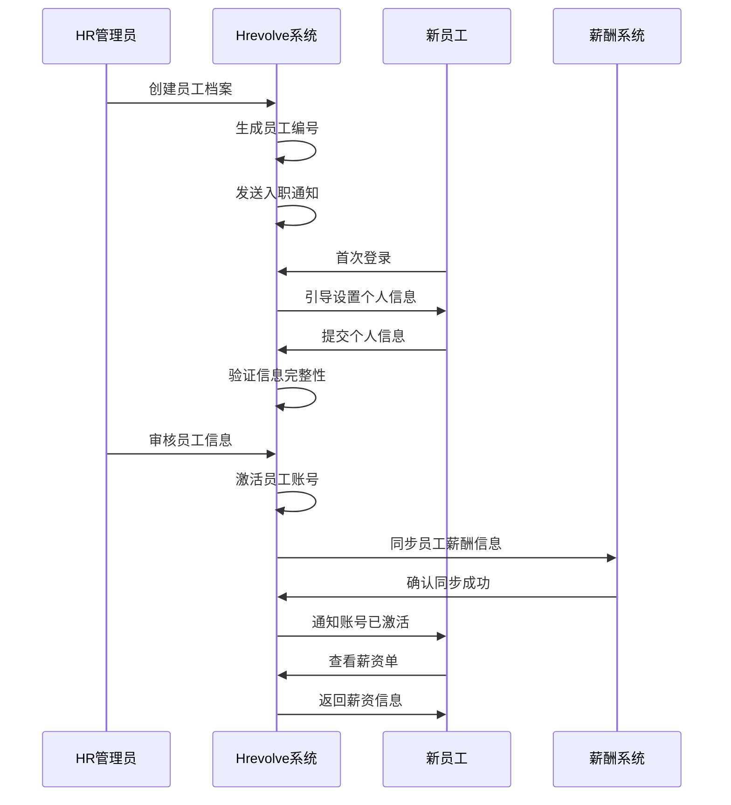

# 系统概述

<cite>
**本文档引用的文件**  
- [README.md](file://README.md)
- [Backend/README.md](file://Backend/README.md)
- [Frontend/README.md](file://Frontend/README.md)
- [Design/RequirementsDocument.md](file://Design/RequirementsDocument.md)
- [Design/Agent.md](file://Design/Agent.md)
- [Backend/Hrevolve.Web/Program.cs](file://Backend/Hrevolve.Web/Program.cs)
- [Backend/Hrevolve.Application/DependencyInjection.cs](file://Backend/Hrevolve.Application/DependencyInjection.cs)
- [Backend/Hrevolve.Infrastructure/DependencyInjection.cs](file://Backend/Hrevolve.Infrastructure/DependencyInjection.cs)
- [Backend/Hrevolve.Domain/Employees/Employee.cs](file://Backend/Hrevolve.Domain/Employees/Employee.cs)
- [Backend/Hrevolve.Domain/Organizations/OrganizationUnit.cs](file://Backend/Hrevolve.Domain/Organizations/OrganizationUnit.cs)
- [Frontend/hrevolve-web/src/main.ts](file://Frontend/hrevolve-web/src/main.ts)
- [Frontend/hrevolve-web/src/router/index.ts](file://Frontend/hrevolve-web/src/router/index.ts)
- [Frontend/hrevolve-web/src/stores/auth.ts](file://Frontend/hrevolve-web/src/stores/auth.ts)
- [Frontend/hrevolve-web/src/api/modules/auth.ts](file://Frontend/hrevolve-web/src/api/modules/auth.ts)
- [Frontend/hrevolve-web/package.json](file://Frontend/hrevolve-web/package.json)
</cite>

## 目录
1. [简介](#简介)
2. [项目结构](#项目结构)
3. [核心功能模块](#核心功能模块)
4. [系统架构设计](#系统架构设计)
5. [用户角色与使用场景](#用户角色与使用场景)
6. [多租户架构](#多租户架构)
7. [AI智能助手](#ai智能助手)
8. [员工全生命周期管理](#员工全生命周期管理)
9. [前后端技术栈](#前后端技术栈)
10. [系统上下文图](#系统上下文图)
11. [典型工作流示例](#典型工作流示例)
12. [部署与配置](#部署与配置)

## 简介

Hrevolve是一个面向现代企业的企业级SaaS人力资源管理系统，采用**Clean Architecture + DDD（领域驱动设计）**构建。系统深度融合AI能力，致力于从传统的"管理工具"转变为"员工服务平台"和"企业战略决策引擎"。系统支持HR管理员、部门经理和普通员工三大用户角色，提供组织架构管理、员工全生命周期管理、考勤、假期、薪酬、报销等核心功能，并集成了基于RAG的AI助手和数据分析能力。

**Section sources**
- [README.md](file://README.md#L1-L160)
- [Backend/README.md](file://Backend/README.md#L1-L158)

## 项目结构

Hrevolve项目采用模块化单体架构，分为后端、前端和设计文档三个主要部分。后端采用分层架构，包括领域层、共享层、基础设施层、应用层、AI代理层和Web层。前端采用Vue 3 + TypeScript技术栈，实现了现代化的用户界面。



**Diagram sources**
- [README.md](file://README.md#L86-L102)

**Section sources**
- [README.md](file://README.md#L86-L102)
- [Backend/README.md](file://Backend/README.md#L18-L28)

## 核心功能模块

Hrevolve系统提供全面的人力资源管理功能，涵盖基础模块、业务模块和智能模块三大类别。系统已实现多租户架构、组织架构管理、员工全生命周期管理、用户认证、RBAC权限控制、考勤管理、假期管理、薪酬管理、报销管理和AI助手等核心功能。

### 基础模块

基础模块提供系统运行所需的核心功能，包括组织架构管理、员工全生命周期管理、用户认证和权限控制。

**Section sources**
- [README.md](file://README.md#L64-L69)
- [Backend/README.md](file://Backend/README.md#L34-L37)

### 业务模块

业务模块涵盖企业日常人力资源管理的核心业务流程，包括考勤管理、假期管理、薪酬管理和报销管理。

**Section sources**
- [README.md](file://README.md#L71-L75)
- [Backend/README.md](file://Backend/README.md#L38-L41)

### 智能模块

智能模块利用AI和数据分析技术，提供AI助手、人力资本仪表盘和离职预测等高级功能，提升系统智能化水平。

**Section sources**
- [README.md](file://README.md#L77-L80)
- [Backend/README.md](file://Backend/README.md#L43-L48)

## 系统架构设计

Hrevolve系统采用分层架构设计，各层职责分明，耦合度低。系统整体架构包括前端、Web层、应用层、领域层、基础设施层和共享层，各层之间通过明确定义的接口进行通信。



**Diagram sources**
- [README.md](file://README.md#L23-L44)
- [Backend/README.md](file://Backend/README.md#L19-L28)

**Section sources**
- [README.md](file://README.md#L21-L44)
- [Backend/README.md](file://Backend/README.md#L18-L28)

## 用户角色与使用场景

Hrevolve系统支持三大用户角色：HR管理员、部门经理和普通员工。每个角色具有不同的权限和使用场景，满足企业不同层级用户的需求。

### HR管理员

HR管理员拥有系统最高权限，负责系统的整体管理和配置，包括组织架构管理、员工信息维护、薪酬核算、权限分配等。

**Section sources**
- [Design/RequirementsDocument.md](file://Design/RequirementsDocument.md#L64-L66)

### 部门经理

部门经理负责本部门的日常管理，可以查看部门员工信息、审批请假申请、查看考勤报表等。

**Section sources**
- [Design/RequirementsDocument.md](file://Design/RequirementsDocument.md#L68)

### 普通员工

普通员工可以查看个人信息、提交请假申请、查询考勤记录、查看薪资单等，享受便捷的员工自助服务。

**Section sources**
- [Design/RequirementsDocument.md](file://Design/RequirementsDocument.md#L69)

## 多租户架构

Hrevolve系统采用混合多租户架构，支持共享数据库和独立数据库两种部署模式。系统通过Query Rewriting和RLS双重机制实现数据隔离，确保不同租户之间的数据安全。

```mermaid
graph TD
A[请求] --> B{租户识别}
B --> |Header| C[解析X-Tenant-Id]
B --> |子域名| D[解析{tenant}.example.com]
B --> |Query参数| E[解析?tenant={code}]
B --> |JWT| F[解析tenant_id声明]
C --> G[租户上下文]
D --> G
E --> G
F --> G
G --> H[Query Rewriting]
H --> I[自动添加tenant_id条件]
I --> J[RLS行级安全]
J --> K[数据库层数据隔离]
```

**Diagram sources**
- [Design/RequirementsDocument.md](file://Design/RequirementsDocument.md#L75-L104)
- [Backend/README.md](file://Backend/README.md#L138-L145)

**Section sources**
- [Design/RequirementsDocument.md](file://Design/RequirementsDocument.md#L75-L104)
- [Backend/README.md](file://Backend/README.md#L138-L145)

## AI智能助手

Hrevolve系统集成了基于Microsoft Agent Framework的AI助手，支持多种AI提供商，包括OpenAI、Azure OpenAI等。AI助手可以回答员工问题、办理自助服务，如查询假期余额、提交请假申请等。



**Diagram sources**
- [Design/RequirementsDocument.md](file://Design/RequirementsDocument.md#L226-L239)
- [Backend/README.md](file://Backend/README.md#L91-L95)
- [Design/Agent.md](file://Design/Agent.md#L186-L235)

**Section sources**
- [Design/RequirementsDocument.md](file://Design/RequirementsDocument.md#L226-L239)
- [Backend/README.md](file://Backend/README.md#L91-L95)
- [Design/Agent.md](file://Design/Agent.md#L186-L235)

## 员工全生命周期管理

Hrevolve系统采用SCD Type 2历史追溯模型，支持员工从入职到离职的全生命周期管理。系统可以精确查询任意历史时间点的员工状态，满足企业对历史数据追溯的需求。



**Diagram sources**
- [Backend/Hrevolve.Domain/Employees/Employee.cs](file://Backend/Hrevolve.Domain/Employees/Employee.cs#L6-L137)
- [Design/RequirementsDocument.md](file://Design/RequirementsDocument.md#L118-L144)

**Section sources**
- [Backend/Hrevolve.Domain/Employees/Employee.cs](file://Backend/Hrevolve.Domain/Employees/Employee.cs#L6-L137)
- [Design/RequirementsDocument.md](file://Design/RequirementsDocument.md#L118-L144)

## 前后端技术栈

Hrevolve系统采用.NET 10与Vue 3技术栈，前后端分离设计。后端使用ASP.NET Core Web API提供RESTful服务，前端使用Vue 3构建现代化的单页应用。

### 后端技术栈

后端采用.NET 10作为核心框架，使用Entity Framework Core作为ORM，PostgreSQL作为数据库，Redis作为缓存，Serilog作为日志框架。

**Section sources**
- [README.md](file://README.md#L49-L60)
- [Backend/README.md](file://Backend/README.md#L9-L16)

### 前端技术栈

前端采用Vue 3 + TypeScript技术栈，使用Vite作为构建工具，Element Plus作为UI组件库，Pinia作为状态管理，Vue Router作为路由管理。

**Section sources**
- [README.md](file://README.md#L49-L54)
- [Frontend/README.md](file://Frontend/README.md#L7-L14)

## 系统上下文图

系统上下文图展示了Hrevolve系统与外部系统之间的交互关系，包括前端、后端、数据库、缓存和外部AI服务。



**Diagram sources**
- [README.md](file://README.md#L23-L44)
- [Backend/README.md](file://Backend/README.md#L19-L28)

**Section sources**
- [README.md](file://README.md#L23-L44)
- [Backend/README.md](file://Backend/README.md#L19-L28)

## 典型工作流示例

以下是从新员工入职到薪酬发放的典型工作流示例，展示了系统各模块之间的协同工作。



**Diagram sources**
- [Design/RequirementsDocument.md](file://Design/RequirementsDocument.md#L186-L200)
- [Backend/README.md](file://Backend/README.md#L114-L124)

**Section sources**
- [Design/RequirementsDocument.md](file://Design/RequirementsDocument.md#L186-L200)
- [Backend/README.md](file://Backend/README.md#L114-L124)

## 部署与配置

Hrevolve系统提供了详细的部署说明，包括环境要求、后端启动和前端启动步骤。系统支持通过配置文件进行灵活配置，满足不同环境的部署需求。

### 环境要求

系统运行需要.NET 10 Preview SDK、Node.js 18+、PostgreSQL 16+和Redis 7+等环境。

**Section sources**
- [README.md](file://README.md#L106-L111)
- [Backend/README.md](file://Backend/README.md#L55-L58)

### 后端启动

后端启动包括依赖还原、数据库迁移和应用运行三个步骤，通过.NET CLI命令完成。

**Section sources**
- [README.md](file://README.md#L113-L127)
- [Backend/README.md](file://Backend/README.md#L66-L78)

### 前端启动

前端启动包括依赖安装、开发模式运行和生产构建三个步骤，通过npm命令完成。

**Section sources**
- [README.md](file://README.md#L129-L142)
- [Frontend/README.md](file://Frontend/README.md#L49-L62)