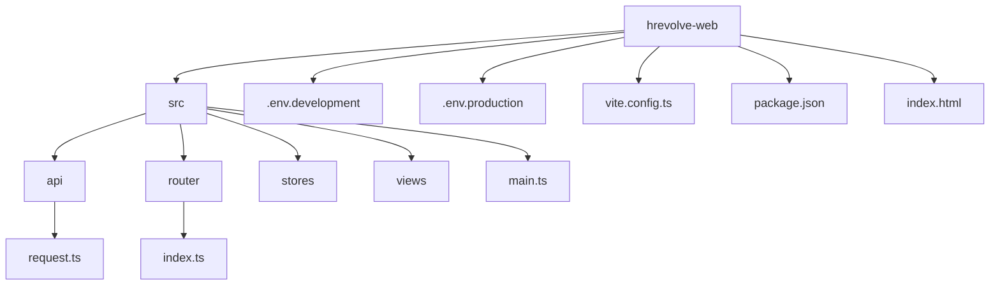
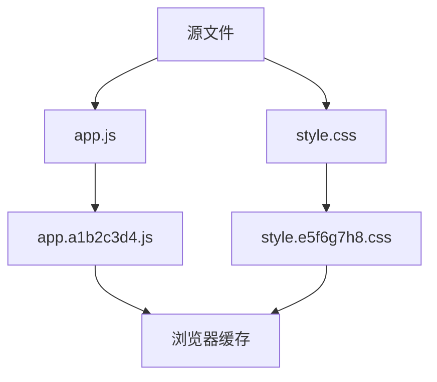

# 前端部署

<cite>
**本文档引用的文件**   
- [vite.config.ts](file://Frontend/hrevolve-web/vite.config.ts)
- [.env.development](file://Frontend/hrevolve-web/.env.development)
- [.env.production](file://Frontend/hrevolve-web/.env.production)
- [package.json](file://Frontend/hrevolve-web/package.json)
- [request.ts](file://Frontend/hrevolve-web/src/api/request.ts)
- [index.ts](file://Frontend/hrevolve-web/src/router/index.ts)
- [main.ts](file://Frontend/hrevolve-web/src/main.ts)
- [README.md](file://Frontend/README.md)
</cite>

## 目录
1. [项目结构](#项目结构)
2. [Vite构建配置详解](#vite构建配置详解)
3. [环境变量管理](#环境变量管理)
4. [API代理机制](#api代理机制)
5. [Vue Router历史模式与Nginx配置](#vue-router历史模式与nginx配置)
6. [生产构建与部署流程](#生产构建与部署流程)
7. [性能优化策略](#性能优化策略)
8. [部署最佳实践](#部署最佳实践)

## 项目结构

Hrevolve前端项目采用Vue 3 + TypeScript + Vite技术栈，项目结构清晰，模块化程度高。核心目录包括`src`源码目录、环境配置文件和构建配置文件。



**图示来源**
- [README.md](file://Frontend/README.md#L16-L35)
- [vite.config.ts](file://Frontend/hrevolve-web/vite.config.ts#L1-L27)

**本节来源**
- [README.md](file://Frontend/README.md#L16-L35)
- [project_structure](file://#L1-L200)

## Vite构建配置详解

Vite配置文件`vite.config.ts`定义了项目的核心构建行为，包括开发服务器、构建输出和路径别名等关键配置。

### base配置项

`base`配置项在Vite中用于指定应用的公共基础路径。虽然在当前配置中未显式设置，但默认值为'/'，表示应用将部署在域名根路径下。如果需要部署到子路径（如`https://example.com/my-app/`），则需要设置`base: '/my-app/'`。

### build.outDir配置

`build.outDir`配置项指定了生产构建的输出目录。在当前项目中配置为`dist`，这意味着执行`vite build`命令后，所有静态资源将被生成到项目根目录下的`dist`文件夹中。

### resolve.alias配置

路径别名配置`@`指向`src`目录，使得在项目中可以使用`@/components/HelloWorld.vue`这样的导入方式，而不是相对路径`../../src/components/HelloWorld.vue`，提高了代码的可读性和可维护性。

**本节来源**
- [vite.config.ts](file://Frontend/hrevolve-web/vite.config.ts#L1-L27)
- [main.ts](file://Frontend/hrevolve-web/src/main.ts#L1-L28)

## 环境变量管理

项目通过`.env`系列文件实现多环境配置管理，支持开发、生产等不同环境的差异化配置。

### 环境变量文件

项目包含两个主要的环境变量文件：
- `.env.development`：开发环境配置
- `.env.production`：生产环境配置

### VITE_API_BASE_URL配置

`VITE_API_BASE_URL`是项目中最重要的环境变量，用于指定API请求的基础路径。根据Vite的约定，以`VITE_`开头的变量可以在客户端代码中通过`import.meta.env.VITE_API_BASE_URL`访问。

在开发环境中，`.env.development`文件配置`VITE_API_BASE_URL=/api`，这使得API请求被Vite开发服务器代理到后端服务。

在生产环境中，`.env.production`文件同样配置`VITE_API_BASE_URL=/api`，表示生产环境下的API请求将直接发送到同源的`/api`路径。

**本节来源**
- [.env.development](file://Frontend/hrevolve-web/.env.development#L1-L4)
- [.env.production](file://Frontend/hrevolve-web/.env.production#L1-L2)
- [request.ts](file://Frontend/hrevolve-web/src/api/request.ts#L8)

## API代理机制

Vite的开发服务器提供了强大的代理功能，用于解决开发环境下的跨域问题。

### server.proxy配置

在`vite.config.ts`中，`server.proxy`配置将所有以`/api`开头的请求代理到后端开发服务器：

```typescript
server: {
  proxy: {
    '/api': {
      target: 'https://localhost:5225',
      changeOrigin: true,
      secure: false, // 允许自签名证书
    },
  },
}
```

### 代理工作流程

当在开发环境中发起`/api/auth/login`请求时，Vite开发服务器会：
1. 拦截前端应用发出的请求
2. 将请求转发到`https://localhost:5225/api/auth/login`
3. 获取后端响应后，再返回给前端应用

这种机制使得前端可以像调用同源API一样调用后端服务，避免了浏览器的同源策略限制。

### 后端服务端口

根据后端`Program.cs`文件的配置，后端服务在开发环境中监听两个端口：
- HTTP: 5224
- HTTPS: 5225

由于Vite配置中代理目标为`https://localhost:5225`，因此API请求通过HTTPS协议与后端通信。

**本节来源**
- [vite.config.ts](file://Frontend/hrevolve-web/vite.config.ts#L12-L21)
- [Backend/Hrevolve.Web/Program.cs](file://Backend/Hrevolve.Web/Program.cs#L1-L46)
- [Backend/Hrevolve.Web/Properties/launchSettings.json](file://Backend/Hrevolve.Web/Properties/launchSettings.json#L1-L41)

## Vue Router历史模式与Nginx配置

项目使用Vue Router的history模式提供更友好的URL体验，这需要服务器端的适当配置来支持。

### history模式配置

在`src/router/index.ts`中，路由使用`createWebHistory`创建：

```typescript
const router = createRouter({
  history: createWebHistory(import.meta.env.BASE_URL),
  routes,
});
```

### 404路由处理

项目配置了通配符路由来处理未匹配的路径：

```typescript
{
  path: '/:pathMatch(.*)*',
  name: 'NotFound',
  component: () => import('@/views/error/NotFoundView.vue'),
}
```

### Nginx配置示例

为了支持history模式，Nginx需要配置为将所有前端路由请求都指向`index.html`，让Vue Router来处理路由：

```nginx
server {
    listen 80;
    server_name your-domain.com;
    root /path/to/your/dist;
    index index.html;

    # 处理静态资源
    location ~* \.(js|css|png|jpg|jpeg|gif|ico|svg)$ {
        expires 1y;
        add_header Cache-Control "public, immutable";
        try_files $uri $uri/ =404;
    }

    # 处理前端路由
    location / {
        try_files $uri $uri/ /index.html;
    }

    # API代理到后端服务
    location /api/ {
        proxy_pass https://localhost:5225/;
        proxy_set_header Host $host;
        proxy_set_header X-Real-IP $remote_addr;
        proxy_set_header X-Forwarded-For $proxy_add_x_forwarded_for;
        proxy_set_header X-Forwarded-Proto $scheme;
    }
}
```

此配置确保：
- 静态资源（JS、CSS、图片等）直接由Nginx提供服务
- 前端路由请求返回`index.html`，由Vue Router处理
- API请求代理到后端服务

**本节来源**
- [src/router/index.ts](file://Frontend/hrevolve-web/src/router/index.ts#L371-L417)
- [index.html](file://Frontend/hrevolve-web/index.html#L1-L14)

## 生产构建与部署流程

项目提供了标准化的构建和部署流程，确保从开发到生产的平滑过渡。

### 构建脚本

`package.json`中定义了构建相关的npm脚本：

```json
"scripts": {
  "dev": "vite",
  "build": "vue-tsc -b && vite build",
  "preview": "vite preview"
}
```

### 构建流程

生产构建流程包括以下步骤：
1. 执行`npm run build`命令
2. `vue-tsc -b`进行TypeScript类型检查
3. `vite build`执行生产构建
4. 生成`dist`目录包含所有静态资源

### 部署流程

典型的部署流程如下：
1. 在开发环境完成开发和测试
2. 执行`npm run build`生成生产版本
3. 将`dist`目录中的文件部署到Web服务器（如Nginx）
4. 配置Web服务器支持history模式和API代理
5. 启动服务并验证功能

**本节来源**
- [package.json](file://Frontend/hrevolve-web/package.json#L6-L10)
- [README.md](file://Frontend/README.md#L50-L62)

## 性能优化策略

项目采用了多种性能优化策略，提升用户体验和应用性能。

### 静态资源哈希

Vite在生产构建时自动为静态资源文件名添加内容哈希，实现长期缓存策略：



当文件内容改变时，哈希值也会改变，从而打破缓存，确保用户获取最新版本。

### Gzip压缩

建议在Nginx等Web服务器上启用Gzip压缩，显著减少传输文件大小：

```nginx
gzip on;
gzip_vary on;
gzip_min_length 1024;
gzip_types text/plain text/css text/xml text/javascript application/javascript application/xml+rss application/json;
```

### 资源预加载

Vite自动处理关键资源的预加载和预连接，优化页面加载性能：

```html
<!-- Vite自动生成的预加载链接 -->
<link rel="modulepreload" href="/assets/app.a1b2c3d4.js">
<link rel="prefetch" href="/assets/chunk.a1b2c3d4.js">
```

### 缓存策略

推荐的缓存策略：
- HTML文件：不缓存或短时间缓存（max-age=0）
- 静态资源（JS、CSS、图片）：长期缓存（max-age=31536000）并使用内容哈希
- API响应：根据数据更新频率设置适当的缓存策略

**本节来源**
- [vite.config.ts](file://Frontend/hrevolve-web/vite.config.ts#L22-L25)
- [package.json](file://Frontend/hrevolve-web/package.json#L1-L38)

## 部署最佳实践

基于项目特点，以下是推荐的部署最佳实践。

### CDN部署建议

对于大型部署，建议使用CDN分发静态资源：
1. 将`dist`目录中的静态资源上传到CDN
2. 配置CDN缓存策略
3. 在Nginx中设置静态资源从CDN加载
4. 保持API请求直接到应用服务器

### 多环境部署

建立完整的多环境部署体系：
- 开发环境：用于日常开发
- 测试环境：用于QA测试
- 预发布环境：用于上线前最终验证
- 生产环境：面向最终用户

每个环境对应不同的`.env`文件和Nginx配置。

### 持续集成/持续部署

建议建立CI/CD流水线：
1. 代码提交触发自动化构建
2. 自动化测试
3. 生成生产构建
4. 自动部署到指定环境
5. 健康检查和回滚机制

### 监控与日志

部署后应建立完善的监控体系：
- 前端错误监控（如Sentry）
- 性能监控（页面加载时间、交互延迟等）
- 用户行为分析
- 服务器日志收集

**本节来源**
- [README.md](file://Frontend/README.md#L1-L75)
- [vite.config.ts](file://Frontend/hrevolve-web/vite.config.ts#L1-L27)
- [package.json](file://Frontend/hrevolve-web/package.json#L1-L38)