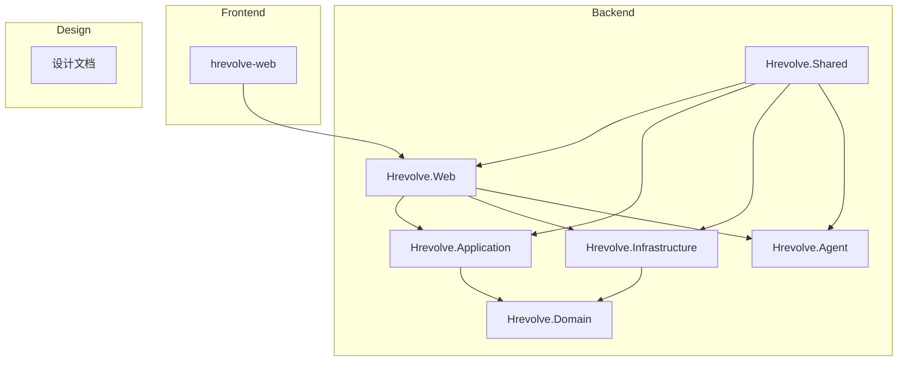
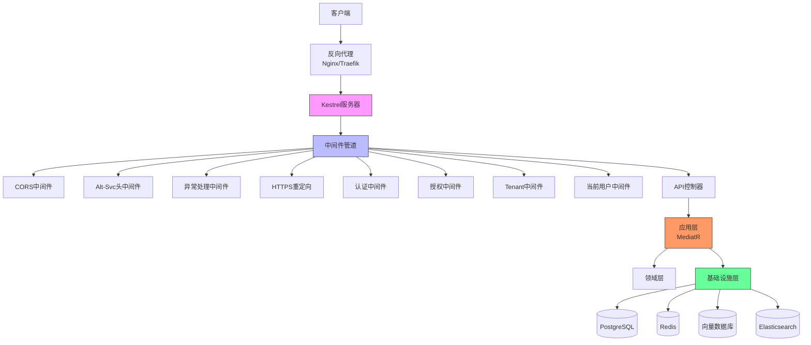
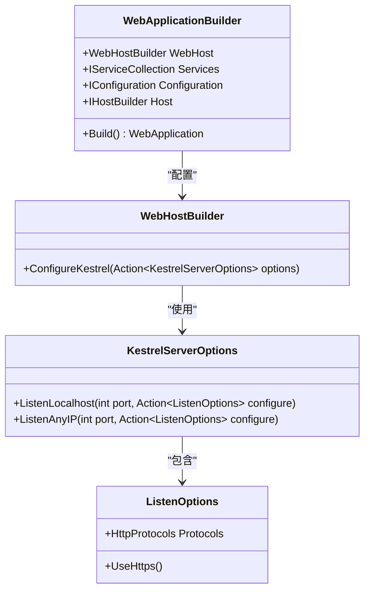
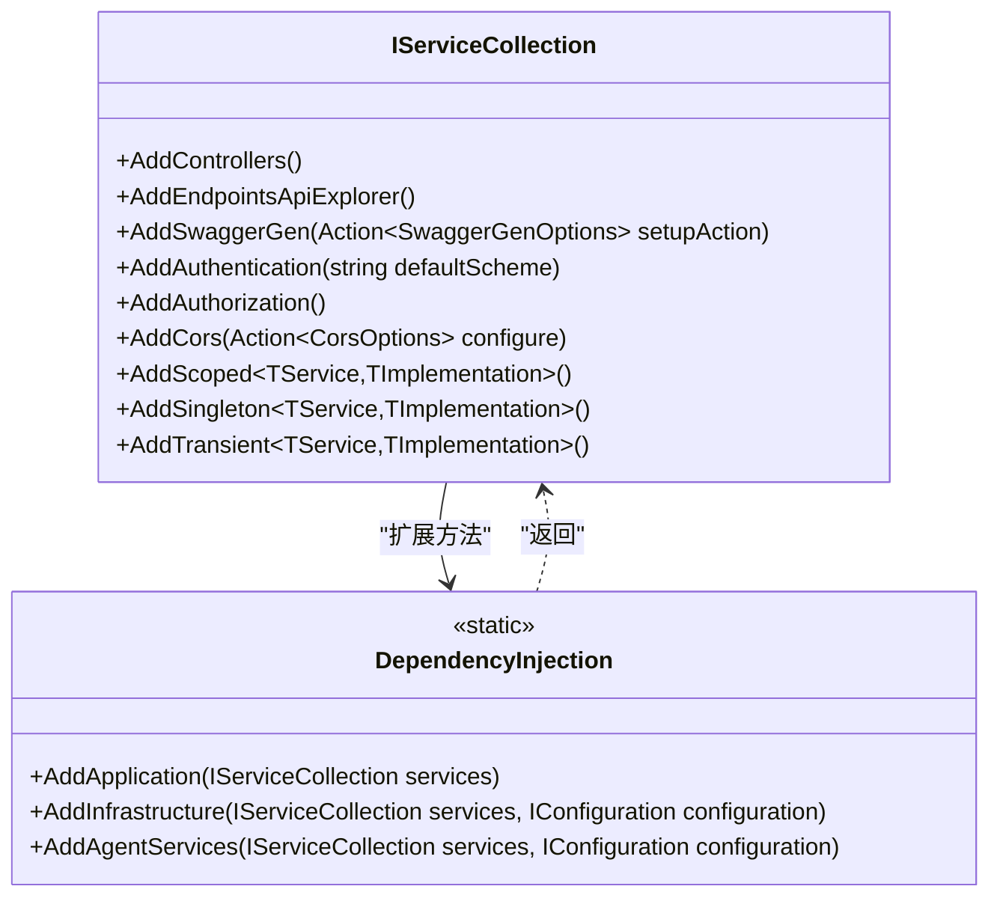
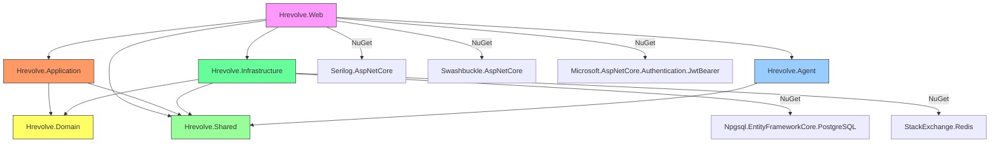

# 后端部署

<cite>
**本文档引用的文件**
- [Program.cs](file://Backend/Hrevolve.Web/Program.cs)
- [appsettings.json](file://Backend/Hrevolve.Web/appsettings.json)
- [appsettings.Development.json](file://Backend/Hrevolve.Web/appsettings.Development.json)
- [launchSettings.json](file://Backend/Hrevolve.Web/Properties/launchSettings.json)
- [Hrevolve.Web.csproj](file://Backend/Hrevolve.Web/Hrevolve.Web.csproj)
- [DependencyInjection.cs](file://Backend/Hrevolve.Application/DependencyInjection.cs)
- [DependencyInjection.cs](file://Backend/Hrevolve.Infrastructure/DependencyInjection.cs)
- [DependencyInjection.cs](file://Backend/Hrevolve.Agent/DependencyInjection.cs)
- [ExceptionHandlingMiddleware.cs](file://Backend/Hrevolve.Web/Middleware/ExceptionHandlingMiddleware.cs)
- [TenantMiddleware.cs](file://Backend/Hrevolve.Web/Middleware/TenantMiddleware.cs)
- [CurrentUserMiddleware.cs](file://Backend/Hrevolve.Web/Middleware/CurrentUserMiddleware.cs)
</cite>

## 目录
1. [简介](#简介)
2. [项目结构](#项目结构)
3. [核心组件](#核心组件)
4. [架构概述](#架构概述)
5. [详细组件分析](#详细组件分析)
6. [依赖分析](#依赖分析)
7. [性能考虑](#性能考虑)
8. [故障排除指南](#故障排除指南)
9. [结论](#结论)

## 简介
本文档详细说明了Hrevolve人力资源管理系统后端服务的部署方案，涵盖Kestrel自托管和Docker容器化两种模式。文档深入解析了`Program.cs`中的WebHost配置、依赖注入注册和中间件管道构建逻辑，详细描述了如何通过`appsettings.json`配置Serilog日志输出到控制台、文件或Elasticsearch。同时提供了Dockerfile编写示例，包含多阶段构建优化镜像大小的方法，解释了如何通过环境变量覆盖JSON配置实现不同环境的灵活部署，并包含HTTPS证书绑定、反向代理（Nginx）配置、健康检查端点（/health）和容器编排（如Kubernetes）的集成建议。

## 项目结构



**图示来源**
- [Hrevolve.Web.csproj](file://Backend/Hrevolve.Web/Hrevolve.Web.csproj)
- [Hrevolve.Application.csproj](file://Backend/Hrevolve.Application/Hrevolve.Application.csproj)
- [Hrevolve.Infrastructure.csproj](file://Backend/Hrevolve.Infrastructure/Hrevolve.Infrastructure.csproj)

**本节来源**
- [Hrevolve.Web.csproj](file://Backend/Hrevolve.Web/Hrevolve.Web.csproj)

## 核心组件

本系统采用分层架构设计，核心组件包括：
- **Hrevolve.Web**: Web API入口，负责HTTP请求处理、中间件管道配置和依赖注入注册
- **Hrevolve.Application**: 应用层，包含业务逻辑、MediatR命令/查询处理和验证行为
- **Hrevolve.Infrastructure**: 基础设施层，提供数据库访问、缓存、多租户支持等基础设施服务
- **Hrevolve.Domain**: 领域模型层，定义实体、值对象和领域服务
- **Hrevolve.Agent**: AI代理层，集成Microsoft Agent Framework提供智能HR助手功能
- **Hrevolve.Shared**: 共享组件层，包含跨层共享的异常、结果类型和接口定义

**本节来源**
- [Hrevolve.Web.csproj](file://Backend/Hrevolve.Web/Hrevolve.Web.csproj)
- [Hrevolve.Application.csproj](file://Backend/Hrevolve.Application/Hrevolve.Application.csproj)
- [Hrevolve.Infrastructure.csproj](file://Backend/Hrevolve.Infrastructure/Hrevolve.Infrastructure.csproj)

## 架构概述



**图示来源**
- [Program.cs](file://Backend/Hrevolve.Web/Program.cs)
- [ExceptionHandlingMiddleware.cs](file://Backend/Hrevolve.Web/Middleware/ExceptionHandlingMiddleware.cs)
- [TenantMiddleware.cs](file://Backend/Hrevolve.Web/Middleware/TenantMiddleware.cs)
- [CurrentUserMiddleware.cs](file://Backend/Hrevolve.Web/Middleware/CurrentUserMiddleware.cs)

## 详细组件分析

### WebHost配置分析



**图示来源**
- [Program.cs](file://Backend/Hrevolve.Web/Program.cs#L4-L18)

**本节来源**
- [Program.cs](file://Backend/Hrevolve.Web/Program.cs#L1-L18)

### 依赖注入注册分析



**图示来源**
- [Program.cs](file://Backend/Hrevolve.Web/Program.cs#L30-L110)
- [DependencyInjection.cs](file://Backend/Hrevolve.Application/DependencyInjection.cs)
- [DependencyInjection.cs](file://Backend/Hrevolve.Infrastructure/DependencyInjection.cs)
- [DependencyInjection.cs](file://Backend/Hrevolve.Agent/DependencyInjection.cs)

**本节来源**
- [Program.cs](file://Backend/Hrevolve.Web/Program.cs#L30-L110)
- [DependencyInjection.cs](file://Backend/Hrevolve.Application/DependencyInjection.cs)
- [DependencyInjection.cs](file://Backend/Hrevolve.Infrastructure/DependencyInjection.cs)
- [DependencyInjection.cs](file://Backend/Hrevolve.Agent/DependencyInjection.cs)

### 中间件管道分析

```mermaid
flowchart TD
Start([请求进入]) --> Cors["使用CORS策略<br/>(允许所有)"]
Cors --> AltSvc["添加Alt-Svc头<br/>'h3=\":5225\"; ma=86400'"]
AltSvc --> ExceptionHandling["异常处理中间件"]
ExceptionHandling --> HttpsRedirect["HTTPS重定向"]
HttpsRedirect --> Authentication["JWT认证"]
Authentication --> Authorization["授权"]
Authorization --> Tenant["多租户中间件"]
Tenant --> CurrentUser["当前用户中间件"]
CurrentUser --> Controllers["映射控制器"]
Controllers --> Health["健康检查端点<br/>/health"]
Controllers --> Api["API控制器"]
Health --> End([响应返回])
Api --> End
```

**图示来源**
- [Program.cs](file://Backend/Hrevolve.Web/Program.cs#L121-L158)
- [ExceptionHandlingMiddleware.cs](file://Backend/Hrevolve.Web/Middleware/ExceptionHandlingMiddleware.cs)
- [TenantMiddleware.cs](file://Backend/Hrevolve.Web/Middleware/TenantMiddleware.cs)
- [CurrentUserMiddleware.cs](file://Backend/Hrevolve.Web/Middleware/CurrentUserMiddleware.cs)

**本节来源**
- [Program.cs](file://Backend/Hrevolve.Web/Program.cs#L121-L158)
- [ExceptionHandlingMiddleware.cs](file://Backend/Hrevolve.Web/Middleware/ExceptionHandlingMiddleware.cs)
- [TenantMiddleware.cs](file://Backend/Hrevolve.Web/Middleware/TenantMiddleware.cs)
- [CurrentUserMiddleware.cs](file://Backend/Hrevolve.Web/Middleware/CurrentUserMiddleware.cs)

### Serilog日志配置分析

```mermaid
classDiagram
class LoggerConfiguration {
+ReadFrom.Configuration(IConfiguration config)
+Enrich.FromLogContext()
+Enrich.WithProperty(string name, object value)
+WriteTo.Console()
+WriteTo.File(string path)
+WriteTo.Elasticsearch()
+CreateLogger() ILogger
}
class SerilogConfiguration {
<<JSON>>
Serilog : {
MinimumLevel : {
Default : "Information",
Override : {
"Microsoft" : "Warning",
"Microsoft.Hosting.Lifetime" : "Information"
}
},
WriteTo : [
{ Name : "Console", Args : { outputTemplate : "[{Timestamp : HH : mm : ss} {Level : u3}] {Message : lj} {Properties : j}{NewLine}{Exception}" } },
{ Name : "File", Args : { path : "logs/log-.txt", rollingInterval : "Day" } }
],
Enrich : ["FromLogContext", "WithMachineName", "WithThreadId"]
}
}
class Program {
+Main(string[] args)
}
Program --> LoggerConfiguration : "配置"
LoggerConfiguration --> SerilogConfiguration : "读取"
```

**图示来源**
- [Program.cs](file://Backend/Hrevolve.Web/Program.cs#L20-L28)
- [appsettings.json](file://Backend/Hrevolve.Web/appsettings.json#L18-L36)
- [appsettings.Development.json](file://Backend/Hrevolve.Web/appsettings.Development.json#L16-L23)

**本节来源**
- [Program.cs](file://Backend/Hrevolve.Web/Program.cs#L20-L28)
- [appsettings.json](file://Backend/Hrevolve.Web/appsettings.json#L18-L36)
- [appsettings.Development.json](file://Backend/Hrevolve.Web/appsettings.Development.json#L16-L23)

## 依赖分析



**图示来源**
- [Hrevolve.Web.csproj](file://Backend/Hrevolve.Web/Hrevolve.Web.csproj)
- [Hrevolve.Application.csproj](file://Backend/Hrevolve.Application/Hrevolve.Application.csproj)
- [Hrevolve.Infrastructure.csproj](file://Backend/Hrevolve.Infrastructure/Hrevolve.Infrastructure.csproj)
- [Hrevolve.Agent.csproj](file://Backend/Hrevolve.Agent/Hrevolve.Agent.csproj)

**本节来源**
- [Hrevolve.Web.csproj](file://Backend/Hrevolve.Web/Hrevolve.Web.csproj)
- [Hrevolve.Application.csproj](file://Backend/Hrevolve.Application/Hrevolve.Application.csproj)
- [Hrevolve.Infrastructure.csproj](file://Backend/Hrevolve.Infrastructure/Hrevolve.Infrastructure.csproj)
- [Hrevolve.Agent.csproj](file://Backend/Hrevolve.Agent/Hrevolve.Agent.csproj)

## 性能考虑

### Kestrel HTTP/3优化
系统已配置Kestrel服务器支持HTTP/3协议，通过QUIC协议提供更低的连接延迟和更好的多路复用性能。HTTPS端口5225同时支持HTTP/1.1、HTTP/2和HTTP/3，通过Alt-Svc头通知客户端支持HTTP/3。

### 多阶段Docker构建
采用多阶段构建策略优化镜像大小，开发阶段使用包含SDK的基础镜像进行编译，运行阶段使用轻量级的ASP.NET运行时镜像，显著减少最终镜像体积。

### 缓存策略
系统集成Redis缓存，对频繁访问的数据进行缓存，减少数据库压力。同时在基础设施层实现了工作单元模式，优化数据库事务处理。

### 数据库连接池
使用Npgsql的连接池功能，配置了重试策略（最多3次），提高数据库连接的稳定性和性能。

## 故障排除指南

### 常见部署问题
- **端口冲突**: 确保5224（HTTP）和5225（HTTPS）端口未被占用
- **数据库连接失败**: 检查`appsettings.json`中的连接字符串配置
- **JWT认证失败**: 验证`appsettings.json`中的Jwt配置项是否正确
- **多租户解析失败**: 确认请求中包含正确的租户标识（X-Tenant-Id头、子域名或查询参数）

### 日志排查
系统使用Serilog记录详细日志，可通过以下方式排查问题：
- 查看控制台输出的实时日志
- 检查`logs/`目录下的文件日志
- 在开发环境中查看详细的Debug级别日志
- 通过健康检查端点`/health`验证服务状态

### 中间件顺序问题
确保中间件按照正确的顺序注册：
1. 异常处理中间件应位于管道最前端
2. CORS中间件应在认证和授权之前
3. 认证和授权中间件应在业务中间件之前
4. 路由和控制器映射应在最后

**本节来源**
- [Program.cs](file://Backend/Hrevolve.Web/Program.cs)
- [ExceptionHandlingMiddleware.cs](file://Backend/Hrevolve.Web/Middleware/ExceptionHandlingMiddleware.cs)
- [TenantMiddleware.cs](file://Backend/Hrevolve.Web/Middleware/TenantMiddleware.cs)

## 结论
Hrevolve后端服务提供了完善的部署方案，支持Kestrel自托管和Docker容器化两种模式。通过清晰的分层架构和模块化设计，系统具有良好的可维护性和扩展性。Serilog日志配置灵活，支持多种输出目标，便于监控和故障排查。多阶段Docker构建优化了镜像大小，适合在Kubernetes等容器编排平台中部署。系统的中间件管道设计合理，确保了安全性、性能和可观察性。通过环境变量覆盖配置的方式，实现了不同环境的灵活部署，满足了从开发到生产的全流程需求。