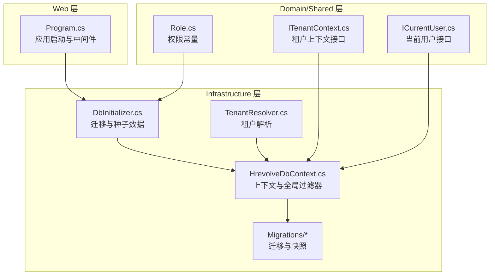
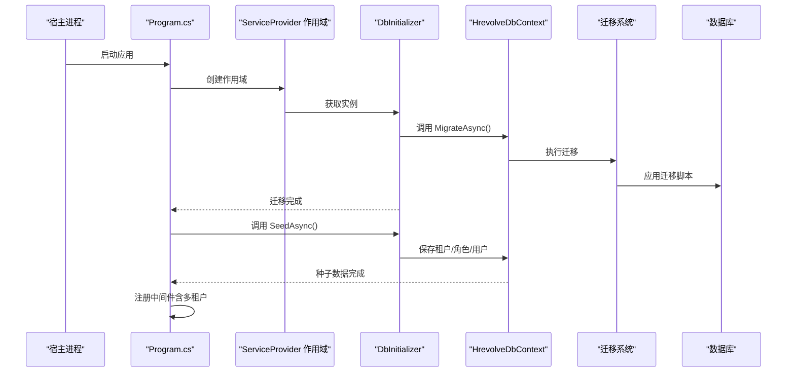
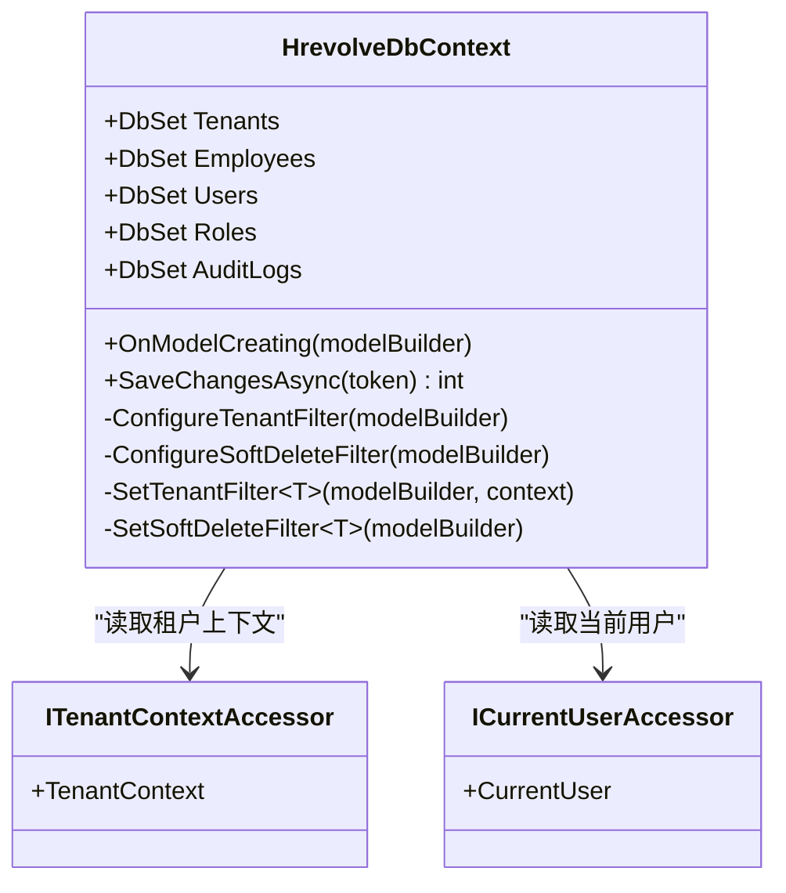
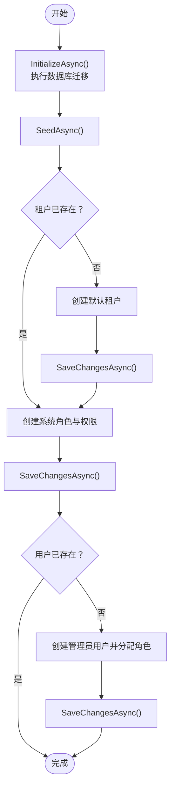
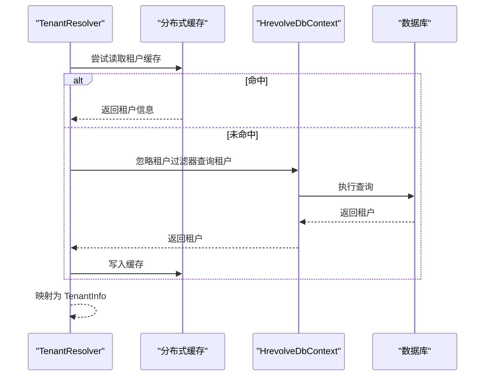
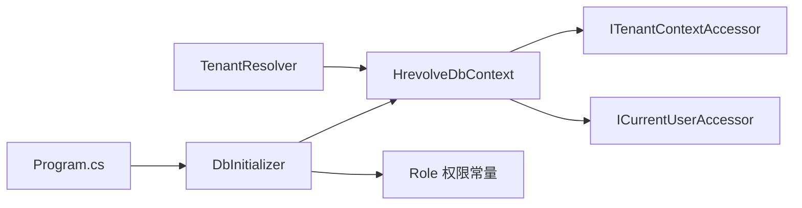

# 数据库迁移与初始化

<cite>
**本文引用的文件**
- [HrevolveDbContext.cs](file://Backend/Hrevolve.Infrastructure/Persistence/HrevolveDbContext.cs)
- [DbInitializer.cs](file://Backend/Hrevolve.Infrastructure/Persistence/DbInitializer.cs)
- [20251227093819_InitialCreate.cs](file://Backend/Hrevolve.Infrastructure/Migrations/20251227093819_InitialCreate.cs)
- [HrevolveDbContextModelSnapshot.cs](file://Backend/Hrevolve.Infrastructure/Migrations/HrevolveDbContextModelSnapshot.cs)
- [TenantResolver.cs](file://Backend/Hrevolve.Infrastructure/MultiTenancy/TenantResolver.cs)
- [Program.cs](file://Backend/Hrevolve.Web/Program.cs)
- [appsettings.json](file://Backend/Hrevolve.Web/appsettings.json)
- [appsettings.Development.json](file://Backend/Hrevolve.Web/appsettings.Development.json)
- [ITenantContext.cs](file://Backend/Hrevolve.Shared/MultiTenancy/ITenantContext.cs)
- [ICurrentUser.cs](file://Backend/Hrevolve.Shared/Identity/ICurrentUser.cs)
- [Role.cs](file://Backend/Hrevolve.Domain/Identity/Role.cs)
</cite>

## 目录
1. [简介](#简介)
2. [项目结构](#项目结构)
3. [核心组件](#核心组件)
4. [架构总览](#架构总览)
5. [详细组件分析](#详细组件分析)
6. [依赖关系分析](#依赖关系分析)
7. [性能考量](#性能考量)
8. [故障排查指南](#故障排查指南)
9. [结论](#结论)
10. [附录](#附录)

## 简介
本文件面向使用 EF Core 进行数据库架构管理的开发者，系统性说明从“代码生成迁移文件（Add-Migration）”、“应用迁移（Update-Database）”到“回滚版本”的完整流程；深入解释 HrevolveDbContext 中多租户查询过滤器与软删除过滤器的实现机制及其对数据隔离与一致性的保障；详述 DbInitializer 类如何在首次部署时自动执行数据库迁移与种子数据注入（租户、角色、用户），并给出不同环境（开发、测试、生产）的迁移策略与生产环境模式变更的安全实践建议。

## 项目结构
后端采用分层架构：
- Web 层：负责应用启动、中间件管线、控制器入口
- Application 层：应用服务与行为（如日志、验证）
- Infrastructure 层：EF Core 数据访问、迁移、仓储、多租户解析
- Domain 层：领域模型与权限常量
- Shared 层：共享接口与工具（多租户上下文、当前用户）

数据库迁移位于 Infrastructure 层的 Migrations 目录，包含初始迁移与模型快照；DbInitializer 在 Web 启动阶段调用以确保数据库一致性与初始数据可用。

图表来源
- [Program.cs](file://Backend/Hrevolve.Web/Program.cs#L113-L119)
- [DbInitializer.cs](file://Backend/Hrevolve.Infrastructure/Persistence/DbInitializer.cs#L12-L44)
- [HrevolveDbContext.cs](file://Backend/Hrevolve.Infrastructure/Persistence/HrevolveDbContext.cs#L63-L118)
- [20251227093819_InitialCreate.cs](file://Backend/Hrevolve.Infrastructure/Migrations/20251227093819_InitialCreate.cs#L1-L120)
- [HrevolveDbContextModelSnapshot.cs](file://Backend/Hrevolve.Infrastructure/Migrations/HrevolveDbContextModelSnapshot.cs#L1-L120)
- [TenantResolver.cs](file://Backend/Hrevolve.Infrastructure/MultiTenancy/TenantResolver.cs#L26-L56)
- [Role.cs](file://Backend/Hrevolve.Domain/Identity/Role.cs#L89-L123)
- [ITenantContext.cs](file://Backend/Hrevolve.Shared/MultiTenancy/ITenantContext.cs#L1-L33)
- [ICurrentUser.cs](file://Backend/Hrevolve.Shared/Identity/ICurrentUser.cs#L61-L114)

章节来源
- [Program.cs](file://Backend/Hrevolve.Web/Program.cs#L113-L119)
- [HrevolveDbContext.cs](file://Backend/Hrevolve.Infrastructure/Persistence/HrevolveDbContext.cs#L63-L118)
- [DbInitializer.cs](file://Backend/Hrevolve.Infrastructure/Persistence/DbInitializer.cs#L12-L44)

## 核心组件
- HrevolveDbContext：集中定义实体集、全局查询过滤器（多租户隔离、软删除）、SaveChangesAsync 的审计与软删除逻辑
- DbInitializer：在应用启动时自动执行数据库迁移与种子数据注入
- TenantResolver：解析租户信息，绕过租户过滤器进行查询
- 迁移文件与模型快照：记录数据库架构演进与实体映射

章节来源
- [HrevolveDbContext.cs](file://Backend/Hrevolve.Infrastructure/Persistence/HrevolveDbContext.cs#L63-L156)
- [DbInitializer.cs](file://Backend/Hrevolve.Infrastructure/Persistence/DbInitializer.cs#L12-L127)
- [TenantResolver.cs](file://Backend/Hrevolve.Infrastructure/MultiTenancy/TenantResolver.cs#L26-L108)
- [20251227093819_InitialCreate.cs](file://Backend/Hrevolve.Infrastructure/Migrations/20251227093819_InitialCreate.cs#L1-L120)
- [HrevolveDbContextModelSnapshot.cs](file://Backend/Hrevolve.Infrastructure/Migrations/HrevolveDbContextModelSnapshot.cs#L1-L120)

## 架构总览
下图展示从应用启动到数据库初始化与多租户过滤器生效的关键交互。

图表来源
- [Program.cs](file://Backend/Hrevolve.Web/Program.cs#L113-L119)
- [DbInitializer.cs](file://Backend/Hrevolve.Infrastructure/Persistence/DbInitializer.cs#L12-L44)
- [HrevolveDbContext.cs](file://Backend/Hrevolve.Infrastructure/Persistence/HrevolveDbContext.cs#L63-L118)

## 详细组件分析

### HrevolveDbContext：多租户与软删除过滤器
- 全局查询过滤器
  - 多租户过滤器：对所有继承自审计基类的实体，按当前租户上下文进行过滤，确保跨表查询天然隔离不同租户数据
  - 软删除过滤器：对所有审计实体默认隐藏已删除记录，避免误读取
- 审计与软删除
  - SaveChangesAsync 自动填充创建/更新时间与操作人，并在删除状态下将实体标记为软删除而非物理删除
- 实现要点
  - 通过反射动态为所有审计实体设置过滤器，减少重复配置
  - 租户过滤器依赖 ITenantContextAccessor，需在中间件管线中正确设置租户上下文

图表来源
- [HrevolveDbContext.cs](file://Backend/Hrevolve.Infrastructure/Persistence/HrevolveDbContext.cs#L63-L156)
- [ITenantContext.cs](file://Backend/Hrevolve.Shared/MultiTenancy/ITenantContext.cs#L1-L33)
- [ICurrentUser.cs](file://Backend/Hrevolve.Shared/Identity/ICurrentUser.cs#L61-L114)

章节来源
- [HrevolveDbContext.cs](file://Backend/Hrevolve.Infrastructure/Persistence/HrevolveDbContext.cs#L63-L156)

### DbInitializer：迁移与种子数据
- 迁移执行
  - InitializeAsync 调用 MigrateAsync，确保数据库与模型保持一致
- 种子数据
  - SeedTenantsAsync：创建默认租户
  - SeedRolesAsync：创建系统角色并绑定权限常量
  - SeedUsersAsync：创建管理员用户并分配系统管理员角色
- 事务与幂等
  - 每个步骤后调用 SaveChangesAsync，保证种子数据的原子性
  - 使用 AnyAsync 判断是否已存在，避免重复插入

图表来源
- [DbInitializer.cs](file://Backend/Hrevolve.Infrastructure/Persistence/DbInitializer.cs#L12-L127)
- [Role.cs](file://Backend/Hrevolve.Domain/Identity/Role.cs#L89-L123)

章节来源
- [DbInitializer.cs](file://Backend/Hrevolve.Infrastructure/Persistence/DbInitializer.cs#L12-L127)
- [Role.cs](file://Backend/Hrevolve.Domain/Identity/Role.cs#L89-L123)

### TenantResolver：租户解析与缓存
- 功能
  - 支持通过租户代码或域名解析租户信息
  - 查询时忽略租户过滤器，避免循环依赖与空结果
  - 使用分布式缓存短期缓存解析结果
- 影响
  - 为多租户中间件提供租户上下文，使 HrevolveDbContext 的租户过滤器生效

图表来源
- [TenantResolver.cs](file://Backend/Hrevolve.Infrastructure/MultiTenancy/TenantResolver.cs#L26-L108)
- [HrevolveDbContext.cs](file://Backend/Hrevolve.Infrastructure/Persistence/HrevolveDbContext.cs#L63-L118)

章节来源
- [TenantResolver.cs](file://Backend/Hrevolve.Infrastructure/MultiTenancy/TenantResolver.cs#L26-L108)

### 迁移文件与模型快照
- 初始迁移
  - 记录了审计日志、员工、组织、岗位、考勤、假期、薪酬、报销、身份认证等核心表结构
  - 包含主键、外键、索引与字段精度/长度约束
- 模型快照
  - 由 EF Core 生成，维护实体属性与关系的元数据，便于后续迁移增量生成

章节来源
- [20251227093819_InitialCreate.cs](file://Backend/Hrevolve.Infrastructure/Migrations/20251227093819_InitialCreate.cs#L1-L120)
- [HrevolveDbContextModelSnapshot.cs](file://Backend/Hrevolve.Infrastructure/Migrations/HrevolveDbContextModelSnapshot.cs#L1-L120)

## 依赖关系分析
- 上下文依赖
  - HrevolveDbContext 依赖 ITenantContextAccessor 与 ICurrentUserAccessor，用于过滤器与审计
- 初始化依赖
  - Program 在启动时注入 DbInitializer 并顺序执行迁移与种子
- 权限依赖
  - 种子角色使用 Role 权限常量，确保权限与业务一致

图表来源
- [Program.cs](file://Backend/Hrevolve.Web/Program.cs#L113-L119)
- [DbInitializer.cs](file://Backend/Hrevolve.Infrastructure/Persistence/DbInitializer.cs#L12-L44)
- [HrevolveDbContext.cs](file://Backend/Hrevolve.Infrastructure/Persistence/HrevolveDbContext.cs#L63-L118)
- [Role.cs](file://Backend/Hrevolve.Domain/Identity/Role.cs#L89-L123)
- [TenantResolver.cs](file://Backend/Hrevolve.Infrastructure/MultiTenancy/TenantResolver.cs#L26-L56)

章节来源
- [Program.cs](file://Backend/Hrevolve.Web/Program.cs#L113-L119)
- [HrevolveDbContext.cs](file://Backend/Hrevolve.Infrastructure/Persistence/HrevolveDbContext.cs#L63-L118)
- [DbInitializer.cs](file://Backend/Hrevolve.Infrastructure/Persistence/DbInitializer.cs#L12-L44)
- [Role.cs](file://Backend/Hrevolve.Domain/Identity/Role.cs#L89-L123)
- [TenantResolver.cs](file://Backend/Hrevolve.Infrastructure/MultiTenancy/TenantResolver.cs#L26-L56)

## 性能考量
- 过滤器与审计
  - 全局过滤器与 SaveChangesAsync 的批量处理对性能影响较小，但应避免在高频写入场景中频繁切换租户上下文
- 缓存
  - TenantResolver 对租户解析结果进行缓存，显著降低数据库压力
- 迁移与种子
  - 种子数据分步保存，减少单次事务压力；建议在生产环境控制种子数据规模与频率

[本节为通用指导，不直接分析具体文件]

## 故障排查指南
- 迁移失败
  - 检查连接字符串与数据库可达性；查看日志输出定位错误
  - 确认迁移文件未被手动修改导致与数据库状态不一致
- 种子数据冲突
  - 若出现重复插入，确认 AnyAsync 判定逻辑与幂等性
- 多租户隔离异常
  - 确认中间件注册顺序：认证与租户中间件应在授权之前
  - 核查 ITenantContextAccessor 是否正确设置租户上下文

章节来源
- [DbInitializer.cs](file://Backend/Hrevolve.Infrastructure/Persistence/DbInitializer.cs#L12-L44)
- [Program.cs](file://Backend/Hrevolve.Web/Program.cs#L141-L156)

## 结论
本项目通过 HrevolveDbContext 的全局过滤器实现了天然的多租户隔离与软删除一致性，DbInitializer 在应用启动阶段自动完成数据库迁移与种子数据注入，确保新环境快速可用。结合 TenantResolver 的缓存与忽略过滤器查询能力，系统在性能与可靠性之间取得平衡。建议在不同环境中遵循相应的迁移策略与安全实践，确保生产环境的模式变更可控、可回滚。

[本节为总结，不直接分析具体文件]

## 附录

### EF Core 迁移与初始化流程（Add-Migration / Update-Database / 回滚）
- 代码生成迁移（Add-Migration）
  - 在包管理器控制台执行命令生成迁移文件，记录模型变更
  - 迁移文件包含 Up/Down 方法，Up 应用于数据库，Down 用于回滚
- 应用迁移（Update-Database）
  - 在启动或 CI/CD 流程中调用 MigrateAsync，确保数据库与模型一致
  - 可指定目标迁移版本进行增量升级
- 回滚版本（Downgrade）
  - 通过 Down 方法回滚到上一版本；建议在生产环境谨慎使用
  - 建议配合备份与灰度发布策略

章节来源
- [20251227093819_InitialCreate.cs](file://Backend/Hrevolve.Infrastructure/Migrations/20251227093819_InitialCreate.cs#L1-L120)
- [HrevolveDbContextModelSnapshot.cs](file://Backend/Hrevolve.Infrastructure/Migrations/HrevolveDbContextModelSnapshot.cs#L1-L120)

### 不同环境的迁移策略与生产安全实践
- 开发环境
  - 使用本地数据库连接字符串，允许频繁迁移与回滚
  - 在开发机上使用 Add-Migration/Update-Database 快速迭代
- 测试环境
  - 与生产隔离的数据库，迁移策略与开发一致，但更严格地控制种子数据
- 生产环境
  - 仅允许受控的迁移窗口；迁移前进行备份与演练
  - 使用只读迁移（仅 Up，不包含 Down）或严格的回滚计划
  - 通过 DbInitializer 的 InitializeAsync 与 SeedAsync 在部署后自动完成迁移与种子
  - 关注连接字符串与日志级别，确保可观测性

章节来源
- [Program.cs](file://Backend/Hrevolve.Web/Program.cs#L113-L119)
- [appsettings.json](file://Backend/Hrevolve.Web/appsettings.json#L1-L38)
- [appsettings.Development.json](file://Backend/Hrevolve.Web/appsettings.Development.json#L1-L31)