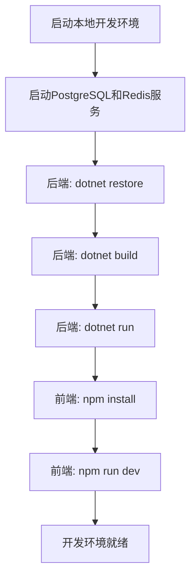
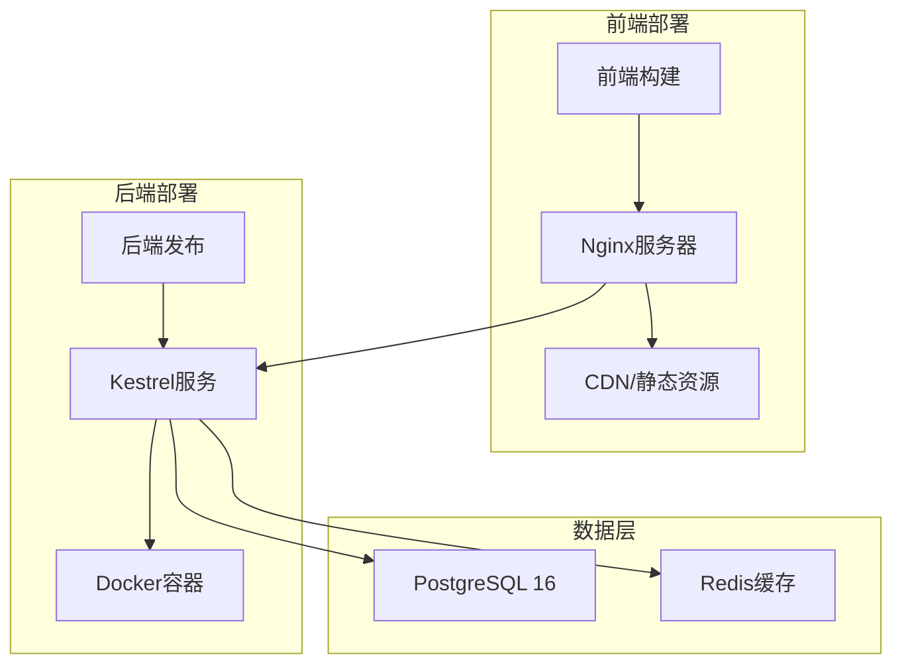
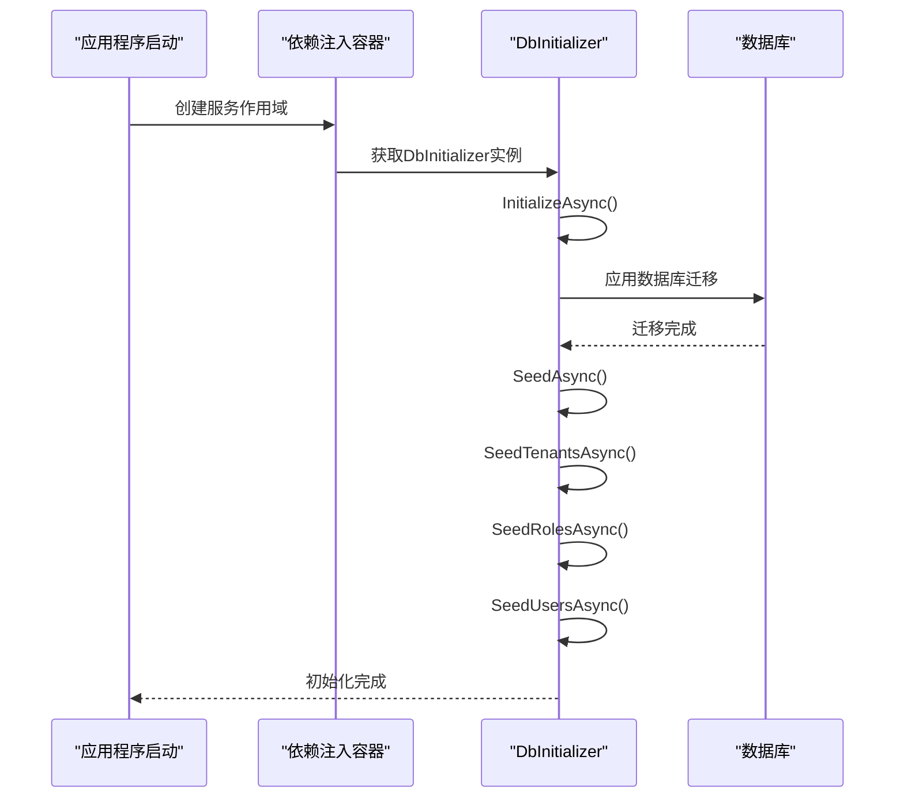
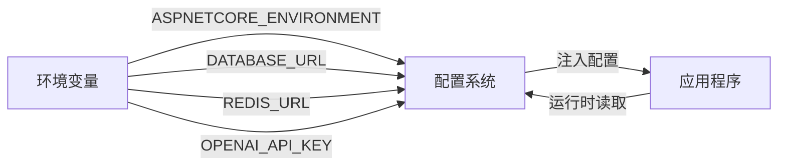
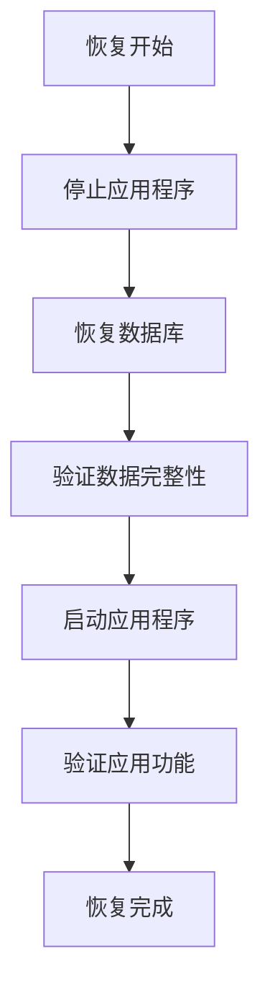

# 部署与配置

<cite>
**本文档引用的文件**  
- [appsettings.json](file://Backend/Hrevolve.Web/appsettings.json)
- [appsettings.Development.json](file://Backend/Hrevolve.Web/appsettings.Development.json)
- [Program.cs](file://Backend/Hrevolve.Web/Program.cs)
- [DbInitializer.cs](file://Backend/Hrevolve.Infrastructure/Persistence/DbInitializer.cs)
- [HrevolveDbContext.cs](file://Backend/Hrevolve.Infrastructure/Persistence/HrevolveDbContext.cs)
- [DependencyInjection.cs](file://Backend/Hrevolve.Infrastructure/DependencyInjection.cs)
- [launchSettings.json](file://Backend/Hrevolve.Web/Properties/launchSettings.json)
- [.env.development](file://Frontend/hrevolve-web/.env.development)
- [.env.production](file://Frontend/hrevolve-web/.env.production)
</cite>

## 目录
1. [本地开发环境搭建](#本地开发环境搭建)
2. [生产环境部署流程](#生产环境部署流程)
3. [关键参数配置](#关键参数配置)
4. [数据库迁移与初始数据](#数据库迁移与初始数据)
5. [前后端分离部署](#前后端分离部署)
6. [环境变量管理](#环境变量管理)
7. [日志收集与监控](#日志收集与监控)
8. [备份与恢复策略](#备份与恢复策略)

## 本地开发环境搭建

Hrevolve系统采用标准的.NET 10和Vue 3技术栈，支持跨平台开发。本地开发环境需要安装以下工具：

1. **.NET SDK 10**：用于后端API开发和运行
2. **Node.js 18+**：用于前端开发和构建
3. **PostgreSQL 16**：作为主数据库
4. **Redis 7**：作为缓存服务
5. **Docker Desktop**（可选）：用于容器化部署测试

开发环境的启动流程如下：



**图示来源**  
- [launchSettings.json](file://Backend/Hrevolve.Web/Properties/launchSettings.json#L1-L41)

**本节来源**  
- [launchSettings.json](file://Backend/Hrevolve.Web/Properties/launchSettings.json#L1-L41)

## 生产环境部署流程

生产环境部署采用前后端分离架构，后端API作为Kestrel服务运行，前端构建为静态资源部署到Nginx或CDN。



**图示来源**  
- [Program.cs](file://Backend/Hrevolve.Web/Program.cs#L1-L173)

**本节来源**  
- [Program.cs](file://Backend/Hrevolve.Web/Program.cs#L1-L173)

## 关键参数配置

### 数据库连接字符串配置

Hrevolve系统使用PostgreSQL 16作为主数据库，连接字符串配置在`appsettings.json`文件中：

```json
{
  "ConnectionStrings": {
    "DefaultConnection": "Host=localhost;Port=5432;Database=hrevolve;Username=postgres;Password=postgres"
  }
}
```

生产环境应使用环境变量覆盖此配置，确保敏感信息不硬编码在配置文件中。

### Redis缓存地址配置

Redis用于缓存会话、租户上下文和MFA验证码，配置如下：

```json
{
  "ConnectionStrings": {
    "Redis": "localhost:6379"
  }
}
```

### OpenAI API密钥配置

AI助手功能通过`appsettings.json`中的AI配置节进行配置：

```json
{
  "AI": {
    "Provider": "OpenAI",
    "ApiKey": "your-openai-api-key",
    "Model": "gpt-4o",
    "Endpoint": "",
    "DeploymentName": ""
  }
}
```

**本节来源**  
- [appsettings.json](file://Backend/Hrevolve.Web/appsettings.json#L1-L38)
- [appsettings.Development.json](file://Backend/Hrevolve.Web/appsettings.Development.json#L1-L31)

## 数据库迁移与初始数据

### EF Core迁移执行方式

Hrevolve系统使用EF Core Code-First模式管理数据库架构，迁移命令如下：

```bash
# 添加新迁移
dotnet ef migrations add InitialCreate --project Backend/Hrevolve.Infrastructure

# 应用迁移到数据库
dotnet ef database update --project Backend/Hrevolve.Infrastructure
```

迁移文件位于`Backend/Hrevolve.Infrastructure/Migrations`目录下。

### 初始数据种子加载机制

系统通过`DbInitializer`类实现初始数据种子加载，包括租户、角色和用户等基础数据：



**图示来源**  
- [Program.cs](file://Backend/Hrevolve.Web/Program.cs#L113-L119)
- [DbInitializer.cs](file://Backend/Hrevolve.Infrastructure/Persistence/DbInitializer.cs#L1-L136)

**本节来源**  
- [Program.cs](file://Backend/Hrevolve.Web/Program.cs#L113-L119)
- [DbInitializer.cs](file://Backend/Hrevolve.Infrastructure/Persistence/DbInitializer.cs#L1-L136)

## 前后端分离部署

### 后端API部署

后端API可以发布为Kestrel服务或Docker容器：

```bash
# 发布为独立服务
dotnet publish -c Release -o ./publish

# 运行发布后的服务
dotnet Hrevolve.Web.dll
```

Docker部署使用标准的多阶段构建：

```dockerfile
# Dockerfile示例
FROM mcr.microsoft.com/dotnet/sdk:10.0 AS build
WORKDIR /app
COPY . .
RUN dotnet publish -c Release -o out

FROM mcr.microsoft.com/dotnet/aspnet:10.0
WORKDIR /app
COPY --from=build /app/out .
ENTRYPOINT ["dotnet", "Hrevolve.Web.dll"]
```

### 前端部署

前端使用Vite构建，部署到Nginx或CDN：

```bash
# 构建生产版本
npm run build

# 配置Nginx
server {
    listen 80;
    root /var/www/hrevolve-web/dist;
    index index.html;
    
    location / {
        try_files $uri $uri/ /index.html;
    }
    
    location /api {
        proxy_pass http://backend:5224;
    }
}
```

环境变量配置：
- `.env.development`: `VITE_API_BASE_URL=/api`
- `.env.production`: `VITE_API_BASE_URL=/api`

**本节来源**  
- [.env.development](file://Frontend/hrevolve-web/.env.development#L1-L4)
- [.env.production](file://Frontend/hrevolve-web/.env.production#L1-L2)

## 环境变量管理

Hrevolve系统遵循12-Factor应用原则，使用环境变量管理配置：



**图示来源**  
- [DependencyInjection.cs](file://Backend/Hrevolve.Infrastructure/DependencyInjection.cs#L1-L58)

**本节来源**  
- [DependencyInjection.cs](file://Backend/Hrevolve.Infrastructure/DependencyInjection.cs#L1-L58)

## 日志收集与监控

### Serilog日志配置

系统使用Serilog进行结构化日志记录，配置如下：

```json
{
  "Serilog": {
    "MinimumLevel": {
      "Default": "Information",
      "Override": {
        "Microsoft": "Warning",
        "Microsoft.Hosting.Lifetime": "Information"
      }
    },
    "WriteTo": [
      {
        "Name": "Console",
        "Args": {
          "outputTemplate": "[{Timestamp:HH:mm:ss} {Level:u3}] {Message:lj} {Properties:j}{NewLine}{Exception}"
        }
      }
    ]
  }
}
```

### 监控端点

系统提供健康检查端点用于监控：

```csharp
app.MapGet("/health", () => Results.Ok(new { Status = "Healthy", Timestamp = DateTime.UtcNow }));
```

**本节来源**  
- [appsettings.json](file://Backend/Hrevolve.Web/appsettings.json#L18-L36)
- [Program.cs](file://Backend/Hrevolve.Web/Program.cs#L157-L159)

## 备份与恢复策略

### 数据库备份

PostgreSQL数据库应定期备份，建议使用pg_dump：

```bash
# 完整备份
pg_dump -h localhost -U postgres hrevolve > hrevolve_backup.sql

# 增量备份（使用WAL归档）
```

### 恢复流程

数据库恢复流程：



**本节来源**  
- [HrevolveDbContext.cs](file://Backend/Hrevolve.Infrastructure/Persistence/HrevolveDbContext.cs#L1-L157)