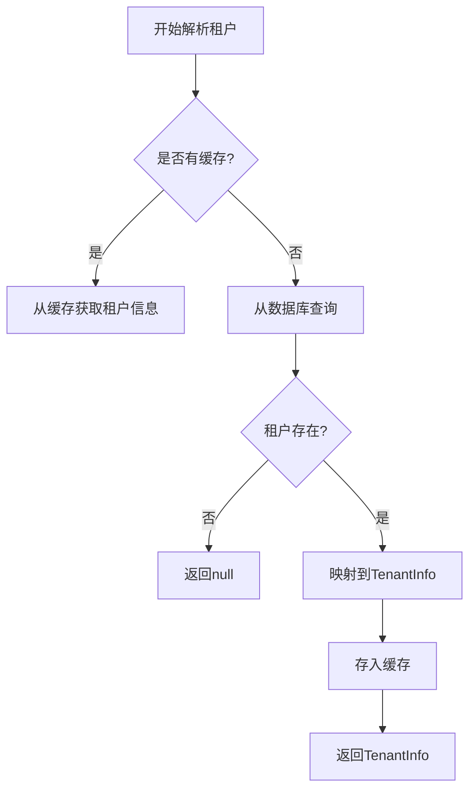
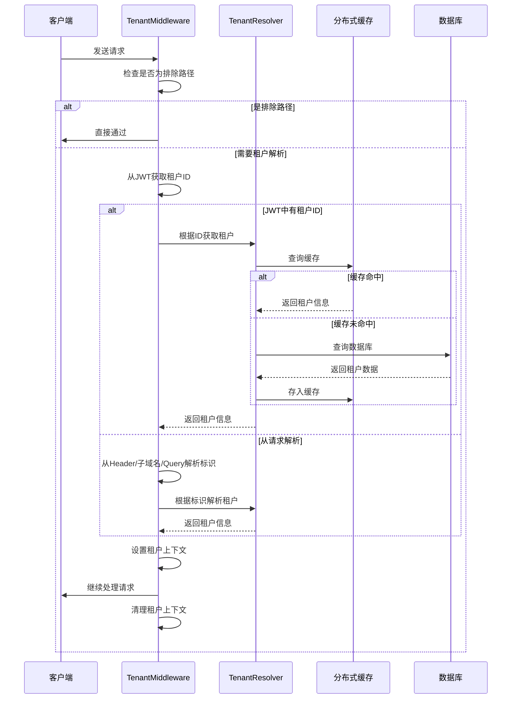
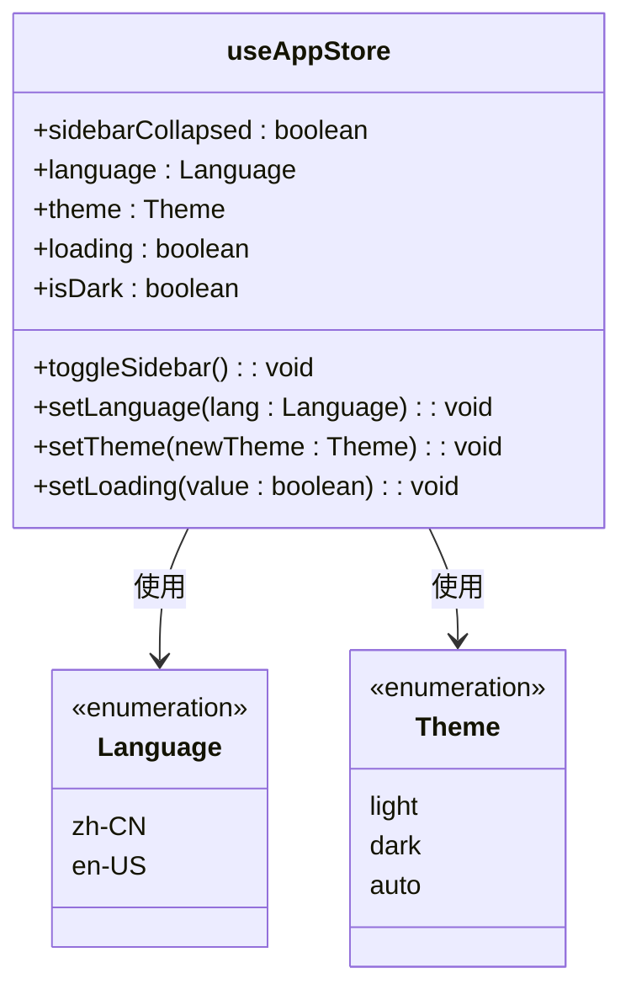
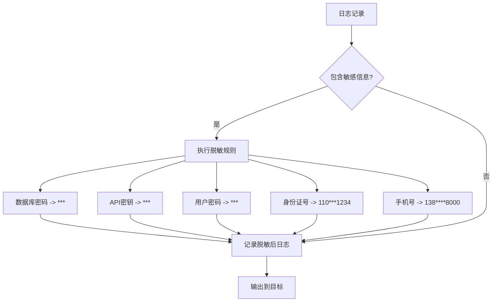

# 配置管理与安全

<cite>
**本文档引用的文件**   
- [appsettings.json](file://Backend/Hrevolve.Web/appsettings.json)
- [appsettings.Development.json](file://Backend/Hrevolve.Web/appsettings.Development.json)
- [Program.cs](file://Backend/Hrevolve.Web/Program.cs)
- [TenantInfo.cs](file://Backend/Hrevolve.Shared/MultiTenancy/TenantInfo.cs)
- [TenantResolver.cs](file://Backend/Hrevolve.Infrastructure/MultiTenancy/TenantResolver.cs)
- [TenantMiddleware.cs](file://Backend/Hrevolve.Web/Middleware/TenantMiddleware.cs)
- [ExceptionHandlingMiddleware.cs](file://Backend/Hrevolve.Web/Middleware/ExceptionHandlingMiddleware.cs)
- [SettingsController.cs](file://Backend/Hrevolve.Web/Controllers/SettingsController.cs)
- [.env.development](file://Frontend/hrevolve-web/.env.development)
- [.env.production](file://Frontend/hrevolve-web/.env.production)
- [settings.ts](file://Frontend/hrevolve-web/src/api/modules/settings.ts)
- [app.ts](file://Frontend/hrevolve-web/src/stores/app.ts)
</cite>

## 目录
1. [引言](#引言)
2. [敏感信息的安全存储策略](#敏感信息的安全存储策略)
3. [多租户环境下的配置加载机制](#多租户环境下的配置加载机制)
4. [前后端分离架构的配置同步](#前后端分离架构的配置同步)
5. [生产环境配置审计清单](#生产环境配置审计清单)
6. [结论](#结论)

## 引言

Hrevolve 是一个企业级SaaS人力资源管理系统，采用.NET 10和前后端分离架构。本系统在配置管理方面采用了多层安全策略，包括敏感信息保护、多租户动态配置和前后端配置同步机制。系统通过JWT认证、多租户中间件和分布式缓存等技术实现了安全高效的配置管理。

**Section sources**
- [Program.cs](file://Backend/Hrevolve.Web/Program.cs#L1-L173)

## 敏感信息的安全存储策略

### 明文配置的风险

在当前代码库中，`appsettings.json` 和 `appsettings.Development.json` 文件直接包含了数据库连接字符串、JWT密钥等敏感信息。这种明文存储方式存在严重的安全风险：

- **开发环境风险**：开发配置文件中包含明文密码（如 `Password=123456`），容易被泄露
- **生产环境风险**：生产配置文件中的JWT密钥长度不足，不符合安全标准
- **版本控制风险**：配置文件被纳入版本控制，可能导致敏感信息泄露

```json
{
  "ConnectionStrings": {
    "DefaultConnection": "Host=localhost;Port=5432;Database=hrevolve;Username=postgres;Password=postgres"
  },
  "Jwt": {
    "Key": "your-256-bit-secret-key-here-must-be-at-least-32-characters"
  }
}
```

### .NET User Secrets 的使用

对于开发环境，推荐使用.NET的User Secrets功能来安全存储敏感信息。User Secrets将配置存储在用户配置文件目录中，不会被纳入版本控制。

```bash
# 初始化User Secrets
dotnet user-secrets init

# 设置数据库连接字符串
dotnet user-secrets set "ConnectionStrings:DefaultConnection" "Host=localhost;Port=5432;Database=hrevolve;Username=postgres;Password=securepassword"

# 设置JWT密钥
dotnet user-secrets set "Jwt:Key" "a-very-secure-32-character-key-here"
```

在 `Program.cs` 中，.NET配置系统会自动加载User Secrets：

```csharp
var builder = WebApplication.CreateBuilder(args);
// User Secrets会自动被包含在配置中
```

### Azure Key Vault 集成

对于生产环境，强烈推荐使用Azure Key Vault来管理敏感信息。Key Vault提供了企业级的安全特性：

- **集中式密钥管理**：所有敏感信息集中存储和管理
- **访问控制**：基于角色的精细访问控制
- **审计日志**：完整的访问和操作审计
- **自动轮换**：支持密钥的自动轮换

集成Azure Key Vault的代码示例：

```csharp
var builder = WebApplication.CreateBuilder(args);

// 添加Azure Key Vault配置源
if (!builder.Environment.IsDevelopment())
{
    var keyVaultEndpoint = builder.Configuration["KeyVault:Endpoint"];
    if (!string.IsNullOrEmpty(keyVaultEndpoint))
    {
        builder.Configuration.AddAzureKeyVault(
            new Uri(keyVaultEndpoint),
            new DefaultAzureCredential());
    }
}
```

### 安全配置最佳实践

1. **环境分离**：不同环境使用不同的配置源
2. **最小权限原则**：配置访问遵循最小权限原则
3. **密钥轮换**：定期轮换JWT密钥和其他敏感信息
4. **加密存储**：在数据库中存储敏感配置时使用加密

**Section sources**
- [appsettings.json](file://Backend/Hrevolve.Web/appsettings.json#L1-L39)
- [appsettings.Development.json](file://Backend/Hrevolve.Web/appsettings.Development.json#L1-L32)
- [Program.cs](file://Backend/Hrevolve.Web/Program.cs#L71-L83)

## 多租户环境下的配置加载机制

### 租户信息模型

系统通过 `TenantInfo` 类来表示租户信息，包含了租户的基本信息和特定配置：

```csharp
public class TenantInfo
{
    public Guid Id { get; set; }
    public string Name { get; set; } = null!;
    public string Code { get; set; } = null!;
    public string? Domain { get; set; }
    public string? ConnectionString { get; set; }
    public TenantSettings Settings { get; set; } = new();
    public bool IsActive { get; set; }
}

public class TenantSettings
{
    public string Timezone { get; set; } = "Asia/Shanghai";
    public string Locale { get; set; } = "zh-CN";
    public string Currency { get; set; } = "CNY";
    public int MaxEmployees { get; set; } = 100;
    public bool EnableMfa { get; set; } = true;
    public bool EnableSso { get; set; }
}
```

### 租户解析器实现

`TenantResolver` 类实现了租户解析逻辑，支持从数据库查询和分布式缓存获取租户信息：



**Diagram sources**
- [TenantResolver.cs](file://Backend/Hrevolve.Infrastructure/MultiTenancy/TenantResolver.cs#L26-L56)

**Section sources**
- [TenantInfo.cs](file://Backend/Hrevolve.Shared/MultiTenancy/TenantInfo.cs#L6-L45)
- [TenantResolver.cs](file://Backend/Hrevolve.Infrastructure/MultiTenancy/TenantResolver.cs#L1-L108)

### 多租户中间件

`TenantMiddleware` 是系统的核心组件，负责在每个请求中解析和设置租户上下文：



**Diagram sources**
- [TenantMiddleware.cs](file://Backend/Hrevolve.Web/Middleware/TenantMiddleware.cs#L21-L133)

**Section sources**
- [TenantMiddleware.cs](file://Backend/Hrevolve.Web/Middleware/TenantMiddleware.cs#L6-L133)
- [ITenantContext.cs](file://Backend/Hrevolve.Shared/MultiTenancy/ITenantContext.cs#L6-L81)

## 前后端分离架构的配置同步

### 前端环境配置

前端项目使用Vite的环境变量机制来管理API基础URL：

```env
# .env.development
VITE_API_BASE_URL=/api

# .env.production  
VITE_API_BASE_URL=/api
```

这种配置方式使得前端在开发和生产环境中都能正确访问后端API，同时通过代理配置避免跨域问题。

### 配置API接口

后端提供了 `SettingsController` 来支持动态获取和更新系统配置：

```mermaid
flowchart LR
A[前端应用] --> B[调用配置API]
B --> C{API端点}
C --> D[/api/settings/system-configs]
C --> E[/api/settings/users]
C --> F[/api/settings/roles]
C --> G[/api/settings/approval-flows]
D --> H[返回系统配置]
E --> I[返回用户列表]
F --> J[返回角色列表]
G --> K[返回审批流程]
H --> A
I --> A
J --> A
K --> A
```

**Diagram sources**
- [SettingsController.cs](file://Backend/Hrevolve.Web/Controllers/SettingsController.cs#L1-L208)

### 前端配置管理

前端通过Pinia store来管理应用级别的配置：



**Diagram sources**
- [app.ts](file://Frontend/hrevolve-web/src/stores/app.ts#L1-L66)

### 配置同步解决方案

1. **启动时加载**：前端在应用启动时调用配置API获取最新配置
2. **本地存储**：将用户偏好设置存储在localStorage中
3. **动态更新**：通过WebSocket或轮询机制实现实时配置更新
4. **缓存策略**：对静态配置进行客户端缓存，减少API调用

**Section sources**
- [.env.development](file://Frontend/hrevolve-web/.env.development#L1-L4)
- [.env.production](file://Frontend/hrevolve-web/.env.production#L1-L2)
- [settings.ts](file://Frontend/hrevolve-web/src/api/modules/settings.ts#L1-L217)
- [app.ts](file://Frontend/hrevolve-web/src/stores/app.ts#L1-L66)

## 生产环境配置审计清单

### JWT安全配置

| 检查项 | 当前状态 | 建议 |
|-------|--------|------|
| 密钥长度 | 不足32字符 | 使用至少32字符的随机密钥 |
| 密钥存储 | 明文存储 | 使用Azure Key Vault等安全存储 |
| 签名算法 | HS256 | 考虑使用RS256等非对称算法 |
| 过期时间 | 未指定 | 设置合理的过期时间（如1小时） |
| 刷新机制 | 未实现 | 实现安全的令牌刷新机制 |

### 日志脱敏配置



**Diagram sources**
- [ExceptionHandlingMiddleware.cs](file://Backend/Hrevolve.Web/Middleware/ExceptionHandlingMiddleware.cs#L16-L76)

### 错误信息隐藏

系统通过全局异常处理中间件确保不向客户端暴露敏感错误信息：

```csharp
private async Task HandleExceptionAsync(HttpContext context, Exception exception)
{
    var response = context.Response;
    response.ContentType = "application/json";
    
    var errorResponse = new ErrorResponse
    {
        TraceId = context.TraceIdentifier
    };
    
    switch (exception)
    {
        case ValidationException validationEx:
            response.StatusCode = (int)HttpStatusCode.BadRequest;
            errorResponse.Code = validationEx.ErrorCode;
            errorResponse.Message = validationEx.Message;
            break;
            
        default:
            logger.LogError(exception, "未处理的异常: {Message}", exception.Message);
            response.StatusCode = (int)HttpStatusCode.InternalServerError;
            errorResponse.Code = "INTERNAL_ERROR";
            errorResponse.Message = "服务器内部错误，请稍后重试";
            break;
    }
    
    await response.WriteAsync(result);
}
```

### 完整审计清单

| 类别 | 检查项 | 状态 | 备注 |
|------|------|------|------|
| **安全** | JWT密钥强度 | 待改进 | 需要使用更长的密钥 |
| **安全** | 敏感信息存储 | 待改进 | 需要迁移到Key Vault |
| **安全** | 错误信息处理 | 已实现 | 全局异常处理已配置 |
| **安全** | 输入验证 | 已实现 | 使用FluentValidation |
| **性能** | 配置缓存 | 已实现 | 使用分布式缓存 |
| **可用性** | 多租户支持 | 已实现 | 完整的租户解析机制 |
| **可维护性** | 配置分离 | 部分实现 | 需要完善环境分离 |
| **可维护性** | 配置文档 | 未实现 | 需要补充配置文档 |

**Section sources**
- [ExceptionHandlingMiddleware.cs](file://Backend/Hrevolve.Web/Middleware/ExceptionHandlingMiddleware.cs#L6-L97)
- [Program.cs](file://Backend/Hrevolve.Web/Program.cs#L70-L86)

## 结论

Hrevolve系统的配置管理架构已经实现了多租户支持和基本的安全特性，但仍有一些改进空间。建议采取以下措施提升配置管理的安全性和可维护性：

1. **立即行动**：将生产环境的敏感信息迁移到Azure Key Vault
2. **短期改进**：增强JWT密钥的安全性，实施密钥轮换策略
3. **中期规划**：完善配置审计和监控机制，实现配置变更的自动检测
4. **长期目标**：建立配置管理平台，实现配置的可视化管理和自动化部署

通过这些改进，系统将能够更好地满足企业级应用的安全和可靠性要求。