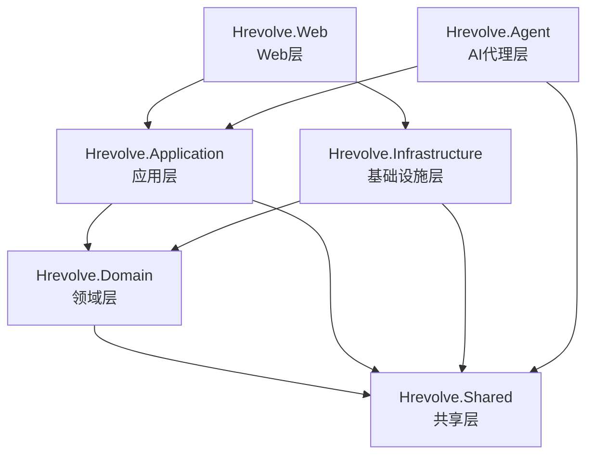
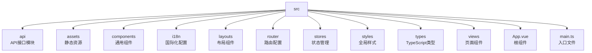
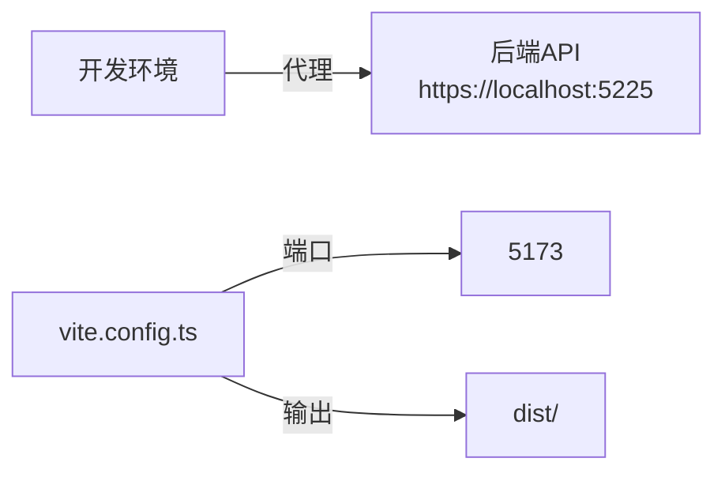

# 项目目录结构

<cite>
**本文档引用的文件**  
- [Backend/README.md](file://Backend/README.md)
- [Frontend/README.md](file://Frontend/README.md)
- [Design/RequirementsDocument.md](file://Design/RequirementsDocument.md)
- [Design/Agent.md](file://Design/Agent.md)
- [Frontend/hrevolve-web/vite.config.ts](file://Frontend/hrevolve-web/vite.config.ts)
- [Backend/Hrevolve.Domain/Hrevolve.Domain.csproj](file://Backend/Hrevolve.Domain/Hrevolve.Domain.csproj)
- [Backend/Hrevolve.Application/Hrevolve.Application.csproj](file://Backend/Hrevolve.Application/Hrevolve.Application.csproj)
- [Backend/Hrevolve.Infrastructure/Hrevolve.Infrastructure.csproj](file://Backend/Hrevolve.Infrastructure/Hrevolve.Infrastructure.csproj)
- [Backend/Hrevolve.Web/Hrevolve.Web.csproj](file://Backend/Hrevolve.Web/Hrevolve.Web.csproj)
- [Backend/Hrevolve.Agent/Hrevolve.Agent.csproj](file://Backend/Hrevolve.Agent/Hrevolve.Agent.csproj)
- [Backend/Hrevolve.Web/appsettings.json](file://Backend/Hrevolve.Web/appsettings.json)
- [Backend/Hrevolve.Web/appsettings.Development.json](file://Backend/Hrevolve.Web/appsettings.Development.json)
- [Backend/Hrevolve.Application/DependencyInjection.cs](file://Backend/Hrevolve.Application/DependencyInjection.cs)
- [Backend/Hrevolve.Infrastructure/DependencyInjection.cs](file://Backend/Hrevolve.Infrastructure/DependencyInjection.cs)
- [Backend/Hrevolve.Agent/DependencyInjection.cs](file://Backend/Hrevolve.Agent/DependencyInjection.cs)
</cite>

## 目录

1. [项目概述](#项目概述)
2. [三大主目录功能划分](#三大主目录功能划分)
3. [后端分层架构解析](#后端分层架构解析)
4. [前端src目录组织逻辑](#前端src目录组织逻辑)
5. [设计文档与数据库设计](#设计文档与数据库设计)
6. [编译输出与环境配置](#编译输出与环境配置)
7. [Clean Architecture与DDD的物理体现](#clean-architecture与ddd的物理体现)

## 项目概述

Hrevolve是一个企业级SaaS人力资源管理系统，采用模块化单体架构（Modular Monolith）和领域驱动设计（DDD）原则构建。项目整体采用Clean Architecture分层模式，通过清晰的物理文件组织来体现架构边界，实现了高内聚、低耦合的设计目标。

**Section sources**
- [Backend/README.md](file://Backend/README.md#L1-L158)
- [Frontend/README.md](file://Frontend/README.md#L1-L75)

## 三大主目录功能划分

项目根目录下包含三个核心主目录：Backend、Frontend和Design，分别承担不同的职责。

- **Backend**：存放所有后端C#代码，采用.NET 10和ASP.NET Core Web API构建，实现了基于领域驱动设计的分层架构。
- **Frontend**：存放Vue 3前端代码，基于Vite构建工具，使用TypeScript和Element Plus组件库，提供现代化的用户界面。
- **Design**：存放系统设计文档和数据库设计图，包括需求文档、AI助手设计说明和draw.io格式的数据库模型图。

这种物理分离确保了前后端开发的独立性，同时通过Design目录集中管理核心设计资产，便于团队协作和知识沉淀。

**Section sources**
- [Backend/README.md](file://Backend/README.md#L1-L158)
- [Frontend/README.md](file://Frontend/README.md#L1-L75)
- [Design/RequirementsDocument.md](file://Design/RequirementsDocument.md#L1-L287)

## 后端分层架构解析

后端采用标准的Clean Architecture分层，包含Domain、Application、Infrastructure、Web、Agent和Shared六个项目，各层职责明确，依赖关系严格遵循架构规范。

### 分层职责与依赖关系

**Diagram sources**
- [Backend/Hrevolve.Domain/Hrevolve.Domain.csproj](file://Backend/Hrevolve.Domain/Hrevolve.Domain.csproj)
- [Backend/Hrevolve.Application/Hrevolve.Application.csproj](file://Backend/Hrevolve.Application/Hrevolve.Application.csproj)
- [Backend/Hrevolve.Infrastructure/Hrevolve.Infrastructure.csproj](file://Backend/Hrevolve.Infrastructure/Hrevolve.Infrastructure.csproj)
- [Backend/Hrevolve.Web/Hrevolve.Web.csproj](file://Backend/Hrevolve.Web/Hrevolve.Web.csproj)
- [Backend/Hrevolve.Agent/Hrevolve.Agent.csproj](file://Backend/Hrevolve.Agent/Hrevolve.Agent.csproj)

### 各层职责详解

#### Hrevolve.Domain (领域层)
位于`Backend/Hrevolve.Domain`目录，是系统的核心，包含所有业务实体、值对象和领域服务。该层不依赖任何其他项目，仅引用共享层。主要包含员工、考勤、假期、薪酬等核心领域的模型定义。

**Section sources**
- [Backend/Hrevolve.Domain/Hrevolve.Domain.csproj](file://Backend/Hrevolve.Domain/Hrevolve.Domain.csproj)

#### Hrevolve.Application (应用层)
位于`Backend/Hrevolve.Application`目录，负责协调领域对象完成业务用例。采用CQRS模式，包含Commands和Queries处理逻辑，以及通过MediatR实现的管道行为（如验证、日志）。依赖领域层和共享层。

**Section sources**
- [Backend/Hrevolve.Application/Hrevolve.Application.csproj](file://Backend/Hrevolve.Application/Hrevolve.Application.csproj)
- [Backend/Hrevolve.Application/DependencyInjection.cs](file://Backend/Hrevolve.Application/DependencyInjection.cs)

#### Hrevolve.Infrastructure (基础设施层)
位于`Backend/Hrevolve.Infrastructure`目录，实现领域层定义的接口，提供数据访问、缓存、消息队列等技术能力。包含Entity Framework Core的数据库上下文、仓储实现和多租户解析器。依赖领域层和共享层。

**Section sources**
- [Backend/Hrevolve.Infrastructure/Hrevolve.Infrastructure.csproj](file://Backend/Hrevolve.Infrastructure/Hrevolve.Infrastructure.csproj)
- [Backend/Hrevolve.Infrastructure/DependencyInjection.cs](file://Backend/Hrevolve.Infrastructure/DependencyInjection.cs)

#### Hrevolve.Web (Web层)
位于`Backend/Hrevolve.Web`目录，是系统的入口点，包含API控制器、中间件和配置。负责HTTP请求的接收与响应，调用应用层服务。该层依赖应用层、基础设施层和AI代理层，是依赖最多的顶层项目。

**Section sources**
- [Backend/Hrevolve.Web/Hrevolve.Web.csproj](file://Backend/Hrevolve.Web/Hrevolve.Web.csproj)
- [Backend/Hrevolve.Web/appsettings.json](file://Backend/Hrevolve.Web/appsettings.json)
- [Backend/Hrevolve.Web/appsettings.Development.json](file://Backend/Hrevolve.Web/appsettings.Development.json)

#### Hrevolve.Agent (AI代理层)
位于`Backend/Hrevolve.Agent`目录，集成Microsoft Agent Framework，实现AI助手功能。通过工具函数（Tool Functions）与系统其他功能集成，支持自然语言交互。依赖应用层以访问业务服务。

**Section sources**
- [Backend/Hrevolve.Agent/Hrevolve.Agent.csproj](file://Backend/Hrevolve.Agent/Hrevolve.Agent.csproj)
- [Backend/Hrevolve.Agent/DependencyInjection.cs](file://Backend/Hrevolve.Agent/DependencyInjection.cs)
- [Design/Agent.md](file://Design/Agent.md#L1-L235)

#### Hrevolve.Shared (共享层)
位于`Backend/Hrevolve.Shared`目录，存放跨层共享的通用组件，如异常定义、多租户上下文接口和结果封装。被所有其他层依赖，是架构的基石。

**Section sources**
- [Backend/Hrevolve.Shared/Hrevolve.Shared.csproj](file://Backend/Hrevolve.Shared/Hrevolve.Shared.csproj)

## 前端src目录组织逻辑

前端项目位于`Frontend/hrevolve-web`目录，其`src`子目录采用功能驱动的组织方式，结构清晰，便于维护。

### src目录结构

**Diagram sources**
- [Frontend/README.md](file://Frontend/README.md#L1-L75)

### 核心子目录说明

#### api
位于`src/api`目录，封装所有后端API调用。采用模块化设计，每个业务模块（如员工、考勤、假期）有独立的API文件，并通过axios实例统一管理请求配置和拦截器。

**Section sources**
- [Frontend/README.md](file://Frontend/README.md#L1-L75)

#### components
位于`src/components`目录，存放可复用的UI组件。目前包含基础的HelloWorld.vue示例组件，未来可扩展为按钮、表格、表单等通用组件库。

**Section sources**
- [Frontend/README.md](file://Frontend/README.md#L1-L75)

#### views
位于`src/views`目录，存放页面级组件。按功能模块组织，如员工管理、考勤、假期等，每个模块对应一个子目录，包含该模块的所有视图组件。

**Section sources**
- [Frontend/README.md](file://Frontend/README.md#L1-L75)

#### stores
位于`src/stores`目录，使用Pinia进行状态管理。包含应用级状态（app.ts）、认证状态（auth.ts）等，实现跨组件的状态共享。

**Section sources**
- [Frontend/README.md](file://Frontend/README.md#L1-L75)

#### router
位于`src/router`目录，定义应用的路由配置。将URL路径映射到对应的视图组件，支持前端导航和页面跳转。

**Section sources**
- [Frontend/README.md](file://Frontend/README.md#L1-L75)

## 设计文档与数据库设计

Design目录是项目的设计中心，存放所有架构和需求文档。

### 核心设计资产

- **RequirementsDocument.md**：详细的需求规格说明书，定义了系统的功能性与非功能性需求，包括多租户架构、员工全生命周期管理、AI助手等核心功能。
- **Agent.md**：AI助手架构设计文档，说明了Microsoft Agent Framework的集成方案、工具函数和配置。
- **DatabaseDesign.drawio**：数据库实体关系图，可视化展示了所有数据表及其关系。
- **Hrevolve.drawio**：系统架构图，展示整体技术栈和组件关系。

这些设计文档为开发提供了明确的指导，确保实现与设计的一致性。

**Section sources**
- [Design/RequirementsDocument.md](file://Design/RequirementsDocument.md#L1-L287)
- [Design/Agent.md](file://Design/Agent.md#L1-L235)

## 编译输出与环境配置

### 编译输出 (dist)
前端构建输出位于`Frontend/hrevolve-web/dist`目录。该目录包含编译后的静态资源文件（JavaScript、CSS、HTML），可直接部署到Web服务器。此目录通常被.gitignore忽略，不纳入版本控制。

**Section sources**
- [Frontend/hrevolve-web/vite.config.ts](file://Frontend/hrevolve-web/vite.config.ts#L1-L27)

### 环境配置 (.env文件)
前端环境变量配置位于项目根目录的`.env.development`和`.env.production`文件。通过Vite的环境变量前缀`VITE_`暴露给前端代码，用于配置API基础路径等。

**Section sources**
- [Frontend/README.md](file://Frontend/README.md#L1-L75)

### 构建脚本 (vite.config.ts)
位于`Frontend/hrevolve-web/vite.config.ts`，是Vite的配置文件。定义了开发服务器端口（5173）、API代理（指向后端5225端口）和构建输出目录（dist）。

**Diagram sources**
- [Frontend/hrevolve-web/vite.config.ts](file://Frontend/hrevolve-web/vite.config.ts#L1-L27)

## Clean Architecture与DDD的物理体现

Hrevolve项目通过物理文件组织完美体现了Clean Architecture和DDD原则。

### 依赖规则
各层遵循严格的单向依赖：Web → Application → Domain，Infrastructure和Agent依赖Domain，所有层可依赖Shared。这种结构通过项目引用（.csproj）强制执行，防止架构倒置。

### 领域驱动设计
领域模型（如Employee、LeaveRequest）集中在Domain层，应用层通过Commands和Queries操作这些模型，基础设施层负责持久化。这种分离确保了业务逻辑的纯粹性。

### 关注点分离
- **表现关注点**：由Web层和前端项目处理
- **应用关注点**：由Application层的用例协调
- **领域关注点**：由Domain层的核心模型承载
- **基础设施关注点**：由Infrastructure层的技术实现

这种清晰的分离使得系统易于理解、测试和维护，是企业级应用架构的最佳实践。

**Section sources**
- [Backend/README.md](file://Backend/README.md#L1-L158)
- [Design/RequirementsDocument.md](file://Design/RequirementsDocument.md#L1-L287)